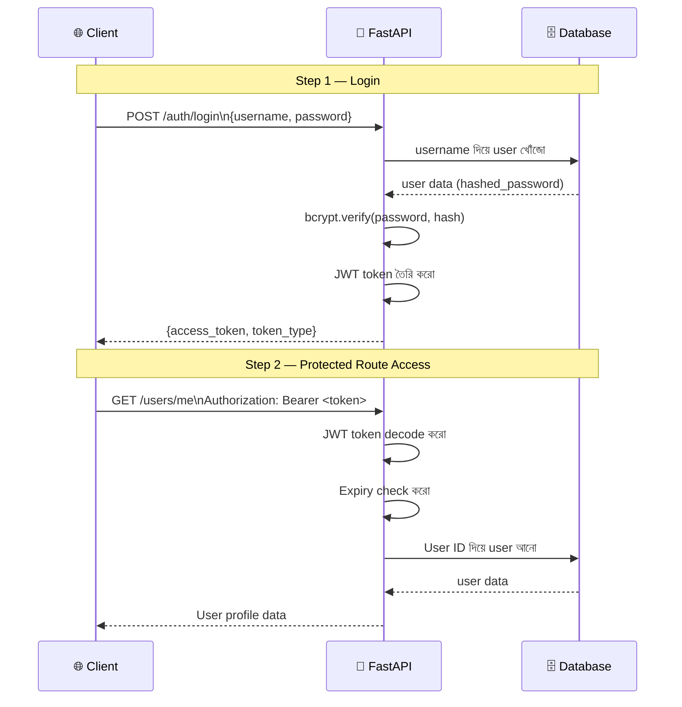

# Security & Authentication 🔐

## Security কী? (What)

**Authentication** (প্রমাণীকরণ) মানে হলো — "তুমি কে?" যাচাই করা।
**Authorization** (অনুমতি) মানে হলো — "তোমার কী করার অধিকার আছে?" যাচাই করা।

FastAPI-তে সাধারণত **JWT (JSON Web Token)** ব্যবহার করে Authentication implement করা হয়:

```
User → Login (username + password)
     → Server verify করে → JWT Token তৈরি করে
     → Token client-এ পাঠায়
     
User → Protected Route-এ যায় (Token সহ)
     → Server Token verify করে
     → Valid হলে → Access দেয়
     → Invalid হলে → 401 Error
```

---

## কেন JWT? (Why)

| Method | সুবিধা | অসুবিধা |
|--------|--------|---------|
| **Session** | সহজ | Server-এ state রাখতে হয়, scale কঠিন |
| **JWT** | Stateless, scalable | Token size বড়, revoke কঠিন |
| **API Key** | Simple | Rotation কঠিন, একটি key সব access |
| **OAuth2** | Standard, secure | Implementation complex |

FastAPI-তে **JWT + OAuth2** combination সবচেয়ে popular এবং production-ready।

---

## Authentication Flow Diagram



---

## প্রয়োজনীয় Libraries ইন্সটল

```bash
# JWT encoding/decoding
pip install python-jose[cryptography]

# Password hashing
pip install passlib[bcrypt]

# অথবা একসাথে
pip install "python-jose[cryptography]" "passlib[bcrypt]"
```

---

## Project Structure

```
auth_app/
├── main.py
├── core/
│   ├── __init__.py
│   ├── config.py       ← Secret key, algorithm, expiry
│   ├── security.py     ← Password hash, JWT create/verify
│   └── deps.py         ← get_current_user dependency
├── models/
│   └── schemas.py      ← Pydantic models
└── routers/
    └── auth.py         ← Login, register endpoints
```

---

## ১. Configuration (core/config.py)

```python
# core/config.py
import os
from datetime import timedelta

# ⚠️ Production-এ .env ফাইল থেকে নাও
SECRET_KEY = os.getenv(
    "SECRET_KEY",
    "09d25e094faa6ca2556c818166b7a9563b93f7099f6f0f4caa6cf63b88e8d3e7"  # development only
)
ALGORITHM = "HS256"                     # JWT signing algorithm
ACCESS_TOKEN_EXPIRE_MINUTES = 30        # Access token — ৩০ মিনিট
REFRESH_TOKEN_EXPIRE_DAYS = 7           # Refresh token — ৭ দিন
```

::: danger SECRET_KEY নিরাপত্তা
`SECRET_KEY` কখনো code-এ hardcode করো না। সবসময় environment variable থেকে নাও।
Production-এ random ৬৪+ character key ব্যবহার করো:
```bash
# Generate করো
openssl rand -hex 32
# Output: 09d25e094faa6ca2556c818166b7a9563b93f7099f6f0f4caa6cf63b88e8d3e7
```
:::

---

## ২. Password Hashing (core/security.py)

```python
# core/security.py
from passlib.context import CryptContext
from jose import JWTError, jwt
from datetime import datetime, timedelta
from typing import Optional
from core.config import SECRET_KEY, ALGORITHM, ACCESS_TOKEN_EXPIRE_MINUTES

# ===== Password Hashing =====
# bcrypt context তৈরি — schemes=["bcrypt"] মানে bcrypt algorithm ব্যবহার হবে
pwd_context = CryptContext(schemes=["bcrypt"], deprecated="auto")

def hash_password(plain_password: str) -> str:
    """
    Plain password → bcrypt hash

    bcrypt কেন?
    - Rainbow table attack থেকে রক্ষা করে
    - Salt automatically যোগ করে (প্রতিটি hash unique)
    - Cost factor দিয়ে slow করা যায় (brute force কঠিন হয়)
    """
    return pwd_context.hash(plain_password)

def verify_password(plain_password: str, hashed_password: str) -> bool:
    """
    Plain password এবং stored hash compare করো।
    True → password সঠিক
    False → password ভুল
    """
    return pwd_context.verify(plain_password, hashed_password)

# ব্যবহার উদাহরণ:
# hashed = hash_password("mypassword123")
# print(hashed)  # $2b$12$EixZaYVK1fsbw1ZfbX3OXePaWxn96p36WQoeG6Lruj3vjPGga31lW
# is_valid = verify_password("mypassword123", hashed)  # True
# is_valid = verify_password("wrongpass", hashed)      # False
```

---

## ৩. JWT Token তৈরি ও Verify (core/security.py continued)

```python
# core/security.py — continued

def create_access_token(
    data: dict,
    expires_delta: Optional[timedelta] = None
) -> str:
    """
    JWT Access Token তৈরি করো।

    data: token-এ store করতে চাই — {"sub": username, "role": "admin"}
    expires_delta: token কতক্ষণ valid থাকবে
    """
    to_encode = data.copy()

    # Expiry time নির্ধারণ
    if expires_delta:
        expire = datetime.utcnow() + expires_delta
    else:
        expire = datetime.utcnow() + timedelta(minutes=ACCESS_TOKEN_EXPIRE_MINUTES)

    to_encode.update({
        "exp": expire,          # Expiry timestamp
        "iat": datetime.utcnow(), # Issued at
        "type": "access"        # Token type
    })

    # Secret key দিয়ে encode করো
    encoded_jwt = jwt.encode(to_encode, SECRET_KEY, algorithm=ALGORITHM)
    return encoded_jwt

def create_refresh_token(data: dict) -> str:
    """
    Refresh Token তৈরি করো — দীর্ঘমেয়াদী (৭ দিন)।
    Access token expired হলে এটি দিয়ে নতুন access token নেওয়া যায়।
    """
    to_encode = data.copy()
    expire = datetime.utcnow() + timedelta(days=7)
    to_encode.update({
        "exp": expire,
        "type": "refresh"   # ← Access token থেকে আলাদা করতে
    })
    return jwt.encode(to_encode, SECRET_KEY, algorithm=ALGORITHM)

def verify_token(token: str, token_type: str = "access") -> Optional[dict]:
    """
    JWT token verify করো এবং payload return করো।

    Returns:
        dict → Token valid, payload data
        None → Token invalid বা expired
    """
    try:
        payload = jwt.decode(token, SECRET_KEY, algorithms=[ALGORITHM])

        # Token type check করো
        if payload.get("type") != token_type:
            return None

        # Subject (username/user_id) check করো
        sub = payload.get("sub")
        if sub is None:
            return None

        return payload

    except JWTError:
        # Token expired, signature invalid, format wrong — সব ক্ষেত্রে None
        return None
```

---

## ৪. Pydantic Schemas (models/schemas.py)

```python
# models/schemas.py
from pydantic import BaseModel, EmailStr, Field
from typing import Optional

# ===== User Schemas =====
class UserCreate(BaseModel):
    """Registration-এর জন্য"""
    username: str = Field(min_length=3, max_length=50, pattern=r"^[a-zA-Z0-9_]+$")
    email: str = Field(description="Valid email address")
    password: str = Field(min_length=8, description="কমপক্ষে ৮ অক্ষর")
    full_name: Optional[str] = None

class UserResponse(BaseModel):
    """Client-কে user data পাঠাতে — password নেই"""
    id: int
    username: str
    email: str
    full_name: Optional[str] = None
    is_active: bool
    role: str

    class Config:
        from_attributes = True  # ORM object থেকে convert

# ===== Token Schemas =====
class Token(BaseModel):
    """Login response"""
    access_token: str
    refresh_token: str
    token_type: str = "bearer"
    expires_in: int    # seconds

class TokenData(BaseModel):
    """Token payload data"""
    username: Optional[str] = None
    role: Optional[str] = None

class RefreshRequest(BaseModel):
    """Refresh token request"""
    refresh_token: str

# ===== Login Schemas =====
class LoginResponse(BaseModel):
    message: str
    user: UserResponse
    token: Token
```

---

## ৫. Auth Dependencies (core/deps.py)

```python
# core/deps.py
from fastapi import Depends, HTTPException, status
from fastapi.security import OAuth2PasswordBearer
from core.security import verify_token

# OAuth2PasswordBearer → /auth/login থেকে token নেওয়া হয়
# এটি Swagger UI-তে "Authorize" button যোগ করে
oauth2_scheme = OAuth2PasswordBearer(tokenUrl="/auth/login")

# Fake user database (real app-এ SQLAlchemy ব্যবহার করো)
fake_users_db = {
    "ashraf": {
        "id": 1, "username": "ashraf",
        "email": "ashraf@bd.com",
        "hashed_password": "$2b$12$EixZaYVK1fsbw1ZfbX3OXePaWxn96p36WQoeG6Lruj3vjPGga31lW",
        "full_name": "আশরাফ হোসেন",
        "is_active": True, "role": "admin"
    },
    "nafisa": {
        "id": 2, "username": "nafisa",
        "email": "nafisa@bd.com",
        "hashed_password": "$2b$12$different_hash_here",
        "full_name": "নাফিসা আক্তার",
        "is_active": True, "role": "user"
    }
}

def get_user_from_db(username: str) -> Optional[dict]:
    """Database থেকে user আনো"""
    return fake_users_db.get(username)

async def get_current_user(
    token: str = Depends(oauth2_scheme)  # Bearer token header থেকে
) -> dict:
    """
    JWT token verify করো এবং current user return করো।
    এটি সব protected endpoint-এ dependency হিসেবে ব্যবহার হবে।
    """
    credentials_exception = HTTPException(
        status_code=status.HTTP_401_UNAUTHORIZED,
        detail="Token verify করা যায়নি — আবার login করুন",
        headers={"WWW-Authenticate": "Bearer"}
    )

    # Token verify করো
    payload = verify_token(token, token_type="access")
    if payload is None:
        raise credentials_exception

    username: str = payload.get("sub")
    if username is None:
        raise credentials_exception

    # Database থেকে user আনো
    user = get_user_from_db(username)
    if user is None:
        raise credentials_exception

    return user

async def get_active_user(
    current_user: dict = Depends(get_current_user)
) -> dict:
    """শুধু active user allow করো"""
    if not current_user.get("is_active"):
        raise HTTPException(
            status_code=status.HTTP_400_BAD_REQUEST,
            detail="Account নিষ্ক্রিয় করা হয়েছে। Support-এ যোগাযোগ করুন।"
        )
    return current_user

async def get_admin_user(
    current_user: dict = Depends(get_active_user)
) -> dict:
    """শুধু admin role allow করো"""
    if current_user.get("role") != "admin":
        raise HTTPException(
            status_code=status.HTTP_403_FORBIDDEN,
            detail="Admin permission প্রয়োজন"
        )
    return current_user
```

---

## ৬. Auth Router (routers/auth.py)

```python
# routers/auth.py
from fastapi import APIRouter, Depends, HTTPException, status
from fastapi.security import OAuth2PasswordRequestForm
from datetime import timedelta

from core.security import (
    verify_password, create_access_token,
    create_refresh_token, verify_token, hash_password
)
from core.deps import get_user_from_db, get_active_user
from core.config import ACCESS_TOKEN_EXPIRE_MINUTES
from models.schemas import Token, UserCreate, UserResponse, RefreshRequest, LoginResponse

router = APIRouter(prefix="/auth", tags=["Auth 🔐"])

# ===== Register =====
@router.post("/register", response_model=UserResponse, status_code=201,
             summary="নতুন Account তৈরি করো")
def register(user_data: UserCreate):
    """
    নতুন user registration।

    - **username**: 3-50 characters, alphanumeric + underscore
    - **email**: Valid email
    - **password**: কমপক্ষে ৮ characters
    """
    from core.deps import fake_users_db  # Real app-এ DB ব্যবহার করো

    # Email/username duplicate check
    for user in fake_users_db.values():
        if user["username"] == user_data.username:
            raise HTTPException(status_code=409, detail="Username ইতিমধ্যে নেওয়া হয়েছে")
        if user["email"] == user_data.email:
            raise HTTPException(status_code=409, detail="Email ইতিমধ্যে registered")

    # Password hash করো
    hashed = hash_password(user_data.password)

    new_id = max(u["id"] for u in fake_users_db.values()) + 1
    new_user = {
        "id": new_id,
        "username": user_data.username,
        "email": user_data.email,
        "hashed_password": hashed,
        "full_name": user_data.full_name,
        "is_active": True,
        "role": "user"
    }
    fake_users_db[user_data.username] = new_user

    return UserResponse(**{k: v for k, v in new_user.items() if k != "hashed_password"})

# ===== Login =====
@router.post("/login", response_model=Token, summary="Login করো — Token পাও")
def login(form_data: OAuth2PasswordRequestForm = Depends()):
    """
    **OAuth2 Password flow** — Swagger UI-এ "Authorize" button দিয়ে test করা যাবে।

    - **username**: তোমার username
    - **password**: তোমার password

    Response-এ `access_token` এবং `refresh_token` পাবে।
    """
    # User খোঁজো
    user = get_user_from_db(form_data.username)
    if not user:
        raise HTTPException(
            status_code=status.HTTP_401_UNAUTHORIZED,
            detail="ভুল username বা password",
            headers={"WWW-Authenticate": "Bearer"}
        )

    # Password verify করো
    if not verify_password(form_data.password, user["hashed_password"]):
        raise HTTPException(
            status_code=status.HTTP_401_UNAUTHORIZED,
            detail="ভুল username বা password",  # ← "ভুল username" বা "ভুল password" আলাদা করে বলবে না!
            headers={"WWW-Authenticate": "Bearer"}
        )

    # Active কিনা check
    if not user.get("is_active"):
        raise HTTPException(status_code=400, detail="Account নিষ্ক্রিয়")

    # Token তৈরি করো
    token_data = {
        "sub": user["username"],    # Subject — unique identifier
        "role": user["role"],       # Role — authorization-এর জন্য
        "user_id": user["id"]       # Extra data
    }
    access_token = create_access_token(
        data=token_data,
        expires_delta=timedelta(minutes=ACCESS_TOKEN_EXPIRE_MINUTES)
    )
    refresh_token = create_refresh_token(data=token_data)

    return Token(
        access_token=access_token,
        refresh_token=refresh_token,
        token_type="bearer",
        expires_in=ACCESS_TOKEN_EXPIRE_MINUTES * 60  # seconds
    )

# ===== Token Refresh =====
@router.post("/refresh", response_model=Token, summary="নতুন Access Token নাও")
def refresh_token(request: RefreshRequest):
    """
    Refresh token দিয়ে নতুন access token নাও।
    Access token expired হলে এই endpoint ব্যবহার করো।
    """
    payload = verify_token(request.refresh_token, token_type="refresh")
    if payload is None:
        raise HTTPException(
            status_code=status.HTTP_401_UNAUTHORIZED,
            detail="Invalid বা expired refresh token — আবার login করুন"
        )

    username = payload.get("sub")
    user = get_user_from_db(username)
    if not user or not user.get("is_active"):
        raise HTTPException(status_code=401, detail="User পাওয়া যায়নি বা নিষ্ক্রিয়")

    # নতুন tokens তৈরি করো
    token_data = {"sub": username, "role": user["role"], "user_id": user["id"]}
    new_access = create_access_token(data=token_data)
    new_refresh = create_refresh_token(data=token_data)

    return Token(
        access_token=new_access,
        refresh_token=new_refresh,
        token_type="bearer",
        expires_in=ACCESS_TOKEN_EXPIRE_MINUTES * 60
    )

# ===== Profile =====
@router.get("/me", response_model=UserResponse, summary="আমার Profile")
def get_my_profile(current_user: dict = Depends(get_active_user)):
    """Login করা user-এর profile দেখো"""
    return UserResponse(**{k: v for k, v in current_user.items() if k != "hashed_password"})

# ===== Logout (Client-side) =====
@router.post("/logout", summary="Logout করো")
def logout(current_user: dict = Depends(get_active_user)):
    """
    JWT stateless — server-এ token delete হয় না।
    Client-এ token মুছে ফেলতে হবে।
    Real app-এ blacklist/Redis-এ token store করো।
    """
    return {
        "message": "Logout সফল। Browser থেকে token মুছে ফেলুন।",
        "note": "Real app-এ token blacklist-এ রাখুন"
    }
```

---

## ৭. Protected Routes — Main App

```python
# main.py
from fastapi import FastAPI, Depends
from core.deps import get_active_user, get_admin_user
from models.schemas import UserResponse
from routers.auth import router as auth_router

app = FastAPI(title="Secure API 🔐")
app.include_router(auth_router)

# ===== Public endpoint — সবাই access করতে পারবে =====
@app.get("/", tags=["Public"])
def home():
    return {"message": "Welcome! Login করতে /auth/login ব্যবহার করো"}

# ===== Protected endpoint — Login লাগবে =====
@app.get("/dashboard", tags=["Protected"])
def dashboard(current_user: dict = Depends(get_active_user)):
    """Login করা যেকোনো user access করতে পারবে"""
    return {
        "message": f"স্বাগতম {current_user['full_name']}!",
        "username": current_user["username"],
        "role": current_user["role"]
    }

# ===== Admin-only endpoint =====
@app.get("/admin/users", tags=["Admin"])
def admin_list_users(admin: dict = Depends(get_admin_user)):
    """শুধু admin role-এর user access করতে পারবে"""
    from core.deps import fake_users_db
    safe_users = [
        {k: v for k, v in u.items() if k != "hashed_password"}
        for u in fake_users_db.values()
    ]
    return {"users": safe_users, "total": len(safe_users)}

@app.delete("/admin/users/{user_id}", tags=["Admin"])
def admin_delete_user(user_id: int, admin: dict = Depends(get_admin_user)):
    """Admin user delete করতে পারবে"""
    return {
        "deleted_user_id": user_id,
        "deleted_by": admin["username"]
    }
```

---

## Token Anatomy — JWT এর ভেতরে কী আছে?

```python
# JWT token তিনটি অংশ নিয়ে:
# eyJhbGciOiJIUzI1NiIsInR5cCI6IkpXVCJ9     ← Header (Base64)
# .eyJzdWIiOiJhc2hyYWYiLCJyb2xlIjoiYWRtaW4ifQ  ← Payload (Base64)
# .SflKxwRJSMeKKF2QT4fwpMeJf36POk6yJV_adQssw5c  ← Signature (HMAC-SHA256)

# Decoded payload:
{
    "sub": "ashraf",        # Subject — username
    "role": "admin",        # Custom claim
    "user_id": 1,           # Custom claim
    "exp": 1735689600,      # Expiry timestamp
    "iat": 1735687800,      # Issued at
    "type": "access"        # Token type
}
```

::: warning JWT Payload — গোপন তথ্য রাখবে না
JWT payload Base64 encoded — **encrypted না**! যে কেউ decode করতে পারবে (jwt.io ব্যবহার করে)। Password, credit card, ব্যক্তিগত sensitive তথ্য **কখনো** token-এ রাখবে না।
:::

---

## Common Mistakes ⚠️

::: danger ভুল ১: Username বা Password আলাদা করে error বলা
```python
# ❌ ভুল — Attacker বুঝতে পারে username আছে কিনা
if not user:
    raise HTTPException(401, detail="Username পাওয়া যায়নি")   # ← Info leak!
if not verify_password(password, user.hashed_password):
    raise HTTPException(401, detail="ভুল password")            # ← Info leak!

# ✅ সঠিক — একই error message দুটো ক্ষেত্রেই
raise HTTPException(401, detail="ভুল username বা password")    # ← Safe
```
:::

::: danger ভুল ২: Password plain text-এ store করা
```python
# ❌ ভুল — কখনো করবে না!
user = {"username": "ashraf", "password": "mypassword123"}   # Plain text!

# ✅ সঠিক — সবসময় hash করো
hashed = hash_password("mypassword123")
user = {"username": "ashraf", "hashed_password": hashed}
```
:::

::: warning ভুল ৩: Token expiry না দেওয়া
```python
# ❌ ভুল — Token কখনো expire হবে না!
token_data = {"sub": username}
token = jwt.encode(token_data, SECRET_KEY)   # exp নেই!

# ✅ সঠিক — সবসময় expiry দাও
token_data = {"sub": username, "exp": datetime.utcnow() + timedelta(minutes=30)}
token = jwt.encode(token_data, SECRET_KEY, algorithm=ALGORITHM)
```
:::

::: warning ভুল ৪: SECRET_KEY hardcode করা
```python
# ❌ ভুল — Code-এ visible, Git-এ যাবে!
SECRET_KEY = "myweakpassword"

# ✅ সঠিক — Environment variable থেকে নাও
import os
SECRET_KEY = os.getenv("SECRET_KEY")
if not SECRET_KEY:
    raise ValueError("SECRET_KEY environment variable set করো!")
```
:::

---

## Best Practices ✨

- **`SECRET_KEY` → `.env` ফাইলে রাখো** — `.gitignore`-এ `.env` যোগ করো
- **Access token ছোট রাখো** — ১৫-৩০ মিনিট; Refresh token ৭-৩০ দিন
- **HTTPS অবশ্যই ব্যবহার করো** — HTTP-তে token intercept করা সহজ
- **Username/password error একই রাখো** — Info leak এড়াতে
- **Password minimum complexity enforce করো** — ৮+ chars, mixed case, numbers
- **Refresh token rotation করো** — প্রতিবার refresh-এ নতুন refresh token দাও
- **Logout-এ token blacklist করো** — Redis-এ blacklisted tokens রাখো
- **Rate limiting যোগ করো login endpoint-এ** — Brute force attack ঠেকাতে
- **bcrypt-এর বদলে argon2 ব্যবহার করতে পারো** — আরও নিরাপদ (passlib[argon2])

---

## Interview Questions 🎯

**প্রশ্ন ১: JWT এবং Session-based Authentication-এর পার্থক্য কী?**

> **উত্তর:** Session-based auth-এ server session state রাখে — প্রতিটি request-এ DB/memory check করতে হয়। JWT stateless — server কোনো state রাখে না, token-এই সব তথ্য থাকে। JWT microservices এবং horizontal scaling-এ সুবিধাজনক কারণ যেকোনো server token verify করতে পারে। কিন্তু JWT revoke করা কঠিন — blacklist implement করতে হয়।

**প্রশ্ন ২: bcrypt কেন password hashing-এর জন্য ব্যবহার করা হয়? MD5 বা SHA-256 কেন না?**

> **উত্তর:** MD5/SHA-256 fast algorithm — attacker সেকেন্ডে কোটি কোটি hash try করতে পারে (brute force)। bcrypt intentionally **slow** — cost factor দিয়ে। এছাড়া bcrypt স্বয়ংক্রিয়ভাবে **salt** যোগ করে, তাই দুটো same password-এর hash আলাদা হয় (rainbow table attack কাজ করে না)। argon2 আরও modern বিকল্প।

**প্রশ্ন ৩: Access Token এবং Refresh Token কেন আলাদা?**

> **উত্তর:** Access token short-lived (15-30 min) — stolen হলেও quickly expire হয়। কিন্তু প্রতি ৩০ মিনিটে user-কে re-login করাতে হলে UX খারাপ। Refresh token long-lived (7-30 days) এবং secure storage-এ থাকে। Access token expire হলে refresh token দিয়ে silently নতুন access token নেওয়া যায় — user বুঝতেই পারে না।

**প্রশ্ন ৪: `OAuth2PasswordBearer(tokenUrl="/auth/login")` কী করে?**

> **উত্তর:** এটি FastAPI-কে বলে যে `/auth/login` endpoint থেকে token নেওয়া হয়। Swagger UI-তে "Authorize" button যোগ হয় — সেখানে username/password দিলে login করে token save করে। পরে সব "lock" icon-এর endpoint automatically এই token use করে test করা যায়। Functionally এটি `Authorization: Bearer <token>` header থেকে token extract করে।

---

## Summary 📋

- ✅ **Authentication** = "তুমি কে?" | **Authorization** = "কী করতে পারবে?"
- ✅ `hash_password()` → bcrypt hash | `verify_password()` → compare
- ✅ `create_access_token(data, expires_delta)` → JWT তৈরি
- ✅ `verify_token(token)` → decode, validate, payload return
- ✅ `OAuth2PasswordBearer(tokenUrl=...)` → Swagger Authorize button
- ✅ `OAuth2PasswordRequestForm` → Login form (username + password)
- ✅ Dependency chain: `get_token → get_current_user → get_active_user → get_admin_user`
- ✅ Access token: ৩০ মিনিট | Refresh token: ৭ দিন
- ✅ Username/password error message → একই রাখো (info leak এড়াতে)
- ✅ SECRET_KEY → `.env` থেকে, কখনো hardcode না

---

## পরবর্তী ধাপ ➡️

Security & Auth শেখা হলো। এখন **Database with SQLAlchemy** শিখবে — engine, SessionLocal, Base setup, model definition, one-to-many relationship, get_db dependency, এবং সম্পূর্ণ CRUD operations real database দিয়ে।
