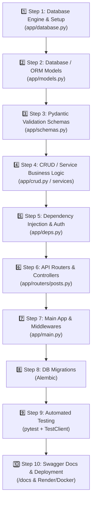

# 🚀 Step-by-Step API Development Blueprint (Professional Developer Roadmap)

একজন দক্ষ ব্যাকএন্ড ডেভেলপার হুট করে সরাসরি এন্ডপয়েন্ট বা রাউট লিখতে শুরু করেন না। একটি স্কেলেবল, মেনটেইনেবল এবং ক্লিন আর্কিটেকচারভিত্তিক RESTful API ডেভেলপমেন্টের একটি নির্দিষ্ট **স্টেপ-বাই-স্টেপ প্রসেস (Order of Execution)** রয়েছে।

এই গাইডে আমরা একটি প্রফেশনাল লাইফসাইকেল অনুসরন করে **Step 1 থেকে Step 10** পর্যন্ত প্রতিটি পর্যায় বিস্তারিত আলোচনা করবো।

---

## 🧭 Complete API Execution Roadmap

নিচের ডায়াগ্রামটি দেখলে বুঝতে পারবে একজন ডেভেলপার কীভাবে নিচ থেকে উপরে (Bottom-Up Approach) API বিল্ড করে:



---

## 📁 Recommended Project Directory Structure

```text
my_api_project/
├── app/
│   ├── __init__.py
│   ├── main.py              # 7️⃣ Entrypoint (FastAPI app, Routers inclusion, Middlewares)
│   ├── config.py            # ⚙️ Environment variables (BaseSettings)
│   ├── database.py          # 1️⃣ DB connection engine & SessionLocal
│   ├── models.py            # 2️⃣ SQLAlchemy DB Tables / Models
│   ├── schemas.py           # 3️⃣ Pydantic Request/Response DTO Schemas
│   ├── crud.py              # 4️⃣ Database queries & business logic
│   ├── deps.py              # 5️⃣ Dependency Injection (get_db, get_current_user)
│   └── routers/             # 6️⃣ APIRouters (Modular Endpoints)
│       ├── __init__.py
│       ├── auth.py
│       └── posts.py
├── alembic/                 # 8️⃣ DB Migration Scripts
├── tests/                   # 9️⃣ Automated Test Suite
│   ├── conftest.py
│   └── test_posts.py
├── .env
├── requirements.txt
└── README.md
```

---

## Step 1: Database Engine & Session (`app/database.py`)

সবচেয়ে প্রথমে ডাটাবেজের সাথে কনেকশন ইঞ্জিন এবং সেশন ফ্যাক্টরি তৈরি করতে হয়।

```python
# app/database.py
from sqlalchemy import create_engine
from sqlalchemy.orm import sessionmaker, declarative_base
from app.config import settings

# Database Connection URL
SQLALCHEMY_DATABASE_URL = settings.DATABASE_URL

# Engine Creation
engine = create_engine(
    SQLALCHEMY_DATABASE_URL, 
    connect_args={"check_same_thread": False} if "sqlite" in SQLALCHEMY_DATABASE_URL else {}
)

# Session Local Generator
SessionLocal = sessionmaker(autocommit=False, autoflush=False, bind=engine)

# Base class for ORM models
Base = declarative_base()
```

---

## Step 2: Database / ORM Models (`app/models.py`)

প্রথমে ডাটাবেজ টেবিলে কী কী কলাম থাকবে, কী ডাটাটাইপ হবে, এবং প্রাইমারি/ফরেন কি সম্পর্কিত রিলেশনশিপ কীভাবে কাজ করবে তা SQLAlchemy দিয়ে ডিফাইন করতে হয়।

> **💡 কেন Model আগে?**
> ডাটা কিসে জমা হবে (DB Table Schema) তা জানা না থাকলে API কিসের ওপর অপারেশন চালাবে তা ডিফাইন করা অসম্ভব।

```python
# app/models.py
from sqlalchemy import Column, Integer, String, Text, Boolean, ForeignKey, DateTime
from sqlalchemy.orm import relationship
from datetime import datetime
from app.database import Base

class User(Base):
    __tablename__ = "users"

    id = Column(Integer, primary_order=True, primary_key=True, index=True)
    email = Column(String(255), unique=True, nullable=False, index=True)
    hashed_password = Column(String(255), nullable=False)
    is_active = Column(Boolean, default=True)
    created_at = Column(DateTime, default=datetime.utcnow)

    # Relationship to Post
    posts = relationship("Post", back_populates="owner", cascade="all, delete-orphan")


class Post(Base):
    __tablename__ = "posts"

    id = Column(Integer, primary_key=True, index=True)
    title = Column(String(255), nullable=False, index=True)
    content = Column(Text, nullable=False)
    published = Column(Boolean, default=True)
    created_at = Column(DateTime, default=datetime.utcnow)
    
    # Foreign Key constraint
    owner_id = Column(Integer, ForeignKey("users.id", ondelete="CASCADE"), nullable=False)
    
    # Relationship back to User
    owner = relationship("User", back_populates="posts")
```

---

## Step 3: Pydantic Schemas / DTOs (`app/schemas.py`)

DB Models তৈরির পরেই আমাদের **Schemas (Data Transfer Objects)** তৈরি করতে হয়। 

> **💡 ORM Model vs Pydantic Schema এর পার্থক্য:**
> - **ORM Model (`models.py`)**: ডাটাবেজ টেবিল রিপ্রেজেন্ট করে (PostgreSQL/SQLite Table)।
> - **Pydantic Schema (`schemas.py`)**: HTTP Request validation (Client Input) এবং Response filtering (JSON Output) ডিফাইন করে।

আমরা **Base -> Create -> Update -> Response** প্যাটার্ন অনুসরন করবো:

```python
# app/schemas.py
from pydantic import BaseModel, EmailStr, ConfigDict
from datetime import datetime
from typing import Optional

# --- User Schemas ---
class UserBase(BaseModel):
    email: EmailStr

class UserCreate(UserBase):
    password: str

class UserResponse(UserBase):
    id: int
    is_active: bool
    created_at: datetime

    model_config = ConfigDict(from_attributes=True)


# --- Post Schemas ---
class PostBase(BaseModel):
    title: str
    content: str
    published: bool = True

class PostCreate(PostBase):
    pass

class PostUpdate(BaseModel):
    title: Optional[str] = None
    content: Optional[str] = None
    published: Optional[bool] = None

class PostResponse(PostBase):
    id: int
    owner_id: int
    created_at: datetime
    owner: UserResponse  # Nested Schema output

    model_config = ConfigDict(from_attributes=True)
```

---

## Step 4: Database Query & Business Logic Layer (`app/crud.py`)

CRUD (Create, Read, Update, Delete) ফাংশনগুলোকে সরাসরি রাউটারের ভেতর না লিখে আলাদা একটি সার্ভিস লেয়ার বা `crud.py` ফাইলে রাখা বেস্ট প্র্যাকটিস।

```python
# app/crud.py
from sqlalchemy.orm import Session
from app import models, schemas
from app.core.security import get_password_hash

# Create User
def create_user(db: Session, user_in: schemas.UserCreate):
    hashed_pwd = get_password_hash(user_in.password)
    db_user = models.User(email=user_in.email, hashed_password=hashed_pwd)
    db.add(db_user)
    db.commit()
    db.refresh(db_user)
    return db_user

# Get Posts with Pagination
def get_posts(db: Session, skip: int = 0, limit: int = 10):
    return db.query(models.Post).offset(skip).limit(limit).all()

# Create Post linked to User
def create_user_post(db: Session, post_in: schemas.PostCreate, user_id: int):
    db_post = models.Post(**post_in.model_dump(), owner_id=user_id)
    db.add(db_post)
    db.commit()
    db.refresh(db_post)
    return db_post

# Delete Post
def delete_post(db: Session, post_id: int, user_id: int):
    post = db.query(models.Post).filter(models.Post.id == post_id, models.Post.owner_id == user_id).first()
    if post:
        db.delete(post)
        db.commit()
        return True
    return False
```

---

## Step 5: Dependency Injection & Auth Helpers (`app/deps.py`)

API রাউটগুলোতে Reusable সার্ভিস যোগ করতে (যেমন: DB Session Yield করা, JWT Token Verify করে কারেন্ট ইউজার বের করা) **FastAPI Dependencies** তৈরি করা হয়।

```python
# app/deps.py
from typing import Generator
from fastapi import Depends, HTTPException, status
from fastapi.security import OAuth2PasswordBearer
from sqlalchemy.orm import Session
from app.database import SessionLocal
from app import crud, models

oauth2_scheme = OAuth2PasswordBearer(tokenUrl="auth/login")

# DB Session Dependency
def get_db() -> Generator:
    db = SessionLocal()
    try:
        yield db
    finally:
        db.close()

# Current User Dependency
def get_current_user(
    db: Session = Depends(get_db), 
    token: str = Depends(oauth2_scheme)
) -> models.User:
    user = crud.verify_jwt_token_and_get_user(db, token)
    if not user:
        raise HTTPException(
            status_code=status.HTTP_401_UNAUTHORIZED,
            detail="Could not validate credentials",
            headers={"WWW-Authenticate": "Bearer"},
        )
    return user
```

---

## Step 6: API Routers & Endpoints (`app/routers/posts.py`)

এখন আমরা Schemas, CRUD Logic এবং Dependencies একসাথে কানেক্ট করে পরিষ্কার এন্ডপয়েন্ট তৈরি করবো।

```python
# app/routers/posts.py
from fastapi import APIRouter, Depends, HTTPException, status
from sqlalchemy.orm import Session
from typing import List

from app import schemas, crud, models
from app.deps import get_db, get_current_user

router = APIRouter(prefix="/posts", tags=["Posts"])

@router.get("/", response_model=List[schemas.PostResponse])
def read_posts(skip: int = 0, limit: int = 10, db: Session = Depends(get_db)):
    return crud.get_posts(db=db, skip=skip, limit=limit)

@router.post("/", response_model=schemas.PostResponse, status_code=status.HTTP_201_CREATED)
def create_post(
    post: schemas.PostCreate,
    db: Session = Depends(get_db),
    current_user: models.User = Depends(get_current_user)
):
    return crud.create_user_post(db=db, post_in=post, user_id=current_user.id)

@router.delete("/{post_id}", status_code=status.HTTP_204_NO_CONTENT)
def delete_post(
    post_id: int,
    db: Session = Depends(get_db),
    current_user: models.User = Depends(get_current_user)
):
    success = crud.delete_post(db=db, post_id=post_id, user_id=current_user.id)
    if not success:
        raise HTTPException(
            status_code=status.HTTP_404_NOT_FOUND, 
            detail="Post not found or unauthorized"
        )
```

---

## Step 7: Main Application Assembly (`app/main.py`)

প্রধান `main.py` ফাইলে FastAPI অ্যাপ ইনস্ট্যান্স ডিফাইন করা হয়, CORS Middleware যুক্ত করা হয় এবং আলাদা আলাদা রাউটার গুচ্ছগুলো যুক্ত করা হয়।

```python
# app/main.py
from fastapi import FastAPI
from fastapi.middleware.cors import CORSMiddleware
from app.routers import auth, posts
from app.database import engine, Base

# Option A: Auto-create tables (Dev environment)
Base.metadata.create_all(bind=engine)

app = FastAPI(
    title="Blog & Post Management API",
    version="1.0.0",
    description="A production-ready FastAPI application built step-by-step."
)

# Add CORS Middleware
app.add_middleware(
    CORSMiddleware,
    allow_origins=["*"],
    allow_credentials=True,
    allow_methods=["*"],
    allow_headers=["*"],
)

# Include Modular Routers
app.include_router(auth.router)
app.include_router(posts.router)

@app.get("/", tags=["Root"])
def root():
    return {"message": "Welcome to the FastAPI Step-by-Step API!"}
```

---

## Step 8: Database Migrations (`Alembic Integration`)

উৎপাদন বা প্রোডাকশন পরিবেশের টেবিল স্ট্রাকচার পরিবর্তন করার জন্য Alembic Migration টুল ব্যবহার করা হয়।

```bash
# 1. Initialize Alembic
alembic init alembic

# 2. Configure alembic/env.py to point to your Base metadata
# target_metadata = Base.metadata

# 3. Create automatic migration script
alembic revision --autogenerate -m "Create users and posts tables"

# 4. Apply migrations to Database
alembic upgrade head
```

---

## Step 9: Automated Testing (`tests/test_posts.py`)

কোড সঠিকভাবে কাজ করছে কিনা তা নিশ্চিত করতে `pytest` এবং `TestClient` দিয়ে টেস্ট লেখা হয়:

```python
# tests/test_posts.py
from fastapi.testclient import TestClient
from app.main import app

client = TestClient(app)

def test_read_posts_empty():
    response = client.get("/posts/")
    assert response.status_code == 200
    assert response.json() == []
```

---

## 📊 Summary Checklist for API Developers

| Step | Component / File | Primary Responsibility / Purpose |
| :--- | :--- | :--- |
| **Step 1** | `database.py` | Configure DB Engine, Connection String & SessionLocal factory. |
| **Step 2** | `models.py` | Define Database Table Schema, Primary/Foreign Keys & ORM Relationships. |
| **Step 3** | `schemas.py` | Define Request & Response Data Transfer Objects (Pydantic DTOs). |
| **Step 4** | `crud.py` | Write pure DB query functions (Separate business logic from HTTP layer). |
| **Step 5** | `deps.py` | Implement FastAPI Dependencies (`get_db`, OAuth2 JWT `get_current_user`). |
| **Step 6** | `routers/*.py` | Create HTTP Route Handlers (`@router.get`, `@router.post`) using APIRouter. |
| **Step 7** | `main.py` | Initialize FastAPI app, attach Middlewares, and mount all Routers. |
| **Step 8** | `alembic` | Run migrations for DB schema updates. |
| **Step 9** | `tests/` | Write automated unit and integration tests (`pytest`). |
| **Step 10** | Docs & Deploy | Test on Interactive Docs (`/docs`) and Deploy with Uvicorn/Gunicorn. |
