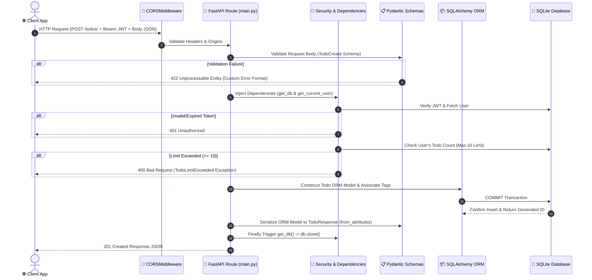

# Real-World Capstone Project — Todo App API 📝

## প্রজেক্ট পরিচিতি (Project Overview)


এই প্রজেক্টটি একটি **Full-Featured, Production-Ready, Secure RESTful Backend Application** যা FastAPI-র আধুনিক ফিচারগুলো বাস্তব জীবনে কীভাবে একসাথে কাজ করে তা ফুটিয়ে তোলে।

---

## 🏗️ Project Architecture & Data Flow Diagram

### 1. High-Level Component Flow Diagram

```mermaid
graph TD
    Client["🌐 Client / Frontend<br/>(Vite/HTML+JS / Postman)"]
    CORS["🧱 CORSMiddleware<br/>(Cross-Origin Access Control)"]
    App["🚀 FastAPI Main Application<br/>(main.py)"]

    subgraph Error_Handling["⚠️ Exception Handlers Layer"]
        VE["Validation Handler (422)<br/>RequestValidationError"]
        TLE["TodoLimitExceeded Handler (400)<br/>Custom Business Exception"]
    end

    subgraph Security_Deps["🔐 Security & Dependency Injection Layer"]
        Config["⚙️ config.py<br/>(Pydantic BaseSettings / .env)"]
        GetDB["🗄️ get_db()<br/>Yield SessionLocal Context"]
        AuthCheck["🔑 get_current_user()<br/>OAuth2 Bearer + PyJWT Decode"]
        FilterDep["🔍 TodoFilterParams<br/>(search, tag, completed, sort)"]
    end

    subgraph Database_Layer["📦 Database & ORM Layer (database.py & models.py)"]
        ORM["SQLAlchemy Models<br/>User ↔ Todo ↔ Tag (Many-to-Many via todo_tags)"]
        DB[("💾 SQLite Database<br/>(todos.db)")]
    end

    Client -->|1. HTTP Requests| CORS
    CORS --> App
    App --> Error_Handling
    App --> Security_Deps
    Security_Deps --> Database_Layer
    Database_Layer <-->|2. SQL Queries (Eager Loading selectinload)| DB
```

---

### 2. Request Lifecycle Sequence Diagram (অনুরোধের পূর্ণাঙ্গ জীবনচক্র)



---

### 3. ডাটা ফ্লো-এর ৬টি মূল ধাপ (Step-by-Step Data Flow Breakdown)

1. **ধাপ ১: Incoming HTTP Request (ক্লায়েন্ট রিকোয়েস্ট)**:
   - ক্লায়েন্ট (React/HTML বা Postman) থেকে HTTP হেডার (`Authorization: Bearer <Token>`) এবং JSON পে-লোড সহ এন্ডপয়েন্টে (যেমন: `POST /todos/`) রিকোয়েস্ট আসে।

2. **ধাপ ২: CORS Middleware Verification (নিরাপত্তা গেটওয়ে)**:
   - `CORSMiddleware` রিকোয়েস্টের Origin, Method এবং Header চেক করে ক্রস-অরিজিন পারমিশন নিশ্চিত করে।

3. **ধাপ ৩: Input Validation & Exception Handling (ডাটা যাচাই)**:
   - Pydantic schema (`TodoCreate`) ইনপুট ফিল্ডগুলো চেক করে। `@field_validator` দিয়ে নিশ্চিত করা হয় যে `due_date` অতীতে নয় এবং `title` খালি বা শুধু স্পেস নয়। ভুল থাকলে `RequestValidationError` হ্যান্ডলার 422 কাস্টম এরর পাঠায়।

4. **ধাপ ৪: Dependency Injection & Auth Layer (ডিপেন্ডেন্সি ও ইউজারের পরিচয়)**:
   - `get_db()` সেশন চালু করে।
   - `get_current_user` ডিপেন্ডেন্সি JWT ডিকোড করে ইউজারের পরিচয় বের করে ডাটাবেজ থেকে `User` মডেল লোড করে।
   - বিজনেস রুলস চেক করা হয় (যেমন: ইউজার ১০টির বেশি Todo তৈরি করার চেষ্টা করলে `TodoLimitExceeded` হ্যান্ডলার ৪০টি ৪-০-০ Bad Request এরর পাঠায়)।

5. **ধাপ ৫: Database Execution & Query Optimization (ডাটাবেজ কাজ)**:
   - SQLAlchemy ORM অবজেক্ট তৈরি করা হয়। ডুপ্লিকেট ট্যাগ এড়িয়ে নতুন/বিদ্যমান ট্যাগের সাথে সংযোগ ঘটানো হয়। 
   - রিড ক্যোয়ারীর ক্ষেত্রে `selectinload(models.Todo.tags)` ব্যবহার করা হয় যাতে **N+1 ক্যোয়ারী প্রবলেম** না ঘটে এবং মাত্র ২টি ক্যোয়ারীতে সমস্ত নিস্টেড ট্যাগ ইগার-লোড (Eager Load) হয়।

6. **ধাপ ৬: Response Serialization & Session Cleanup (রেসপন্স ও ক্লিওনিং)**:
   - SQLAlchemy মডলকে Pydantic schema (`TodoResponse`) দিয়ে JSON ফরম্যাটে রূপান্তর (`from_attributes = True`) করা হয়।
   - `get_db()` এর `finally: db.close()` ব্লকের মাধ্যমে ক্যনেকশন ক্লোজ করা হয় এবং ক্লায়েন্টকে HTTP 201 Created রেসপন্স পাঠানো হয়।

---

## 📁 প্রজেক্ট মডিউল ও ফাইল ইনডেক্স (Module Directory)

| মডিউল / ফাইল | ফাইল টাইপ | দায়িত্ব (Responsibility) & মূল প্রযুক্তি |
|-------------|----------|-----------------------------------------|
| **`config.py`** | Environment Config | `BaseSettings` ব্যবহার করে `.env` ফাইল থেকে কনফিগ লোড করা |
| **`database.py`** | DB Layer | SQLAlchemy Engine, `SessionLocal`, Base Model এবং `get_db()` সেশন ম্যানেজমেন্ট |
| **`models.py`** | ORM Model Layer | SQLite DB টেবিল স্কিমা (`User`, `Todo`, `Tag`) ও Relationships |
| **`schemas.py`** | Validation Layer | Pydantic v2 data validation schemas, `@field_validator`, `from_attributes` |
| **`security.py`** | Encryption Layer | Passlib/Bcrypt দিয়ে পাসওয়ার্ড হ্যাশিং ও ভেরিফিকেশন |
| **`auth.py`** | Security Dependency | PyJWT টোকেন জেনারেশন ও Bearer Token Auth Dependency |
| **`main.py`** | Core App & Routes | API Endpoints, Custom Exceptions, Routing, Filtering, N+1 Optimization |
| **`test_main.py`** | Automated Testing | Pytest setup, TestClient, isolated test DB fixture, dependency overrides |
| **`Dockerfile` & `docker-compose.yml`** | DevOps / Deployment | Docker containerization, multi-service setup (Backend + Frontend) |

---

## Module 1: Environment & Settings Management (`config.py`)

`config.py` ফাইলের মূল দায়িত্ব হলো প্রজেক্টের বিভিন্ন সিক্রেট কী (যেমন: JWT Secret Key, Database URL, Token Expiration) হ্যার্ডকোড না করে নিরাপদে `.env` ফাইল বা ইনভাইরনমেন্ট ভেরিয়েবল থেকে লোড করা।

```python
from pydantic_settings import BaseSettings


class Settings(BaseSettings):
    database_url: str = "sqlite:///./todos.db"
    secret_key: str
    algorithm: str = "HS256"
    access_token_expire_minutes: int = 30

    class Config:
        env_file = ".env"


settings = Settings()
```

### 🔍 লাইন-বাই-লাইন বিস্তারিত ব্যাখ্যা:

1. **`from pydantic_settings import BaseSettings`**:
   - Pydantic-এর `BaseSettings` ক্লাস ইমপোর্ট করে। এটি স্বয়ংক্রিয়ভাবে OS-এর environment variables অথবা `.env` ফাইল রিড করে পাইথন টাইপ অনুযায়ী কাস্ট করে দেয়।
2. **`class Settings(BaseSettings):`**:
   - `Settings` ক্লাস তৈরি যা `BaseSettings`-কে ইনহেরিট করে।
3. **`database_url: str = "sqlite:///./todos.db"`**:
   - ডাটাবেজ কনেকশন স্ট্রিং। ডিফল্ট ভ্যালু হিসেবে local SQLite রিড করবে, তবে `.env`-এ `DATABASE_URL` থাকলে সেটা অগ্রাধিকার পাবে।
4. **`secret_key: str`**:
   - JWT টোকেন এনক্রিপ্ট করার জন্য গোপন সিক্রেট কী। এখানে কোনো default দেয়া নেই, তাই `.env` ফাইলে `SECRET_KEY` না থাকলে অ্যাপ স্টার্ট হওয়ার সময়ই Pydantic ValidationError দেবে — যা সিস্টেম সিকিউরিটির জন্য অত্যন্ত নিরাপদ!
5. **`algorithm: str = "HS256"`**:
   - JWT সাইনিং অ্যালগরিদম (`HS256` = HMAC using SHA-256)।
6. **`access_token_expire_minutes: int = 30`**:
   - একটি access token তৈরি হওয়ার পর কত মিনিট পর মেয়ারাদোত্তীর্ণ (expire) হবে (এখানে ৩০ মিনিট)।
7. **`class Config: env_file = ".env"`**:
   - Pydantic-কে নির্দেশ দেয় যে একই ডিরেক্টরির `.env` ফাইল থেকে টাইটেল ম্যাচ করে ভেরিয়েবল লোড করতে।
8. **`settings = Settings()`**:
   - `Settings` ক্লাসের একটা singleton অবজেক্ট তৈরি করা হলো যা পুরো অ্যাপ জুড়ে ব্যবহার হবে।

---

## Module 2: Database Connection & Session Management (`database.py`)

`database.py` হলো SQLAlchemy ORM এবং অ্যাপের সংযোগ কেন্দ্র।

```python
from sqlalchemy import create_engine
from sqlalchemy.orm import sessionmaker, declarative_base

DATABASE_URL = "sqlite:///./todos.db"

engine = create_engine(
    DATABASE_URL,
    connect_args={"check_same_thread": False}   # SQLite-এ FastAPI-র জন্য দরকার
)

SessionLocal = sessionmaker(autocommit=False, autoflush=False, bind=engine)
Base = declarative_base()


def get_db():
    db = SessionLocal()
    try:
        yield db
    finally:
        db.close()
```

### 🔍 লাইন-বাই-লাইন বিস্তারিত ব্যাখ্যা:

1. **`from sqlalchemy import create_engine`**:
   - ডাটাবেজের সাথে ফিজিক্যাল কনেকশন তৈরি করার ইঞ্জিন ইমপোর্ট করা হয়েছে।
2. **`from sqlalchemy.orm import sessionmaker, declarative_base`**:
   - `sessionmaker`: DB সেশন ফ্যাক্টরি তৈরি করতে ব্যবহৃত হয়।
   - `declarative_base`: সব SQLAlchemy মডলের জন্য বেস ক্লাস।
3. **`DATABASE_URL = "sqlite:///./todos.db"`**:
   - SQLite ডাটাবেজ ফাইলের পাথ।
4. **`engine = create_engine(..., connect_args={"check_same_thread": False})`**:
   - `check_same_thread: False`: SQLite ডিফল্টভাবে একটা কনেকশনকে শুধুমাত্র একটা থ্রেডে সীমাবদ্ধ রাখে। কিন্তু FastAPI asynchronous & multi-threaded হওয়ায় একাধিক থ্রেড থেকে ডাটাবেজ অ্যাক্সেস করার অনুমতি দিতে এই ফ্ল্যাগটি আবশ্যক।
5. **`SessionLocal = sessionmaker(autocommit=False, autoflush=False, bind=engine)`**:
   - `autocommit=False`:explicitly `db.commit()` না ডাকা পর্যন্ত ডাটা রাইট হবে না (নিরাপদ লেনদেন)।
   - `autoflush=False`: ক্যোয়ারী করার সময় ডাটাবেজে অটোমেটিক ফ্লাশ বন্ধ রাখে।
6. **`Base = declarative_base()`**:
   - ORM মডলগুলোর জন্য মূল Base Class।
7. **`def get_db():` (Generator & Dependency Injection)**:
   - **`db = SessionLocal()`**: নতুন DB সেশন ওপেন করা হয়।
   - **`yield db`**: সেশনটি এন্ডপয়েন্ট ফংশনের কাছে হ্যান্ডওভার করে।
   - **`finally: db.close()`**: HTTP Request সম্পন্ন বা ব্যর্থ হওয়ার পর নিশ্চিতভাবে সেশন ক্লোজ করে মেমরি লিক (memory leak) রোধ করে।

---

## Module 3: Database Tables & ORM Relationships (`models.py`)

`models.py` ফাইলে Relational Database-এর টেবিল স্ট্রাকচার এবং Many-to-Many রিলেশনশিপ ডিফাইন করা হয়েছে।

```python
from sqlalchemy import Column, Integer, String, Boolean, ForeignKey, Date, Table
from sqlalchemy.orm import relationship
from database import Base


# many-to-many এর জন্য association table
todo_tags = Table(
    "todo_tags",
    Base.metadata,
    Column("todo_id", Integer, ForeignKey("todos.id"), primary_key=True),
    Column("tag_id", Integer, ForeignKey("tags.id"), primary_key=True),
)


class User(Base):
    __tablename__ = "users"

    id = Column(Integer, primary_key=True, index=True)
    username = Column(String, unique=True, index=True, nullable=False)
    hashed_password = Column(String, nullable=False)

    todos = relationship("Todo", back_populates="owner")


class Tag(Base):
    __tablename__ = "tags"

    id = Column(Integer, primary_key=True, index=True)
    name = Column(String, unique=True, nullable=False)

    todos = relationship("Todo", secondary=todo_tags, back_populates="tags")


class Todo(Base):
    __tablename__ = "todos"

    id = Column(Integer, primary_key=True, index=True)
    title = Column(String, nullable=False)
    description = Column(String, nullable=True)
    completed = Column(Boolean, default=False)
    due_date = Column(Date, nullable=True)
    owner_id = Column(Integer, ForeignKey("users.id"))

    owner = relationship("User", back_populates="todos")
    tags = relationship("Tag", secondary=todo_tags, back_populates="todos")
```

### 🔍 লাইন-বাই-লাইন বিস্তারিত ব্যাখ্যা:

1. **`todo_tags = Table(...)` (Association Table)**:
   - `Todo` এবং `Tag`-এর মধ্যে **Many-to-Many** সম্পর্ক তৈরি করতে জুংশন টেবিল `todo_tags` তৈরি করা হয়েছে।
   - `todo_id` ও `tag_id` যৌথভাবে Composite Primary Key গঠন করে।
2. **`class User(Base):`**:
   - `users` টেবিল মডল। `username` ফিল্ডটি unique এবং indexed যাতে দ্রুত ব্যবহারকারী খোঁজা যায়।
   - `todos = relationship("Todo", back_populates="owner")`: User থেকে তার সমস্ত Todo অ্যাক্সেস করার One-to-Many রিলেশনশিপ।
3. **`class Tag(Base):`**:
   - `tags` টেবিল মডল। `name` ফিল্ডটি ইউনিক।
   - `todos = relationship("Todo", secondary=todo_tags, back_populates="tags")`: `secondary=todo_tags` বলে দিচ্ছে যে 중간 Association Table ব্যবহার করে Many-to-Many কনেকশন তৈরি হবে।
4. **`class Todo(Base):`**:
   - `todos` টেবিল মডল।
   - `owner_id = Column(Integer, ForeignKey("users.id"))`: ForeignKey যা User টেবিলের `id`-কে নির্দেশ করে।
   - `due_date`: ডাটাবেজে `Date` ফিল্ড হিসেবে সংরক্ষিত হয়।

---

## Module 4: Data Validation Schemas (`schemas.py`)

Pydantic v2 ব্যবহার করে ক্লায়েন্ট ইনপুট ভ্যালিডেশন এবং আউটপুট রেসপন্স ফরম্যাটিং করা হয়।

```python
from pydantic import BaseModel, Field, field_validator
from typing import Optional
from datetime import date, datetime


class TagResponse(BaseModel):
    id: int
    name: str

    class Config:
        from_attributes = True


class UserCreate(BaseModel):
    username: str = Field(min_length=3, max_length=50)
    password: str = Field(min_length=6)


class UserResponse(BaseModel):
    id: int
    username: str

    class Config:
        from_attributes = True


class Token(BaseModel):
    access_token: str
    token_type: str = "bearer"


class TodoCreate(BaseModel):
    title: str = Field(min_length=1, max_length=100)
    description: Optional[str] = Field(default=None, max_length=500)
    completed: bool = False
    due_date: Optional[date] = None
    tag_names: list[str] = []

    @field_validator("due_date")
    @classmethod
    def due_date_not_in_past(cls, value: Optional[date]) -> Optional[date]:
        if value and value < date.today():
            raise ValueError("Due date cannot be in the past")
        return value

    @field_validator("title")
    @classmethod
    def title_not_empty(cls, value: str) -> str:
        if not value.strip():
            raise ValueError("Title cannot be empty or whitespace")
        return value


class TodoUpdate(BaseModel):
    title: Optional[str] = None
    description: Optional[str] = None
    completed: Optional[bool] = None


class TodoResponse(BaseModel):
    id: int
    title: str
    description: Optional[str] = None
    completed: bool
    due_date: Optional[date] = None
    tags: list[TagResponse] = []

    class Config:
        from_attributes = True
```

### 🔍 লাইন-বাই-লাইন বিস্তারিত ব্যাখ্যা:

1. **`UserCreate`**:
   - `username`: সর্বনিম্ন ৩ এবং সর্বোচ্চ ৫০ ক্যারেক্টার হতে হবে (`Field(min_length=3, max_length=50)`)।
   - `password`: সর্বনিম্ন ৬ ক্যারেক্টার আবশ্যক।
2. **`from_attributes = True` (`Config` ক্লাস)**:
   - Pydantic v2-এর অত্যন্ত গুরুত্বপূর্ণ ফিচার। এটি SQLAlchemy ORM অবজেক্টকে স্বয়ংক্রিয়ভাবে Pydantic JSON/Dict ফরম্যাটে রূপান্তর করার অনুমতি দেয় (Pydantic v1-এ এর নাম ছিল `orm_mode = True`)।
3. **`TodoCreate` Custom Validators (`@field_validator`)**:
   - **`due_date_not_in_past`**: পরীক্ষা করে যে ডেটটি আজকের পূর্বের কোনো তারিখ কিনা। পূর্বের তারিখ হলে `ValueError` থ্রো করবে যা FastAPI স্বয়ংক্রিয়ভাবে HTTP 422 Unprocessable Entity-তে কনভার্ট করবে!
   - **`title_not_empty`**: শুধুমাত্র স্পেস (whitespace) দিয়ে তৈরি টাইটেল রিজেক্ট করবে (`value.strip()`).
4. **`TodoResponse`**:
   - রেসপন্সে স্বয়ংক্লীয়ভাবে স্ব-সংযুক্ত `tags: list[TagResponse]` নিস্টেড আকারে আউটপুট হিসেবে রিটার্ন হবে।

---

## Module 5: Password Hashing & Encryption (`security.py`)

পাসওয়ার্ড টেক্সট ডাটাবেজে র প্লেইনটেক্সট হিসেবে না রেখে Bcrypt অ্যালগরিদম দিয়ে হ্যাশ করা হয়।

```python
from passlib.context import CryptContext

pwd_context = CryptContext(schemes=["bcrypt"], deprecated="auto")


def hash_password(password: str) -> str:
    return pwd_context.hash(password)


def verify_password(plain_password: str, hashed_password: str) -> bool:
    return pwd_context.verify(plain_password, hashed_password)
```

### 🔍 লাইন-বাই-লাইন বিস্তারিত ব্যাখ্যা:

1. **`CryptContext(schemes=["bcrypt"], deprecated="auto")`**:
   - Passlib লাইব্রেরির ক্রিপ্টো কনটেক্সট তৈরি করে যা Passlib-কে `bcrypt` অ্যালগরিদম ব্যবহারের নির্দেশনা দেয়।
2. **`hash_password(password: str)`**:
   - ব্যবহারকারীর প্লেইন পাসওয়ার্ডকে নিরাপদ সল্টেড হ্যাশে রূপান্তর করে (যেমন: `$2b$12$e...`).
3. **`verify_password(plain_password, hashed_password)`**:
   - লগইনের সময় ক্লায়েন্টের প্লেইন পাসওয়ার্ড এবং DB-র হ্যাশ পাসওয়ার্ড ম্যাচ করে চেক করে true/false রিটার্ন করে।

---

## Module 6: JWT Token & Security Authentication (`auth.py`)

`auth.py` ফাইলের কাজ হলো JWT Access Token জেনারেট করা এবং প্রতিটি প্রটেক্টেড এন্ডপয়েন্টে Bearer Token ভ্যালিডেট করে ইউজার রিট্রিভ করা।

```python
from datetime import datetime, timedelta, timezone
from jose import JWTError, jwt
from fastapi import Depends, HTTPException, status
from fastapi.security import OAuth2PasswordBearer
from sqlalchemy.orm import Session

import models
from database import get_db
from config import settings

SECRET_KEY = settings.secret_key
ALGORITHM = settings.algorithm
ACCESS_TOKEN_EXPIRE_MINUTES = settings.access_token_expire_minutes

oauth2_scheme = OAuth2PasswordBearer(tokenUrl="login")


def create_access_token(data: dict, expires_delta: timedelta | None = None):
    to_encode = data.copy()
    if expires_delta:
        expire = datetime.now(timezone.utc) + expires_delta
    else:
        expire = datetime.now(timezone.utc) + timedelta(minutes=ACCESS_TOKEN_EXPIRE_MINUTES)
    to_encode.update({"exp": expire})
    encoded_jwt = jwt.encode(to_encode, SECRET_KEY, algorithm=ALGORITHM)
    return encoded_jwt


def get_current_user(
    token: str = Depends(oauth2_scheme),
    db: Session = Depends(get_db)
) -> models.User:
    try:
        payload = jwt.decode(token, SECRET_KEY, algorithms=[ALGORITHM])
        username: str = payload.get("sub")
        if username is None:
            raise HTTPException(status_code=401, detail="Invalid token")
    except JWTError:
        raise HTTPException(status_code=401, detail="Invalid or expired token")

    user = db.query(models.User).filter(models.User.username == username).first()
    if user is None:
        raise HTTPException(status_code=401, detail="User not found")
    return user
```

### 🔍 লাইন-বাই-লাইন বিস্তারিত ব্যাখ্যা:

1. **`oauth2_scheme = OAuth2PasswordBearer(tokenUrl="login")`**:
   - FastAPI-র বিল্ট-ইন OAuth2 স্কিমা। এটি Swagger UI (`/docs`)-এ "Authorize" বাটন এনে দেয় এবং Incoming HTTP Request-এর Header থেকে `Authorization: Bearer <token>` এক্সট্র্যাক্ট করে।
2. **`create_access_token()`**:
   - Payload ডাটার সাথে Expiration Time (`exp`) যুক্ত করে `jwt.encode()` এর মাধ্যমে এনক্রিপ্টেড টোকেন জেনারেট করে।
3. **`get_current_user()` (Authentication Dependency)**:
   - এটি একটি ডিপেন্ডেন্সি ফাংশন যা যেকোনো প্রটেক্টেড রুট প্রসেস হওয়ার আগে চলে।
   - `jwt.decode()` দিয়ে টোকেন ডিক্রিপ্ট করে `sub` (username) বের করে।
   - টোকেন মেয়াদোত্তীর্ণ বা ফেক হলে HTTP 401 Unauthorized এক্সেপশন থ্রো করে।
   - ডাটাবেজ থেকে আসল ইউজার অবজেক্ট ফেচ করে রিটার্ন করে।

---

## Module 7: Application Entry Point & Core Endpoints (`main.py`)

`main.py` হলো অ্যাপের হৃদপিন্ড। এখানে মিডলওয়্যার, এক্সেপশন হ্যান্ডলার, কাস্টম ডিপেন্ডেন্সি ক্লাসিফিকেশন এবং সমস্ত API Endpoints রয়েছে।

```python
from fastapi import FastAPI, Depends, HTTPException, Request
from fastapi.middleware.cors import CORSMiddleware
from fastapi.responses import JSONResponse
from fastapi.security import OAuth2PasswordRequestForm
from sqlalchemy.orm import Session, selectinload
from sqlalchemy.exc import IntegrityError
from typing import Optional
from fastapi.exceptions import RequestValidationError

import models, schemas
from database import engine, get_db, Base
from security import hash_password, verify_password
from auth import create_access_token, get_current_user

Base.metadata.create_all(bind=engine)

app = FastAPI(title="Todo App")

app.add_middleware(
    CORSMiddleware,
    allow_origins=["*"],
    allow_credentials=True,
    allow_methods=["*"],
    allow_headers=["*"],
)
```

### 🛠️ Custom Exception Handlers

```python
@app.exception_handler(RequestValidationError)
async def validation_exception_handler(request: Request, exc: RequestValidationError):
    errors = []
    for error in exc.errors():
        errors.append({
            "field": error["loc"][-1],
            "message": error["msg"]
        })
    return JSONResponse(
        status_code=422,
        content={"detail": "Validation failed", "errors": errors}
    )


class TodoLimitExceeded(Exception):
    def __init__(self, message: str):
        self.message = message


@app.exception_handler(TodoLimitExceeded)
async def todo_limit_exception_handler(request: Request, exc: TodoLimitExceeded):
    return JSONResponse(
        status_code=400,
        content={"detail": exc.message}
    )
```

### 🔍 এক্সেপশন হ্যান্ডলার ব্যাখ্যা:
- **`validation_exception_handler`**: Pydantic validation ভুল হলে ডিফল্ট হিজিবিজি এররের বদলে কাস্টম পরিচ্ছন্ন JSON রেসপন্স পাঠায় (`{"field": "due_date", "message": "Due date cannot be in the past"}`).
- **`TodoLimitExceeded`**: ব্যবসায়ী লজিকের এক্সেপশন (যেমন: ১ জন ইউজার ১০ টির বেশি Todo রাখতে পারবে না)।

---

### 🛠️ Helper Dependencies & Auth Routes

```python
def get_todo_or_404(
    todo_id: int,
    db: Session = Depends(get_db),
    current_user: models.User = Depends(get_current_user)
) -> models.Todo:
    todo = db.query(models.Todo).filter(models.Todo.id == todo_id).first()
    if not todo:
        raise HTTPException(status_code=404, detail="Todo not found")
    if todo.owner_id != current_user.id:
        raise HTTPException(status_code=403, detail="You do not have permission to access this todo")
    return todo


@app.post("/register", response_model=schemas.UserResponse, status_code=201)
def register(user: schemas.UserCreate, db: Session = Depends(get_db)):
    new_user = models.User(
        username=user.username,
        hashed_password=hash_password(user.password)
    )
    db.add(new_user)
    try:
        db.commit()
        db.refresh(new_user)
    except IntegrityError:
        db.rollback()
        raise HTTPException(status_code=400, detail="Username already exists")
    return new_user


@app.post("/login", response_model=schemas.Token)
def login(form_data: OAuth2PasswordRequestForm = Depends(), db: Session = Depends(get_db)):
    user = db.query(models.User).filter(models.User.username == form_data.username).first()
    if not user or not verify_password(form_data.password, user.hashed_password):
        raise HTTPException(status_code=401, detail="Incorrect username or password")

    access_token = create_access_token({"sub": user.username})
    return {"access_token": access_token, "token_type": "bearer"}
```

### 🔍 কাস্টম হেল্পার ও অথ সার্ভিস ব্যাখ্যা:
- **`get_todo_or_404`**: DRY (Don't Repeat Yourself) নীতি মেনে তৈরি করা কাস্টম ডিপেন্ডেন্সি। এটি যেকোনো TODO আইডি রিট্রিভ করে নিশ্চিত করে যে এটি উক্ত ইউজারের নিজের এবং ডাটাবেজে বিদ্যমান। অন্যথায় ৪-৪ বা ৪-৩ পারমিশন এরর দেয়।
- **`register`**: ইউনিক ইউজার সাবমিশন নিশ্চিত করে; ডুপ্লিকেট ইউজার হলে SQLAlchemy-র `IntegrityError` ক্যাচ করে রোলব্যাক সম্পন্ন করে।

---

### 🛠️ Todo Filtering, Searching, Sorting & Endpoints

```python
class TodoFilterParams:
    def __init__(
        self, completed: Optional[bool] = None,
        search: Optional[str] = None,           # title-এ keyword খুঁজবে
        tag: Optional[str] = None,              # tag name দিয়ে filter
        sort_by: str = "id",                    # "id" বা "due_date"
        skip: int = 0,
        limit: int = 10
    ):
        self.completed = completed
        self.search = search
        self.tag = tag
        self.sort_by = sort_by
        self.skip = skip
        self.limit = limit


@app.get("/todos/", response_model=list[schemas.TodoResponse])
def list_todos(
    filters: TodoFilterParams = Depends(),
    db: Session = Depends(get_db),
    current_user: models.User = Depends(get_current_user)
):
    # selectinload দিয়ে tags আগে থেকেই load করে নিচ্ছি — N+1 ক্যোয়ারী এড়ানোর জন্য
    query = db.query(models.Todo).options(
        selectinload(models.Todo.tags)
    ).filter(models.Todo.owner_id == current_user.id)

    if filters.completed is not None:
        query = query.filter(models.Todo.completed == filters.completed)

    if filters.search:
        query = query.filter(models.Todo.title.ilike(f"%{filters.search}%"))

    if filters.tag:
        query = query.join(models.Todo.tags).filter(models.Tag.name == filters.tag)

    if filters.sort_by == "due_date":
        query = query.order_by(models.Todo.due_date)
    else:
        query = query.order_by(models.Todo.id)

    return query.offset(filters.skip).limit(filters.limit).all()
```

### ⚡ N+1 Query Optimization Mechanic (`selectinload`):
`list_todos` এন্ডপয়েন্টে `options(selectinload(models.Todo.tags))` ব্যবহার করা হয়েছে। এটি না দিলে ১০টি TODO অবজেক্ট রেসপন্সে পাঠাতে SQLAlchemy মোট ১১টি ক্যোয়ারী করতো (১টি Todos-এর জন্য + ১০টি আলাদা Tags-এর জন্য — যাকে **N+1 Problem** বলা হয়)। `selectinload` ব্যবহার করার ফলে SQLAlchemy `IN (...)` ক্যোয়ারী দিয়ে মাত্র ২টি ক্যোয়ারীতে সম্পূর্ণ ডাটা ইগার লোড (Eager Load) করে ফেলে!

---

## Module 8: Automated Unit & Integration Testing (`test_main.py`)

`test_main.py` টেস্ট স্যুট কীভাবে আলাদা ইন-মেমোরি টেস্ট ডাটাবেজ ব্যবহার করে এপিআই টেস্ট করে তা ডিফাইন করে।

```python
import pytest
from fastapi.testclient import TestClient
from sqlalchemy import create_engine
from sqlalchemy.orm import sessionmaker

from main import app
from database import Base, get_db

# আলাদা test database — main todos.db এর সাথে mix হবে না
TEST_DATABASE_URL = "sqlite:///./test.db"
engine = create_engine(TEST_DATABASE_URL, connect_args={"check_same_thread": False})
TestingSessionLocal = sessionmaker(autocommit=False, autoflush=False, bind=engine)


def override_get_db():
    db = TestingSessionLocal()
    try:
        yield db
    finally:
        db.close()


app.dependency_overrides[get_db] = override_get_db


@pytest.fixture(scope="function", autouse=True)
def setup_and_teardown():
    Base.metadata.create_all(bind=engine)
    yield
    Base.metadata.drop_all(bind=engine)


client = TestClient(app)


def test_register_user():
    response = client.post("/register", json={"username": "ripon", "password": "test123"})
    assert response.status_code == 201
    assert response.json()["username"] == "ripon"


def test_create_todo_unauthorized():
    response = client.post("/todos/", json={"title": "Learn FastAPI"})
    assert response.status_code == 401
```

### 🔍 টেস্ট আর্কিটেকচার ব্যাখ্যা:
1. **`app.dependency_overrides[get_db] = override_get_db`**:
   - এটি FastAPI-র পাওয়ারফুল টেস্টিং ফিচার। টেস্ট রান হওয়ার সময় অরিজিনাল `get_db` ওভাররাইড হয়ে টেস্ট ডাটাবেজে কনেক্ট করে।
2. **`setup_and_teardown` Fixture**:
   - প্রতিটি টেস্ট ফাংশন রান হওয়ার আগে টেবিল তৈরি করে এবং টেস্ট শেষ হওয়া মাত্রই সব টেবিল ধ্বংস (drop) করে ফ্রেশ স্টেট বজায় রাখে।

---

## Module 9: Containerization & Deployment Setup (`Dockerfile` & `docker-compose.yml`)

### `Dockerfile`
```dockerfile
FROM python:3.12-slim

WORKDIR /app

COPY requirements.txt .
RUN pip install --no-cache-dir -r requirements.txt

COPY . .

CMD ["uvicorn", "main:app", "--host", "0.0.0.0", "--port", "8000"]
```

### `docker-compose.yml`
```yaml
services:
  backend:
    build: .
    container_name: todo_backend
    ports:
      - "8000:8000"
    volumes:
      - .:/app
    env_file:
      - .env
    restart: always

  frontend:
    build: ./frontend
    container_name: todo_frontend
    ports:
      - "5500:80"
    depends_on:
      - backend
    restart: always
```

---

## 🎯 প্রজেক্টের মূল দর্শন ও আর্কিটেকচারাল মেকানিজম (Architecture & Design Philosophy)

1. **Separation of Concerns (দায়িত্বের বিভাজন)**:
   - Config, Database, Models, Schemas, Security, Auth, Exception Handlers — প্রতিটি বিষয় আলাদা ফাইলে আইসোলেটেড।
2. **Layered Security & Ownership Isolation**:
   - শুধু JWT Authentication-ই নয়, ডাটাবেজ ক্যোয়ারী লেভেলেও `owner_id == current_user.id` ফিল্টার দিয়ে মাল্টি-ট্যালেন্ট সিকিউরিটি লেয়ার নিশ্চিত করা হয়েছে।
3. **High Performance & Eager Loading**:
   - SQLAlchemy-র `selectinload` ব্যবহারের মাধ্যমে Relational Query Optimization (N+1 Solution) প্রয়োগ করা হয়েছে।
4. **Resilient Automated Test Suite**:
   - `dependency_overrides` ফিচার ব্যবহার করে Production DB অক্ষত রেখে টেস্ট স্যুট চালনা।

---
