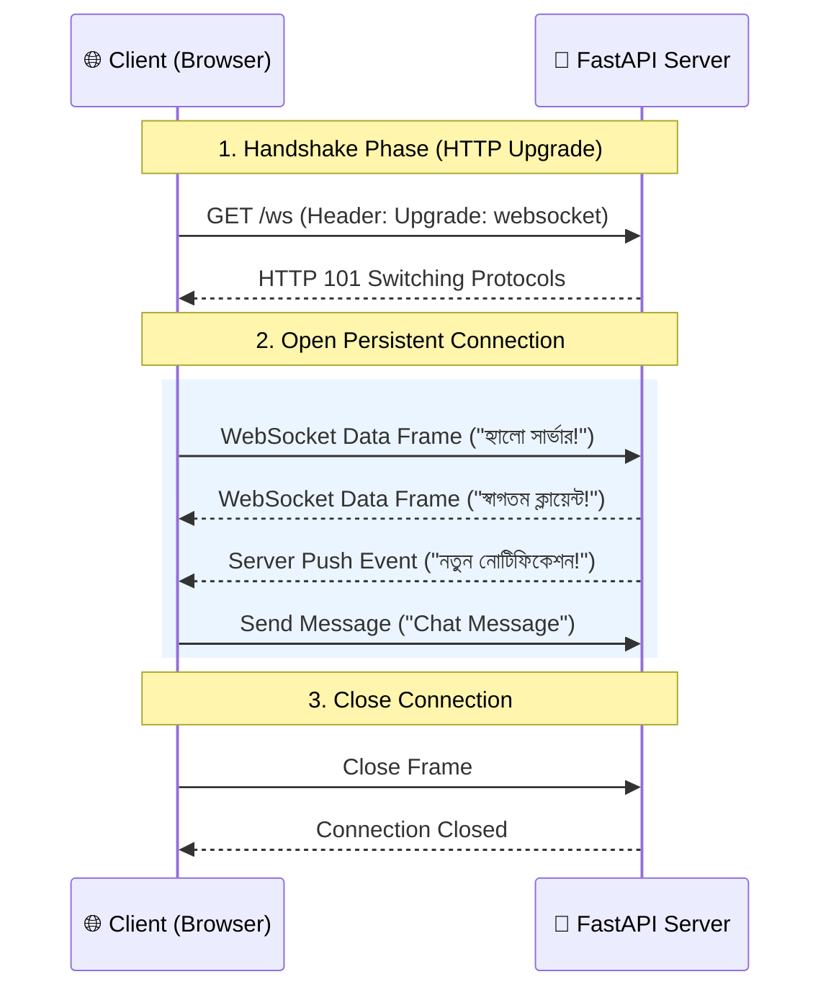

# WebSockets 🔌

## WebSockets কী? (What)

**WebSocket** হলো একটি কম্পিউটার কমিউনিকেশন প্রোটোকল যা একটি মাত্র TCP কানেকশনের মাধ্যমে ক্লায়েন্ট (Browser) এবং সার্ভারের মধ্যে **Full-Duplex** (দুইমুখী) এবং **Real-Time** ডাটা আদান-প্রদান নিশ্চিত করে।

সাধারণ HTTP রিকোয়েস্টে ক্লায়েন্টকে প্রতিবার রিকোয়েস্ট পাঠাতে হয় এবং সার্ভার রেসপন্স দেয় (Request-Response pattern)। কিন্তু WebSocket-এ একবার কানেকশন তৈরি (Handshake) হয়ে গেলে ক্লায়েন্ট ও সার্ভার উভয়েই যেকোনো মুহূর্তে একে অপরকে ডাটা পাঠাতে পারে।

---

## কেন WebSockets প্রয়োজন? (Why)

```
❌ সাধারণ HTTP (REST API / Polling):
   - রিয়েল-টাইম ডাটা পেতে ক্লায়েন্টকে প্রতি ২ সেকেন্ড পরপর রিকোয়েস্ট পাঠাতে হয় (Short/Long Polling)
   - প্রচুর ব্যান্ডউইথ ও সার্ভার হেডার ওভারহেড তৈরি হয়
   - সার্ভার নিজে থেকে ক্লায়েন্টকে কোনো নোটিফিকেশন পাঠাতে পারে না

✅ WebSockets:
   -Persistent Single Connection — কোনো অতিরিক্ত HTTP হেডার ওভারহেড নেই
   - Instant Bidirectional Data — সার্ভার মুহূর্তের মধ্যে ক্লায়েন্টকে আপডেট পাঠাতে পারে
   - Chat App, Live Sports Score, Stock Price Tracking, Real-time Dashboard-এর জন্য সেরা সমাধান
```

---

## WebSocket Communication Flow



---

## ১. Basic WebSocket Endpoint

FastAPI-তে `WebSocket` অবজেক্ট ইনজেক্ট করে `accept()`, `send_text()`, `receive_text()` দিয়ে বেসিক রিয়েল-টাইম কানেকশন তৈরি করা হয়।

```python
# main.py
from fastapi import FastAPI, WebSocket, WebSocketDisconnect

app = FastAPI()

@app.websocket("/ws")
async def websocket_endpoint(websocket: WebSocket):
    # ১. হ্যান্ডশেক অ্যাকসেপ্ট করো
    await websocket.accept()
    print("🔌 Client Connected!")
    
    try:
        while True:
            # ২. ক্লায়েন্টের পাঠানো টেক্সট রিড করো
            data = await websocket.receive_text()
            print(f"📥 Received: {data}")
            
            # ৩. ক্লায়েন্টকে রেসপন্স ফেরত পাঠাও
            await websocket.send_text(f"সার্ভার থেকে রেসপন্স: আপনি পাঠিয়েছেন '{data}'")
            
    except WebSocketDisconnect:
        # ৪. ক্লায়েন্ট ডিসকানেক্ট হলে
        print("❌ Client Disconnected!")
```

---

## ২. Connection Manager — একাধিক Connection পরিচালনা

রিয়েল-টাইম অ্যাপে (যেমন চ্যাট রুম) একই সাথে বহু ইউজার যুক্ত থাকে। তাদের কানেকশন ট্র্যাক করতে এবং সবাইকে একসাথে মেসেজ পাঠাতে (Broadcasting) একটি **ConnectionManager** ক্লাস তৈরি করা হয়।

```python
# connection_manager.py
from fastapi import WebSocket
from typing import List

class ConnectionManager:
    def __init__(self):
        # সক্রিয় কানেকশনগুলোর তালিকা
        self.active_connections: List[WebSocket] = []

    async def connect(self, websocket: WebSocket):
        """নতুন কানেকশন গ্রহণ করো এবং লিস্টে যুক্ত করো"""
        await websocket.accept()
        self.active_connections.append(websocket)

    def disconnect(self, websocket: WebSocket):
        """কানেকশন বিচ্ছিন্ন হলে লিস্ট থেকে সরাও"""
        if websocket in self.active_connections:
            self.active_connections.remove(websocket)

    async def send_personal_message(self, message: str, websocket: WebSocket):
        """নির্দিষ্ট একজন ইউজারকে মেসেজ পাঠাও"""
        await websocket.send_text(message)

    async def broadcast(self, message: str):
        """সংযুক্ত সব ইউজারকে মেসেজ পাঠাও (Broadcasting)"""
        for connection in self.active_connections:
            await connection.send_text(message)

# Global Instance
manager = ConnectionManager()
```

---

## ৩. Real-time Chat Room Application (Complete Backend)

এখন ConnectionManager ব্যবহার করে একটি পূর্ণাঙ্গ Multi-user Chat Backend তৈরি করি:

```python
# main.py
from fastapi import FastAPI, WebSocket, WebSocketDisconnect, Query, status
from connection_manager import manager

app = FastAPI(title="FastAPI Real-time Chat API")

@app.websocket("/ws/chat/{room_name}")
async def chat_endpoint(
    websocket: WebSocket,
    room_name: str,
    username: str = Query(...)  # Query parameter: /ws/chat/general?username=Arif
):
    # ১. ইউজারকে কানেক্ট করো
    await manager.connect(websocket)
    
    # ২. সবাইকে জানাও নতুন ইউজার যুক্ত হয়েছে
    await manager.broadcast(f"📢 system: '{username}' চ্যাট রুমে যুক্ত হয়েছেন।")
    
    try:
        while True:
            # ৩. ইউজারের পাঠানো মেসেজ গ্রহণ করো
            message = await websocket.receive_text()
            
            # ৪. চ্যাট রুমের সবাইকে সেই মেসেজ ব্রডকাস্ট করো
            broadcast_data = f"{username}: {message}"
            await manager.broadcast(broadcast_data)
            
    except WebSocketDisconnect:
        # ৫. ডিসকানেক্ট হলে লিস্ট থেকে সরাও এবং সবাইকে জানাও
        manager.disconnect(websocket)
        await manager.broadcast(f"📢 system: '{username}' চ্যাট রুম ত্যাগ করেছেন।")
```

---

## ৪. WebSocket Authentication (JWT Verification)

WebSocket কানেকশনে সাধারণ HTTP Header পাঠানো কঠিন হতে পারে (বিশেষ করে ব্রাউজার Native WebSocket API-তে)। তাই Query Parameter হিসেবে JWT Token পাঠানো সবচেয়ে জনপ্রিয় প্যাটার্ন।

```python
# auth_ws.py
from fastapi import FastAPI, WebSocket, WebSocketDisconnect, Query, status
from jose import jwt, JWTError

SECRET_KEY = "your-secret-key"
ALGORITHM = "HS256"

async def get_current_user_ws(token: str):
    """Token থেকে ইউজার ভ্যালিডেট করো"""
    try:
        payload = jwt.decode(token, SECRET_KEY, algorithms=[ALGORITHM])
        username: str = payload.get("sub")
        if username is None:
            return None
        return username
    except JWTError:
        return None

@app.websocket("/ws/secure")
async def secure_websocket(
    websocket: WebSocket,
    token: str = Query(...)  # URL: ws://localhost:8000/ws/secure?token=eyJhbGci...
):
    # 1. Token ভ্যালিডেট করো
    username = await get_current_user_ws(token)
    
    if username is None:
        # 4008 / 1008 Policy Violation কোড দিয়ে রিজেক্ট করো
        await websocket.close(code=status.WS_1008_POLICY_VIOLATION)
        print("❌ Auth Failed: Connection Closed")
        return

    # 2. Auth সফল হলে কানেকশন গ্রহণ করো
    await websocket.accept()
    await websocket.send_text(f"স্বাগতম {username}! আপনার সিকিউর WebSocket অ্যাক্টিভ।")
    
    try:
        while True:
            msg = await websocket.receive_text()
            await websocket.send_text(f"Echo [{username}]: {msg}")
    except WebSocketDisconnect:
        print(f"User {username} disconnected.")
```

---

## ৫. HTML / Vanilla JS Frontend Integration Example

 FastApi backend-এর সাথে কানেক্ট করার জন্য একটি সরল ব্রাউজার Frontend উদাহরণ:

```html
<!DOCTYPE html>
<html lang="bn">
<head>
    <meta charset="UTF-8">
    <title>FastAPI Chat Room</title>
    <style>
        body { font-family: Arial, sans-serif; margin: 20px; }
        #messages { border: 1px solid #ccc; height: 300px; overflow-y: scroll; padding: 10px; margin-bottom: 10px; }
        .msg { margin: 5px 0; }
        .system { color: gray; font-style: italic; }
    </style>
</head>
<body>
    <h2>🚀 FastAPI WebSocket Chat</h2>
    <div id="messages"></div>

    <input type="text" id="messageInput" placeholder="মেসেজ লিখুন..." />
    <button onclick="sendMessage()">পাঠান</button>

    <script>
        const username = prompt("আপনার নাম লিখুন:") || "Anonymous";
        // WebSocket কানেকশন শুরু
        const ws = new WebSocket(`ws://localhost:8000/ws/chat/general?username=${username}`);

        const messagesDiv = document.getElementById("messages");

        // ১. মেসেজ আসলে স্ক্রিনে দেখাও
        ws.onmessage = function(event) {
            const message = document.createElement("div");
            message.className = "msg";
            if(event.data.includes("📢 system:")) {
                message.classList.add("system");
            }
            message.textContent = event.data;
            messagesDiv.appendChild(message);
            messagesDiv.scrollTop = messagesDiv.scrollHeight;
        };

        // ২. মেসেজ পাঠানোর ফাংশন
        function sendMessage() {
            const input = document.getElementById("messageInput");
            if (input.value.trim() !== "") {
                ws.send(input.value);
                input.value = "";
            }
        }
    </script>
</body>
</html>
```

---

## Comparison: Protocols for Real-time Data

| বৈশিষ্ট্য | HTTP REST | Short/Long Polling | Server-Sent Events (SSE) | WebSockets |
|-----------|-----------|--------------------|--------------------------|------------|
| **দিক (Direction)** | One-way (Client -> Server) | One-way (Client Request) | One-way (Server -> Client) | **Full-Duplex (Two-way)** |
| **কানেকশন** | New per request | New per request | Persistent (Single) | **Persistent (Single)** |
| **ওভারহেড** | বেশি (Headers) | অনেক বেশি | কম | **অত্যন্ত কম** |
| **ব্যবহারের ক্ষেত্র** | CRUD Operations | Legacy Real-time | Live Score, Notifications | **Chat, Gaming, Trading** |

---

## Common Mistakes ⚠️

::: danger ভুল ১: `accept()` করার আগেই `receive_text()` বা `send_text()` কল করা
```python
# ❌ ভুল — accept() না করে মেসেজ পাঠানোর চেষ্টা
@app.websocket("/ws")
async def ws_endpoint(websocket: WebSocket):
    await websocket.send_text("Hello") # ❌ RuntimeError: WebSocket is not connected!

# ✅ সঠিক — আগে accept() করো
@app.websocket("/ws")
async def ws_endpoint(websocket: WebSocket):
    await websocket.accept() # ✅ Handshake complete
    await websocket.send_text("Hello")
```
:::

::: danger ভুল ২: WebSocket Endpoint-এ `async def` না লিখে সাধারণ `def` লেখা
WebSocket অপারেশনগুলো সম্পূর্ণ Asynchronous। তাই ফানশনটি অবশ্যই `async def` হতে হবে।
:::

::: warning ভুল ৩: Multi-server Environment (Horizontal Scaling)-এ In-memory Manager ব্যবহার করা
যদি তোমার FastAPI অ্যাপ ২টি আলাদা সার্ভারে (Load Balancer-এর পেছনে) চলে, তবে ১ নম্বর সার্ভারের ইউজার ২ নম্বর সার্ভারের ইউজারকে চ্যাট মেসেজ পাঠাতে পারবে না।
**সমাধান:** Production Multi-server सेटअप-এ **Redis Pub/Sub** মেসেজ ব্রোকার ব্যবহার করতে হয়।
:::

---

## Best Practices ✨

- **Connection Manager ব্যবহার করো:** স্টেট ও সব সক্রিয় ডিরেক্ট কানেকশন গুছিয়ে রাখার জন্য ডেডিকেটেড ম্যানেজার ক্লাস ব্যবহার করো।
- **Disconnect Exception সামলাও:** `WebSocketDisconnect` ব্লকটি ঠিকমত ক্যাচ করো যাতে ব্রাউজার বন্ধ করলে ডেড কানেকশন মেমোরি থেকে মুছে ফেলা যায়।
- **Heartbeat / Ping-Pong:** কানেকশন সচল আছে কিনা তা নিয়মিত ইন-বিল্ট Ping-Pong দিয়ে চেক করো।
- **Redis Pub/Sub:** একাধিক Worker বা সার্ভার স্কেলিং-এর জন্য Redis Pub/Sub বা NATS মেসেজিং ব্যবহার করো।
- **Query Parameter-এ Auth Token পাঠাও:** ব্রাউজার ক্লায়েন্ট থেকে সিকিউর হ্যান্ডশেক করতে Query string-এ Token পাঠাও।

---

## Interview Questions 🎯

**প্রশ্ন ১: WebSocket এবং HTTP-এর মধ্যে মূল প্রযুক্তিগত পার্থক্য কী?**

> **উত্তর:** HTTP হলো Stateless, Request-Response ভিত্তিক প্রোটোকল যা প্রতিবার কানেকশন তৈরি ও বন্ধ করে। অন্যদিকে WebSocket হলো Statefull, Full-Duplex, Persistent TCP কানেকশন ভিত্তিক প্রোটোকল যার মাধ্যমে হ্যান্ডশেকের পর উভয় প্রান্ত থেকে যেকোনো সময় রিয়েল-টাইমে ডাটা আদান-প্রদান সম্ভব।

**প্রশ্ন ২: FastAPI-তে `WebSocketDisconnect` এক্সেপশন কেন ক্যাচ করা গুরুত্বপূর্ণ?**

> **উত্তর:** যখন ক্লায়েন্ট ট্যাব বন্ধ করে বা নেটওয়ার্ক সংযোগ বিচ্ছিন্ন হয়, তখন FastAPI `WebSocketDisconnect` এক্সেপশন রেইজ করে। এটি ক্যাচ না করলে সার্ভার বন্ধ হওয়া বা অ্যাক্টিভ কানেকশন লিস্টে ডেড অবজেক্ট থেকে যাওয়ার ফলে মেমোরি লিক এবং ব্রডকাস্ট ক্র্যাশ হতে পারে।

**প্রশ্ন ৩: একাধিক Uvicorn Worker বা মাল্টি-সার্ভার এনভায়রনমেন্টে WebSocket ব্রডকাস্টিং কীভাবে সামলানো হয়?**

> **উত্তর:** একাধিক Worker বা সার্ভার থাকলে In-memory লিস্ট দিয়ে ব্রডকাস্ট করা যায় না। এজন্য **Redis Pub/Sub** বা **RabbitMQ**-এর মতো Message Broker ব্যবহার করা হয়। যখনই কোনো Worker এ মেসেজ আসে, সে Redis Channel-এ Publish করে এবং বাকি সব Worker তা Subscribe করে নিজেদের ইউজারদের ব্রডকাস্ট করে।

**প্রশ্ন ৪: WebSocket হ্যান্ডশেকের সময় Authentication কীভাবে করা উচিত?**

> **উত্তর:** ব্রাউজারের স্ট্যান্ডার্ড `new WebSocket(url)` API-তে custom HTTP Header সাপোর্ট করে না। তাই হ্যান্ডশেকের সময় URL Query Parameter-এ (যেমন: `ws://domain/ws?token=JWT_TOKEN`) টোকেন পাঠানো হয় এবং সার্ভারে `websocket.accept()` করার আগেই টোকেন ডিকোড ও ভ্যালিডেট করে ভ্যালিড না হলে `websocket.close(code=1008)` করা হয়।

---

## Summary 📋

- ✅ **Full-Duplex**: দুইমুখী রিয়েল-টাইম কম্যুনিকেশনের জন্য `FastAPI.websocket` ব্যবহার করা হয়।
- ✅ **Handshake**: `await websocket.accept()` দিয়ে কানেকশন চালু করা হয়।
- ✅ **ConnectionManager**: সক্রিয় ক্লায়েন্টদের তালিকা সংরক্ষণ ও `broadcast()` করার জন্য ব্যবহৃত হয়।
- ✅ **Disconnect Handling**: `try...except WebSocketDisconnect` দিয়ে ডেড কানেকশন পরিষ্কার করা হয়।
- ✅ **Frontend Integration**: ব্রাউজারের `new WebSocket()` দিয়ে খুব সহজে ব্যাকএন্ডের সাথে যুক্ত হওয়া যায়।

---

## পরবর্তী ধাপ ➡️

WebSockets শেখা শেষ হলো — এর মাধ্যমে **Level 3 Advanced** শেষ হলো! 

এখন শুরু হবে **Level 4 Expert (Professional Level)**। পরবর্তী টপিকে তোমরা শিখবে **Architecture Patterns & Project Structure** — Clean Architecture, Layered/Modular Architecture, Repository Pattern, Services Layer এবং Scalable Enterprise Project Setup।
