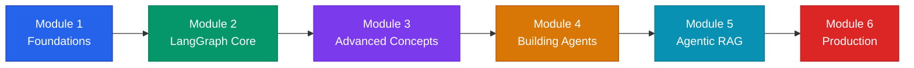

# Agentic AI using LangGraph — মাস্টারক্লাস ডকুমেন্টেশন

স্বাগতম **"Agentic AI using LangGraph"** সম্পূর্ণ প্র্যাকটিক্যাল ডকুমেন্টেশনে! এই সিরিজটি বিশেষভাবে ডিজাইন করা হয়েছে সেই সমস্ত ডেভেলপার ও এআই ইঞ্জিনিয়ারদের জন্য, যারা চ্যাটবটের গণ্ডি পেরিয়ে স্বায়ত্তশাসিত (Autonomous), গোল-ড্রিভেন এবং প্রোডাকশন-রেডি মাল্টি-এজেন্ট সিস্টেম তৈরি করতে চান।

---

## 🎯 এই সিরিজের লক্ষ্য ও ব্যাপ্তি

সাধারণ Generative AI বা RAG অ্যাপ্লিকেশন শুধু তথ্যের উত্তর দিতে পারে, কিন্তু বাস্তব পৃথিবীর জটিল কাজগুলো সম্পন্ন করতে পারে না। এই সিরিজে আমরা শিখব কীভাবে **LangGraph** ব্যবহার করে স্টেটফুল (Stateful), সাইক্লিক (Cyclic) এবং সেলফ-কারেক্টিং AI এজেন্ট আর্কিটেকচার তৈরি করতে হয়।

---

## 📚 কোর্স মডিউল ও সিলেবাস

### Module 1 — Foundations of Agentic AI
* [১. Generative AI থেকে Agentic AI এর বিবর্তন](./evolution-from-genai-to-agentic-ai.md)
* *২. Anatomy of an AI Agent (Brain, Memory, Planning, Tools) — (শীঘ্রই আসছে)*

### Module 2 — LangGraph Fundamentals
* *Graph, State, Nodes এবং Edges এর পরিচিতি — (শীঘ্রই আসছে)*
* *StateGraph তৈরি ও কম্পাইলেশন — (শীঘ্রই আসছে)*

### Module 3 — Advanced LangGraph Concepts
* *Conditional Edges এবং Dynamic Routing — (শীঘ্রই আসছে)*
* *Human-in-the-loop (Checkpointer, Breakpoints) — (শীঘ্রই আসছে)*
* *Time Travel ও State Inspection — (শীঘ্রই আসছে)*

### Module 4 — Building AI Agents
* *ReAct Agent স্ক্র্যাচ থেকে তৈরি — (শীঘ্রই আসছে)*
* *Plan-and-Execute Architecture — (শীঘ্রই আসছে)*
* *Multi-Agent Collaboration ও Supervisor Architecture — (শীঘ্রই আসছে)*

### Module 5 — Agentic RAG Applications
* *Self-RAG (Self-Reflective RAG) — (শীঘ্রই আসছে)*
* *Adaptive RAG ও Query Routing — (শীঘ্রই আসছে)*
* *Corrective RAG (CRAG) — (শীঘ্রই আসছে)*

### Module 6 — Production & Deployment
* *LangGraph Studio ও LangSmith Tracing — (শীঘ্রই আসছে)*
* *LangServe / FastAPI ডিপ্লয়মেন্ট ও স্কেলিং — (শীঘ্রই আসছে)*

---

:::tip শেখার পূর্বশর্ত
এই কোর্সটি ইন্টারমিডিয়েট লেভেলের ডেভেলপারদের জন্য। পাইথন এবং সাধারণ LangChain বা LLM API সম্পর্কে প্রাথমিক ধারণা থাকলে সবচেয়ে দ্রুত বুঝতে পারবেন।
:::

👉 **প্রথম অধ্যায় শুরু করুন:** **[১. Generative AI থেকে Agentic AI এর বিবর্তন →](./evolution-from-genai-to-agentic-ai.md)**
