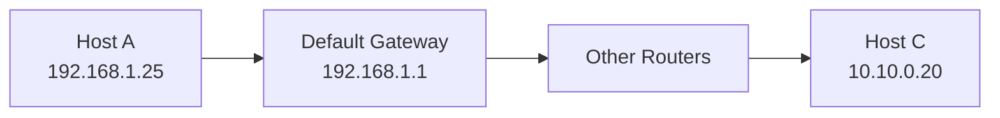
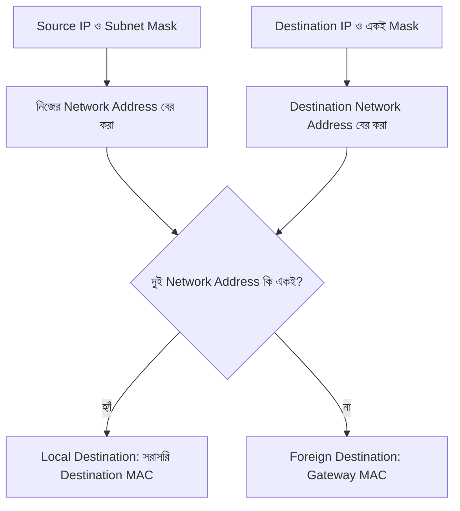
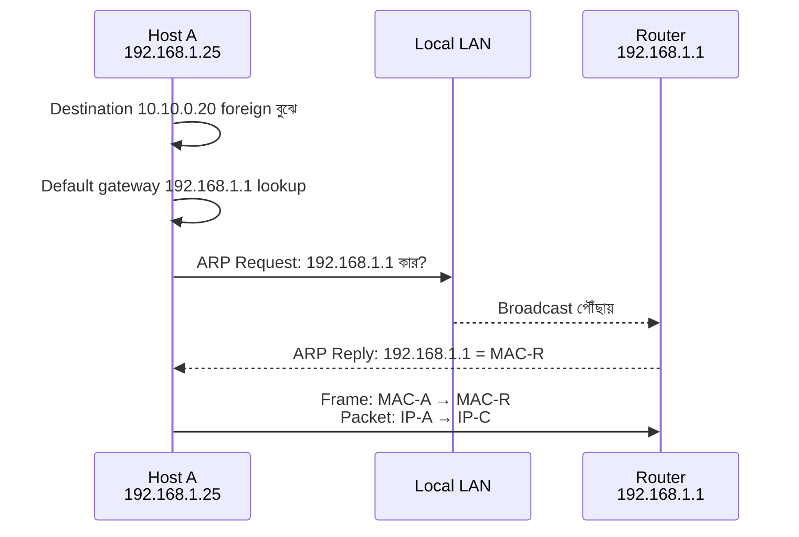
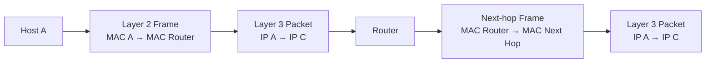
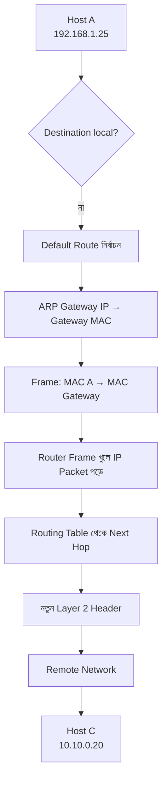
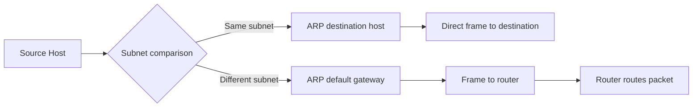
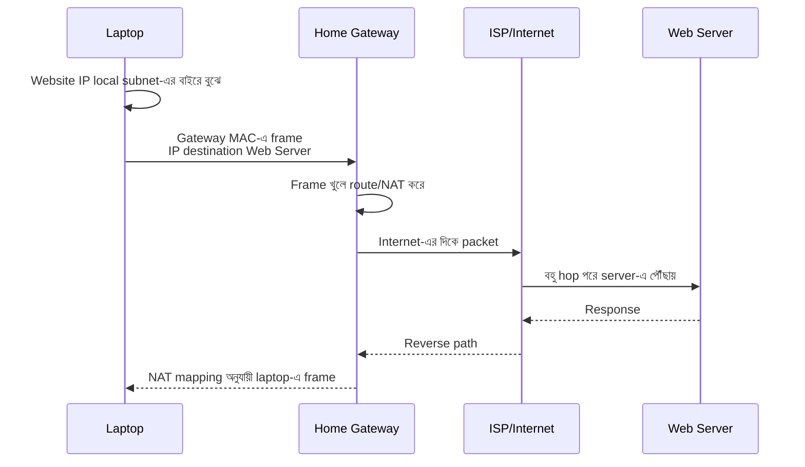
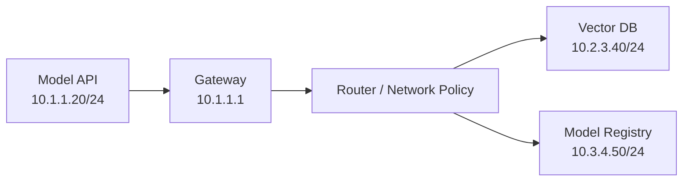

# Foreign Network Communication — Default Gateway ও ARP

একটি host যখন একই local network-এর অন্য host-এর সঙ্গে কথা বলে, তখন সে সরাসরি সেই host-এর MAC Address resolve করে frame পাঠাতে পারে। কিন্তু destination যদি অন্য subnet বা **foreign network**-এ থাকে, তখন host-এর behavior বদলে যায়। সে remote host-এর MAC Address খোঁজে না; বরং নিজের **default gateway** বা local router-এর MAC Address খুঁজে packet gateway-তে পাঠায়।

এই page-এ আমরা দেখব:

- Destination local না foreign কীভাবে বোঝা যায়
- Subnet mask কীভাবে network comparison-এ সাহায্য করে
- Default gateway কেন দরকার
- ARP request কীভাবে router-এর MAC খুঁজে পায়
- Layer 2 ও Layer 3 header-এর destination কেন আলাদা হয়
- Router কীভাবে পরের hop-এর জন্য packet প্রস্তুত করে

## 1. What — Foreign Network Communication কী?

**Foreign network communication** হলো এমন network communication যেখানে source host-এর subnet-এর বাইরে থাকা destination host-এর কাছে data পাঠানো হয়।

উদাহরণ:

```text
Host A:      192.168.1.25/24
Host C:      10.10.0.20/24
Default GW: 192.168.1.1
```

Host A-এর local network হলো `192.168.1.0/24`, কিন্তু Host C আছে `10.10.0.0/24` network-এ। তাই Host A Host C-এর কাছে সরাসরি Ethernet frame পাঠাবে না। সে প্রথমে local router বা default gateway-এর কাছে frame পাঠাবে।



## 2. Why — Default Gateway কেন দরকার?

একটি host local subnet-এর বাইরে থাকা সব network-এর MAC Address জানে না এবং জানার প্রয়োজনও নেই। MAC Address শুধুমাত্র local link-এর জন্য কার্যকর। Remote network-এ পৌঁছানোর জন্য একটি Layer 3 device দরকার, যে packet routing করতে পারে।

এই local routing device-ই **default gateway**।

Default gateway ছাড়া host:

- Local subnet-এর host-এ data পাঠাতে পারবে
- কিন্তু অন্য subnet বা Internet-এ যেতে পারবে না
- Remote destination-এর জন্য next hop জানবে না
- `No route to host` বা timeout-এর মতো error পেতে পারে

:::tip সহজ নিয়ম
Destination local হলে destination host-এর MAC দরকার। Destination foreign হলে default gateway-এর MAC দরকার।
:::

## 3. Analogy — নিজের এলাকা থেকে অন্য শহরে চিঠি পাঠানো

আপনার বাড়ি যদি একই এলাকার অন্য বাড়িতে চিঠি পাঠায়, local delivery person সরাসরি সেটি পৌঁছে দিতে পারে। কিন্তু অন্য শহরে চিঠি পাঠালে আপনি সেই শহরের বাড়ির local delivery person-এর ঠিকানা জানেন না। তাই চিঠি প্রথমে আপনার এলাকার post office-এ দেন। Post office পরের route ঠিক করে।

Networking-এ:

- Local host = আপনার বাড়ি
- Local subnet = আপনার এলাকা
- Remote host = অন্য শহরের বাড়ি
- Default gateway = এলাকার post office
- Destination IP = চিঠির final address
- Gateway MAC = local delivery office-এর local address
- Router = পরের শহরের route বেছে নেওয়া post office

Final destination IP চিঠির ঠিকানার মতো শেষ পর্যন্ত থাকে, কিন্তু প্রতিটি local delivery hop-এর MAC information বদলাতে পারে।

## 4. Local বনাম Foreign Destination

Source host-এর প্রথম কাজ হলো destination IP নিজের local subnet-এর মধ্যে আছে কি না যাচাই করা। এই সিদ্ধান্ত নেওয়ার জন্য host ব্যবহার করে:

- নিজের IP Address
- Destination IP Address
- Subnet mask বা CIDR prefix

ধরা যাক:

```text
Host A IP:       192.168.1.25
Subnet Mask:     255.255.255.0
CIDR:            /24
Destination 1:   192.168.1.50
Destination 2:   10.10.0.20
```

`/24`-এ প্রথম 24 bit network portion। তাই:

```text
Host A network: 192.168.1.0/24
Destination 1:  192.168.1.0/24  → Local
Destination 2:  10.10.0.0/24    → Foreign
```

### Bitwise comparison

Host network address বের করতে IP-কে subnet mask-এর সঙ্গে bitwise AND করা হয়:

```text
192.168.1.25   AND   255.255.255.0 = 192.168.1.0
192.168.1.50   AND   255.255.255.0 = 192.168.1.0
10.10.0.20     AND   255.255.255.0 = 10.10.0.0
```

প্রথম destination-এর network address source-এর মতো, তাই local। দ্বিতীয়টির network address আলাদা, তাই foreign।



:::warning শুধু প্রথম octet দেখে সিদ্ধান্ত নেবেন না
`192.168.x.x` বা `10.x.x.x` দেখেই local/foreign বলা যায় না। Locality নির্ধারণ হয় source IP, destination IP এবং subnet mask/prefix একসাথে দেখে।
:::

## 5. Default Gateway Configuration

Host-এর network configuration-এ সাধারণত থাকে:

```text
IP Address:       192.168.1.25
Subnet Mask:      255.255.255.0
Default Gateway:  192.168.1.1
DNS Server:       192.168.1.1
```

**Default route** হলো এমন route যা অন্য কোনো নির্দিষ্ট route match না করলে ব্যবহৃত হয়। IPv4-এ এটি সাধারণত:

```text
0.0.0.0/0
```

উদাহরণ:

```text
Destination      Gateway        Interface
192.168.1.0/24   0.0.0.0        eth0
0.0.0.0/0        192.168.1.1    eth0
```

`192.168.1.0/24` local network-এর জন্য directly connected route। `0.0.0.0/0` remote network-এর জন্য default gateway ব্যবহার করে।

### Gateway নিজে local হতে হয়

Host gateway-এর IP-তে সরাসরি Layer 2 frame পাঠাতে পারে, কারণ gateway-এর IP সাধারণত একই local subnet-এ থাকে। যদি gateway foreign subnet-এ দেওয়া হয়, host সেটিতে পৌঁছানোর local frame বানাতে পারবে না।

## 6. ARP — Gateway-এর MAC খোঁজা

Host foreign destination-এর IP জানে, কিন্তু Ethernet frame বানাতে local destination MAC দরকার। Remote Host C-এর MAC চাওয়া অর্থহীন, কারণ সেটি local broadcast domain-এ নেই। তাই Host A gateway-এর IP-এর জন্য ARP করে।

ধরা যাক:

```text
Host A:       192.168.1.25
Gateway IP:   192.168.1.1
Gateway MAC:  অজানা
```

### ARP process

1. Host A দেখে destination `10.10.0.20` foreign network-এ
2. Routing table দেখে next hop হিসেবে `192.168.1.1` পায়
3. ARP cache-এ `192.168.1.1` খোঁজে
4. Entry না থাকলে ARP Request broadcast করে
5. Router ARP Request গ্রহণ করে
6. Router নিজের MAC দিয়ে ARP Reply পাঠায়
7. Host A mapping cache-এ রাখে
8. Host A gateway-এর MAC দিয়ে frame পাঠায়



## 7. ARP Cache

**ARP cache** হলো host-এর সাময়িক table যেখানে IP-to-MAC mapping রাখা হয়। একই gateway-তে প্রতিটি remote request-এর আগে নতুন ARP করতে হয় না। Cache entry valid থাকা পর্যন্ত host সেটি reuse করে।

Linux:

```bash
ip neigh show
```

সম্ভাব্য output:

```text
192.168.1.1 dev eth0 lladdr 3c:52:82:aa:bb:cc REACHABLE
```

Windows:

```powershell
arp -a
```

সম্ভাব্য output:

```text
Interface: 192.168.1.25 --- 0x8
  Internet Address      Physical Address      Type
  192.168.1.1           3c-52-82-aa-bb-cc     dynamic
```

Cache state-এর উদাহরণ:

- `REACHABLE` — mapping ব্যবহারযোগ্য
- `STALE` — পুরোনো, প্রয়োজনে পুনরায় যাচাই হবে
- `INCOMPLETE` — ARP reply-এর অপেক্ষায়
- `FAILED` — resolution ব্যর্থ

### Cache clear

Linux-এ নির্দিষ্ট neighbor entry:

```bash
sudo ip neigh del 192.168.1.1 dev eth0
```

Windows-এ ARP cache দেখার জন্য `arp -a` ব্যবহার করা যায়। Cache clear করার command environment ও privilege অনুযায়ী ভিন্ন হতে পারে; production host-এ পরিবর্তন করার আগে impact বুঝুন।

:::warning ARP cache সবসময় স্থায়ী নয়
ARP mapping সাধারণত dynamic এবং time-based। Router, NIC বা network পরিবর্তন হলে পুরোনো mapping expire বা refresh হতে পারে।
:::

## 8. Layer 2 ও Layer 3 Header

Foreign network-এ data পাঠানোর সময় Host A-এর packet-এ দুই ধরনের destination থাকে।

### Layer 3 header

Layer 3 final logical destination নির্দেশ করে:

```text
Source IP:       192.168.1.25
Destination IP:  10.10.0.20
```

### Layer 2 header

Layer 2 বর্তমান local hop-এর destination নির্দেশ করে:

```text
Source MAC:      MAC-Host-A
Destination MAC: MAC-Default-Gateway
```

এগুলো ইচ্ছাকৃতভাবে আলাদা। Router-এর কাছে frame পৌঁছাতে হবে, কিন্তু packet-এর final destination Host C।



## 9. Complete Foreign Network Flow

ধরা যাক:

```text
Host A
IP:       192.168.1.25/24
Gateway:  192.168.1.1

Host C
IP:       10.10.0.20/24
```

### ধাপ ১: Application destination নির্ধারণ করে

Application `10.10.0.20`-এর কোনো service-এ data পাঠাতে চায়।

### ধাপ ২: Locality check

Host A `192.168.1.25/24` এবং destination `10.10.0.20` compare করে। Network আলাদা হওয়ায় destination foreign।

### ধাপ ৩: Routing table lookup

Host A দেখে foreign destination-এর জন্য default route আছে:

```text
0.0.0.0/0 via 192.168.1.1 dev eth0
```

### ধাপ ৪: Gateway MAC resolution

ARP cache-এ gateway mapping না থাকলে Host A ARP Request পাঠায়।

### ধাপ ৫: Packet ও frame তৈরি

```text
Layer 3:
Source IP:       192.168.1.25
Destination IP:  10.10.0.20

Layer 2:
Source MAC:      MAC-A
Destination MAC: MAC-Router
```

### ধাপ ৬: Switch frame forward করে

Local switch destination MAC দেখে frame router-এর port-এ পাঠায়।

### ধাপ ৭: Router frame খুলে packet দেখে

Router Layer 2 header সরিয়ে destination IP `10.10.0.20` দেখে। নিজের routing table অনুযায়ী next hop বেছে নেয়।

### ধাপ ৮: Router নতুন frame তৈরি করে

পরের interface বা next hop-এর MAC অনুযায়ী নতুন Layer 2 header যোগ হয়। Layer 3 destination এখনও `10.10.0.20`।

### ধাপ ৯: Final network-এ delivery

শেষ router Host C-এর local network-এ পৌঁছে Host C-এর MAC resolve করে। তারপর final frame Host C-এর কাছে পাঠায়।



## 10. Local বনাম Foreign Communication

| বিষয় | Local destination | Foreign destination |
|---|---|---|
| Network comparison | একই subnet | আলাদা subnet |
| Next hop | সরাসরি destination host | Default gateway/router |
| ARP target | Destination host-এর IP | Gateway-এর IP |
| Layer 2 destination | Destination MAC | Gateway MAC |
| Layer 3 destination | Destination IP | Remote destination IP |
| Router দরকার | সাধারণত নয় | হ্যাঁ |
| উদাহরণ | `192.168.1.25 → 192.168.1.50` | `192.168.1.25 → 10.10.0.20` |



## 11. Commands দিয়ে Flow যাচাই

### নিজের configuration দেখা

Linux:

```bash
ip addr show
ip route show
```

Windows PowerShell:

```powershell
ipconfig
Get-NetIPConfiguration
route print
```

খুঁজবেন:

- Host IP
- Subnet prefix বা mask
- Default gateway
- Default route
- Interface name

### Gateway reachability

```bash
ping 192.168.1.1
```

Windows:

```powershell
ping 192.168.1.1
```

Gateway reachable না হলে remote destination test করার আগে local link, VLAN, ARP ও IP configuration পরীক্ষা করুন।

### Remote destination-এর route দেখা

Linux:

```bash
ip route get 10.10.0.20
```

সম্ভাব্য output:

```text
10.10.0.20 via 192.168.1.1 dev eth0 src 192.168.1.25
```

এই output-এ দেখা যাচ্ছে:

- Destination: `10.10.0.20`
- Next hop/gateway: `192.168.1.1`
- Interface: `eth0`
- Source IP: `192.168.1.25`

Windows:

```powershell
tracert 10.10.0.20
```

### ARP mapping দেখা

```bash
ip neigh show 192.168.1.1
```

Windows:

```powershell
arp -a
```

### Layer 2 ও ARP packet capture

নিজের অনুমোদিত Linux interface-এ:

```bash
sudo tcpdump -ni eth0 arp or icmp
```

একটি fresh ARP resolution দেখতে আগে cache expire বা environment-appropriate test করুন। Shared বা production network-এ packet capture করার আগে অনুমতি নিন।

## 12. Real World Example — Internet-এ Website Access

আপনার laptop-এর configuration:

```text
Laptop IP:      192.168.1.25
Subnet:         192.168.1.0/24
Gateway:        192.168.1.1
Website IP:     93.184.216.34
```

Browser website-এর IP পাওয়ার পর laptop দেখে `93.184.216.34` local `192.168.1.0/24` network-এর মধ্যে নয়। তাই:

1. Laptop default route নির্বাচন করে
2. Gateway `192.168.1.1`-এর MAC ARP দিয়ে খোঁজে
3. TCP/HTTPS packet তৈরি করে
4. Layer 3 destination রাখে `93.184.216.34`
5. Layer 2 destination রাখে gateway-এর MAC
6. Home router frame গ্রহণ করে
7. Router Layer 2 header সরিয়ে IP packet route করে
8. NAT থাকলে source address/port translate করতে পারে
9. ISP ও Internet router-গুলো packet forward করে
10. Response reverse path-এ home router-এ ফিরে আসে
11. NAT table দেখে router response laptop-এর কাছে পাঠায়



## 13. MLOps/LLMOps-এ Foreign Network Flow

একটি ML inference service যখন vector database বা model registry-তে থাকা অন্য subnet-এর service-এ যোগাযোগ করে, একই flow ঘটে:



উদাহরণ:

- Model API local subnet `10.1.1.0/24`-এ
- Vector DB অন্য subnet `10.2.3.0/24`-এ
- Model API destination foreign বুঝে gateway-এর MAC resolve করে
- Router বা virtual gateway packet `10.2.3.0/24`-এর দিকে route করে
- Network Policy বা firewall port `6333` allow/deny করতে পারে

এখানে `Connection timeout` হলে শুধু application code নয়, route table, gateway, security policy, ARP/neighbor state এবং destination service—সব পরীক্ষা করতে হবে।

## 14. Common Mistakes

1. **Remote host-এর MAC ARP দিয়ে খোঁজা** — Host শুধু local next hop-এর MAC resolve করে।
2. **Destination IP frame-এর Layer 2 destination-এ বসানো** — Layer 2 destination MAC, Layer 3 destination IP।
3. **Gateway না দিয়েও Internet চলবে ভাবা** — Local subnet-এর বাইরে যেতে default route/gateway দরকার।
4. **Subnet mask ignore করা** — Local বনাম foreign সিদ্ধান্ত IP-এর চেহারা দেখে নয়, mask/prefix দিয়ে হয়।
5. **Gateway-এর IP foreign network-এ দেওয়া** — Gateway সাধারণত source host-এর local subnet-এ থাকতে হয়।
6. **ARP cache-কে permanent configuration ভাবা** — এটি dynamic cache; expire বা refresh হতে পারে।
7. **Gateway ping সফল মানেই remote service reachable ভাবা** — Remote route, firewall, port বা application এখনও ব্যর্থ হতে পারে।
8. **Router final destination-এর MAC শুরুতেই জানে ভাবা** — প্রতিটি outgoing link-এর next hop অনুযায়ী local MAC resolution হয়।
9. **Remote destination-এর জন্য Layer 2 broadcast ব্যবহার করা** — Broadcast local segment অতিক্রম করে না; router দরকার।
10. **NAT থাকলে IP behavior অপরিবর্তিত ভাবা** — NAT source/destination address বা port পরিবর্তন করতে পারে।

## 15. Best Practices

- প্রতিটি host-এর IP, subnet/prefix, gateway ও DNS configuration পরিষ্কারভাবে document করুন
- Routing table দেখে next hop verify করুন; অনুমান করে gateway ঠিক করবেন না
- Gateway এবং remote destination আলাদা health check হিসেবে monitor করুন
- ARP/neighbor state ও route state troubleshooting runbook-এ রাখুন
- Local subnet unnecessarily বড় না করে segmentation পরিকল্পনা করুন
- Firewall বা Network Policy-তে source subnet, destination subnet ও service port স্পষ্টভাবে define করুন
- MLOps/LLMOps service-এর জন্য DNS/service discovery ব্যবহার করুন, কিন্তু underlying route ও gateway বুঝে রাখুন
- Static route পরিবর্তনের আগে return path আছে কি না যাচাই করুন
- ARP spoofing ও gateway impersonation প্রতিরোধে switch security, trusted network ও monitoring ব্যবহার করুন
- Packet capture-এ একই packet-এর Layer 2 ও Layer 3 destination আলাদা করে পরীক্ষা করুন
- Public network-এ sensitive traffic encryption ছাড়া পাঠাবেন না

:::danger ARP Spoofing সতর্কতা
ARP trust-based protocol। আক্রমণকারী ভুয়া ARP Reply দিয়ে gateway-এর IP-এর সঙ্গে নিজের MAC জুড়ে দিতে পারে। এতে traffic intercept বা redirect হতে পারে। Secure switching, inspection, encryption এবং network monitoring ব্যবহার করুন।
:::

## 16. Interview Questions

### প্রশ্ন ১: Host কীভাবে বুঝবে destination local না foreign?

**উত্তর:** Host নিজের IP ও subnet mask/prefix ব্যবহার করে নিজের network address বের করে। Destination IP-এর network address একই হলে destination local; আলাদা হলে foreign। Foreign destination-এর জন্য default route ও gateway ব্যবহার হয়।

### প্রশ্ন ২: Foreign destination-এর ক্ষেত্রে ARP কার জন্য করা হয়?

**উত্তর:** Remote host-এর জন্য নয়; local default gateway-এর IP-এর জন্য ARP করা হয়। কারণ প্রথম Layer 2 hop হলো source host থেকে gateway।

### প্রশ্ন ৩: Foreign packet-এর Layer 2 ও Layer 3 destination কী?

**উত্তর:** Layer 3 destination হলো final remote host-এর IP Address। Layer 2 destination হলো current local hop-এর MAC Address, প্রথম hop-এ যা default gateway-এর MAC।

### প্রশ্ন ৪: Default gateway কীভাবে ব্যবহৃত হয়?

**উত্তর:** Routing table-এ কোনো specific route না মিললে host default route ব্যবহার করে। Default route-এর next hop হিসেবে gateway-এর IP থাকে। Host ARP দিয়ে gateway-এর MAC খুঁজে packet-কে local frame-এর ভিতরে gateway-তে পাঠায়।

## 17. Summary

- Foreign network হলো source host-এর local subnet-এর বাইরের network।
- Host source IP, destination IP ও subnet mask compare করে destination local না foreign নির্ধারণ করে।
- Foreign destination-এর জন্য host default gateway বা local router ব্যবহার করে।
- Host remote server-এর MAC খোঁজে না; gateway-এর MAC-এর জন্য ARP করে।
- Layer 3 header-এ final destination IP থাকে।
- প্রথম Layer 2 header-এ destination থাকে default gateway-এর MAC।
- Router incoming frame খুলে packet-এর destination IP দেখে এবং next hop বেছে নেয়।
- প্রতিটি router hop-এ Layer 2 header বদলে যায়; Layer 3 packet সাধারণত final destination IP ধরে রাখে।
- ARP mapping ARP cache-এ সাময়িকভাবে সংরক্ষিত হয়।
- `ip route get`, `ip neigh`, `arp -a`, `ping` এবং `traceroute` এই flow troubleshooting-এ গুরুত্বপূর্ণ।

## 18. পরবর্তী ধাপ

পরবর্তী lesson-এ আমরা **IP Addressing ও IPv4** নিয়ে গভীরভাবে আলোচনা করব—IPv4 structure, subnet mask, public/private address, special ranges এবং address planning সহ।
