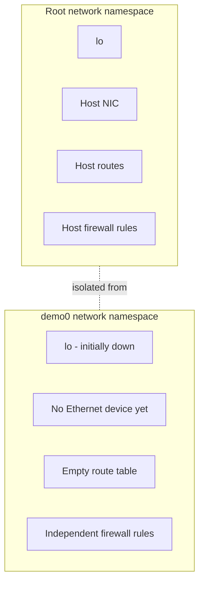
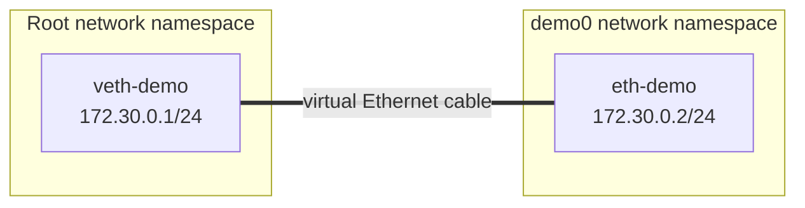
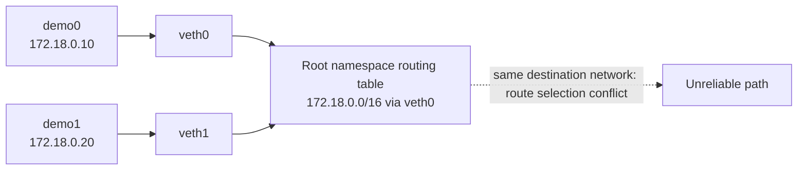
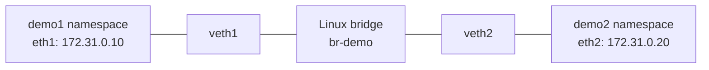
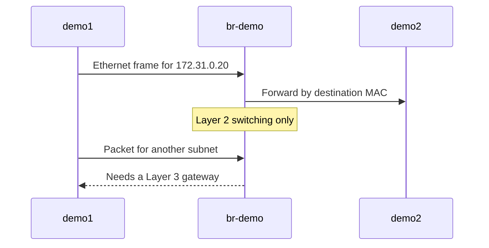
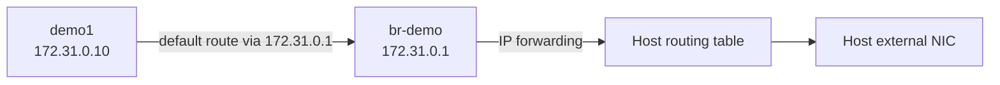
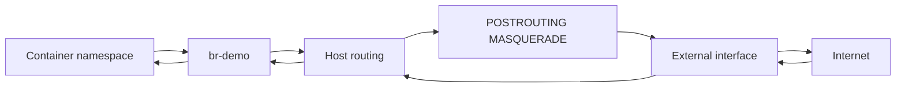
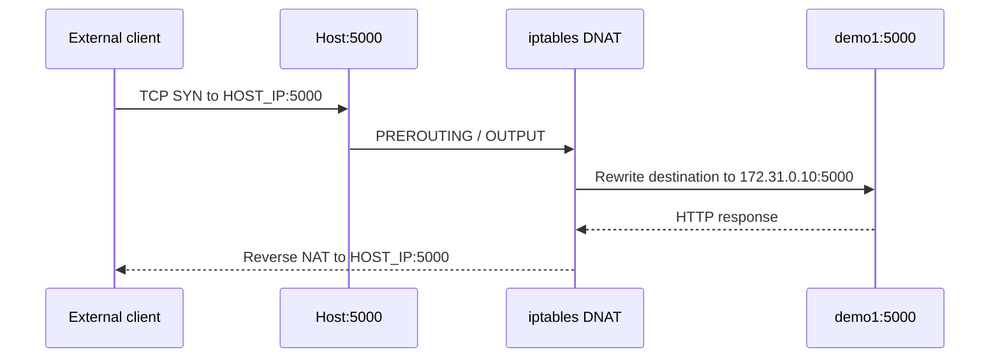
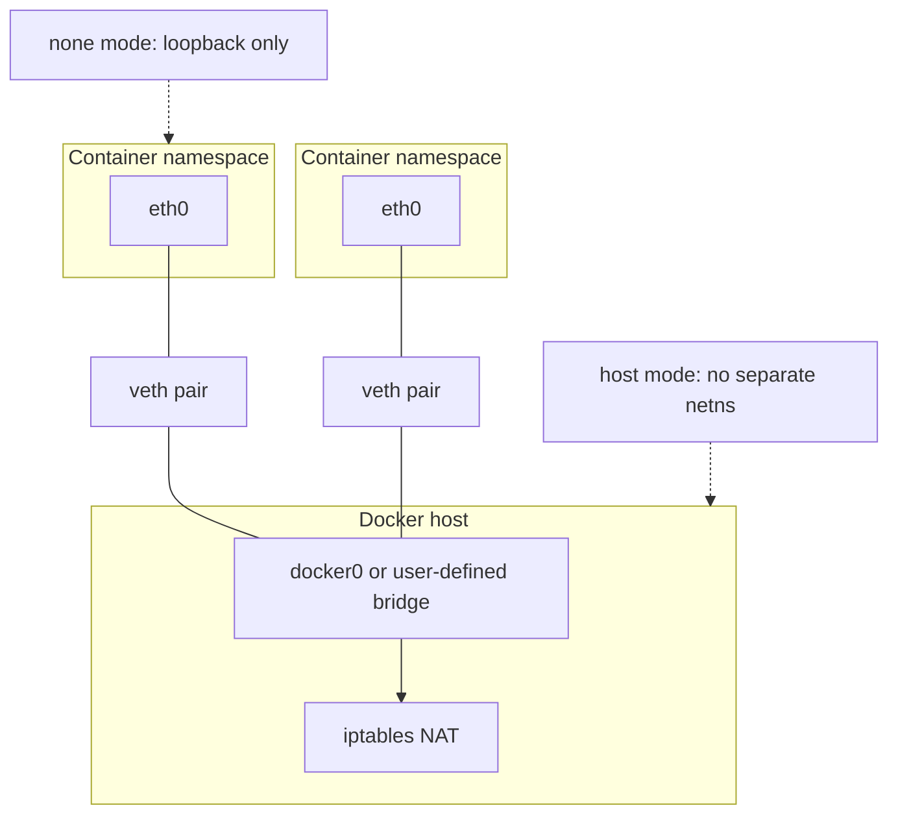

# Linux Container Networking From Scratch

Docker-এর network magic আসলে Linux kernel-এর কয়েকটি মৌলিক সুবিধার সমন্বয়:

- **Network namespace**: প্রতিটি process-এর জন্য আলাদা network stack
- **Virtual Ethernet pair (`veth`)**: দুই namespace-এর মধ্যে virtual cable
- **Linux bridge**: Layer 2 virtual switch
- **Routing ও NAT**: অন্য subnet এবং Internet-এ packet পাঠানোর ব্যবস্থা
- **DNAT**: Host-এর published port থেকে container service-এ traffic পাঠানো

এই lesson-এ আমরা Docker ব্যবহার না করে একই building blocks দিয়ে একটি ছোট container network বানাব। কাজটি Linux host বা disposable VM-এ করুন। Host-এর network configuration বদলাতে পারে, তাই ব্যক্তিগত workstation-এ সরাসরি চালাবেন না।

:::danger গুরুত্বপূর্ণ সতর্কতা
নিচের command-গুলোর অনেকগুলো `root` privilege চায় এবং bridge, route, firewall rule ও IP forwarding পরিবর্তন করে। একটি disposable Ubuntu VM ব্যবহার করুন এবং শেষে cleanup section চালান।
:::

## 1. Network Context কী?

Linux network context-এর গুরুত্বপূর্ণ অংশগুলো হলো:

| অংশ | কী নিয়ন্ত্রণ করে |
|---|---|
| Network devices | `lo`, Ethernet, bridge এবং virtual interfaces |
| Routing table | কোন destination কোন interface বা gateway দিয়ে যাবে |
| Netfilter rules | packet filtering, forwarding, NAT এবং port forwarding |
| Network namespace | একটি process-এর devices, routes ও firewall rules-এর আলাদা view |

শুরুতে নিজের environment inspect করুন:

```bash
ip link show
ip route show
iptables -S
iptables -t nat -S
```

Namespace-এর ভিতরে একই command চালালে আলাদা result পাওয়া যাবে। এটাই container network isolation-এর ভিত্তি।



## 2. Network Namespace তৈরি

একটি namespace তৈরি করলে নতুন network stack পাওয়া যায়। শুরুতে সেখানে শুধু down অবস্থায় loopback থাকে।

```bash
sudo ip netns add demo0
sudo ip netns list
sudo ip netns exec demo0 ip link show
sudo ip netns exec demo0 ip route show
```

`ip netns exec` namespace-এর ভিতরে command চালানোর সহজ উপায়। `nsenter` দিয়েও করা যায়, তবে এই lesson-এ command-গুলো ছোট রাখার জন্য `ip netns exec` ব্যবহার করা হয়েছে।

:::tip Namespace এবং container
এই lab-এ container বলতে মূলত network namespace বোঝানো হচ্ছে। বাস্তব container runtime একই namespace-এর সঙ্গে process, mount, PID, user ও cgroup isolation যোগ করে।
:::

## 3. একটি Namespace-কে Host-এর সঙ্গে যুক্ত করা

`veth` সবসময় pair হিসেবে তৈরি হয়। এক প্রান্তে packet ঢুকলে অন্য প্রান্তে packet দেখা যায়। আমরা host-side interface-টি root namespace-এ এবং peer-টি `demo0`-এ রাখব।



```bash
sudo ip link add veth-demo type veth peer name eth-demo
sudo ip link set eth-demo netns demo0

# Host-side interface
sudo ip addr add 172.30.0.1/24 dev veth-demo
sudo ip link set veth-demo up

# Namespace-side interface
sudo ip netns exec demo0 ip link set lo up
sudo ip netns exec demo0 ip link set eth-demo up
sudo ip netns exec demo0 ip addr add 172.30.0.2/24 dev eth-demo
```

এখন দুই প্রান্তের মধ্যে সরাসরি connectivity পরীক্ষা করুন:

```bash
sudo ip netns exec demo0 ping -c 2 172.30.0.1
ping -c 2 172.30.0.2
```

এখানে `172.30.0.0/24` route interface-এ address যোগ করার সময় kernel নিজে তৈরি করেছে। কিন্তু namespace থেকে অন্য network-এ যাওয়ার জন্য এখনো কোনো default route নেই।

```bash
sudo ip netns exec demo0 ip route show
```

## 4. কেন একাধিক veth Pair যথেষ্ট নয়?

দুটি namespace-কে একই subnet-এ রাখতে চাইলে host-এর দুই veth interface-এ একই subnet-এর address বসানো tempting মনে হয়। কিন্তু root namespace তখন একই destination network-এর জন্য একাধিক competing route পায়। কোন interface দিয়ে packet যাবে, তা নির্ভরযোগ্য থাকে না।

এই সমস্যার সমাধান হলো host-side veth interface-এ container IP না বসিয়ে সেগুলোকে একটি Layer 2 bridge-এর port হিসেবে ব্যবহার করা। Bridge MAC address দেখে frame forward করবে; প্রতিটি container নিজের namespace-এ IP রাখবে।



## 5. Linux Bridge দিয়ে Container Network

নতুন করে দুটি namespace বানাই:

```bash
sudo ip netns add demo1
sudo ip netns add demo2

sudo ip link add veth1 type veth peer name eth1
sudo ip link add veth2 type veth peer name eth2

sudo ip link set eth1 netns demo1
sudo ip link set eth2 netns demo2

sudo ip netns exec demo1 ip link set lo up
sudo ip netns exec demo1 ip link set eth1 up
sudo ip netns exec demo1 ip addr add 172.31.0.10/24 dev eth1

sudo ip netns exec demo2 ip link set lo up
sudo ip netns exec demo2 ip link set eth2 up
sudo ip netns exec demo2 ip addr add 172.31.0.20/24 dev eth2
```

Bridge তৈরি করে host-side veth port দুটিকে যুক্ত করুন:

```bash
sudo ip link add br-demo type bridge
sudo ip link set br-demo up
sudo ip link set veth1 master br-demo
sudo ip link set veth2 master br-demo
```



এখন container-to-container traffic Layer 2 bridge-এর মাধ্যমে চলবে:

```bash
sudo ip netns exec demo1 ping -c 2 172.31.0.20
sudo ip netns exec demo2 ping -c 2 172.31.0.10
sudo bridge link show
sudo ip netns exec demo1 ip neigh show
```

Bridge নিজে router নয়। তাই এটি একই Ethernet segment-এর endpoints-কে যুক্ত করে, কিন্তু অন্য network-এ packet পাঠানোর জন্য একটি Layer 3 gateway প্রয়োজন।



## 6. Host Gateway ও Default Route

Bridge interface-এ host-এর gateway address বসান:

```bash
sudo ip addr add 172.31.0.1/24 dev br-demo
sudo ip route show
```

Container namespace-এ default route যোগ করুন:

```bash
sudo ip netns exec demo1 ip route add default via 172.31.0.1
sudo ip netns exec demo2 ip route add default via 172.31.0.1
```

এখন namespace থেকে host-এর অন্য interface-এর address-এ যাওয়ার route আছে। Host-এর forwarding ক্ষমতা চালু না করলে packet host-এর এক interface থেকে অন্য interface-এ যাবে না।

```bash
sudo sysctl -w net.ipv4.ip_forward=1
```

:::warning Forwarding স্থায়ী করা
`sysctl -w` সাধারণত runtime-only পরিবর্তন। Production host-এ স্থায়ী configuration করার আগে security policy, firewall এবং distribution-specific sysctl configuration যাচাই করুন।
:::



## 7. Internet Access-এর জন্য NAT

Container address যেমন `172.31.0.10` private এবং host-এর বাইরের router এই network সম্পর্কে জানে না। তাই outbound packet host-এর external interface দিয়ে বের হওয়ার আগে source address masquerade করতে হয়।

External interface-এর নাম বের করুন:

```bash
ip route get 1.1.1.1
```

ধরা যাক external interface `eth0`। তখন:

```bash
sudo iptables -t nat -A POSTROUTING \
  -s 172.31.0.0/24 \
  -o eth0 \
  -j MASQUERADE
```

Test:

```bash
sudo ip netns exec demo1 ping -c 2 1.1.1.1
```

Packet path-টি এমন:



:::info Filter table বনাম NAT table
`FORWARD` chain packet pass করবে কি না নির্ধারণ করে। `POSTROUTING`-এর `MASQUERADE` source address বদলায় এবং connection tracking-এর সাহায্যে reply packet-কে আবার container-এর address-এ ফিরিয়ে দেয়।
:::

যদি host-এর forwarding policy `DROP` হয়, explicit forwarding rules লাগতে পারে:

```bash
sudo iptables -A FORWARD -i br-demo -o eth0 -s 172.31.0.0/24 -j ACCEPT
sudo iptables -A FORWARD -i eth0 -o br-demo \
  -d 172.31.0.0/24 \
  -m conntrack --ctstate ESTABLISHED,RELATED \
  -j ACCEPT
```

## 8. Port Publishing: DNAT

ধরা যাক `demo1` namespace-এ একটি HTTP server চলছে:

```bash
sudo ip netns exec demo1 python3 -m http.server \
  --bind 172.31.0.10 5000
```

Host থেকে `172.31.0.10:5000` সরাসরি পৌঁছানো গেলেও বাইরের client host-এর address-এ `5000` port-এ আসবে। সেই traffic container-এ পাঠাতে DNAT rule যোগ করা যায়।

```bash
HOST_IP=192.0.2.10

sudo iptables -t nat -A PREROUTING \
  -d "$HOST_IP" \
  -p tcp --dport 5000 \
  -j DNAT --to-destination 172.31.0.10:5000
```

Host নিজে যদি published address ব্যবহার করে request পাঠায়, local traffic সাধারণত `PREROUTING` দিয়ে যায় না। সে ক্ষেত্রে `OUTPUT` rule-ও লাগতে পারে:

```bash
sudo iptables -t nat -A OUTPUT \
  -d "$HOST_IP" \
  -p tcp --dport 5000 \
  -j DNAT --to-destination 172.31.0.10:5000
```

তারপর:

```bash
curl "http://$HOST_IP:5000"
```

Port publishing-এর মূল ধারণা:

| কাজ | Linux mechanism |
|---|---|
| Host port থেকে container port | DNAT in `PREROUTING` |
| Host-local request intercept | DNAT in `OUTPUT` |
| Container reply-এর address ঠিক রাখা | Connection tracking এবং reverse NAT |
| External network-এ container reply পাঠানো | Routing ও forwarding |



## 9. Docker Network Modes-এর সঙ্গে সম্পর্ক

এই low-level lab Docker-এর network modes বোঝার ভিত্তি তৈরি করে:

| Docker mode | Linux ধারণা |
|---|---|
| `--network host` | Container host-এর network namespace share করে |
| `--network none` | Namespace তৈরি হয়, কিন্তু loopback ছাড়া network নেই |
| `--network bridge` | Namespace + veth pair + Linux bridge + routing/NAT |

Docker এগুলো manually নয়, daemon ও network driver-এর মাধ্যমে তৈরি এবং পরিচালনা করে। User-defined bridge network-এ Docker আরও DNS-based service discovery যোগ করে, তাই application-এ static container IP ব্যবহার করা উচিত নয়।



## 10. Debugging Checklist

কোনো namespace বা container network কাজ না করলে এই ক্রমে পরীক্ষা করুন:

```bash
# Namespace ও interface
ip netns list
ip link show
sudo ip netns exec demo1 ip addr

# Route ও neighbor state
sudo ip netns exec demo1 ip route
sudo ip netns exec demo1 ip neigh

# Bridge membership
bridge link show
bridge fdb show br br-demo

# Forwarding ও firewall
sysctl net.ipv4.ip_forward
iptables -S FORWARD
iptables -t nat -S

# Packet observation
sudo tcpdump -ni br-demo
sudo tcpdump -ni veth1
```

Common failure patterns:

- Interface `DOWN`: সংশ্লিষ্ট namespace-এ `ip link set ... up` দিন
- `Network is unreachable`: route বা default gateway নেই
- Container-to-container failure: veth bridge-এ attached কি না দেখুন
- Outbound failure: IP forwarding, `FORWARD` policy এবং MASQUERADE rule দেখুন
- Port publish failure: destination host address, DNAT chain এবং service bind address যাচাই করুন
- Subnet clash: host-এর অন্য route-এর সঙ্গে container subnet overlap করছে কি না দেখুন

## 11. Cleanup

Lab শেষ হলে rules, routes, bridge এবং namespaces সরান। নিজের host-এর interface বা pre-existing firewall rule মুছবেন না।

```bash
# Lab namespaces
sudo ip netns delete demo0 2>/dev/null || true
sudo ip netns delete demo1 2>/dev/null || true
sudo ip netns delete demo2 2>/dev/null || true

# Bridge এবং তার host-side ports
sudo ip link delete br-demo 2>/dev/null || true
sudo ip link delete veth-demo 2>/dev/null || true

# Lab-specific NAT rule (exact rule match করে delete করুন)
sudo iptables -t nat -D POSTROUTING \
  -s 172.31.0.0/24 -o eth0 -j MASQUERADE 2>/dev/null || true

# Runtime forwarding state আগের মানে ফেরত দেওয়ার আগে নিজের host policy যাচাই করুন
sudo sysctl -w net.ipv4.ip_forward=0
```

## Summary

- Namespace network stack isolate করে।
- `veth` pair namespace-এর মধ্যে virtual cable তৈরি করে।
- Bridge host-side veth ports-কে একটি Layer 2 segment-এ যুক্ত করে।
- Bridge-এ gateway address এবং namespace-এ default route থাকলে host connectivity হয়।
- IP forwarding host-কে router-এর মতো কাজ করতে দেয়।
- MASQUERADE private container address-কে external host address দিয়ে Internet-এ পাঠায়।
- DNAT host-এর published port থেকে container service-এ traffic পৌঁছে দেয়।
- Docker bridge networking মূলত এই একই primitives-এর managed version।

পরবর্তী ধাপে এই ধারণাগুলো [Docker Container Networking](/docker/container-networking) এবং [Docker Network Commands](/docker/network-commands)-এর সঙ্গে মিলিয়ে দেখুন।
