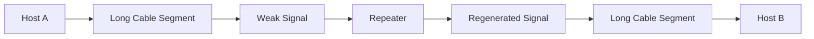
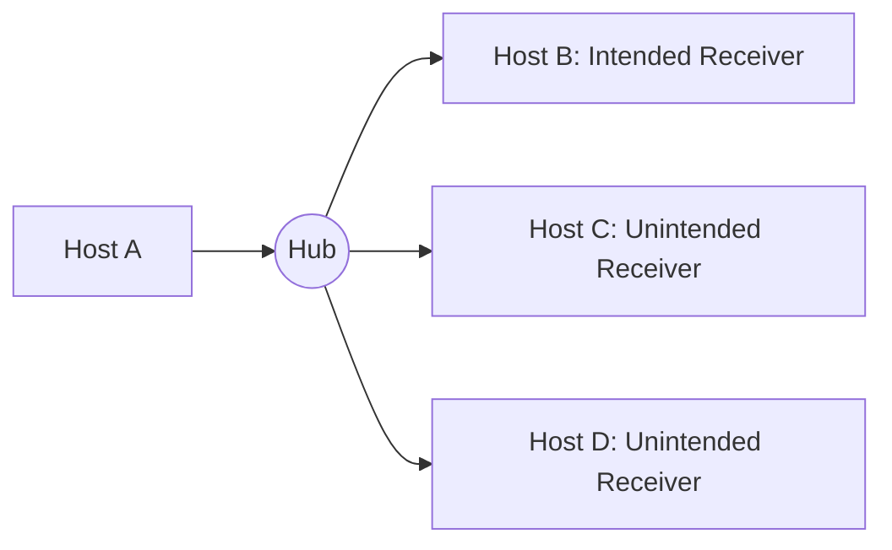
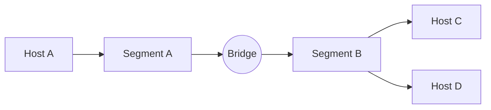
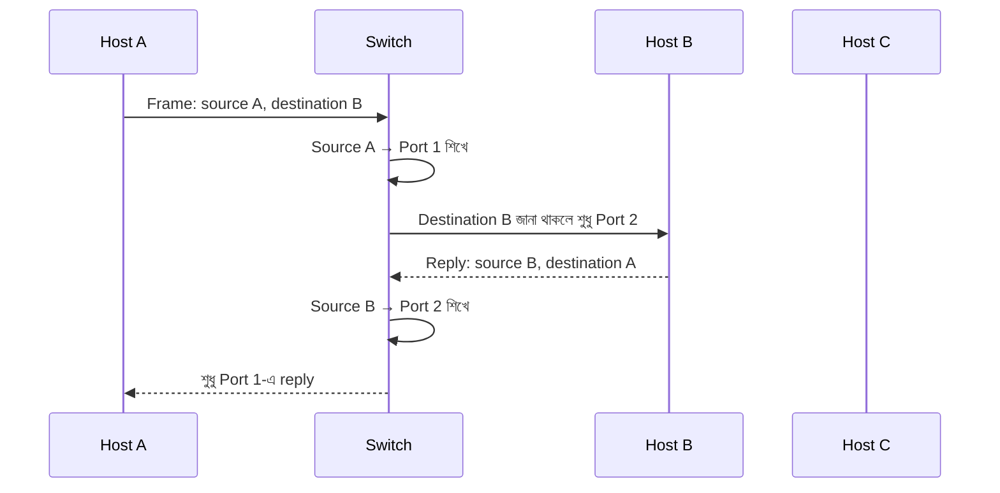
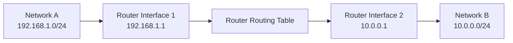
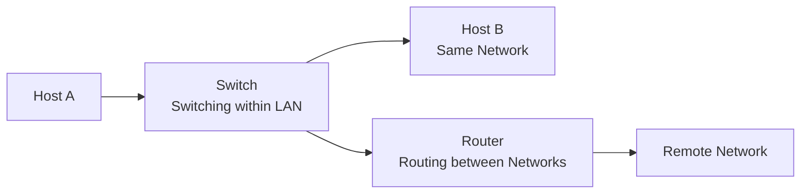
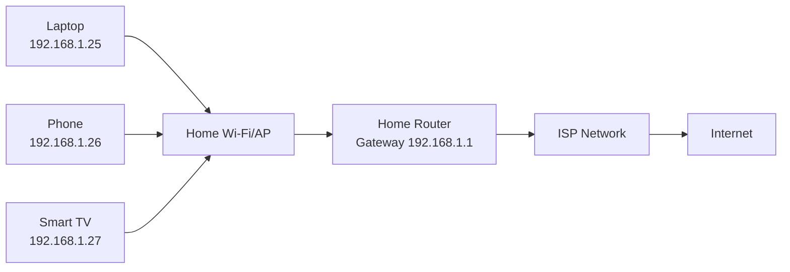
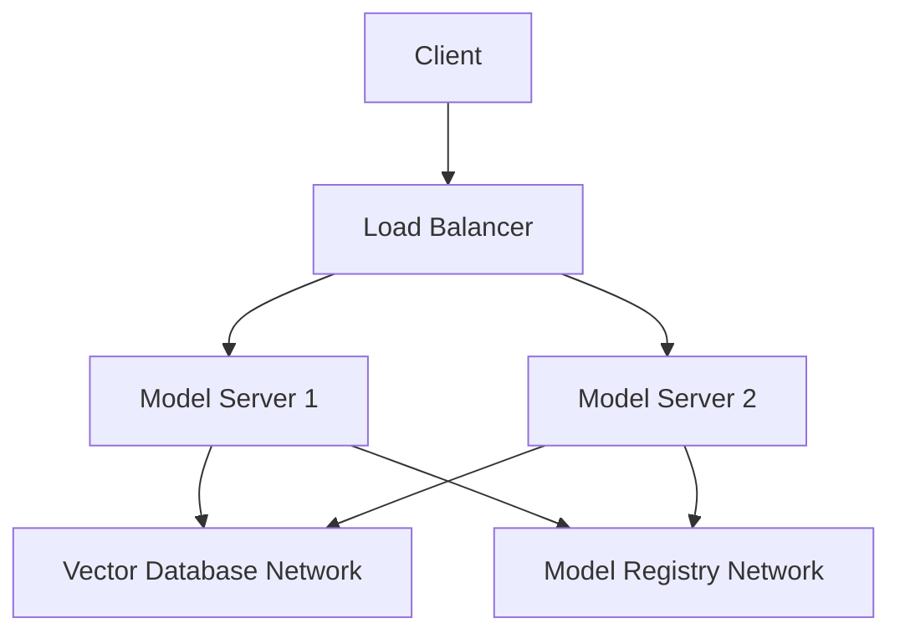

# Network Devices — Repeater, Hub, Bridge, Switch ও Router

আগের lesson-এ আমরা Host, IP Address, Network এবং Internet-এর মৌলিক ধারণা দেখেছি। এখন প্রশ্ন হলো: একটি device কীভাবে আরেকটি device-এর কাছে data পৌঁছে দেয়? Network বড় হলে কীভাবে দূরত্ব, traffic এবং আলাদা network-এর সমস্যা সমাধান করা হয়?

এই কাজগুলো করার জন্য বিভিন্ন **Network Device** ব্যবহৃত হয়। Repeater signal-এর শক্তি ফিরিয়ে আনে, Hub একাধিক port-এ traffic ছড়িয়ে দেয়, Bridge network segment আলাদা করে, Switch নির্দিষ্ট port-এ frame পাঠায়, আর Router ভিন্ন network-এর মধ্যে packet forward করে।

সবচেয়ে গুরুত্বপূর্ণ পার্থক্যটি শুরুতেই মনে রাখুন:

- **Switching** = একই network-এর ভিতরে data সরানো
- **Routing** = ভিন্ন network-এর মধ্যে data সরানো

## 1. What — Network Device কী?

**Network Device** হলো এমন hardware বা virtual component যা network-এর host, segment বা পৃথক network-এর মধ্যে data চলাচল, signal transmission, forwarding এবং traffic control-এ সাহায্য করে।

একটি device কোন layer-এ কাজ করে এবং data-এর কোন অংশ দেখে সিদ্ধান্ত নেয়, তার উপর তার ক্ষমতা নির্ভর করে।

| Device | প্রধান কাজ | সাধারণ OSI Layer |
|---|---|---|
| Repeater | দুর্বল signal regenerate করা | Layer 1: Physical |
| Hub | সব port-এ signal repeat করা | Layer 1: Physical |
| Bridge | দুই segment-এর traffic filter করা | Layer 2: Data Link |
| Switch | MAC Address দেখে নির্দিষ্ট port-এ frame পাঠানো | Layer 2: Data Link |
| Router | IP Address দেখে network-এর মধ্যে packet route করা | Layer 3: Network |

বাস্তবে আধুনিক device-এ একাধিক function একসাথে থাকতে পারে। যেমন home router-এর ভিতরে router, switch, wireless access point, firewall, DHCP server এবং NAT একসাথে থাকতে পারে।

## 2. Why — Network Device কেন দরকার?

দুটি computer সরাসরি cable দিয়ে যুক্ত করলে ছোট network তৈরি হয়। কিন্তু device-এর সংখ্যা, দূরত্ব ও network-এর পরিমাণ বাড়লে direct connection আর practical থাকে না।

Network device দরকার হয়:

- দীর্ঘ cable বা wireless distance পার হতে
- অনেক host-কে একই local network-এ যুক্ত করতে
- অপ্রয়োজনীয় traffic কমাতে
- Collision ও broadcast domain নিয়ন্ত্রণ করতে
- আলাদা network বা subnet-এর মধ্যে যোগাযোগ করাতে
- Internet-এর দিকে gateway হিসেবে কাজ করতে
- Security policy, NAT, DHCP এবং traffic filtering প্রয়োগ করতে
- Physical hardware-এর পরিবর্তে virtual network infrastructure তৈরি করতে

:::tip মূল পার্থক্য
একটি Switch সাধারণত একই LAN-এর ভিতরে frame forward করে। একটি Router সাধারণত আলাদা IP network বা subnet-এর মধ্যে packet forward করে।
:::

## 3. Analogy — রাস্তা ও ডাকঘরের উপমা

একটি শহরের road system হিসেবে network-কে ভাবুন।

| Network concept | বাস্তব উপমা |
|---|---|
| Repeater | দুর্বল মাইকে শব্দ আবার জোরে করে দেয় এমন signal station |
| Hub | এমন একজন messenger যে চিঠি সবাইকে দিয়ে দেয় |
| Bridge | দুই এলাকার মাঝের নিয়ন্ত্রিত সেতু |
| Switch | চিঠির ঠিকানা দেখে নির্দিষ্ট বাড়িতে পাঠানো sorting office |
| Router | এক শহর বা দেশের network থেকে অন্য network-এ যাওয়ার post office |
| Routing table | কোন destination-এ কোন road দিয়ে যেতে হবে তার map |
| MAC Address | স্থানীয় এলাকার নির্দিষ্ট বাড়ির পরিচয় |
| IP Address | শহর/এলাকা/দেশসহ logical address |

Hub জানে না data কার জন্য; তাই সে সবাইকে পাঠায়। Switch local address শিখে নির্দিষ্ট recipient-এর port বেছে নেয়। Router দেখে destination কোন network-এ, তারপর routing table ব্যবহার করে পরবর্তী পথ ঠিক করে।

## 4. Repeater — Signal দূরে পৌঁছানোর ব্যবস্থা

### What

**Repeater** হলো Layer 1 device, যা দুর্বল বা ক্ষয়প্রাপ্ত signal গ্রহণ করে সেটিকে regenerate করে আবার পাঠায়। এটি সাধারণত signal-এর content বুঝে না; শুধু physical signal-এর quality ও strength পুনরুদ্ধার করে।

Network cable দিয়ে signal চলার সময় দূরত্ব বাড়লে signal দুর্বল হয়। এই দুর্বল হওয়াকে **attenuation** বলা হয়। Repeater সেই signal-এর একটি পরিষ্কার সংস্করণ পরের অংশে পাঠায়।

### Why

Repeater ছাড়া cable-এর maximum distance অতিক্রম করলে:

- Signal distortion বাড়ে
- Bit error হতে পারে
- Frame corrupt হতে পারে
- Connection intermittent বা সম্পূর্ণ ব্যর্থ হতে পারে

### Internal Working

1. Repeater incoming electrical, optical বা wireless signal গ্রহণ করে
2. Signal-এর timing, amplitude বা shape বিশ্লেষণ করে
3. Noise ও distortion যতটা সম্ভব বাদ দেয়
4. Regenerated signal পরের network segment-এ পাঠায়



### Repeater কী জানে না?

Repeater সাধারণত জানে না:

- Source কে
- Destination কে
- MAC Address কী
- IP Address কী
- কোন port-এ পাঠানো দরকার

এটি শুধু signal regenerate করে। তাই এটিকে intelligent forwarding device বলা যায় না।

:::warning সীমাবদ্ধতা
Repeater distance বাড়ায়, কিন্তু network-এর traffic কমায় না। একই collision বা broadcast সমস্যা থাকলে repeater সেটি সমাধান করবে না।
:::

## 5. Hub — Multi-port Repeater

### What

**Hub** হলো একটি **multi-port repeater**। একাধিক device hub-এর port-এ যুক্ত হতে পারে। কোনো port-এ signal এলে hub সেটির signal অন্য সব port-এ copy করে পাঠায়।

Hub Layer 1 device, তাই সে MAC Address বা IP Address দেখে সিদ্ধান্ত নিতে পারে না।

### Internal Working

ধরা যাক Host A, Host B এবং Host C একটি hub-এর সঙ্গে যুক্ত। Host A যখন Host B-এর জন্য frame পাঠায়:

1. Host A signal hub-এ পাঠায়
2. Hub signal গ্রহণ করে
3. Hub destination যাচাই করে না
4. Hub signal Host B এবং Host C—দুই port-এই পাঠায়
5. Host B data গ্রহণ করে
6. Host C দেখে data তার জন্য নয় এবং discard করে



### Hub-এর সমস্যা

| সমস্যা | ফলাফল |
|---|---|
| সব port-এ traffic যায় | অপ্রয়োজনীয় traffic বাড়ে |
| MAC learning নেই | নির্দিষ্ট port নির্বাচন করতে পারে না |
| Shared bandwidth | সব host bandwidth ভাগ করে |
| এক collision domain | একসাথে transmission হলে collision হতে পারে |
| Security দুর্বল | অন্য host traffic capture করতে পারে |
| Half-duplex operation | একই সময়ে send ও receive সীমিত |

**Collision** হলো যখন একই shared medium-এ একাধিক device একই সময়ে data পাঠায় এবং signal পরস্পরের সঙ্গে সংঘর্ষে corrupt হয়। Hub-based Ethernet-এ collision detect ও সামলানোর জন্য পুরনো **CSMA/CD** ব্যবহৃত হতো।

### Hub বনাম Modern Network

আধুনিক Ethernet LAN-এ Hub প্রায় ব্যবহার হয় না। Switch Hub-এর তুলনায় বেশি efficient, কারণ Switch destination MAC দেখে নির্দিষ্ট port নির্বাচন করতে পারে।

## 6. Bridge — দুই Segment-এর মধ্যে বুদ্ধিমান সংযোগ

### What

**Bridge** হলো Layer 2 device যা দুটি network segment-কে যুক্ত করে এবং MAC Address দেখে কোন traffic কোন side-এ পাঠানো দরকার তা নির্ধারণ করে।

Bridge Hub-এর মতো শুধু signal repeat করে না; এটি কিছুটা intelligence ব্যবহার করে traffic filter করে।

### Internal Working

ধরা যাক Bridge-এর বাম পাশে Segment A এবং ডান পাশে Segment B।

1. Bridge incoming frame-এর source MAC Address দেখে
2. Source MAC কোন side-এ আছে তা MAC table-এ শেখে
3. Destination MAC কোন side-এ আছে তা খোঁজে
4. Destination একই side-এ হলে frame অন্য side-এ পাঠায় না
5. Destination অন্য side-এ হলে frame forward করে
6. Destination অজানা হলে প্রয়োজন অনুযায়ী frame flood করে



### Bridge-এর উপকার

- অপ্রয়োজনীয় traffic অন্য segment-এ যেতে দেয় না
- Collision domain ভাগ করতে পারে
- Host location শিখতে পারে
- Hub-এর তুলনায় bandwidth utilization ভালো

Bridge-এর সীমাবদ্ধতা হলো এটি সাধারণত দুইটি segment-এর জন্য ব্যবহৃত হয় এবং বড় network-এ বহু port পরিচালনার জন্য Switch বেশি উপযুক্ত। আধুনিক Switch মূলত multi-port bridge-এর উন্নত রূপ।

## 7. Switch — Multi-port Intelligent Bridge

### What

**Switch** হলো Layer 2 network device যা একাধিক host-কে যুক্ত করে এবং destination **MAC Address** দেখে frame-কে নির্দিষ্ট port-এ forward করে।

Switch-এর সবচেয়ে গুরুত্বপূর্ণ feature হলো **MAC Address Table** বা **CAM Table**। CAM-এর পূর্ণরূপ **Content Addressable Memory**; এটি দ্রুত MAC-to-port lookup করতে সাহায্য করে।

### Switch কীভাবে MAC শেখে?

ধরা যাক:

- Host A-এর MAC: `AA:AA:AA:AA:AA:AA`
- Host B-এর MAC: `BB:BB:BB:BB:BB:BB`
- Host A Switch-এর Port 1-এ
- Host B Switch-এর Port 2-এ

Host A frame পাঠালে Switch:

1. Frame Port 1-এ receive করে
2. Source MAC `AA:AA:AA:AA:AA:AA` দেখে
3. MAC table-এ লিখে: `AA:AA:AA:AA:AA:AA → Port 1`
4. Destination MAC table-এ থাকলে নির্দিষ্ট port বেছে নেয়
5. Destination MAC অজানা হলে অন্য relevant port-এ flood করে
6. পরবর্তীতে reply এলে Host B-এর MAC-ও Port 2 হিসেবে শেখে



### Unknown Unicast Flooding

Switch destination MAC জানে না হলে frame-টি incoming port বাদ দিয়ে অন্য port-এ পাঠায়। এটিকে **unknown unicast flooding** বলা হয়। Destination host reply দিলে Switch তার MAC location শিখে ফেলে।

### Broadcast ও Multicast

Switch সাধারণত broadcast frame সব relevant port-এ পাঠায়। IPv4-এর ARP request একটি broadcast-এর উদাহরণ। Broadcast-এর destination MAC হলো:

```text
FF:FF:FF:FF:FF:FF
```

বড় network-এ broadcast বেশি হলে performance কমতে পারে। Router সাধারণত Layer 3 boundary তৈরি করে broadcast domain আলাদা করে।

### Switch-এর উপকার

- প্রতিটি port-এ আলাদা collision domain
- Full-duplex communication সমর্থন
- Destination port-এ targeted forwarding
- ভালো bandwidth utilization
- VLAN দিয়ে logical segmentation
- Port security ও monitoring feature

**VLAN (Virtual Local Area Network)** হলো একই physical switch-এর port-গুলোকে আলাদা logical network-এ ভাগ করার পদ্ধতি। VLAN নিয়ে বিস্তারিত আলাদা topic-এ আলোচনা করা যায়।

### Managed বনাম Unmanaged Switch

| বিষয় | Unmanaged Switch | Managed Switch |
|---|---|---|
| Configuration | প্রায় নেই | Web UI, CLI বা API দিয়ে করা যায় |
| VLAN | সাধারণত নেই | সমর্থন করে |
| Monitoring | সীমিত | SNMP, port statistics, logs |
| Security | সীমিত | Port security, 802.1X, ACL |
| ব্যবহার | Home বা ছোট office | Production enterprise network |
| খরচ | কম | বেশি |

## 8. Router — ভিন্ন Network-এর মধ্যে যোগাযোগ

### What

**Router** হলো Layer 3 device যা destination IP Address দেখে ভিন্ন network বা subnet-এর মধ্যে packet forward করে। Router সাধারণত প্রতিটি interface-এ আলাদা IP network-এর সঙ্গে যুক্ত থাকে।

Router local network-এর host-এর **default gateway** হিসেবে কাজ করে। কোনো destination local subnet-এর বাইরে হলে host packet router-এর কাছে পাঠায়।

### Routing Table

Router-এর সিদ্ধান্তের কেন্দ্রে থাকে **Routing Table**। এতে destination network, subnet prefix, next hop এবং outgoing interface-এর তথ্য থাকে।

উদাহরণ:

```text
Destination       Next Hop        Interface
192.168.1.0/24    directly conn.   eth0
10.10.0.0/16      192.168.1.254    eth1
0.0.0.0/0         203.0.113.1      eth2
```

`0.0.0.0/0` হলো **default route**। অন্য কোনো specific route না মিললে packet এই route ব্যবহার করে।

### Router কীভাবে packet forward করে?

1. Router incoming interface-এ frame গ্রহণ করে
2. Data Link header সরিয়ে IP packet বের করে
3. Destination IP পড়ে routing table lookup করে
4. Longest prefix match ব্যবহার করে সবচেয়ে নির্দিষ্ট route বেছে নেয়
5. TTL এক কমায়
6. প্রয়োজনে নতুন Data Link header তৈরি করে
7. Next hop-এর outgoing interface দিয়ে packet পাঠায়



### Routing Table কীভাবে তৈরি হয়?

Router route পেতে পারে:

- **Connected route** — interface configuration থেকে automatically
- **Static route** — administrator manually configure করে
- **Dynamic route** — routing protocol-এর মাধ্যমে

Dynamic routing protocol-এর উদাহরণ:

- **RIP (Routing Information Protocol)** — distance vector, ছোট network-এর জন্য পুরনো protocol
- **OSPF (Open Shortest Path First)** — enterprise internal network-এ ব্যবহৃত link-state protocol
- **BGP (Border Gateway Protocol)** — Internet-এর autonomous system-এর মধ্যে routing-এর প্রধান protocol

এই page-এ protocol-এর গভীরে না গিয়ে router-এর মূল কাজ হিসেবে packet forwarding বোঝাই লক্ষ্য।

### Router-এর অন্যান্য কাজ

আধুনিক router-এ প্রায়ই থাকে:

- NAT (Network Address Translation)
- DHCP server
- Firewall ও ACL
- VPN termination
- QoS বা Quality of Service
- Load balancing
- Wireless access point

তবে এগুলো Router-এর মূল Layer 3 routing function-এর অতিরিক্ত feature।

## 9. Switching বনাম Routing

| বিষয় | Switching | Routing |
|---|---|---|
| কোথায় কাজ করে | একই network বা LAN-এর ভিতরে | ভিন্ন network-এর মধ্যে |
| Address | MAC Address | IP Address |
| প্রধান device | Switch | Router |
| সাধারণ layer | Layer 2 | Layer 3 |
| Data unit | Frame | Packet |
| Decision table | MAC/CAM table | Routing table |
| Broadcast | Forward করতে পারে | সাধারণত boundary তৈরি করে |
| উদাহরণ | একই office-এর দুই PC | Office network থেকে Internet |



## 10. Hub, Bridge, Switch ও Router-এর তুলনা

| বৈশিষ্ট্য | Hub | Bridge | Switch | Router |
|---|---|---|---|---|
| Port | একাধিক | সাধারণত 2 | একাধিক | একাধিক interface |
| Layer | 1 | 2 | 2 | 3 |
| Address দেখে? | না | MAC | MAC | IP |
| Traffic forwarding | সব port-এ | MAC অনুযায়ী দুই segment | নির্দিষ্ট port | নির্দিষ্ট next hop/interface |
| Collision domain | একটি shared | ভাগ করতে পারে | প্রতিটি port আলাদা | প্রতিটি interface আলাদা |
| Broadcast domain | একটি | সাধারণত একটি | VLAN অনুযায়ী | interface/network অনুযায়ী ভাগ করে |
| Intelligence | খুব কম | মাঝারি | বেশি | বেশি |
| আধুনিক ব্যবহার | প্রায় obsolete | Switch-এ absorbed | খুব প্রচলিত | LAN/WAN/Internet-এ অপরিহার্য |

## 11. Hands-on Commands

### Linux interface ও route দেখা

```bash
ip link
ip addr
ip route
```

সম্ভাব্য output:

```text
default via 192.168.1.1 dev eth0
192.168.1.0/24 dev eth0 proto kernel scope link src 192.168.1.25
```

এখানে `192.168.1.1` হলো default gateway। `192.168.1.0/24` local network-এর route।

### Windows-এ route দেখা

```powershell
ipconfig
route print
```

### ARP বা neighbor table দেখা

```bash
ip neigh
arp -a
```

Windows:

```powershell
arp -a
```

এখানে local IP থেকে MAC mapping দেখা যায়। Host local destination বা gateway-এ frame পাঠানোর সময় এই mapping ব্যবহার করতে পারে।

### পথ পরীক্ষা করা

Linux/macOS:

```bash
traceroute example.com
```

Windows:

```powershell
tracert example.com
```

এটি packet কোন কোন Layer 3 hop অতিক্রম করছে তার ধারণা দেয়। কোনো hop-এ `* * *` দেখা গেলেই সবসময় failure নয়; অনেক router diagnostic response block করে।

### Listening service দেখা

```bash
ss -tuln
```

Windows:

```powershell
netstat -ano
```

এগুলো switch বা router table দেখায় না; local host-এর transport endpoint ও connection state দেখায়। এই পার্থক্যটি গুরুত্বপূর্ণ।

## 12. Real World Example — Home Network থেকে Internet

একটি সাধারণ home network-এ laptop, phone ও smart TV Wi-Fi router-এর সঙ্গে যুক্ত থাকে। এই home router-এর ভিতরে একাধিক function থাকে:

1. Wireless access point host-গুলোকে যুক্ত করে
2. Built-in switch local Ethernet device-গুলোকে যুক্ত করে
3. DHCP server private IP দেয়
4. Router local network ও ISP network-এর মধ্যে packet forward করে
5. NAT private IP-কে public IP দিয়ে Internet-এ পাঠায়
6. Firewall unsolicited inbound traffic filter করে



আপনি যখন একটি website খুলবেন, local device প্রথমে বুঝবে destination local network-এ নেই। তাই packet home router-এর default gateway-এ যাবে। Home router routing এবং NAT করে ISP-এর দিকে packet পাঠাবে। Response এলে NAT table দেখে সঠিক internal host-এ ফিরিয়ে দেবে।

## 13. MLOps/LLMOps-এ Network Device-এর ব্যবহার

MLOps/LLMOps architecture-এ একই ধারণার physical ও virtual রূপ দেখা যায়:

- Container network-এর virtual switch container-গুলোকে যুক্ত করে
- Kubernetes Service traffic virtual routing ও load balancing করে
- Ingress বা API Gateway external traffic ভিতরের service-এ route করে
- Firewall বা Network Policy service-to-service traffic নিয়ন্ত্রণ করে
- Load Balancer client traffic একাধিক model server-এ distribute করে
- Router বা virtual network gateway subnet-এর মধ্যে traffic চালায়



Physical Switch ও Router-এর ধারণা বোঝা থাকলে Docker bridge network, Kubernetes CNI, service routing এবং cloud virtual network বোঝা অনেক সহজ হয়। Device virtual হলেও মূল প্রশ্ন একই থাকে: data কোন address দেখে, কোন boundary পার হচ্ছে, এবং কোন next hop বেছে নিচ্ছে?

## 14. Common Mistakes

1. **Hub ও Switch-কে একই device ভাবা** — Hub সবাইকে পাঠায়; Switch MAC table দেখে নির্দিষ্ট port বেছে নেয়।
2. **Switch ভিন্ন network-এর মধ্যে route করে ভাবা** — সাধারণ Layer 2 Switch IP network boundary পার করায় না; Layer 3 switch আলাদা feature।
3. **Router শুধু Internet-এর জন্য ভাবা** — Router যেকোনো পৃথক subnet বা network-এর মধ্যে packet forward করে।
4. **Repeater traffic filter করে ভাবা** — Repeater signal regenerate করে, destination বুঝে না।
5. **MAC table ও routing table গুলিয়ে ফেলা** — Switch MAC-to-port mapping রাখে; Router destination network-to-next-hop mapping রাখে।
6. **`traceroute`-এর প্রতিটি hop-কে final destination ভাবা** — intermediate hop শুধু path-এর একটি router।
7. **একটি router-এর সব interface একই network-এ রাখা** — সাধারণ routing design-এ interface-গুলো আলাদা network-এর boundary তৈরি করে।
8. **Switch port-এ cable লাগলেই Internet হবে ভাবা** — Internet access-এর জন্য valid IP, gateway, DNS এবং upstream route দরকার।
9. **Virtual network physical network থেকে সম্পূর্ণ আলাদা ভাবা** — virtual device-ও একই addressing, forwarding ও segmentation ধারণা অনুসরণ করে।
10. **একটি device-এর সব feature-কে তার মূল function ভাবা** — home router-এ DHCP, NAT ও firewall থাকলেও router-এর মূল কাজ routing।

## 15. Best Practices

- Network design-এ Layer 1, Layer 2 এবং Layer 3 boundary স্পষ্টভাবে document করুন
- Hub-এর পরিবর্তে managed বা প্রয়োজন অনুযায়ী unmanaged Switch ব্যবহার করুন
- Switch-এ VLAN দিয়ে team, environment বা service segment করুন
- Router ও Layer 3 boundary-তে ACL এবং least-privilege policy ব্যবহার করুন
- Static route ব্যবহারের আগে network বড় হলে dynamic routing দরকার কি না বিবেচনা করুন
- MAC table, ARP table, routing table ও interface status troubleshooting-এ আলাদা করে পরীক্ষা করুন
- Redundant uplink ব্যবহার করলে Layer 2 loop এড়াতে Spanning Tree Protocol-এর নীতি বুঝুন
- Device management interface public Internet-এ সরাসরি expose করবেন না
- Configuration backup, firmware update এবং centralized logging রাখুন
- Network device-এর CPU, memory, interface error, packet drop ও bandwidth monitor করুন
- Physical device-এর পাশাপাশি virtual switch, virtual router এবং network policy-ও inventory-তে রাখুন

:::danger Network Loop-এর সতর্কতা
দুটি Switch একাধিক cable দিয়ে যুক্ত করলে loop তৈরি হতে পারে। Broadcast frame বারবার ঘুরে network অচল করতে পারে। Production network-এ redundancy design করার সময় Spanning Tree বা উপযুক্ত Layer 3 design ব্যবহার করুন।
:::

## 16. Interview Questions

### প্রশ্ন ১: Hub ও Switch-এর মধ্যে মূল পার্থক্য কী?

**উত্তর:** Hub Layer 1 device এবং incoming signal সব port-এ পাঠায়। Switch Layer 2 device; এটি source MAC শিখে এবং destination MAC দেখে নির্দিষ্ট port-এ frame forward করে। তাই Switch বেশি efficient, secure এবং scalable।

### প্রশ্ন ২: Switch কীভাবে MAC Address শেখে?

**উত্তর:** Switch প্রতিটি incoming frame-এর source MAC Address এবং যে port দিয়ে frame এসেছে, সেই mapping MAC/CAM table-এ রাখে। পরে destination MAC table-এ থাকলে নির্দিষ্ট port-এ frame পাঠায়। না থাকলে incoming port বাদ দিয়ে frame flood করে।

### প্রশ্ন ৩: Router ও Switch-এর মধ্যে পার্থক্য কী?

**উত্তর:** Switch সাধারণত একই LAN বা Layer 2 network-এর ভিতরে MAC Address ব্যবহার করে frame forward করে। Router আলাদা IP network বা subnet-এর মধ্যে destination IP, routing table এবং next hop ব্যবহার করে packet forward করে।

### প্রশ্ন ৪: Default Gateway কী?

**উত্তর:** Default Gateway হলো local host-এর সেই router address যেখানে local subnet-এর বাইরের destination-এর packet পাঠানো হয়। Host-এর routing table-এ কোনো specific route না মিললে সাধারণত default route ব্যবহার করে gateway-এ packet যায়।

## 17. Summary

- **Repeater** দুর্বল physical signal regenerate করে এবং network distance বাড়াতে সাহায্য করে।
- **Hub** একটি multi-port repeater; এটি destination না বুঝে সব port-এ traffic পাঠায়।
- **Bridge** MAC Address শিখে দুই network segment-এর মধ্যে অপ্রয়োজনীয় traffic কমায়।
- **Switch** হলো multi-port intelligent bridge; এটি MAC table ব্যবহার করে নির্দিষ্ট port-এ frame পাঠায়।
- **Router** destination IP ও routing table ব্যবহার করে ভিন্ন network-এর মধ্যে packet forward করে।
- **Switching** একই network-এর ভিতরের forwarding; **Routing** ভিন্ন network-এর মধ্যকার forwarding।
- Switch সাধারণত Layer 2, Router Layer 3 এবং Repeater/Hub Layer 1-এ কাজ করে।
- আধুনিক home router-এ Router, Switch, Wireless AP, DHCP, NAT ও Firewall একসাথে থাকতে পারে।
- Physical network device-এর একই ধারণা virtual switch, virtual router, container network এবং Kubernetes networking-এও প্রযোজ্য।

## 18. পরবর্তী ধাপ

পরবর্তী lesson-এ আমরা **OSI Model** নিয়ে বিস্তারিত আলোচনা করব। সেখানে সাতটি layer কীভাবে Repeater, Switch, Router এবং বিভিন্ন protocol-এর কাজকে আলাদা করে বোঝায়, তা ধাপে ধাপে দেখা হবে।
