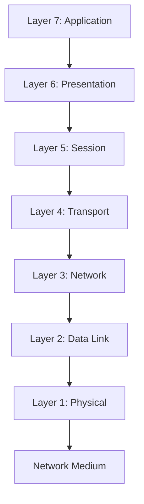
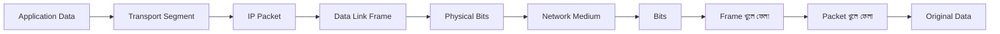
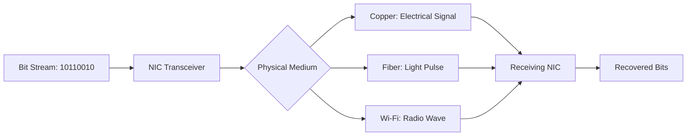
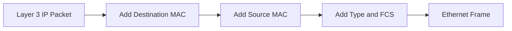
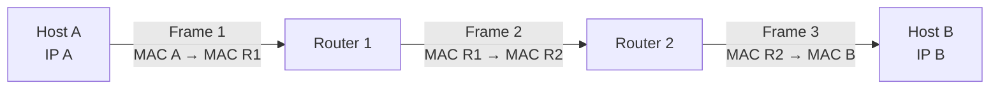
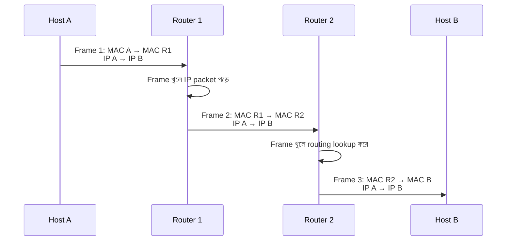
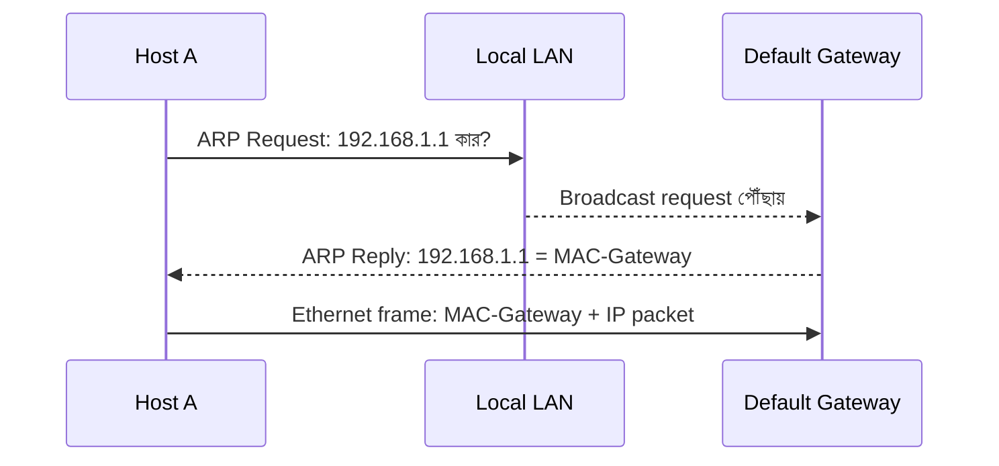
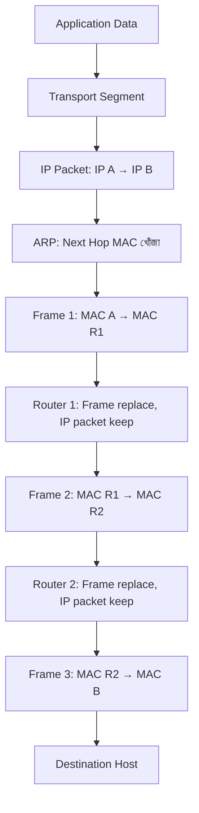
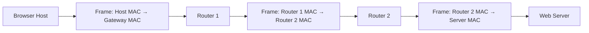
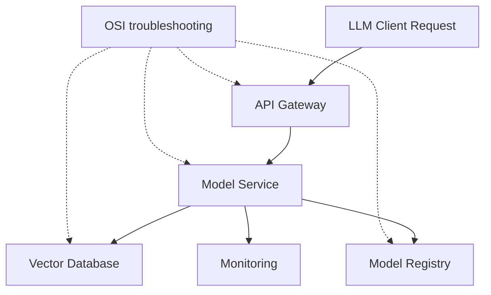

# OSI Model — Network Communication-এর Practical Map

দুটি Host কীভাবে network-এর মাধ্যমে data আদান-প্রদান করে, তা বোঝার জন্য **OSI Model** একটি conceptual framework। OSI-এর পূর্ণরূপ **Open Systems Interconnection**। এটি network communication-কে সাতটি logical layer-এ ভাগ করে, যাতে প্রতিটি layer-এর দায়িত্ব, protocol এবং troubleshooting boundary আলাদা করে বোঝা যায়।

এই lesson-এ মূল focus হলো communication-এর প্রথম তিনটি layer:

- **Layer 1: Physical** — raw bit কীভাবে signal হয়ে medium-এর মধ্য দিয়ে যায়
- **Layer 2: Data Link** — একটি hop-এর মধ্যে frame কীভাবে পৌঁছায়
- **Layer 3: Network** — বহু hop পেরিয়ে end-to-end packet কীভাবে destination network-এ যায়

একটি practical rule মনে রাখুন:

> **Layer 3 পুরো journey-এর destination চেনে; Layer 2 প্রতিটি ছোট hop-এর পরের device চেনে; Layer 1 signal বহন করে।**

## 1. What — OSI Model কী?

**OSI Model** হলো network communication বোঝানোর একটি seven-layer reference model। প্রতিটি layer তার নিচের layer-এর service ব্যবহার করে এবং উপরের layer-কে একটি নির্দিষ্ট service দেয়।

OSI Model কোনো একক network device বা protocol নয়। এটি network system-কে বিশ্লেষণ, design এবং troubleshoot করার একটি shared language।



যদিও model-এ সাতটি layer আছে, video-তে আলোচিত data movement বোঝার জন্য Layer 1, Layer 2 এবং Layer 3 সবচেয়ে গুরুত্বপূর্ণ ভিত্তি।

## 2. Why — OSI Model কেন দরকার?

OSI Model না থাকলে network problem আলোচনা করার সময় সবাই আলাদা ভাষা ব্যবহার করত। “Internet কাজ করছে না” কথাটি খুব অস্পষ্ট। OSI Model সাহায্য করে সমস্যাটিকে নির্দিষ্ট স্তরে নামিয়ে আনতে:

- Cable খুলে গেছে কি? → Layer 1
- Switch সঠিক MAC port-এ frame পাঠাচ্ছে কি? → Layer 2
- Router-এর route আছে কি? → Layer 3
- TCP connection তৈরি হচ্ছে কি? → Layer 4
- DNS বা HTTP কাজ করছে কি? → Layer 7

এতে troubleshooting systematic হয় এবং hardware, protocol ও application-এর দায়িত্ব আলাদা করা যায়।

:::tip মুখস্থ করার চেয়ে flow বুঝুন
OSI Model-এর নাম মুখস্থ করা কম গুরুত্বপূর্ণ; data নিচের দিকে কীভাবে encapsulate হয় এবং destination-এ উপরের দিকে কীভাবে decapsulate হয়, সেটি বোঝাই মূল লক্ষ্য।
:::

## 3. Analogy — Courier Delivery System

একটি courier system হিসেবে network communication ভাবুন।

- Application-এর তৈরি message হলো পাঠানোর জিনিস
- Transport layer message-কে shipment বা conversation-এ সাজায়
- Network layer final city ও destination area লিখে
- Data Link layer পরবর্তী local delivery office-এর ঠিকানা লেখে
- Physical layer রাস্তা, truck, fiber বা radio signal ব্যবহার করে

Final destination একই থাকে, কিন্তু প্রতিটি শহর বা delivery hub পার হওয়ার সময় local courier label বদলাতে পারে। Network-এও IP packet-এর end-to-end পরিচয় বজায় থাকে, কিন্তু প্রতিটি router hop-এ Layer 2 frame-এর local source ও destination MAC নতুন করে তৈরি হয়।

## 4. Encapsulation ও Decapsulation

**Encapsulation** হলো sender-এর দিকে data-র সঙ্গে প্রতিটি layer-এর control information যোগ হওয়ার প্রক্রিয়া। **Decapsulation** হলো receiver-এর দিকে layer-by-layer সেই header/trailer খুলে original data application-এর কাছে পৌঁছানো।

সাধারণভাবে:

```text
Application Data
    ↓
Transport Segment
    ↓
Network Packet
    ↓
Data Link Frame
    ↓
Physical Bits
```

Destination-এ উল্টো দিকে:

```text
Bits → Frame → Packet → Segment → Application Data
```



প্রতিটি layer তার নিজের header যোগ করে। তাই একই data-এর উপর একাধিক addressing ও control information থাকতে পারে।

## 5. Layer 1 — Physical Layer

### What

**Physical Layer** OSI Model-এর প্রথম layer। এটি raw bits—`0` এবং `1`—কে electrical signal, light pulse বা radio wave হিসেবে physical medium-এর মধ্য দিয়ে পাঠায়।

Layer 1 data-এর অর্থ বোঝে না। এটি শুধু signal-এর timing, voltage, frequency, modulation, connector এবং transmission medium নিয়ে কাজ করে।

### Layer 1-এর উদাহরণ

- Copper Ethernet cable
- Fiber-optic cable
- Wi-Fi radio signal
- RJ45 connector
- Network Interface Card-এর physical transceiver
- Repeater
- Hub
- Signal voltage, frequency ও modulation

### Internal Working

1. Upper layer থেকে bit stream Layer 1-এ আসে
2. Network interface bit-গুলোকে physical signal-এ encode করে
3. Cable, fiber বা radio medium signal বহন করে
4. Receiving interface signal detect করে
5. Signal decode করে bit stream তৈরি করে
6. Layer 2-এর কাছে bit stream পাঠায়



### Layer 1 সমস্যা

- Cable unplugged
- Damaged fiber বা connector
- Wrong speed/duplex negotiation
- Weak Wi-Fi signal
- Electromagnetic interference
- Bad transceiver বা NIC
- Port-এর link light না জ্বলা
- Excessive CRC বা physical errors

### Hands-on Commands

Linux-এ interface ও link state:

```bash
ip link show
```

সম্ভাব্য output:

```text
2: eth0: <BROADCAST,MULTICAST,UP,LOWER_UP> mtu 1500 state UP
```

এখানে `LOWER_UP` সাধারণত physical link detected হওয়ার ইঙ্গিত।

Ethernet link-এর বিস্তারিত দেখতে:

```bash
ethtool eth0
```

সম্ভাব্য output:

```text
Speed: 1000Mb/s
Duplex: Full
Link detected: yes
```

:::warning Link up মানেই application up নয়
Physical link `UP` থাকলে শুধু Layer 1-এর একটি অংশ ঠিক আছে বোঝায়। IP address, route, port বা application এখনও ভুল হতে পারে।
:::

## 6. Layer 2 — Data Link Layer

### What

**Data Link Layer** হলো OSI Model-এর দ্বিতীয় layer। এটি একই local link বা adjacent devices-এর মধ্যে data delivery পরিচালনা করে। Layer 2-এর data unit হলো **Frame**।

Layer 2 সাধারণত **MAC Address** ব্যবহার করে। MAC-এর পূর্ণরূপ **Media Access Control**। এটি network interface-এর local Layer 2 identifier।

### Hop-to-hop Delivery

**Hop-to-hop delivery** মানে packet-এর পুরো journey নয়; শুধু sender-এর পরের সরাসরি device বা next hop-এ frame পৌঁছে দেওয়া।

উদাহরণ:

```text
Host A → Switch → Router → Router → Host B
```

প্রতিটি arrow বা adjacent jump-এর জন্য Layer 2 আলাদা frame তৈরি করে। Layer 2 জানে না পুরো Internet journey কোথায় শেষ হবে; সে শুধু local link-এর next device-কে চেনে।

### Layer 2 Frame

একটি সাধারণ Ethernet frame-এ থাকে:

```text
[Destination MAC][Source MAC][Type][Payload][FCS]
```

- **Destination MAC** — local link-এ frame কোন interface-এ যাবে
- **Source MAC** — frame কোন interface থেকে এসেছে
- **Type** — payload কোন protocol-এর, যেমন IPv4 বা IPv6
- **Payload** — সাধারণত Layer 3 packet
- **FCS (Frame Check Sequence)** — transmission error detect করার checksum



### Switch-এর সঙ্গে সম্পর্ক

Switch incoming frame-এর source MAC দেখে MAC table শেখে। Destination MAC table-এ থাকলে নির্দিষ্ট port-এ frame পাঠায়। তাই Switch মূলত Layer 2 forwarding device।

### NIC-এর সঙ্গে সম্পর্ক

**NIC (Network Interface Card)** হলো host-এর network interface, যা physical signal পাঠায়/গ্রহণ করে এবং Layer 2 frame তৈরি বা পড়ে। একটি laptop-এর Wi-Fi এবং Ethernet NIC আলাদা interface হতে পারে।

## 7. Layer 3 — Network Layer

### What

**Network Layer** হলো OSI Model-এর তৃতীয় layer। এটি ভিন্ন network বা subnet-এর মধ্যে data-র end-to-end delivery-এর জন্য logical addressing ও routing ব্যবহার করে। Layer 3-এর data unit সাধারণত **Packet**।

Layer 3-এর প্রধান address হলো **IP Address**। Router Layer 3 device হিসেবে destination IP দেখে packet-এর next hop নির্বাচন করে।

### End-to-end Delivery

**End-to-end delivery** মানে source host থেকে final destination host পর্যন্ত পুরো logical journey। এই journey-তে packet বহু router পার হতে পারে।

```text
Source IP: 192.168.1.25
Destination IP: 203.0.113.20
```

এই source ও destination IP packet-এর logical journey বোঝায়। মাঝের router-গুলো packet forward করে, কিন্তু সাধারণ forwarding-এর সময় final destination IP পরিবর্তন করে না।

### Layer 3 Packet

```text
[Source IP][Destination IP][TTL][Protocol][Payload]
```

- **Source IP** — packet কোথা থেকে এসেছে
- **Destination IP** — packet কোথায় যাবে
- **TTL (Time To Live)** — packet কত hop পর্যন্ত চলতে পারবে
- **Protocol** — payload TCP, UDP বা অন্য কিছু কি না
- **Payload** — Transport layer segment

### Router-এর কাজ

1. Router incoming Layer 2 frame গ্রহণ করে
2. Frame header খুলে Layer 3 packet বের করে
3. Destination IP দেখে routing table lookup করে
4. Next hop ও outgoing interface নির্ধারণ করে
5. TTL এক কমায়
6. নতুন Layer 2 frame তৈরি করে
7. নতুন local link-এ packet পাঠায়



## 8. Layer 2 ও Layer 3 একসাথে কীভাবে কাজ করে?

এটাই OSI Model-এর সবচেয়ে গুরুত্বপূর্ণ practical অংশ। ধরা যাক Host A, Router 1, Router 2 এবং Host B আছে।

```text
Host A → Router 1 → Router 2 → Host B
```

প্রতিটি hop-এ:

- Layer 3 source/destination IP সাধারণত একই থাকে
- Layer 2 source/destination MAC বদলে যায়
- নতুন local frame তৈরি হয়
- Router পুরনো frame সরিয়ে নতুন frame বানায়

### Hop 1: Host A থেকে Router 1

```text
Frame 1:
Source MAC:      MAC-Host-A
Destination MAC: MAC-Router-1
Source IP:       IP-Host-A
Destination IP:  IP-Host-B
```

### Hop 2: Router 1 থেকে Router 2

```text
Frame 2:
Source MAC:      MAC-Router-1-Outgoing
Destination MAC: MAC-Router-2
Source IP:       IP-Host-A
Destination IP:  IP-Host-B
```

### Hop 3: Router 2 থেকে Host B

```text
Frame 3:
Source MAC:      MAC-Router-2-Outgoing
Destination MAC: MAC-Host-B
Source IP:       IP-Host-A
Destination IP:  IP-Host-B
```



:::info মূল takeaway
MAC Address local hop-এর জন্য; IP Address end-to-end logical delivery-এর জন্য। তাই Router পার হওয়ার সময় MAC header বদলায়, কিন্তু destination IP সাধারণত final host-এর জন্য একই থাকে।
:::

## 9. ARP — IP থেকে MAC খুঁজে বের করা

### What

**ARP (Address Resolution Protocol)** হলো IPv4 network-এ কোনো local IP Address-এর corresponding MAC Address খুঁজে বের করার protocol। এটি Layer 3 IP information এবং Layer 2 MAC information-এর মধ্যে bridge হিসেবে কাজ করে।

একটি host destination IP জানলেও local Ethernet frame বানাতে destination MAC দরকার। ARP এই gap পূরণ করে।

### ARP-এর ধাপ

ধরা যাক Host A-এর IP `192.168.1.25`, gateway-এর IP `192.168.1.1`। Host A gateway-এ packet পাঠাতে চায়।

1. Host A দেখে gateway local subnet-এ আছে
2. Host A ARP cache-এ `192.168.1.1` খোঁজে
3. Entry না থাকলে ARP Request broadcast করে
4. Request-এ থাকে: “`192.168.1.1` কার?”
5. Local network-এর সবাই request পায়
6. Gateway `192.168.1.1` ARP Reply পাঠায়
7. Reply-তে gateway-এর MAC থাকে
8. Host A ARP cache-এ mapping রাখে
9. Host A gateway-এর MAC দিয়ে Ethernet frame পাঠায়



### ARP Command

Linux:

```bash
ip neigh show
```

সম্ভাব্য output:

```text
192.168.1.1 dev eth0 lladdr 3c:52:82:aa:bb:cc REACHABLE
```

Windows:

```powershell
arp -a
```

সম্ভাব্য output:

```text
Interface: 192.168.1.25 --- 0x8
  Internet Address      Physical Address      Type
  192.168.1.1           3c-52-82-aa-bb-cc     dynamic
```

### ARP-এর সীমা

ARP local broadcast domain-এর মধ্যে কাজ করে। Host remote Internet server-এর MAC সরাসরি জানতে চায় না; সে local default gateway-এর MAC জানতে চায়। Router পরের link-এর জন্য নিজে পরবর্তী hop-এর MAC resolve করে।

:::warning ARP ও DNS এক নয়
ARP IP Address থেকে local MAC Address খোঁজে। DNS hostname থেকে IP Address খোঁজে। দুটোই address resolution করে, কিন্তু তাদের scope ও purpose আলাদা।
:::

## 10. Packet Journey — সম্পূর্ণ ধাপে ধাপে

ধরা যাক `192.168.1.25` host থেকে `10.10.0.20` server-এ data যাবে।

1. Application data তৈরি করে
2. Transport layer segment তৈরি করে
3. Layer 3 source IP ও destination IP যোগ করে packet তৈরি করে
4. Host দেখে `10.10.0.20` local subnet-এ নেই
5. Default gateway-এর IP-এর জন্য ARP lookup করে
6. Gateway-এর MAC দিয়ে Ethernet frame তৈরি হয়
7. Switch frame Router-এর port-এ পাঠায়
8. Router frame খুলে destination IP পড়ে
9. Router routing table দেখে next hop নির্ধারণ করে
10. Router TTL কমায়
11. Router পরের hop-এর MAC resolve করে
12. নতুন source/destination MAC দিয়ে নতুন frame তৈরি করে
13. এই process প্রতিটি router hop-এ repeat হয়
14. Final router destination host-এর MAC resolve করে
15. Destination host frame গ্রহণ করে packet decapsulate করে
16. Transport ও application layer original data পায়



## 11. Layer Comparison

| বিষয় | Layer 1: Physical | Layer 2: Data Link | Layer 3: Network |
|---|---|---|---|
| মূল কাজ | Bits transport | Hop-to-hop delivery | End-to-end routing |
| Data unit | Bits | Frame | Packet |
| Address | Physical signal, interface | MAC Address | IP Address |
| প্রধান device | Repeater, Hub, cable | NIC, Bridge, Switch | Router, Layer 3 Switch |
| Scope | Physical medium | Local link/segment | Multiple networks |
| সিদ্ধান্ত | Signal কীভাবে যাবে | কোন local port-এ যাবে | কোন next network/hop-এ যাবে |
| উদাহরণ protocol/technology | Ethernet signaling, Wi-Fi radio | Ethernet, ARP, VLAN | IPv4, IPv6, ICMP |
| সাধারণ সমস্যা | Cable, signal, link | MAC, VLAN, frame, ARP | Route, IP, TTL, gateway |

## 12. OSI Model-এর বাকি Layer এক নজরে

Video-এর practical scope Layer 1–3 হলেও সম্পূর্ণ OSI reference হিসেবে বাকি layer-গুলো জানা দরকার।

| Layer | নাম | Data unit | সাধারণ উদাহরণ |
|---|---|---|---|
| 7 | Application | Data | HTTP, DNS, SMTP |
| 6 | Presentation | Data | Encryption, compression, encoding |
| 5 | Session | Data | Session control, dialog management |
| 4 | Transport | Segment/Datagram | TCP, UDP |
| 3 | Network | Packet | IP, ICMP, Router |
| 2 | Data Link | Frame | Ethernet, MAC, Switch |
| 1 | Physical | Bits | Cable, fiber, radio, Hub |

বাস্তব TCP/IP stack-এ OSI-এর Session, Presentation এবং Application layer প্রায়ই একটি Application layer-এ একত্রে দেখা হয়। তাই OSI Model একটি reference model, প্রতিটি real-world implementation অবশ্যই হুবহু সাতটি আলাদা component হবে এমন নয়।

## 13. Hands-on Troubleshooting by Layer

একটি host অন্য host-এ পৌঁছাতে না পারলে নিচের ক্রমে পরীক্ষা করুন:

### Layer 1

```bash
ip link show
ethtool eth0
```

প্রশ্ন:

- Interface up কি?
- Cable বা Wi-Fi link আছে কি?
- Link speed/duplex ঠিক কি?

### Layer 2

```bash
ip neigh show
arp -a
```

প্রশ্ন:

- Gateway-এর MAC resolve হয়েছে কি?
- ARP entry `FAILED` বা `INCOMPLETE` কি?
- VLAN বা switch port ভুল কি?

### Layer 3

```bash
ip addr
ip route
ping 192.168.1.1
traceroute 10.10.0.20
```

প্রশ্ন:

- IP address ও subnet ঠিক কি?
- Default route আছে কি?
- Gateway reachable কি?
- Remote network-এর route আছে কি?

:::tip Layer-by-layer diagnosis
প্রথমে `ping` দিয়ে default gateway পরীক্ষা করুন। Gateway না পৌঁছালে দূরের server বা DNS নিয়ে debug করা অর্থহীন। Gateway পৌঁছালেও remote IP না পৌঁছালে Layer 3 route বা firewall পরীক্ষা করুন।
:::

## 14. Real World Example — Browser Request-এর প্রথম তিন Layer

আপনি browser-এ একটি website খুললে প্রথম তিনটি layer-এ এমন flow হয়:

1. Browser/transport destination server-এর IP ঠিক করে
2. Layer 3 packet-এ source ও destination IP থাকে
3. Local host বুঝে destination remote network-এ
4. ARP দিয়ে default gateway-এর MAC খোঁজে
5. Layer 2 frame gateway-এর MAC-এ পাঠায়
6. Router frame খুলে destination IP দেখে
7. Router নতুন local MAC দিয়ে পরের frame তৈরি করে
8. প্রতিটি router hop-এ একই process চলতে থাকে
9. Final router destination host-এর MAC ব্যবহার করে frame পাঠায়
10. Server frame খুলে IP packet গ্রহণ করে



## 15. MLOps/LLMOps-এ OSI Model

MLOps/LLMOps system troubleshoot করার সময় OSI Model অত্যন্ত কার্যকর:

- Model server-এর port open নয় → Layer 4 বা application boundary
- Container interface down → Layer 1/virtual physical boundary
- Docker bridge বা Kubernetes CNI ভুল → Layer 2/virtual networking
- Service-এর IP route নেই → Layer 3
- Vector database hostname resolve হচ্ছে না → Application/DNS path
- API request timeout → Layer 3 থেকে Layer 7 পর্যন্ত একাধিক সম্ভাবনা



একটি `Connection refused` এবং একটি `No route to host` একই সমস্যা নয়। প্রথমটি service/port boundary-র দিকে ইঙ্গিত করতে পারে; দ্বিতীয়টি route, firewall বা network path-এর দিকে ইঙ্গিত করে। Layer-based thinking এই পার্থক্য দ্রুত পরিষ্কার করে।

## 16. Common Mistakes

1. **OSI layer মানেই আলাদা physical box ভাবা** — একটি আধুনিক device একাধিক layer-এর function করতে পারে।
2. **MAC Address end-to-end থাকে ভাবা** — Router পার হলে Layer 2 source/destination MAC সাধারণত বদলে যায়।
3. **IP Address প্রতিটি hop-এ বদলায় ভাবা** — সাধারণ routing-এ source/destination IP final journey-এর জন্য থাকে; NAT বা বিশেষ feature হলে পরিবর্তন হতে পারে।
4. **ARP remote server-এর MAC খোঁজে ভাবা** — ARP local next hop, সাধারণত gateway-এর MAC resolve করে।
5. **Layer 2 ও Layer 3 দুটোই শুধু address বলে গুলিয়ে ফেলা** — MAC local link, IP routed network path-এর জন্য।
6. **`ping` সফল মানেই সব layer ঠিক ভাবা** — ICMP reply থাকলেও TCP port বা application fail করতে পারে।
7. **OSI Model-কে exact implementation ভাবা** — এটি reference model; TCP/IP stack layer grouping আলাদা হতে পারে।
8. **Router frame forward করে ভাবা** — Router incoming frame খুলে packet forward করে এবং outgoing link-এর জন্য নতুন frame তৈরি করে।
9. **Switch IP দেখে সবসময় forwarding করে ভাবা** — সাধারণ Layer 2 switch MAC দেখে; Layer 3 switch আলাদা routing capability রাখে।
10. **প্রথমেই application code পরিবর্তন করা** — নিচের layer verify না করে code বদলালে root cause আরও অস্পষ্ট হয়।

## 17. Best Practices

- Troubleshooting-এ নিচ থেকে উপরে Layer 1 → Layer 2 → Layer 3 পরীক্ষা করুন
- Network diagram-এ host, MAC scope, IP subnet, gateway এবং router hop আলাদা করে চিহ্নিত করুন
- ARP table, MAC table ও routing table-এর উদ্দেশ্য আলাদা করে document করুন
- Production-এ IP plan, subnet, VLAN ও routing boundary version-controlled documentation-এ রাখুন
- Packet capture বিশ্লেষণের সময় Ethernet header, IP header ও Transport header আলাদা করে পড়ুন
- Layer 2 broadcast domain অপ্রয়োজনীয়ভাবে বড় করবেন না
- Router interface ও default gateway-এ clear IP addressing রাখুন
- IPv4-এর সঙ্গে IPv6-এর neighbor discovery আলাদা—ARP শুধু IPv4-এর জন্য, এটি মনে রাখুন
- Health check-এ শুধু ping নয়, port এবং application-level check-ও রাখুন
- Container/Kubernetes network troubleshooting-এ virtual interface ও network namespace-কে physical interface-এর মতো layer-by-layer বিশ্লেষণ করুন

:::danger Header পরিবর্তনকে উপেক্ষা করবেন না
Router hop-এর packet capture-এ source/destination MAC বদলানো স্বাভাবিক। এটিকে packet corruption ভাববেন না। একই সময়ে source/destination IP ও TTL পরীক্ষা করুন; TTL কমা routing hop-এর স্বাভাবিক অংশ।
:::

## 18. Interview Questions

### প্রশ্ন ১: Hop-to-hop এবং end-to-end delivery-এর পার্থক্য কী?

**উত্তর:** Hop-to-hop delivery একটি local link-এ adjacent device-এর মধ্যে frame পৌঁছে দেয় এবং MAC Address ব্যবহার করে। End-to-end delivery source host থেকে final destination host পর্যন্ত logical journey, যা IP Address ও routing-এর মাধ্যমে বহু hop পেরিয়ে সম্পন্ন হয়।

### প্রশ্ন ২: Router পার হওয়ার সময় MAC Address ও IP Address-এর কী হয়?

**উত্তর:** Router incoming Layer 2 frame খুলে packet বের করে। পরের link-এর জন্য নতুন source ও destination MAC দিয়ে নতুন frame তৈরি হয়। সাধারণ routing-এ source ও destination IP final endpoints নির্দেশ করে এবং অপরিবর্তিত থাকে, যদিও TTL কমে। NAT থাকলে IP পরিবর্তিত হতে পারে।

### প্রশ্ন ৩: ARP কেন দরকার?

**উত্তর:** Host destination IP জানলেও Ethernet frame তৈরি করতে destination MAC দরকার। ARP local IPv4 address-এর corresponding MAC খুঁজে বের করে, যাতে IP packet-কে Layer 2 frame-এর ভিতরে পাঠানো যায়।

### প্রশ্ন ৪: Switch ও Router কোন layer-এ কাজ করে?

**উত্তর:** সাধারণ Switch Layer 2-এ কাজ করে এবং MAC Address ব্যবহার করে frame forward করে। Router Layer 3-এ কাজ করে এবং IP Address ও routing table ব্যবহার করে ভিন্ন network-এর মধ্যে packet forward করে। কিছু Layer 3 Switch routing-ও করতে পারে।

## 19. Summary

- OSI Model network communication-কে সাতটি logical layer-এ ভাগ করা reference model।
- Layer 1 raw bits-কে electrical, optical বা radio signal হিসেবে বহন করে।
- Layer 2 MAC Address ও frame ব্যবহার করে adjacent device-এর মধ্যে hop-to-hop delivery করে।
- Layer 3 IP Address ও packet ব্যবহার করে বহু network পার হয়ে end-to-end delivery করে।
- Switch সাধারণত Layer 2-এ MAC table দিয়ে frame forward করে।
- Router Layer 3-এ routing table দিয়ে packet-এর next hop নির্বাচন করে।
- প্রতিটি router hop-এ Layer 2 frame নতুন করে তৈরি হয় এবং MAC Address বদলায়।
- Layer 3 IP packet সাধারণত final source ও destination IP ধরে রাখে; TTL প্রতি router-এ কমে।
- ARP local IPv4 Address-কে MAC Address-এর সঙ্গে যুক্ত করে।
- OSI Model troubleshooting-এ সমস্যাকে physical, local-link, routed-network বা application স্তরে ভাগ করতে সাহায্য করে।

## 20. পরবর্তী ধাপ

পরবর্তী lesson-এ আমরা **TCP/IP Model** নিয়ে আলোচনা করব। সেখানে বাস্তবে Internet যে protocol stack ব্যবহার করে, সেটি OSI Model-এর সঙ্গে কীভাবে সম্পর্কিত এবং কোথায় আলাদা, তা পরিষ্কার হবে।
