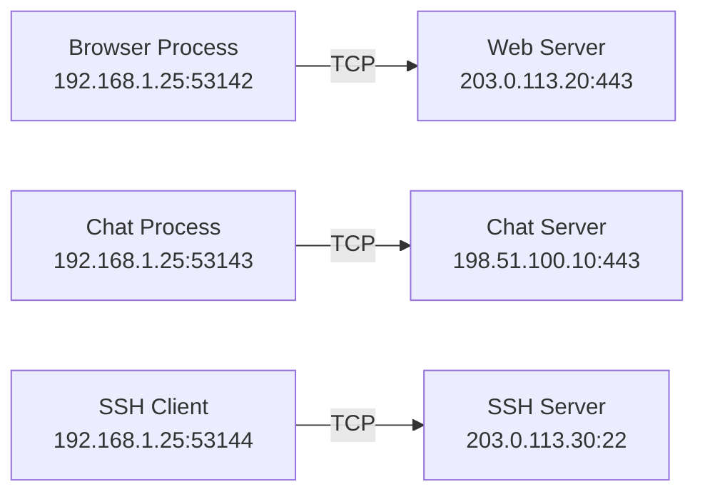
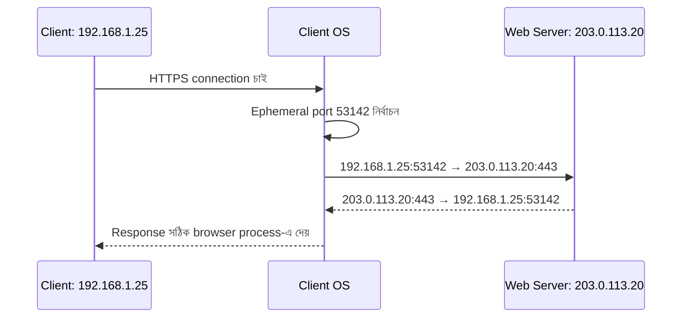
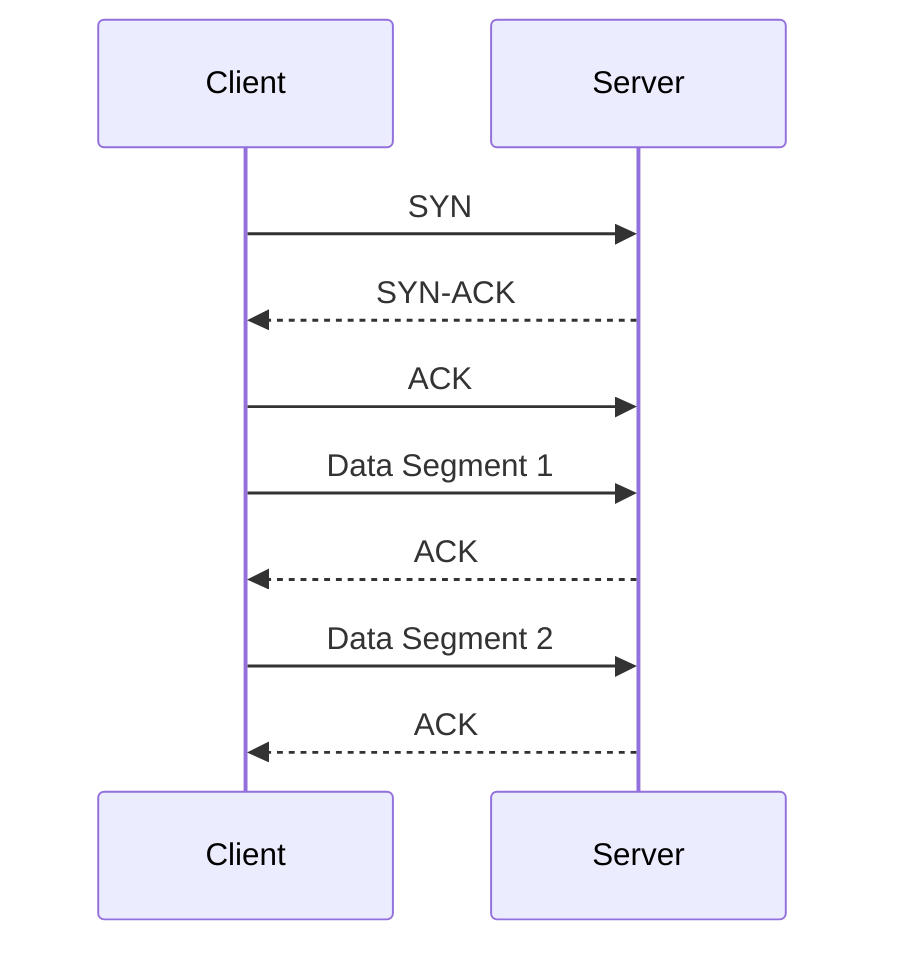
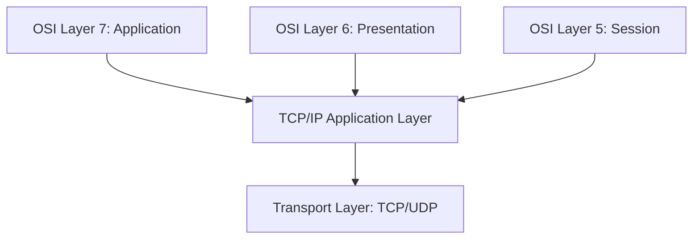
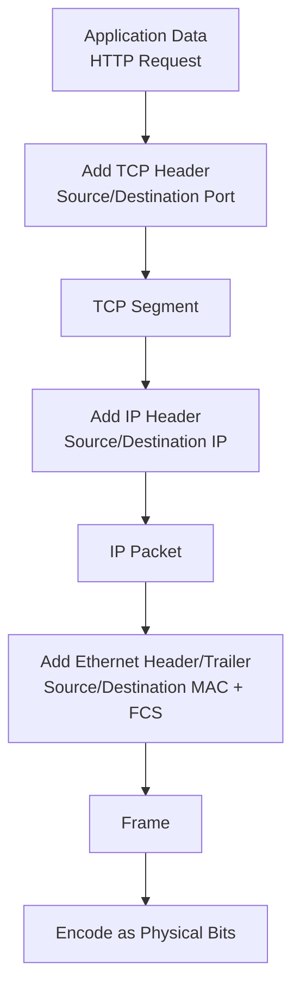
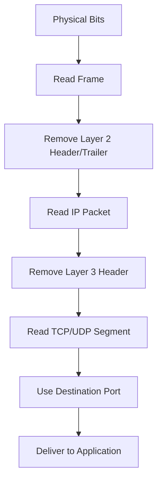
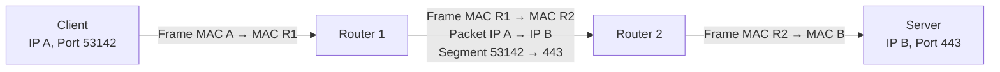
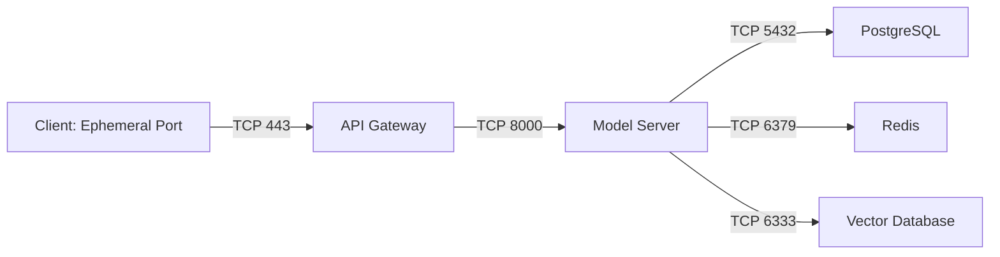

# Transport Layer ও Encapsulation

OSI Model-এর প্রথম তিনটি layer আমাদের দেখিয়েছে signal কীভাবে যায়, local link-এ frame কীভাবে পৌঁছায় এবং IP packet কীভাবে network থেকে network-এ route হয়। কিন্তু একটি host-এর ভিতরে যদি একই সময়ে browser, chat app, database client এবং monitoring agent network ব্যবহার করে, তখন প্রশ্ন আসে:

> একই host-এ পৌঁছানো data কোন application-এর কাছে যাবে?

এই সমস্যার সমাধান করে **Layer 4: Transport Layer**। Transport Layer host-to-host delivery-কে আরও নির্দিষ্ট করে **service-to-service delivery**-তে নিয়ে যায়। এর প্রধান পরিচয় হলো **port number** এবং এর প্রধান protocol হলো **TCP** ও **UDP**।

এই lesson-এ আমরা দেখব:

- Transport Layer কেন দরকার
- Port কীভাবে application stream আলাদা করে
- Server ও client port কীভাবে কাজ করে
- TCP এবং UDP-এর ভূমিকা
- Layer 5, 6 ও 7 কেন বাস্তবে Application layer হিসেবে group করা হয়
- Encapsulation ও de-encapsulation কীভাবে ঘটে
- OSI Model কেন rigid rule নয়, বরং conceptual guide

## 1. What — Transport Layer কী?

**Transport Layer** হলো OSI Model-এর Layer 4, যার কাজ হলো একটি host-এর নির্দিষ্ট service বা application থেকে অন্য host-এর নির্দিষ্ট service বা application-এ data পৌঁছে দেওয়া।

Layer 3 IP Address দিয়ে host চেনে। Layer 4 port number দিয়ে সেই host-এর ভিতরের service চেনে।

```text
IP Address = কোন host?
Port Number = সেই host-এর কোন service?
```

একটি network endpoint সাধারণত এভাবে বোঝানো হয়:

```text
203.0.113.20:443
```

এখানে:

- `203.0.113.20` হলো destination host-এর IP Address
- `443` হলো HTTPS service-এর destination port

Transport Layer-এর data unit protocol অনুযায়ী আলাদা নামে পরিচিত:

| Protocol | Layer 4 data unit |
|---|---|
| TCP | Segment |
| UDP | Datagram |

## 2. Why — Transport Layer কেন দরকার?

শুধু IP Address থাকলে data host-এ পৌঁছাবে, কিন্তু host-এর ভিতরে কোন application এটি পাবে তা বোঝা যাবে না। একটি laptop একই সময়ে অনেক network conversation চালাতে পারে:

- Browser web server-এর সঙ্গে কথা বলছে
- Chat application messaging server-এর সঙ্গে কথা বলছে
- SSH client remote server-এ connected
- Database client PostgreSQL server-এ query পাঠাচ্ছে
- Monitoring agent metrics পাঠাচ্ছে

সব data একই host-এর IP Address-এ এলেও প্রতিটির destination service আলাদা। Port number ছাড়া operating system বুঝতে পারত না কোন data কোন process-এ দিতে হবে।

Transport Layer আরও কিছু গুরুত্বপূর্ণ কাজ করতে পারে:

- Application stream আলাদা করা
- Data segmentation করা
- Delivery reliability দেওয়া
- Flow control করা
- Congestion control করা
- Connection establish ও close করা
- Error detection ও retransmission করা

:::tip মূল ধারণা
Layer 3 বলে data কোন machine-এ যাবে। Layer 4 বলে সেই machine-এর কোন service data গ্রহণ করবে।
:::

## 3. Analogy — বাড়ির ঠিকানা ও apartment number

একটি apartment building হিসেবে server host-কে ভাবুন।

- IP Address = building-এর street address
- Port Number = building-এর নির্দিষ্ট apartment বা office number
- TCP/UDP = delivery service-এর নিয়ম
- Source port = sender-এর temporary return number
- Destination port = recipient service-এর দরজা

শুধু address লিখলে delivery building পর্যন্ত পৌঁছাতে পারে, কিন্তু কোন apartment-এ যাবে তা জানা যাবে না। একইভাবে শুধু IP Address application delivery-এর জন্য যথেষ্ট নয়।

## 4. Port Number — Host-এর ভিতরের Service Address

**Port** হলো 16-bit একটি number, যা একটি host-এর ভিতরের নির্দিষ্ট network service বা process শনাক্ত করে। Port-এর range হলো:

```text
0 থেকে 65535
```

### Port range

| Range | নাম | ব্যবহার |
|---|---|---|
| `0–1023` | Well-known ports | Common system/network services |
| `1024–49151` | Registered ports | Application ও vendor services |
| `49152–65535` | Dynamic/Ephemeral ports | সাধারণত client-side temporary ports |

Operating system ও platform অনুযায়ী ephemeral range কিছুটা ভিন্ন হতে পারে। তাই `49152` থেকে শুরু হওয়াকে universal rule না ধরে dynamic port range হিসেবে ভাবা ভালো।

### Well-known port-এর উদাহরণ

| Service | Protocol | Port |
|---|---|---:|
| HTTP | TCP | `80` |
| HTTPS | TCP | `443` |
| DNS | UDP/TCP | `53` |
| SSH | TCP | `22` |
| SMTP | TCP | `25` |
| DHCP server | UDP | `67` |
| DHCP client | UDP | `68` |
| NTP | UDP | `123` |
| PostgreSQL | TCP | `5432` |
| MySQL | TCP | `3306` |
| Redis | TCP | `6379` |

Port number service শনাক্ত করতে সাহায্য করে, কিন্তু কোনো service ইচ্ছা করলে অন্য port-এও চলতে পারে। তাই port `443`-এ কিছু চলছে মানেই সেটি অবশ্যই HTTPS, এমন নিশ্চয়তা নেই।

## 5. Source Port ও Destination Port

একটি communication stream-এ সাধারণত চারটি গুরুত্বপূর্ণ তথ্য থাকে:

```text
Source IP:        192.168.1.25
Source Port:      53142
Destination IP:   203.0.113.20
Destination Port: 443
```

- **Source IP** — কোন host থেকে এসেছে
- **Source Port** — source host-এর কোন application stream পাঠাচ্ছে
- **Destination IP** — কোন host-এ যাবে
- **Destination Port** — destination host-এর কোন service data নেবে

এই চারটি মিলে একটি **socket pair** বা connection-এর পরিচয় তৈরি করতে সাহায্য করে। TCP connection-এর জন্য সাধারণভাবে এই চারটি value-এর combination unique stream আলাদা করতে ব্যবহৃত হয়।



একই client host-এর একই source IP থেকেও আলাদা source port ব্যবহার করে বহু simultaneous connection চালানো যায়।

## 6. Server Port ও Client Ephemeral Port

### Server-side port

Server সাধারণত একটি নির্দিষ্ট বা well-known port-এ **listen** করে। উদাহরণ:

- Web server → `80` বা `443`
- SSH server → `22`
- PostgreSQL → `5432`

Server application operating system-কে জানায় যে সে নির্দিষ্ট port-এ incoming connection গ্রহণ করবে।

### Client-side port

Client সাধারণত connection তৈরি করার সময় operating system-এর কাছ থেকে একটি **ephemeral port** পায়। এই port-এর মাধ্যমে operating system বুঝতে পারে কোন response কোন client process-এর কাছে ফেরত যাবে।



একই client-এর আরেকটি browser tab একই server-এর সঙ্গে connection করলে অন্য source port ব্যবহার করতে পারে:

```text
Connection 1: 192.168.1.25:53142 → 203.0.113.20:443
Connection 2: 192.168.1.25:53143 → 203.0.113.20:443
```

এই source port-এর পার্থক্যের কারণে operating system দুইটি stream আলাদা রাখতে পারে।

## 7. TCP — Reliable Transport

### What

**TCP (Transmission Control Protocol)** হলো connection-oriented এবং reliable transport protocol। এটি data সঠিক ক্রমে পৌঁছেছে কি না, হারানো data retransmit করতে হবে কি না এবং sender কত দ্রুত পাঠাবে—এসব নিয়ন্ত্রণ করে।

TCP সাধারণত ব্যবহার হয় যেখানে data loss বা wrong order গ্রহণযোগ্য নয়:

- HTTP/HTTPS
- SSH
- Database connection
- File transfer
- Email delivery

### TCP-এর প্রধান বৈশিষ্ট্য

- Connection-oriented
- Ordered byte stream
- Reliable delivery
- Acknowledgment বা ACK
- Retransmission
- Flow control
- Congestion control
- Full-duplex communication

TCP application data-কে segment-এ ভাগ করে। প্রতিটি segment-এ sequence number থাকে, যাতে receiver data সঠিক order-এ সাজাতে পারে।

### TCP-এর সাধারণ flow



TCP connection তৈরি, data transfer ও close—এই তিনটি phase-এ কাজ করে। Three-way handshake নিয়ে আলাদা lesson-এ আরও বিস্তারিত আলোচনা করা যাবে।

## 8. UDP — Lightweight Transport

### What

**UDP (User Datagram Protocol)** হলো connectionless এবং minimal-overhead transport protocol। এটি connection establish করার জন্য TCP-এর মতো handshake করে না এবং সাধারণত delivery guarantee বা ordering দেয় না।

UDP ব্যবহার হয় যেখানে speed, low latency বা simple request-response reliability-এর চেয়ে গুরুত্বপূর্ণ:

- DNS query
- Voice ও video streaming
- Online gaming
- DHCP
- Real-time telemetry
- QUIC-এর underlying transport হিসেবে UDP

### UDP-এর বৈশিষ্ট্য

- Connectionless
- No built-in ordering
- No built-in retransmission
- Low overhead
- Application নিজে reliability যোগ করতে পারে
- Packet loss হলেও application চলতে পারে

UDP datagram-এ সাধারণত থাকে:

```text
[Source Port][Destination Port][Length][Checksum][Data]
```

## 9. TCP বনাম UDP

| বিষয় | TCP | UDP |
|---|---|---|
| Connection | Connection-oriented | Connectionless |
| Reliability | Built-in | Built-in নয় |
| Ordering | বজায় রাখে | গ্যারান্টি নেই |
| Retransmission | আছে | নেই |
| Flow control | আছে | নেই |
| Congestion control | আছে | নেই |
| Overhead | বেশি | কম |
| Latency | তুলনামূলক বেশি | কম হতে পারে |
| Data model | Byte stream | Datagram/message |
| ব্যবহার | HTTPS, SSH, database | DNS, streaming, gaming |

:::warning UDP মানেই unreliable application নয়
UDP নিজে delivery guarantee দেয় না, কিন্তু application-level protocol sequence number, acknowledgment, retry ও error recovery যোগ করতে পারে। QUIC/HTTP/3 এর উদাহরণ।
:::

## 10. Layer 5, 6 ও 7 — Modern Application Layer

OSI Model-এ Layer 5, 6 ও 7 আলাদা নামে পরিচিত:

| Layer | নাম | মূল ধারণা |
|---|---|---|
| 5 | Session | Communication session শুরু, বজায় ও শেষ করা |
| 6 | Presentation | Format, encoding, compression ও encryption |
| 7 | Application | User-facing network service ও application protocol |

বাস্তব Internet protocol stack-এ এই তিনটি layer প্রায়ই একটি **Application Layer** হিসেবে group করা হয়। TCP/IP Model সাধারণত OSI-এর Session, Presentation ও Application function-কে একত্র করে Application layer-এ রাখে।

উদাহরণ:

- HTTP request ও response → Application function
- JSON encoding → Presentation-এর মতো কাজ
- TLS encryption → Presentation/Session-এর মতো কাজ
- Login session বা WebSocket session → Session-এর মতো কাজ



এখানে grouping মানে function হারিয়ে যায় না; শুধু real-world implementation-এ সবসময় আলাদা protocol layer হিসেবে দেখা যায় না।

## 11. Encapsulation — Sender-এর দিকে Data নামা

**Encapsulation** হলো sender host-এ data stack-এর নিচে নামার সময় প্রতিটি layer-এর header বা control information যোগ হওয়া।

ধরা যাক browser একটি HTTPS request পাঠাচ্ছে।

### ধাপ ১: Application Data

Browser HTTP request তৈরি করে:

```text
GET /api/health HTTP/1.1
Host: example.com
```

### ধাপ ২: Transport Segment

TCP source ও destination port যোগ করে:

```text
Source Port: 53142
Destination Port: 443
Sequence Number: ...
Acknowledgment Number: ...
Payload: HTTP request
```

এখন এটি TCP **Segment**।

### ধাপ ৩: Network Packet

IP source ও destination address যোগ করে:

```text
Source IP: 192.168.1.25
Destination IP: 203.0.113.20
Payload: TCP segment
```

এখন এটি IP **Packet**।

### ধাপ ৪: Data Link Frame

Ethernet source ও destination MAC যোগ করে:

```text
Source MAC:  MAC-Client
Destination MAC: MAC-Gateway
Payload: IP packet
FCS: Error check
```

এখন এটি Data Link **Frame**।

### ধাপ ৫: Physical Bits

NIC frame-কে electrical signal, light pulse বা radio transmission-এ convert করে।



## 12. De-encapsulation — Receiver-এর দিকে Data ওপরে ওঠা

**De-encapsulation** হলো receiver host-এ data stack-এর ওপরের দিকে ওঠার সময় প্রতিটি layer নিজের header পরীক্ষা করে সরিয়ে দেওয়া।

1. Physical Layer signal গ্রহণ করে bits তৈরি করে
2. Data Link Layer frame-এর FCS পরীক্ষা করে MAC দেখে
3. Layer 3 IP header দেখে packet গ্রহণযোগ্য কি না যাচাই করে
4. Layer 4 TCP/UDP header দেখে port ও connection শনাক্ত করে
5. Transport data সঠিক socket/process-এর কাছে দেয়
6. Application Layer original request পায়



## 13. Complete Encapsulation Example

```text
Application:
    HTTP Request

Transport:
    [TCP Header | HTTP Request]
    Source Port: 53142
    Destination Port: 443

Network:
    [IP Header | TCP Segment]
    Source IP: 192.168.1.25
    Destination IP: 203.0.113.20

Data Link:
    [Ethernet Header | IP Packet | FCS]
    Source MAC: Client MAC
    Destination MAC: Gateway MAC

Physical:
    010101010101... electrical/light/radio signal
```

Destination server-এ একই data উল্টোভাবে খোলা হয়:

```text
Bits → Frame → Packet → TCP Segment → HTTP Request
```

## 14. Router Hop-এ Encapsulation কীভাবে বদলায়?

একটি router Layer 3 packet forward করার সময় incoming Layer 2 frame সাধারণত সরিয়ে ফেলে এবং outgoing interface-এর জন্য নতুন Layer 2 frame তৈরি করে।

### Client থেকে Router

```text
Frame 1:
MAC Client → MAC Router-1
IP Client  → IP Server
Port 53142 → Port 443
```

### Router 1 থেকে Router 2

```text
Frame 2:
MAC Router-1 → MAC Router-2
IP Client     → IP Server
Port 53142    → Port 443
```

### Router 2 থেকে Server

```text
Frame 3:
MAC Router-2 → MAC Server
IP Client    → IP Server
Port 53142   → Port 443
```



সাধারণ routing-এ:

- MAC Address প্রতি hop-এ বদলায়
- IP Address final endpoints নির্দেশ করে
- Port number service endpoints নির্দেশ করে
- TTL প্রতি router-এ কমে

NAT, proxy, load balancer বা firewall inspection থাকলে কিছু header পরিবর্তিত বা অতিরিক্তভাবে পরীক্ষা হতে পারে।

## 15. OSI Model কি rigid rule?

না। OSI Model একটি conceptual reference, rigid implementation rule নয়। বাস্তব device ও protocol একাধিক layer-এর function করতে পারে।

### উদাহরণ: Router Layer 4 inspect করতে পারে

সাধারণ router Layer 3-এ route করে। কিন্তু firewall বা advanced router TCP destination port দেখে rule প্রয়োগ করতে পারে:

```text
Allow TCP destination port 443
Deny TCP destination port 23
```

এক্ষেত্রে device Layer 3 routing-এর পাশাপাশি Layer 4 information inspect করছে।

### উদাহরণ: Layer 7 load balancer

একটি application load balancer HTTP Host header, URL path বা cookie দেখে request route করতে পারে। এটি Layer 7 information ব্যবহার করছে।

### উদাহরণ: ARP layer boundary পার করে

ARP IPv4 IP Address-কে local MAC Address-এর সঙ্গে যুক্ত করে। তাই এটি Layer 3 এবং Layer 2-এর মধ্যে কাজ করে; একে একটি মাত্র OSI layer-এ কঠোরভাবে আটকে রাখা কঠিন।

### উদাহরণ: Switch Layer 3 routing করতে পারে

Layer 3 switch MAC switching-এর পাশাপাশি inter-VLAN routing করতে পারে। তাই “একটি box = একটি layer”—এই ধারণা আধুনিক network-এ সবসময় সত্য নয়।

:::info OSI-এর সঠিক ব্যবহার
OSI Model ব্যবহার করুন responsibility, data unit, address type এবং troubleshooting boundary বোঝার জন্য। বাস্তব product বা protocol-কে জোর করে একটি মাত্র layer-এ আটকে রাখবেন না।
:::

## 16. Hands-on Commands

### Listening ports দেখা

Linux:

```bash
ss -tulnp
```

সম্ভাব্য output:

```text
LISTEN 0 128 0.0.0.0:22    0.0.0.0:*    users:(('sshd',pid=742))
LISTEN 0 4096 0.0.0.0:8000 0.0.0.0:*    users:(('python',pid=1180))
```

Windows:

```powershell
netstat -ano
```

এখানে listening port দেখে বোঝা যায় কোন host service incoming connection-এর অপেক্ষায় আছে।

### নির্দিষ্ট port connectivity পরীক্ষা

Linux/macOS:

```bash
nc -vz example.com 443
```

Windows PowerShell:

```powershell
Test-NetConnection example.com -Port 443
```

সম্ভাব্য output:

```text
ComputerName     : example.com
RemotePort       : 443
TcpTestSucceeded : True
```

### HTTP service পরীক্ষা

```bash
curl -I https://example.com
```

সম্ভাব্য output:

```text
HTTP/2 200
content-type: text/html
server: example
```

`curl` শুধু Layer 3 বা Layer 4 নয়; এটি application-level HTTP response-ও পরীক্ষা করে।

### Packet capture

Linux-এ নিজের অনুমোদিত interface-এ:

```bash
sudo tcpdump -ni eth0 'tcp port 443'
```

এটি TCP port `443`-এর packet summary দেখাতে পারে। Production network-এ packet capture করার আগে privacy, authorization ও security policy মেনে চলুন।

## 17. Layer-based Troubleshooting

একটি API request ব্যর্থ হলে নিচের ক্রমে পরীক্ষা করুন:

| ধাপ | পরীক্ষা | সম্ভাব্য সমস্যা |
|---|---|---|
| Layer 1 | `ip link`, `ethtool` | Cable, link, NIC |
| Layer 2 | `ip neigh`, `arp -a` | ARP, VLAN, MAC path |
| Layer 3 | `ip route`, `ping` | IP, gateway, route |
| Layer 4 | `ss`, `nc`, `Test-NetConnection` | Port, firewall, TCP/UDP |
| Layer 7 | `curl`, application logs | HTTP, auth, app logic |

উদাহরণ:

- `No route to host` → Layer 3 বা firewall path
- `Connection refused` → host পৌঁছেছে, কিন্তু port-এ service নেই বা reject করছে
- `Connection timed out` → packet drop, firewall, route বা overloaded service
- `HTTP 500` → network path কাজ করেছে; application-side error
- DNS name resolve হয় না → name resolution path পরীক্ষা করুন

## 18. MLOps/LLMOps-এ Transport Layer

MLOps/LLMOps platform-এ service-to-service delivery অত্যন্ত গুরুত্বপূর্ণ:



উদাহরণ:

- User-এর HTTPS request API Gateway-এর port `443`-এ যায়
- Gateway model service-এর port `8000`-এ request পাঠায়
- Model service PostgreSQL-এর port `5432`-এ query পাঠায়
- Cache-এর জন্য Redis port `6379` ব্যবহার হয়
- RAG system vector database-এর নির্দিষ্ট port-এ কথা বলে

এখানে IP route ঠিক থাকলেও port বন্ধ থাকলে request ব্যর্থ হবে। আবার port open থাকলেও application protocol ভুল হলে response ব্যর্থ হতে পারে।

## 19. Common Mistakes

1. **IP Address থাকলেই application delivery হয় ভাবা** — destination port-ও দরকার।
2. **Server port ও client source port একই ভাবা** — server well-known port-এ listen করে; client সাধারণত ephemeral port ব্যবহার করে।
3. **সব port number universal service identity ভাবা** — application অন্য port-এও চলতে পারে।
4. **TCP ও UDP-কে শুধু fast/slow দিয়ে বিচার করা** — reliability, ordering, overhead ও use case-ও বিবেচনা করতে হবে।
5. **UDP-তে কোনো reliability সম্ভব নয় ভাবা** — application-level reliability যোগ করা যায়।
6. **Encapsulation-এ প্রতিটি layer একই header রাখে ভাবা** — Router hop-এ Layer 2 header বদলায়।
7. **OSI layer-গুলো সবসময় আলাদা hardware ভাবা** — আধুনিক device একাধিক layer inspect বা process করতে পারে।
8. **Port open মানেই application healthy ভাবা** — port listening থাকলেও application error দিতে পারে।
9. **`ping` দিয়ে port পরীক্ষা করা** — `ping` ICMP ব্যবহার করে; TCP/UDP port পরীক্ষা করতে `nc`, `Test-NetConnection` বা application command ব্যবহার করুন।
10. **Layer 5–7 বাস্তবে অস্তিত্বহীন ভাবা** — function আছে, শুধু TCP/IP model-এ অনেক সময় Application layer হিসেবে group করা হয়।

## 20. Best Practices

- Service inventory-তে প্রতিটি service-এর protocol, port এবং exposure স্পষ্টভাবে লিখুন
- Production firewall-এ শুধু দরকারি source-to-destination port allow করুন
- Port number দেখে service assume না করে protocol-level health check করুন
- TCP service-এর জন্য connection timeout, keepalive ও connection pool ঠিকভাবে configure করুন
- UDP application-এ loss, ordering ও retry handling দরকার কি না design করুন
- External service এবং internal service-এর port exposure আলাদা রাখুন
- Container ও Kubernetes deployment-এ `containerPort`, `servicePort` এবং `nodePort` গুলিয়ে ফেলবেন না
- Packet capture-এ Layer 2, Layer 3 ও Layer 4 header আলাদা করে বিশ্লেষণ করুন
- Firewall বা load balancer Layer 4/Layer 7 inspection করছে কি না document করুন
- Port scan বা packet capture শুধু অনুমোদিত system-এ করুন
- Layer-based monitoring রাখুন: link, IP reachability, port availability ও application response আলাদা metric হিসেবে মাপুন

:::danger Security সতর্কতা
অপ্রয়োজনীয় port Internet-এ expose করবেন না। `0.0.0.0:5432` বা database port public করে রাখা brute-force, data exposure ও unauthorized access-এর ঝুঁকি তৈরি করতে পারে।
:::

## 21. Interview Questions

### প্রশ্ন ১: Layer 3 ও Layer 4-এর মূল পার্থক্য কী?

**উত্তর:** Layer 3 IP Address ব্যবহার করে host-to-host বা network-to-network packet delivery করে। Layer 4 port number ব্যবহার করে নির্দিষ্ট host-এর application বা service-to-service delivery করে।

### প্রশ্ন ২: Client কেন ephemeral source port ব্যবহার করে?

**উত্তর:** একই host থেকে একই বা ভিন্ন server-এর দিকে একাধিক simultaneous connection আলাদা করার জন্য operating system client-কে temporary source port দেয়। Response এলে source port দেখে সঠিক process বা socket-এ data ফেরত দেওয়া যায়।

### প্রশ্ন ৩: TCP ও UDP-এর মধ্যে পার্থক্য কী?

**উত্তর:** TCP connection-oriented, reliable এবং ordered byte stream দেয়; এটি acknowledgment ও retransmission ব্যবহার করে। UDP connectionless, কম overhead-এর datagram protocol; built-in ordering বা retransmission দেয় না, তাই low-latency use case-এ উপযোগী।

### প্রশ্ন ৪: Encapsulation ও de-encapsulation কী?

**উত্তর:** Sender-এর দিকে data stack-এর নিচে নামার সময় প্রতিটি layer header/control information যোগ করে—এটি encapsulation। Receiver-এর দিকে প্রতিটি layer নিজের header পরীক্ষা করে সরিয়ে data উপরের layer-এ পাঠায়—এটি de-encapsulation।

## 22. Summary

- Transport Layer হলো OSI Model-এর Layer 4 এবং এর কাজ service-to-service delivery।
- IP Address host শনাক্ত করে; port number host-এর নির্দিষ্ট service শনাক্ত করে।
- Server সাধারণত well-known বা configured port-এ listen করে।
- Client সাধারণত OS-এর কাছ থেকে ephemeral source port পায়।
- TCP reliable, ordered, connection-oriented transport দেয়।
- UDP lightweight, connectionless transport দেয় এবং application-level reliability-এর সুযোগ রাখে।
- OSI Layer 5, 6 ও 7 বাস্তবে প্রায়ই TCP/IP model-এর Application layer হিসেবে group করা হয়।
- Encapsulation-এ data নিচের দিকে নামার সময় Segment, Packet ও Frame তৈরি হয়।
- De-encapsulation-এ receiver Frame, Packet ও Segment খুলে application data পায়।
- Router hop-এ Layer 2 header বদলায়; Layer 3 IP ও Layer 4 port সাধারণত final endpoints নির্দেশ করে।
- OSI Model conceptual guide; বাস্তব device একাধিক layer-এর function করতে পারে।

## 23. পরবর্তী ধাপ

পরবর্তী lesson-এ আমরা **TCP/IP Model ও OSI Model-এর তুলনা** করব। সেখানে Internet-এর বাস্তব protocol stack, layer mapping এবং কেন modern networking-এ TCP/IP model বেশি ব্যবহৃত হয়, তা বিস্তারিতভাবে দেখা হবে।
