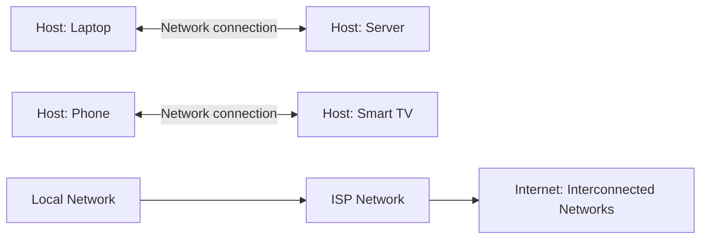
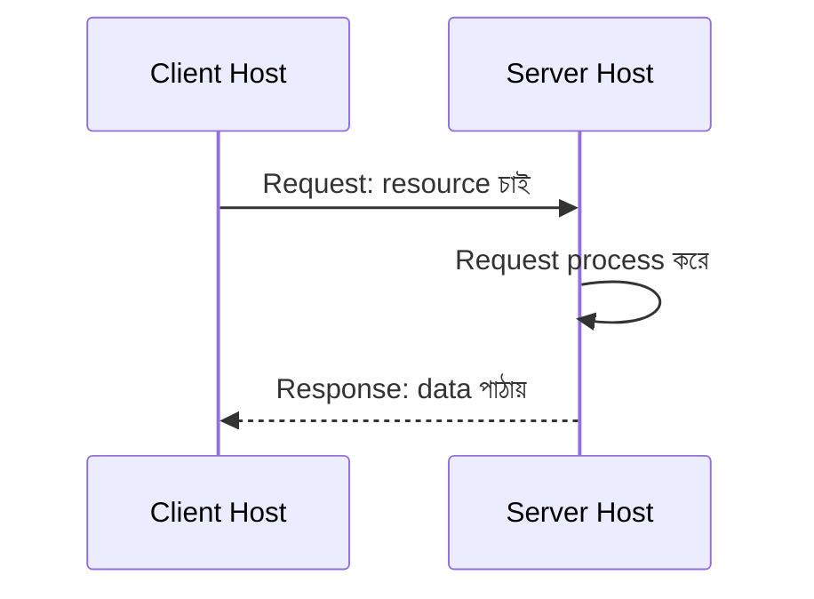
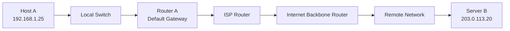
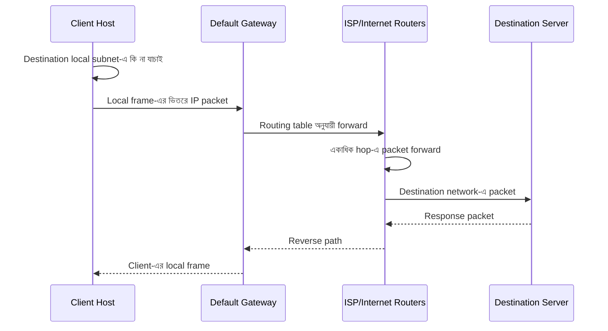
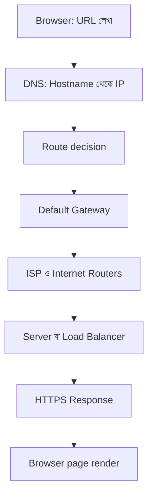
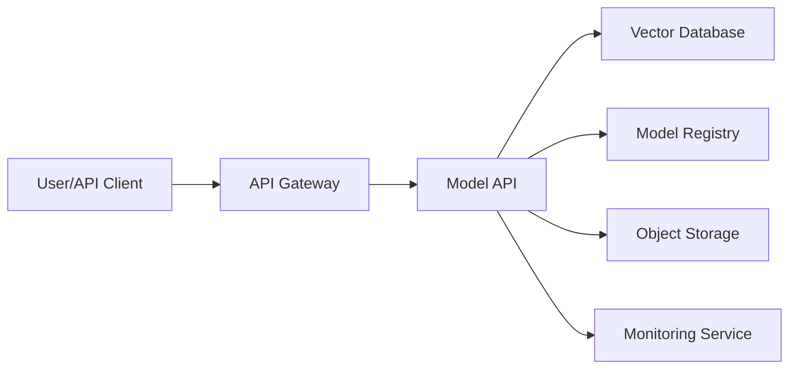

# Networking Fundamentals — Hosts, IP Address, Network ও Internet

কম্পিউটার Networking বোঝার শুরুটা কোনো নির্দিষ্ট device বা command দিয়ে নয়; শুরু হয় চারটি মৌলিক ধারণা দিয়ে: **Host**, **IP Address**, **Network**, এবং **Internet**। এই চারটি ধারণা পরিষ্কার হলে পরের অধ্যায়ের `Switch`, `Router`, `TCP`, `DNS`, `HTTP`, `Firewall` এবং container networking অনেক সহজে বোঝা যায়।

এই page-এ আমরা সাধারণ computer networking নিয়ে আলোচনা করব। এখানে কোনো নির্দিষ্ট cloud provider-এর architecture নয়; বরং Internet-এ data কীভাবে এক host থেকে অন্য host-এ পৌঁছায়, সেই ভিত্তিটা তৈরি করা হবে।

## 1. What — Network কী?

**Network** হলো দুই বা ততোধিক **Host**-কে এমনভাবে সংযুক্ত করা একটি logical বা physical ব্যবস্থা, যাতে তারা data আদান-প্রদান করতে পারে।

এখানে:

- **Host** হলো যে কোনো device যা network traffic পাঠাতে বা গ্রহণ করতে পারে।
- **IP Address** হলো network-এ কোনো host-এর logical address বা পরিচয়।
- **Protocol** হলো data আদান-প্রদানের নিয়ম।
- **Network** হলো সেই host ও communication path-এর সংগঠিত সমষ্টি।
- **Internet** হলো পরস্পরের সঙ্গে সংযুক্ত অসংখ্য network-এর বিশাল সমষ্টি।

একটি network খুব ছোট হতে পারে, যেমন cable দিয়ে সরাসরি যুক্ত দুটি computer। আবার খুব বড়ও হতে পারে, যেমন দেশ-বিদেশের ISP, data center এবং backbone network মিলিয়ে Internet।



## 2. Why — Network কেন দরকার?

Network না থাকলে প্রতিটি device বিচ্ছিন্ন দ্বীপের মতো থাকত। Data সরাতে হলে storage device হাতে করে এক machine থেকে অন্য machine-এ নিতে হতো।

Network আমাদের সাহায্য করে:

- একটি device থেকে অন্য device-এ file পাঠাতে
- Web server থেকে webpage বা API response পেতে
- Database, cache ও application server-এর মধ্যে যোগাযোগ করতে
- Video call, online gaming ও streaming চালাতে
- Printer, storage এবং অন্যান্য shared resource ব্যবহার করতে
- Distributed application ও microservice তৈরি করতে
- ML training job, model server ও monitoring service সংযুক্ত করতে

একটি production application-এ network failure মানেই শুধু Internet বন্ধ হওয়া নয়। Application থেকে database-এ route না থাকা, ভুল IP, blocked port, DNS failure বা packet loss হলেও service অচল হতে পারে।

:::tip মূল ধারণা
কোনো application "চলছে না" বলার আগে আলাদা করে ভাবুন: host কি জীবিত, IP configuration ঠিক কি না, route আছে কি না, port শুনছে কি না, এবং application protocol কাজ করছে কি না।
:::

## 3. Analogy — ডাক ব্যবস্থার সঙ্গে তুলনা

Networking-কে একটি international postal system হিসেবে ভাবুন।

| Networking ধারণা | ডাক ব্যবস্থায় উপমা                                               |
| --------------------- | ---------------------------------------------------------------------------------- |
| Host                  | যে বাড়ি বা অফিস চিঠি পাঠায়/গ্রহণ করে              |
| IP Address            | বাড়ির পূর্ণ ডাক ঠিকানা                                        |
| Network               | একই এলাকার ডাক-ব্যবস্থা                                        |
| Router                | কোন পথে চিঠি যাবে তা ঠিক করা sorting office                  |
| Packet                | চিঠির একটি খাম                                                         |
| Port                  | একই বাড়ির নির্দিষ্ট room বা service                           |
| Protocol              | চিঠি পাঠানোর format ও নিয়ম                                       |
| ISP                   | আপনার এলাকার postal carrier                                             |
| DNS                   | নাম দেখে ঠিকানা খুঁজে বের করা phone book                   |
| Firewall              | নিরাপত্তা প্রহরী, কে ঢুকতে পারবে তা যাচাই করে |

আপনি যদি শুধু "Ashraf" লিখে একটি চিঠি পাঠান, postal system জানবে না সেটি কোথায় যাবে। একইভাবে application যদি সঠিক destination IP বা hostname না জানে, data পাঠাতে পারবে না।

## 4. Host — Network-এর অংশগ্রহণকারী

**Host** হলো network-এ অংশগ্রহণকারী এমন যেকোনো device যার network identity আছে এবং যে data send বা receive করতে পারে। Host-কে অনেক সময় **end system**-ও বলা হয়, কারণ communication-এর endpoint সাধারণত host-ই।

উদাহরণ:

- Laptop, desktop ও mobile phone
- Web server, API server ও database server
- Router বা network appliance, যদি সেটি traffic originate বা terminate করে
- Printer, camera, smart speaker ও IoT device
- Virtual machine এবং container
- Kubernetes-এর ভিতরের pod বা service endpoint

### Client ও Server

**Client** হলো যে host কোনো resource বা service চায়। **Server** হলো যে host request গ্রহণ করে এবং response বা resource দেয়।

এই ভূমিকা স্থায়ী নয়। একই machine এক সময় client এবং অন্য সময় server হতে পারে। যেমন browser একটি web server-এর client, কিন্তু file share করলে সেই laptop নিজেই server-এর মতো কাজ করতে পারে।



:::warning Client মানেই দুর্বল, Server মানেই শক্তিশালী নয়
Client ও Server মূলত communication role। Server হিসেবে কাজ করা computer সাধারণ laptop-ও হতে পারে, আর client হিসেবে cloud-এর শক্তিশালী machine-ও থাকতে পারে।
:::

## 5. IP Address — Host-এর Logical পরিচয়

**IP Address** বা Internet Protocol Address হলো network-এ কোনো host বা network interface শনাক্ত করার logical address। Data packet-এর source ও destination কোথায়, তা বোঝার জন্য IP Address ব্যবহার করা হয়।

একটি device-এর একাধিক network interface থাকলে একাধিক IP থাকতে পারে। যেমন laptop-এর Wi-Fi interface এবং Ethernet interface-এর আলাদা IP থাকতে পারে।

### IPv4

**IPv4** হলো Internet Protocol-এর বহুল ব্যবহৃত version। IPv4 address মোট **32-bit** এবং সাধারণত চারটি decimal octet হিসেবে লেখা হয়।

উদাহরণ:

```text
192.168.1.25
```

প্রতিটি octet-এর মান `0` থেকে `255` পর্যন্ত হতে পারে। তাই মোট address space হলো:

```text
2^32 = 4,294,967,296টি address
```

তবে সব address সাধারণ host-কে দেওয়া যায় না। Private range, loopback, multicast, reserved এবং network/broadcast address-এর মতো বিশেষ ব্যবহার আছে।

### IPv6

**IPv6** হলো IPv4-এর পরের version। এটি 128-bit address ব্যবহার করে এবং address space অত্যন্ত বড়।

উদাহরণ:

```text
2001:db8:85a3::8a2e:370:7334
```

এই page-এ মূল flow বোঝানোর জন্য IPv4 ব্যবহার করা হবে, কিন্তু production network-এ IPv6-এর উপস্থিতি উপেক্ষা করা উচিত নয়।

### Public ও Private IP

**Private IP** সাধারণত local network-এর ভিতরে ব্যবহৃত হয় এবং Internet-এ সরাসরি routable নয়। IPv4-এর প্রচলিত private range:

| Range                                  | CIDR               |
| -------------------------------------- | ------------------ |
| `10.0.0.0` – `10.255.255.255`     | `10.0.0.0/8`     |
| `172.16.0.0` – `172.31.255.255`   | `172.16.0.0/12`  |
| `192.168.0.0` – `192.168.255.255` | `192.168.0.0/16` |

**Public IP** Internet-এ globally routable address। ISP সাধারণত home router বা organization-এর edge router-কে public IP দেয়।

:::danger Private IP-কে Public IP ভাববেন না
`192.168.x.x`, `10.x.x.x` বা `172.16.x.x` থেকে `172.31.x.x` range-এর IP Internet-এ সরাসরি পৌঁছানো যায় না। সাধারণত `NAT` নামের একটি ব্যবস্থা private host-এর traffic public address দিয়ে বাইরে পাঠায়।
:::

## 6. Network ও Subnet

Network হলো logically grouped host-এর সমষ্টি। একই network-এর host সাধারণত পরস্পরের সঙ্গে সরাসরি বা local switching-এর মাধ্যমে যোগাযোগ করতে পারে।

**Subnet** বা subnetworks হলো বড় network-কে ছোট logical network-এ ভাগ করার পদ্ধতি। এর ফলে:

- Broadcast domain ছোট হয়
- Address management সহজ হয়
- আলাদা team বা service isolate করা যায়
- Routing policy পরিষ্কার করা যায়
- Failure ও security boundary নিয়ন্ত্রণ করা যায়

একটি IPv4 address সাধারণত দুই অংশে দেখা হয়:

```text
Network portion + Host portion
```

কোন bit network-এর এবং কোন bit host-এর, তা **subnet mask** বা **CIDR prefix** নির্ধারণ করে।

উদাহরণ:

```text
IP Address: 192.168.1.25
Subnet:     192.168.1.0/24
```

`/24` মানে প্রথম 24 bit network portion, বাকি 8 bit host portion। এই subnet-এর সাধারণ usable host range হলো `192.168.1.1` থেকে `192.168.1.254`; `192.168.1.0` network address এবং `192.168.1.255` broadcast address হিসেবে ব্যবহৃত হয়।

:::info Subnetting-এর গভীরতা
`CIDR`, subnet calculation, usable host count এবং route summarization আলাদা একটি topic হিসেবে পড়া উচিত। এখানে শুধু network-এর logical grouping বোঝানোর জন্য মৌলিক ধারণাটি দেওয়া হলো।
:::

## 7. Network-এর ধরন

### PAN — Personal Area Network

একজন ব্যক্তির খুব কাছের device-এর ছোট network। Bluetooth headphone ও phone-এর সংযোগ একটি উদাহরণ।

### LAN — Local Area Network

বাড়ি, office, lab বা একটি building-এর ভিতরের local network। সাধারণত Ethernet বা Wi-Fi দিয়ে তৈরি হয়।

### WLAN — Wireless LAN

Wireless technology, সাধারণত Wi-Fi, ব্যবহার করে তৈরি LAN-কে WLAN বলা হয়।

### MAN — Metropolitan Area Network

একটি শহর বা metropolitan area জুড়ে বিস্তৃত network। একাধিক office বা institution যুক্ত করতে ব্যবহার হতে পারে।

### WAN — Wide Area Network

বড় ভৌগোলিক অঞ্চলে বিস্তৃত network। বিভিন্ন city, country বা data center সংযুক্ত করা WAN-এর উদাহরণ।

### Internet

Internet কোনো একক network নয়। এটি ISP, enterprise network, data center network, submarine cable, exchange point এবং backbone network-এর interconnected system।

| Network type | বিস্তার                | উদাহরণ                    |
| ------------ | ----------------------------- | ------------------------------- |
| PAN          | ব্যক্তিগত পরিসর | Phone ও Bluetooth earbud       |
| LAN          | বাড়ি/office/building    | Office Ethernet network         |
| MAN          | শহর                        | City-wide institutional network |
| WAN          | দেশ/বিশ্ব             | Bank branch network             |
| Internet     | বিশ্বব্যাপী        | Public web ও API ecosystem     |

## 8. Data কীভাবে এক Host থেকে অন্য Host-এ যায়?

Application সরাসরি পুরো data একসাথে পাঠায় না। Data সাধারণত ছোট ছোট **packet**-এ ভাগ হয়। Packet হলো network-এর মধ্য দিয়ে চলাচলকারী data-এর একক অংশ, যার সঙ্গে source, destination এবং control information যুক্ত থাকে।

সাধারণ flow:

1. Application data তৈরি করে
2. Transport layer data-কে segment বা datagram-এ সাজায়
3. Network layer source ও destination IP যোগ করে packet তৈরি করে
4. Data Link layer local delivery-এর জন্য frame তৈরি করে
5. Physical medium bit হিসেবে data বহন করে
6. প্রতিটি intermediate router destination দেখে পরের hop বেছে নেয়
7. Destination host packet গ্রহণ করে layers-এর মাধ্যমে data application-এ পৌঁছে দেয়


### Packet বনাম Circuit

Traditional telephone system-এ একটি call-এর জন্য নির্দিষ্ট circuit reserve করা হতো। Internet মূলত **packet switching** ব্যবহার করে: প্রতিটি packet network-এর available path ব্যবহার করে এগোয়। তাই একই connection-এর packet ভিন্ন route-এও যেতে পারে এবং congestion হলে delay বা loss হতে পারে।

## 9. Router ও Interconnected Networks

একটি host যখন নিজের local subnet-এর বাইরের destination-এ data পাঠাতে চায়, তখন সাধারণত **default gateway**-এর কাছে packet পাঠায়। Default gateway হলো local network থেকে বাইরের network-এ যাওয়ার router।

**Router** IP address দেখে packet-এর পরবর্তী গন্তব্য বা **next hop** নির্ধারণ করে। এই সিদ্ধান্ত নেওয়ার জন্য router-এর **routing table** থাকে।



একটি packet-এর journey-তে:

- Source host destination IP নির্ধারণ করে
- Local subnet কি না যাচাই করে
- Remote হলে default gateway-এর MAC address খুঁজে
- Router packet receive করে routing table দেখে
- Router TTL কমিয়ে পরের interface-এ পাঠায়
- এই process বহু hop পেরিয়ে destination network-এ পৌঁছায়

**Hop** হলো packet-এর এক router বা Layer 3 device থেকে পরের router-এ যাওয়ার একটি ধাপ।

## 10. IP Address, MAC Address ও Port-এর পার্থক্য

এই তিনটি address গুলিয়ে ফেলা নতুনদের সাধারণ ভুল।

| বিষয়       | IP Address                                 | MAC Address                                     | Port                                                    |
| ---------------- | ------------------------------------------ | ----------------------------------------------- | ------------------------------------------------------- |
| পরিচয়     | Logical network address                    | Local interface-এর hardware/data-link address | Host-এর ভিতরের service/application endpoint     |
| Layer            | Network layer                              | Data Link layer                                 | Transport layer                                         |
| উদাহরণ     | `192.168.1.25`                           | `00:1A:2B:3C:4D:5E`                           | `443`, `5432`                                       |
| Scope            | Local বা global routing                  | সাধারণত local network segment            | নির্দিষ্ট host-এর নির্দিষ্ট service |
| পরিবর্তন | Network বদলালে বদলাতে পারে | Interface বদলালে বদলায়             | Application configuration অনুযায়ী              |

একটি web request-এ:

- IP বলে কোন host-এ যেতে হবে
- MAC বলে local link-এ কোন interface-এ frame যাবে
- Port বলে সেই host-এর কোন service request নেবে

## 11. Hands-on Commands

### নিজের IP ও interface দেখা

Linux:

```bash
ip address
ip route
```

সম্ভাব্য output:

```text
2: eth0: <BROADCAST,MULTICAST,UP,LOWER_UP>
    inet 192.168.1.25/24 brd 192.168.1.255 scope global eth0

default via 192.168.1.1 dev eth0
192.168.1.0/24 dev eth0 proto kernel scope link src 192.168.1.25
```

Windows PowerShell:

```powershell
ipconfig
Get-NetIPConfiguration
```

এখানে খুঁজবেন:

- Interface-এর নাম
- IPv4 address
- Subnet mask বা prefix
- Default gateway
- DNS server

### Connectivity পরীক্ষা: `ping`

`ping` সাধারণত ICMP Echo Request পাঠিয়ে destination থেকে Echo Reply আসে কি না পরীক্ষা করে।

```bash
ping -c 4 8.8.8.8
```

সম্ভাব্য output:

```text
64 bytes from 8.8.8.8: icmp_seq=1 ttl=117 time=24.8 ms
64 bytes from 8.8.8.8: icmp_seq=2 ttl=117 time=25.1 ms

--- 8.8.8.8 ping statistics ---
4 packets transmitted, 4 received, 0% packet loss
round-trip min/avg/max = 24.8/25.0/25.4 ms
```

`ping` সফল হলে অন্তত IP-level reachability সম্পর্কে ধারণা পাওয়া যায়। তবে `ping` বন্ধ থাকলেও web service সচল থাকতে পারে; কারণ firewall ICMP block করতে পারে।

### Route দেখা: `traceroute` ও `tracert`

Linux/macOS:

```bash
traceroute example.com
```

Windows:

```powershell
tracert example.com
```

এগুলো destination-এর পথে intermediate hop দেখানোর চেষ্টা করে। প্রতিটি hop-এর latency ও timeout দেখে কোন অংশে সমস্যা হতে পারে তা অনুমান করা যায়।

### Local neighbor দেখা: `arp` ও `ip neigh`

```bash
ip neigh
arp -a
```

এগুলো local network-এ IP থেকে MAC mapping-এর cache দেখাতে পারে। এই mapping তৈরিতে IPv4-এর **ARP (Address Resolution Protocol)** ব্যবহৃত হয়।

### Open port দেখা: `ss` ও `netstat`

```bash
ss -tuln
```

Windows:

```powershell
netstat -ano
```

এখানে local address, port, protocol এবং connection state দেখা যায়। Port listening আছে মানেই application সঠিকভাবে request process করছে, এমন নয়; এটি কেবল একটি স্তরের প্রমাণ।

## 12. Internal Working — একটি সাধারণ request-এর ধাপ

ধরা যাক, `192.168.1.25` host থেকে `203.0.113.20` server-এ data পাঠানো হবে।

1. Application destination হিসেবে server-এর IP ও service port নির্ধারণ করে
2. Host subnet mask দেখে বুঝে destination local subnet-এ নেই
3. তাই packet default gateway `192.168.1.1`-এর দিকে পাঠাতে হবে
4. Host ARP ব্যবহার করে gateway-এর MAC address খুঁজে
5. IP packet-টি Ethernet বা Wi-Fi frame-এর ভিতরে encapsulate হয়
6. Local switch frame-টি gateway interface-এ পৌঁছে দেয়
7. Router destination IP দেখে routing table থেকে next hop নির্বাচন করে
8. প্রতিটি router নতুন local frame তৈরি করে packet forward করে
9. Destination network-এর router packet server-এর local interface-এ পাঠায়
10. Server packet গ্রহণ করে, transport/application layer-এ data process করে
11. Response একই ধরনের layered process-এ client-এর দিকে ফিরে আসে



## 13. Real World Example — Browser-এ একটি Website খোলা

আপনি browser-এ `https://example.com` লিখলে শুধু একটি কাজ হয় না; বহু network operation ধারাবাহিকভাবে ঘটে।

1. Browser hostname `example.com`-এর IP জানতে DNS query করে
2. Host-এর local DNS cache বা configured DNS resolver উত্তর দেয়
3. Browser destination IP-এর port `443`-এ connection শুরু করে
4. Local host route দেখে packet default gateway-এ পাঠায়
5. Router ও ISP packet-কে Internet-এর বিভিন্ন network পার করে
6. Server firewall ও load balancer request গ্রহণ করে
7. HTTPS-এর জন্য encryption handshake হয়
8. Web server request process করে response পাঠায়
9. Browser response-এর data assemble করে page render করে



এই journey-র প্রতিটি অংশ আলাদা failure তৈরি করতে পারে। DNS ঠিক থাকলেও route বন্ধ হতে পারে, route ঠিক থাকলেও port block হতে পারে, port খোলা থাকলেও application error দিতে পারে।

## 14. MLOps/LLMOps-এ Networking-এর গুরুত্ব

MLOps বা LLMOps platform-এ একাধিক service network-এর মাধ্যমে যুক্ত থাকে:



উদাহরণ হিসেবে:

- Inference API-কে model server-এর port-এ পৌঁছাতে হয়
- RAG application-কে vector database-এর host ও port জানতে হয়
- Training job-কে object storage ও experiment tracker-এ data পাঠাতে হয়
- Monitoring agent metrics endpoint-এ network request করে
- Container ও Kubernetes service-গুলোর মধ্যে DNS ও routing কাজ করে

তাই model code সঠিক হলেও `Connection refused`, `Timeout`, `No route to host`, ভুল hostname বা firewall rule-এর কারণে পুরো pipeline ব্যর্থ হতে পারে।

## 15. Common Mistakes — নতুনরা যেসব ভুল করে

1. **IP Address-কে device-এর স্থায়ী পরিচয় ভাবা** — DHCP বা network বদলালে host-এর IP বদলাতে পারে।
2. **Private IP দিয়ে Internet থেকে server access করার চেষ্টা করা** — private address Internet-এ routable নয়।
3. **`ping` সফল মানেই application ঠিক আছে ভাবা** — ICMP কাজ করলেও TCP port বা application বন্ধ থাকতে পারে।
4. **`localhost`-কে অন্য machine বা container ভাবা** — `localhost` সবসময় request করা current host/interface-কে বোঝায়।
5. **Port ও IP একই জিনিস ভাবা** — IP host চেনে, port host-এর ভিতরের service চেনে।
6. **একটি network মানেই Internet ভাবা** — LAN, WAN এবং Internet-এর scope আলাদা।
7. **Router শুধু Internet-এর জন্য ব্যবহার হয় ভাবা** — router যেকোনো আলাদা IP network-এর মধ্যে packet forward করতে পারে।
8. **High latency-কে সবসময় bandwidth সমস্যা ভাবা** — latency, throughput, packet loss ও congestion আলাদা বিষয়।
9. **শুধু application log দেখে network সমস্যা সমাধান করা** — interface, route, DNS, port এবং firewall আলাদা স্তরে পরীক্ষা করা দরকার।
10. **IP hardcode করে configuration স্থির ভাবা** — production-এ DNS বা service discovery ব্যবহার করলে endpoint পরিবর্তন সহজ হয়।

## 16. Best Practices

- Host, interface, IP, subnet, gateway ও DNS-এর তথ্য documentation-এ পরিষ্কার রাখুন
- Production service-এর জন্য meaningful DNS name বা service discovery ব্যবহার করুন
- Network range পরিকল্পনা করার সময় ভবিষ্যৎ growth ও subnet বিভাজন বিবেচনা করুন
- Service-to-service traffic-এ least privilege firewall rule ব্যবহার করুন
- গুরুত্বপূর্ণ service-এর জন্য health check, timeout, retry ও circuit breaker পরিকল্পনা করুন
- `ping`, `traceroute`, `nslookup`/`dig`, `ss`/`netstat` এবং packet capture-এর উদ্দেশ্য আলাদা করে শিখুন
- Public service expose করার আগে authentication, encryption ও firewall policy নিশ্চিত করুন
- একই network-এ সব service না রেখে প্রয়োজন অনুযায়ী segmentation করুন
- IPv4-এর পাশাপাশি IPv6 readiness যাচাই করুন
- Network observability-এর জন্য latency, error rate, packet loss, connection count ও throughput monitor করুন
- Configuration-এ IP hardcode না করে environment-specific DNS বা service endpoint ব্যবহার করুন

:::warning Troubleshooting-এর সঠিক ক্রম
একসাথে সব configuration বদলাবেন না। প্রথমে link/interface, তারপর local IP, route, DNS, port connectivity এবং শেষে application protocol পরীক্ষা করুন। এতে root cause দ্রুত আলাদা করা যায়।
:::

## 17. Interview Questions

### প্রশ্ন ১: Host কী?

**উত্তর:** Host হলো এমন কোনো network-connected device বা endpoint যা data পাঠাতে বা গ্রহণ করতে পারে। Computer, phone, server, printer, VM এবং container host-এর উদাহরণ। Host client, server বা দুটো ভূমিকাতেই কাজ করতে পারে।

### প্রশ্ন ২: Network ও Internet-এর মধ্যে পার্থক্য কী?

**উত্তর:** Network হলো যোগাযোগের জন্য সংযুক্ত দুই বা ততোধিক host-এর একটি logical বা physical group। Internet হলো বহু স্বাধীন network, ISP এবং backbone-এর interconnected global system। তাই Internet একটি network নয়; এটি network-এর network।

### প্রশ্ন ৩: IP Address-এর কাজ কী?

**উত্তর:** IP Address network layer-এ source ও destination host বা interface শনাক্ত করে এবং router-কে packet কোন network-এর দিকে পাঠাতে হবে তা নির্ধারণে সাহায্য করে। IP logical address; এটি MAC address বা application port-এর বিকল্প নয়।

### প্রশ্ন ৪: একই host-এর IP Address ও Port কেন দুটোই দরকার?

**উত্তর:** IP Address host বা machine শনাক্ত করে, আর Port সেই host-এর নির্দিষ্ট service শনাক্ত করে। যেমন `203.0.113.20:443`-এ `203.0.113.20` হলো server host এবং `443` হলো HTTPS service-এর endpoint।

## 18. Summary

- **Host** হলো network traffic পাঠানো বা গ্রহণ করা device বা endpoint।
- **Client** request করে এবং **Server** response দেয়; এই role context অনুযায়ী বদলাতে পারে।
- **IP Address** host-এর logical network identity এবং packet delivery-এর ভিত্তি।
- **IPv4** 32-bit, আর **IPv6** 128-bit addressing ব্যবহার করে।
- **Private IP** local network-এ ব্যবহৃত হয়; Internet-এ direct route করা যায় না।
- **Network** হলো connected host-এর logical group; **Subnet** বড় network-কে ছোট segment-এ ভাগ করে।
- **Internet** হলো interconnected networks-এর বিশ্বব্যাপী system।
- Data packet আকারে layer পেরিয়ে router ও বিভিন্ন hop-এর মাধ্যমে destination-এ যায়।
- IP host চেনে, MAC local link-এর interface চেনে, আর port নির্দিষ্ট service চেনে।
- `ping` reachability, `traceroute` path, `ss`/`netstat` listening state এবং `nslookup`/`dig` DNS পরীক্ষা করতে সাহায্য করে।

## 19. পরবর্তী ধাপ

এখন পরবর্তী গুরুত্বপূর্ণ বিষয় হলো **OSI Model** — যেখানে network communication-কে সাতটি layer-এ ভাগ করে প্রতিটি layer-এর কাজ, protocol এবং troubleshooting boundary বিস্তারিতভাবে বোঝা হবে।
