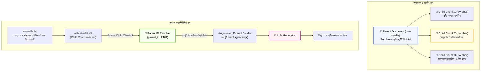

# Advanced Document Retrieval Techniques (Small-to-Big & Compression)

স্বাগতম আমাদের RAG সিরিজের ত্রয়োদশ পর্বে! আমরা ইতিপূর্বে বেসিক রিট্রিভাল (Naive RAG) এবং বিভিন্ন চাংকিং টেকনিক দেখেছি। 

বাস্তব প্রোডাকশন সিস্টেমে সবচেয়ে বড় দ্বন্দ্বটি হলো:
* **সার্চের জন্য:** চ্যাঙ্ক ছোট হলে ভালো (কারণ ছোট চ্যাঙ্কের ভেক্টর খুব সুনির্দিষ্ট হয়)।
* **উত্তরের জন্য:** চ্যাঙ্ক বড় হলে ভালো (কারণ LLM-এর একটি সমৃদ্ধ ও পূর্ণাঙ্গ প্রেক্ষাপট দরকার)।

তাহলে আমরা কীভাবে একই সাথে দুটি সুবিধাই পেতে পারি? এই সমস্যার বৈপ্লবিক সমাধান হলো **Advanced Retrieval Techniques**—বিশেষ করে **Parent Document Retriever (Small-to-Big Retrieval)** এবং **Contextual Compression**।

---

## ১. What (Advanced Retrieval কী?)

**Advanced Retrieval Techniques** হলো এমন কিছু বিশেষায়িত কৌশল যা সাধারণ একক-স্তরের ভেক্টর সার্চের সীমাবদ্ধতা কাটিয়ে উঠতে সাহায্য করে।

এর মধ্যে সবচেয়ে জনপ্রিয় দুটি কৌশল হলো:
1. **Parent Document Retriever (Small-to-Big):** অনুসন্ধান (Search) চালানো হয় ছোট ছোট চাইল্ড চ্যাঙ্কে (Child Chunks); কিন্তু যখনই কোনো মিল পাওয়া যায়, তখন সেই ছোট চ্যাঙ্কটি নয়, বরং তার পেছনের সম্পূর্ণ মূল অনুচ্ছেদ বা প্যারেন্ট চ্যাঙ্কটি (Parent Chunk) LLM-এর কাছে পাঠানো হয়!
2. **Contextual Compression (প্রসঙ্গ সংকোচন):** রিট্রিভ হওয়া ডকুমেন্টের অপ্রয়োজনীয় আবর্জনা বাক্য ছেঁকে ফেলে শুধুমাত্র প্রশ্নের সাথে সরাসরি সম্পর্কিত লাইনগুলো ফিল্টার করে রাখা।

---

## ২. Why (কেন এটি সাধারণ রিট্রিভালের চেয়ে উন্নত?)

সাধারণ রিট্রিভালে দুটি বড় সমস্যা দেখা দেয়:
1. **Context Fragmentation (প্রেক্ষাপটের বিচ্ছিন্নতা):** ছোট চ্যাঙ্ক পাঠালে LLM অনেক সময় বাক্যের আগের বা পরের শর্ত দেখতে পায় না (যেমন: *"ছুটি প্রযোজ্য হবে..."* অংশ পেল, কিন্তু *"যদি পূর্বে ৩ দিন আগে জানানো হয়"* অংশটি মিস করল)।
2. **Prompt Noise (অপ্রয়োজনীয় তথ্যের অপচয়):** বড় চ্যাঙ্ক পাঠালে ভেতরে অপ্রাসঙ্গিক তথ্য থাকে, যা LLM-কে বিভ্রান্ত করে এবং টোকেন খরচ বাড়ায়।

Small-to-Big কৌশল সার্চের ক্ষেত্রে **১০০% প্রিসিশন** এবং উত্তরের ক্ষেত্রে **১০০% পূর্ণাঙ্গ প্রেক্ষাপট** নিশ্চিত করে!

---

## ৩. Analogy (বাস্তব জীবনের উপমা)

Small-to-Big Retrieval বুঝতে সবচেয়ে সেরা উপমা হলো **"বইয়ের সূচিপত্র ও বইয়ের পৃষ্ঠা"**:

* আপনি যখন একটি বইয়ে নির্দিষ্ট কোনো টপিক খোঁজেন, তখন আপনি পুরো বইয়ের প্রতিটি প্যারাগ্রাফ খুঁটিয়ে পড়েন না। আপনি সূচিপত্রের **ছোট ছোট কিওয়ার্ড বা লাইনে** চোখ বুলান (Small Child Chunk for Search)।
* কিন্তু যেই মুহূর্তে কাঙ্ক্ষিত লাইনটি পেয়ে যান, আপনি তখন সরাসরি বইয়ের সেই নির্দিষ্ট পৃষ্ঠায় চলে যান এবং **আস্ত পুরো পৃষ্ঠাটি পড়েন** (Big Parent Chunk for Context)।

Parent Document Retriever ঠিক এই কাজটিই স্বয়ংক্রিয়ভাবে করে!

---

## ৪. How it works (Small-to-Big কার্যপদ্ধতি)

1. **Parent Chunking:** কাঁচা ডকুমেন্টকে প্রথমে বড় বড় যৌক্তিক খণ্ডে ভাগ করা হয় (যেমন: ১০০০ ক্যারেক্টার)। এগুলো হলো **Parent Documents**।
2. **Child Splitting:** প্রতিটি Parent Chunk-কে আরও ছোট ছোট খণ্ডে বিভক্ত করা হয় (যেমন: ১৫০-২০০ ক্যারেক্টার)। এগুলো হলো **Child Chunks**।
3. **Linkage via Metadata:** প্রতিটি Child Chunk-এর মেটাডেটায় তার মূল Parent Chunk-এর একটি ইউনিক আইডি (`parent_id`) ট্যাগ করে রাখা হয়।
4. **Child Search & Parent Retrieval:** ব্যবহারকারীর প্রশ্নের ভেক্টর দিয়ে সার্চ করা হয় ছোট Child Chunks-এর মধ্যে। কিন্তু ম্যাচ পাওয়ার পর সিস্টেমে Child-এর বদলে তার আসল Parent Document-টি তুলে এনে LLM-কে সরবরাহ করা হয়।

---

## ৫. Architecture Diagram (Small-to-Big ফ্লো)



---

## ৬. সম্পূর্ণ ও কার্যকরী Code Example

চলুন পাইথনে একটি স্বয়ংসম্পূর্ণ `ParentDocumentRetriever` তৈরি করি। কোনো জটিল ফ্রেমওয়ার্ক ছাড়াই পুরো আর্কিটেকচারটি পরিষ্কারভাবে বুঝতে পারবেন।

```python
import math
from collections import Counter

# ধাপ ১: চাইল্ড ও প্যারেন্ট মেমোরি স্টোর
class SimpleParentDocumentRetriever:
    def __init__(self):
        self.parent_store = {}  # {parent_id: full_text}
        self.child_documents = []  # [(child_text, parent_id), ...]

    def add_document(self, parent_id, full_parent_text, child_chunk_size=150, overlap=30):
        # প্যারেন্ট স্টোরে সংরক্ষণ
        self.parent_store[parent_id] = full_parent_text
        
        # চাইল্ড চ্যাঙ্ক তৈরি (Small Chunks)
        start = 0
        text_len = len(full_parent_text)
        
        while start < text_len:
            end = start + child_chunk_size
            child_text = full_parent_text[start:end].strip()
            self.child_documents.append((child_text, parent_id))
            start += (child_chunk_size - overlap)

    def _term_frequency(self, text):
        words = text.lower().replace(",", "").replace(".", "").replace("?", "").split()
        return Counter(words)

    def _cosine_similarity(self, v1, v2):
        common = set(v1.keys()) & set(v2.keys())
        dot = sum(v1[k] * v2[k] for k in common)
        norm1 = math.sqrt(sum(v ** 2 for v in v1.values()))
        norm2 = math.sqrt(sum(v ** 2 for v in v2.values()))
        if not norm1 or not norm2:
            return 0.0
        return dot / (norm1 * norm2)

    # মূল সার্চ ফাংশন (Search in Small, Return Big!)
    def retrieve(self, query):
        print(f"\n🔍 অনুসন্ধান: '{query}'")
        query_vec = self._term_frequency(query)
        
        scored_children = []
        for child_text, parent_id in self.child_documents:
            child_vec = self._term_frequency(child_text)
            score = self._cosine_similarity(query_vec, child_vec)
            scored_children.append((score, child_text, parent_id))

        scored_children.sort(key=lambda x: x[0], reverse=True)
        best_score, best_child, best_parent_id = scored_children[0]

        print(f"🎯 [Child Match]: '{best_child[:60]}...' (Score: {best_score:.4f})")
        print(f"🔗 [Parent Lookup]: উদ্ধার করা হচ্ছে মূল Parent ID: {best_parent_id}")

        # চাইল্ডের বদলে সম্পূর্ণ প্যারেন্ট ডকুমেন্ট রিটার্ন
        full_context = self.parent_store[best_parent_id]
        return full_context

# পরীক্ষা চালানোর অংশ
if __name__ == "__main__":
    retriever = SimpleParentDocumentRetriever()

    # TechNova-র একটি দীর্ঘ প্যারেন্ট ডকুমেন্ট (HR Leave Policy)
    parent_doc_1 = (
        "TechNova Solutions Ltd. - Employee Leave Handbook 2026. "
        "আমাদের প্রতিষ্ঠানে সকল নিয়মিত কর্মী বছরে মোট ২০ দিন বেতনসহ ক্যাজুয়াল ছুটি পাওয়ার অধিকারী। "
        "ছুটির আবেদন কমপক্ষে ৩ কর্মদিবস পূর্বে ইন্টারনাল এইচআর পোর্টালের মাধ্যমে জমা দিতে হবে। "
        "জরুরি অসুস্থতাজনিত কারণে টানা দুই দিনের বেশি অফিসে অনুপস্থিত থাকলে অনুমোদিত চিকিৎসকের প্রেসক্রিপশন জমা দেওয়া বাধ্যতামূলক। "
        "অনুমোদনহীন অনুপস্থিতির ক্ষেত্রে বেতন কর্তন করা হতে পারে।"
    )

    # প্যারেন্ট ডকুমেন্ট যোগ করা
    retriever.add_document(parent_id="P_LEAVE_2026", full_parent_text=parent_doc_1)

    # ব্যবহারকারী একটি সুনির্দিষ্ট ছোট প্রশ্ন করলেন
    query = "অসুস্থ হলে ডাক্তারের প্রেসক্রিপশন জমা দেওয়ার নিয়ম কী?"
    retrieved_parent_context = retriever.retrieve(query)

    print("\n📦 [LLM-কে পাঠানো চূড়ান্ত কনটেক্সট]:")
    print(retrieved_parent_context)
```

### কোড লাইনের সহজ ব্যাখ্যা:
* `add_document()`: পুরো লেখাটিকে `P_LEAVE_2026` আইডিতে সংরক্ষণ করে এবং তাকে স্বয়ংক্রিয়ভাবে কয়েকটি ছোট ছোট চাইল্ড চ্যাঙ্কে বিভক্ত করে।
* `scored_children`: সার্চ হয় শুধুমাত্র ছোট চাইল্ড চ্যাঙ্কগুলোর মধ্যে, যার ফলে সুনির্দিষ্ট শব্দের মিল খুব দ্রুত ও নিখুঁতভাবে ধরা পড়ে।
* `self.parent_store[best_parent_id]`: উত্তর দেওয়ার সময় ছোট চ্যাঙ্কের খণ্ডিত অংশ না পাঠিয়ে পুরো প্যারেন্ট ডকুমেন্ট পাঠানো হয়, যাতে LLM আবেদনের সময়সীমা ও শর্তাবলীর পূর্ণাঙ্গ জ্ঞান পায়।

---

## ৭. Output উদাহরণ

কোডটি চালালে নিচের মতো পরিষ্কার আউটপুট দেখতে পাবেন:

```text
🔍 অনুসন্ধান: 'অসুস্থ হলে ডাক্তারের প্রেসক্রিপশন জমা দেওয়ার নিয়ম কী?'
🎯 [Child Match]: 'জরুরি অসুস্থতাজনিত কারণে টানা দুই দিনের বেশি অফিসে অনুপস্থিত থা...' (Score: 0.8165)
🔗 [Parent Lookup]: উদ্ধার করা হচ্ছে মূল Parent ID: P_LEAVE_2026

📦 [LLM-কে পাঠানো চূড়ান্ত কনটেক্সট]:
TechNova Solutions Ltd. - Employee Leave Handbook 2026. আমাদের প্রতিষ্ঠানে সকল নিয়মিত কর্মী বছরে মোট ২০ দিন বেতনসহ ক্যাজুয়াল ছুটি পাওয়ার অধিকারী। ছুটির আবেদন কমপক্ষে ৩ কর্মদিবস পূর্বে ইন্টারনাল এইচআর পোর্টালের মাধ্যমে জমা দিতে হবে। জরুরি অসুস্থতাজনিত কারণে টানা দুই দিনের বেশি অফিসে অনুপস্থিত থাকলে অনুমোদিত চিকিৎসকের প্রেসক্রিপশন জমা দেওয়া বাধ্যতামূলক। অনুমোদনহীন অনুপস্থিতির ক্ষেত্রে বেতন কর্তন করা হতে পারে।
```

লক্ষ্য করুন, চাইল্ড সার্চে নির্দিষ্ট প্রেসক্রিপশনের লাইনটি ধরা পড়ার সাথে সাথে LLM পুরো ছুটির পলিসির সম্পূর্ণ ব্যাকগ্রাউন্ড একবারে পেয়ে গেছে!

---

## ৮. VitePress Callouts

:::tip LangChain ParentDocumentRetriever
LangChain-এ এই টেকনিকটি সরাসরি বিল্ট-ইন রয়েছে:
```python
from langchain.retrievers import ParentDocumentRetriever
from langchain.storage import InMemoryStore

retriever = ParentDocumentRetriever(
    vectorstore=vectorstore,      # যেখানে Child Chunks থাকবে
    docstore=InMemoryStore(),      # যেখানে Full Parent Docs থাকবে
    child_splitter=child_splitter,
    parent_splitter=parent_splitter
)
```
:::

:::warning মেমোরি ম্যানেজমেন্ট
যদি আপনার প্যারেন্ট ডকুমেন্টসগুলো অনেক বড় হয় (যেমন ৫০ পাতা), তবে পুরো ৫০ পাতা রিটার্ন করবেন না। সাধারণত প্যারেন্ট চ্যাঙ্ক ৫০০-১০০০ শব্দ এবং চাইল্ড চ্যাঙ্ক ১০০-১৫০ শব্দ রাখা সবচেয়ে ভারসাম্যপূর্ণ।
:::

---

## ৯. Common Mistakes (নতুনদের সাধারণ ভুলসমূহ)

1. **চাইল্ড চ্যাঙ্ক সরাসরি LLM-কে দেওয়া:** চাইল্ড চ্যাঙ্কের আগে বা পেছনের শর্তাবলী হারিয়ে যায়, ফলে মডেল ভুল সিদ্ধান্তে উপনীত হয়।
2. **প্যারেন্ট চ্যাঙ্ক অতিরিক্ত বড় করা:** পুরো বইকে একটি মাত্র প্যারেন্ট আইডি দিলে LLM-এর টোকেন লিমিট শেষ হয়ে যাবে।
3. **চাইল্ড-প্যারেন্ট ম্যাপিং নষ্ট হওয়া:** ডেটাবেস মাইগ্রেশনের সময় আইডি মিসম্যাচ হওয়া।

---

## ১০. Practice Exercise

**অনুশীলন:**
`SimpleParentDocumentRetriever`-এ আরেকটি নতুন প্যারেন্ট ডকুমেন্ট যুক্ত করুন:
`parent_id="P_FINANCE_2026"` (ইন্টারনেট বিল, হোম অফিস অ্যালাউন্স ও ট্যাক্স রুলস নিয়ে)।
এরপর প্রশ্ন করুন: *"বাসা থেকে কাজ করলে কি ইন্টারনেট বিল পাওয়া যাবে?"*। দেখুন আপনার সিস্টেম কি সঠিক ফিন্যান্স প্যারেন্ট ডকুমেন্ট তুলে আনছে?

---

## ১১. Summary (সারসংক্ষেপ)

* **Small-to-Big Retrieval** রিট্রিভালের ক্ষেত্রে ছোট চ্যাঙ্কের নির্ভুলতা এবং জেনারেশনের ক্ষেত্রে বড় চ্যাঙ্কের পূর্ণাঙ্গ প্রেক্ষাপট নিশ্চিত করে।
* এটি সার্চ চালায় **Child Chunks**-এ এবং মেটাডেটা লিঙ্কের মাধ্যমে উদ্ধার করে **Parent Document**।
* এটি প্রেক্ষাপট বিচ্ছিন্নতা (Context Fragmentation) দূর করে।
* প্রোডাকশন RAG-এ উত্তরকে সমৃদ্ধ ও বিশ্বাসযোগ্য করতে এটি একটি অপরিহার্য টেকনিক।

---

## ১২. পরবর্তী ধাপ

পরের পর্বে আমরা শিখব ব্যবহারকারীর অস্পষ্ট প্রশ্নকে একাধিক দৃষ্টিকোণ থেকে প্রসারিত করে সার্চ কোয়ালিটি বাড়ানোর জাদুকরী পদ্ধতি—**Multi-Query RAG**!
