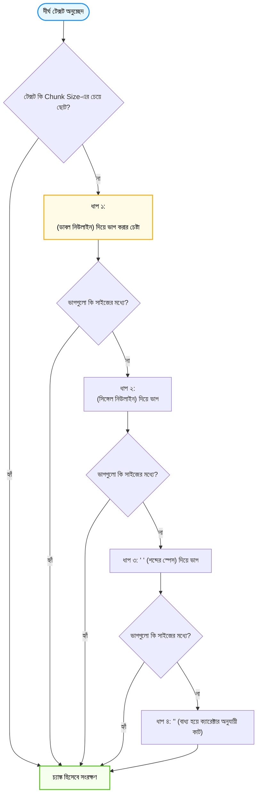

# LangChain দিয়ে Advanced Text Splitting (Advanced Text Splitting in Python)

স্বাগতম আমাদের RAG সিরিজের নবম পর্বে! আগের পর্বে আমরা বিভিন্ন টেক্সট চাংকিং স্ট্র্যাটেজি এবং তাদের তাত্ত্বিক দিকগুলো জেনেছি। 

এই পর্বে আমরা সরাসরি LangChain-এর সবচেয়ে বহুল ব্যবহৃত এবং প্রোডাকশন-রেডি স্প্লিটার—**`RecursiveCharacterTextSplitter`** এবং অন্যান্য অ্যাডভান্সড স্প্লিটারগুলো গভীরভাবে শিখব। LangChain-এর এই স্প্লিটারটিকে গোটা এআই ইন্ডাস্ট্রির **"ডি-ফ্যাক্টো স্ট্যান্ডার্ড (De-facto Standard)"** বলা হয়!

---

## ১. What (Advanced Text Splitting ও রিকার্সিভ স্প্লিটার কী?)

LangChain-এ সাধারণ `CharacterTextSplitter` যেখানে একটি নির্দিষ্ট অক্ষরের (যেমন শুধুমাত্র স্পেস বা নিউলাইন) ওপর নির্ভর করে টেক্সট কাটে, সেখানে **`RecursiveCharacterTextSplitter`** ক্রমান্বয়ে একাধিক সেপারেটরের একটি তালিকা ব্যবহার করে বুদ্ধিমত্তার সাথে টেক্সটকে বিভক্ত করে।

ডিফল্টভাবে এর সেপারেটর তালিকা হলো:
```python
separators = ["\n\n", "\n", " ", ""]
```

এর মানে হলো: এটি প্রথমে ডাবল নিউলাইন (`\n\n`) দিয়ে অনুচ্ছেদগুলোকে একসাথে রাখার চেষ্টা করে। অনুচ্ছেদটি যদি চাঙ্ক সাইজের চেয়ে বড় হয়, তবে সে নিচে নেমে সিঙ্গেল নিউলাইন (`\n`) দিয়ে কাটে। তাও যদি বড় হয়, তখন সে শব্দের মাঝে স্পেস (`" "`) ধরে কাটে। আর চরম বাধ্য না হলে সে কখনো শব্দের মাঝখানে (ক্যারেক্টার `""`) কাটে না!

---

## ২. Why (কেন এটি সাধারণ স্প্লিটারের চেয়ে বহুগুণ শ্রেয়?)

1. **প্রাকৃতিক লেখার গঠন রক্ষা করে:** একটি প্যারাগ্রাফের প্রতিটি বাক্য একে অপরের সাথে সম্পর্কিত। রিকার্সিভ স্প্লিটার সর্বোচ্চ চেষ্টা করে পুরো প্যারাগ্রাফটিকে এক চ্যাঙ্কে রাখতে।
2. **শব্দ অক্ষত রাখা:** সাধারণ ফিক্সড স্প্লিটার যেমন "ক্যাজুয়াল"-কে "ক্যাজু" আর "য়াল" করে ফেলে, রিকার্সিভ স্প্লিটার শব্দ ও বাক্যের ব্যাকরণগত সমাপ্তি অক্ষুণ্ণ রাখে।
3. **কন্টেন্ট-অ্যাওয়ার স্প্লিটিং:** কোড ফাইল (Python, JS, HTML) বা Markdown ফাইলের জন্য এর বিশেষায়িত রূপ রয়েছে যা ফাংশন বা হেডার ধরে চ্যাঙ্ক কাটে।

---

## ৩. Analogy (বাস্তব জীবনের উপমা)

রিকার্সিভ স্প্লিটার বুঝতে সবচেয়ে চমৎকার উপমা হলো **"একজন দক্ষ দর্জির কাপড় কাটা"**:

* একজন অদক্ষ দর্জি অন্ধের মতো ইঞ্চি মেপে কাঁচি চালিয়ে দেয়, ফলে সুন্দর নকশা বা বোতামের মাঝখান দিয়ে কেটে নষ্ট হয় (Fixed Chunking)।
* কিন্তু একজন মাস্টার দর্জি প্রথমে কাপড়ের মূল ভাঁজগুলো দেখেন (প্যারাগ্রাফ `\n\n`)।
* সেখানে না হলে সেলাইয়ের রেখা বরাবর কাটেন (বাক্য `\n`)।
* প্রয়োজন হলে নকশার ফাঁক দিয়ে কাটেন (শব্দের স্পেস `" "`)।
* আর কোনো উপায় না থাকলে তবেই কাপড়ের ভেতরে সূক্ষ্ম কাট দেন।

রিকার্সিভ স্প্লিটার হলো আপনার ডকুমেন্টের সেই মাস্টার দর্জি!

---

## ৪. How it works (অ্যালগরিদমের কার্যপদ্ধতি)



---

## ৫. LangChain-এর বিভিন্ন স্প্লিটারের তুলনা

| স্প্লিটারের নাম | কোন ধরনের ডেটার জন্য সেরা | মূল বৈশিষ্ট্য |
|---|---|---|
| **`RecursiveCharacterTextSplitter`** | সাধারণ টেক্সট, আর্টিকেল, পিডিএফ | প্যারাগ্রাফ, বাক্য ও শব্দ ক্রমান্বয়ে রক্ষা করে |
| **`CharacterTextSplitter`** | সহজ টেক্সট | শুধুমাত্র একটি নির্দিষ্ট ক্যারেক্টারে ভাগ করে |
| **`MarkdownHeaderTextSplitter`** | ডকস ও টেকনিক্যাল নথিপত্র | `#`, `##` হেডার ধরে চ্যাঙ্ক কাটে ও মেটাডেটায় হেডার যোগ করে |
| **`TokenTextSplitter`** | LLM টোকেন লিমিট নিশ্চিত করতে | ক্যারেক্টারের বদলে OpenAI টোকেন গুনে চ্যাঙ্ক কাটে |

---

## ৬. সম্পূর্ণ ও কার্যকরী Code Example

চলুন LangChain-এর `RecursiveCharacterTextSplitter` অ্যালগরিদমটি স্ক্র্যাচ থেকে পাইথনে বাস্তবায়ন করি, যাতে প্রত্যেকে কোনো ডিপেন্ডেন্সি এরর ছাড়াই এটি বুঝতে পারেন। এরপর LangChain-এ কীভাবে কোড লিখতে হয় তাও দেখানো হলো।

```python
# TechNova Solutions-এর একটি সমৃদ্ধ মাল্টি-প্যারাগ্রাফ পলিসি ডকুমেন্ট
technova_doc = """# TechNova Solutions - HR & Operations Guide 2026

## ১. ছুটির সাধারণ নীতিমালা
TechNova Solutions লিমিটেডের সকল নিয়মিত ফুল-টাইম কর্মী বছরে মোট ২০ দিন বেতনসহ ক্যাজুয়াল ছুটি (Casual Leave) পাওয়ার অধিকারী। ছুটির আবেদন কমপক্ষে ৩ দিন পূর্বে পোর্টালের মাধ্যমে জমা দিতে হবে।

জরুরি অসুস্থতাজনিত ছুটির ক্ষেত্রে টানা দুই দিনের বেশি অফিসে অনুপস্থিত থাকলে অনুমোদিত চিকিৎসকের প্রেসক্রিপশন জমা দেওয়া বাধ্যতামূলক।

## ২. কর্মঘণ্টা ও হাইব্রিড ওয়ার্ক পলিসি
আমাদের অফিসের স্বাভাবিক কাজের সময় সকাল ৯:৩০ টা থেকে সন্ধ্যা ৬:০০ টা পর্যন্ত। শুক্র ও শনিবার সাপ্তাহিক ছুটি। কর্মীরা সপ্তাহে সর্বোচ্চ ২ দিন বাসা থেকে কাজ (Work from Home) করার সুবিধা পাবেন।

বাসা থেকে নিরবচ্ছিন্ন ইন্টারনেটের জন্য প্রতি মাসে ১,৫০০ টাকা ইন্টারনেট রিইমবার্সমেন্ট প্রদান করা হবে যা প্রতি মাসের ২৫ তারিখের মধ্যে ফিন্যান্স ডিপার্টমেন্টে দাবি করতে হবে।"""

# ধাপ ১: স্ক্র্যাচ থেকে রিকার্সিভ ক্যারেক্টার স্প্লিটার অ্যালগরিদম
class CustomRecursiveSplitter:
    def __init__(self, chunk_size=250, chunk_overlap=40, separators=None):
        self.chunk_size = chunk_size
        self.chunk_overlap = chunk_overlap
        self.separators = separators or ["\n\n", "\n", " ", ""]

    def split_text(self, text):
        return self._split(text, self.separators)

    def _split(self, text, separators):
        final_chunks = []
        if not separators:
            return [text]

        separator = separators[0]
        new_separators = separators[1:]

        # সেপারেটর দিয়ে টেক্সট স্প্লিট করা
        splits = text.split(separator) if separator else list(text)

        good_splits = []
        for piece in splits:
            if not piece:
                continue
            
            # খণ্ডটি যদি নির্ধারিত সাইজের চেয়ে বড় হয়, তবে পরবর্তী সেপারেটরে পাঠাও
            if len(piece) > self.chunk_size and new_separators:
                sub_chunks = self._split(piece, new_separators)
                good_splits.extend(sub_chunks)
            else:
                good_splits.append(piece)

        # ওভারল্যাপ সহ চ্যাঙ্কগুলোকে জোড়া লাগানো
        current_chunk = ""
        for s in good_splits:
            if len(current_chunk) + len(s) <= self.chunk_size:
                current_chunk += (separator if current_chunk else "") + s
            else:
                if current_chunk:
                    final_chunks.append(current_chunk.strip())
                current_chunk = s

        if current_chunk:
            final_chunks.append(current_chunk.strip())

        return final_chunks

# ধাপ ২: কোড রান করে ফলাফল যাচাই
if __name__ == "__main__":
    splitter = CustomRecursiveSplitter(chunk_size=220, chunk_overlap=30)
    chunks = splitter.split_text(technova_doc)

    print(f"📦 মোট চ্যাঙ্ক তৈরি হয়েছে: {len(chunks)} টি\n")
    for idx, chunk in enumerate(chunks, 1):
        print(f"--- [চ্যাঙ্ক {idx}] (দৈর্ঘ্য: {len(chunk)} ক্যারেক্টার) ---")
        print(chunk)
        print("-" * 55)

    print("\n💡 [LangChain এ যেভাবে কোড লিখবেন]:")
    print("""
from langchain_text_splitters import RecursiveCharacterTextSplitter

text_splitter = RecursiveCharacterTextSplitter(
    chunk_size=500,
    chunk_overlap=50,
    separators=["\\n\\n", "\\n", " ", ""]
)
chunks = text_splitter.split_text(technova_doc)
    """)
```

### কোড লাইনের সহজ ব্যাখ্যা:
* `separators=["\n\n", "\n", " ", ""]`: অগ্রাধিকার ভিত্তিক বিভাজন তালিকা। প্রথমে অনুচ্ছেদ, তারপর লাইন, তারপর শব্দ।
* `_split()`: একটি রিকার্সিভ (পুনরাবৃত্তিমূলক) ফাংশন যা যতক্ষণ কোনো অংশ `chunk_size`-এর চেয়ে বড় থাকে, ততক্ষণ তালিকার পরের সেপারেটরে যেতে থাকে।
* আউটপুটে লক্ষ্য করুন কীভাবে প্রতিটি চ্যাঙ্ক অর্থপূর্ণ অনুচ্ছেদ বজায় রেখেছে।

---

## ৭. Output উদাহরণ

কোডটি চালালে নিচের মতো পরিপাটি চ্যাঙ্ক দেখতে পাবেন:

```text
📦 মোট চ্যাঙ্ক তৈরি হয়েছে: 3 টি

--- [চ্যাঙ্ক 1] (দৈর্ঘ্য: 181 ক্যারেক্টার) ---
# TechNova Solutions - HR & Operations Guide 2026

## ১. ছুটির সাধারণ নীতিমালা
TechNova Solutions লিমিটেডের সকল নিয়মিত ফুল-টাইম কর্মী বছরে মোট ২০ দিন বেতনসহ ক্যাজুয়াল ছুটি (Casual Leave) পাওয়ার অধিকারী।
-------------------------------------------------------
--- [চ্যাঙ্ক 2] (দৈর্ঘ্য: 204 ক্যারেক্টার) ---
ছুটির আবেদন কমপক্ষে ৩ দিন পূর্বে পোর্টালের মাধ্যমে জমা দিতে হবে।

জরুরি অসুস্থতাজনিত ছুটির ক্ষেত্রে টানা দুই দিনের বেশি অফিসে অনুপস্থিত থাকলে অনুমোদিত চিকিৎসকের প্রেসক্রিপশন জমা দেওয়া বাধ্যতামূলক।
-------------------------------------------------------
--- [চ্যাঙ্ক 3] (দৈর্ঘ্য: 219 ক্যারেক্টার) ---
## ২. কর্মঘণ্টা ও হাইব্রিড ওয়ার্ক পলিসি
আমাদের অফিসের স্বাভাবিক কাজের সময় সকাল ৯:৩০ টা থেকে সন্ধ্যা ৬:০০ টা পর্যন্ত। শুক্র ও শনিবার সাপ্তাহিক ছুটি। কর্মীরা সপ্তাহে সর্বোচ্চ ২ দিন বাসা থেকে কাজ করার সুবিধা পাবেন।
-------------------------------------------------------
```

---

## ৮. VitePress Callouts

:::tip প্রোডাকশন রেকমেন্ডেড কম্বিনেশন
বাস্তব প্রজেক্টে বেশিরভাগ টেক্সট ডকুমেন্টের জন্য **`chunk_size: 500-800`** ক্যারেক্টার এবং **`chunk_overlap: 50-100`** ক্যারেক্টার সবচেয়ে আদর্শ ফলাফল দেয়।
:::

:::warning Markdown ডকুমেন্টের জন্য বিশেষ টিপস
আপনার ডেটা যদি Markdown ফাইল হয়, তবে সরাসরি ক্যারেক্টার স্প্লিটার না চালিয়ে আগে **`MarkdownHeaderTextSplitter`** চালান। এটি হেডারগুলোকে মেটাডেটা হিসেবে আলাদা করে রাখে, ফলে AI জানতে পারে কোন নিয়মটি কোন সেকশনের অধীন।
:::

---

## ৯. Common Mistakes (নতুনদের সাধারণ ভুলসমূহ)

1. **`CharacterTextSplitter` ব্যবহার করা:** নতুনরা না জেনে `CharacterTextSplitter` ব্যবহার করে ভাবেন টেক্সট স্প্লিট হচ্ছে, কিন্তু ডিফল্ট সেপারেটর `\n\n` না পেলে পুরো ফাইল এক চ্যাঙ্কেই থেকে যায়!
2. **সেপারেটর তালিকা উল্টো করা:** প্রথমে স্পেস `" "` দিয়ে পরে `\n\n` দিলে ডকুমেন্টের সমস্ত প্যারাগ্রাফ শুরুতেই ভেঙে টুকরো টুকরো হয়ে যায়।
3. **ওভারল্যাপ খুব বেশি দেওয়া:** চাঙ্ক সাইজ ২০০ দিয়ে ওভারল্যাপ ১৫০ দিলে মেমোরিতে ডুপ্লিকেট ডেটা বেড়ে যায়।

---

## ১০. Practice Exercise

**অনুশীলন:**
`technova_doc` এর শেষে একটি কোড ব্লক যোগ করুন:
```python
# def submit_leave_request(emp_id, days): pass
```
এবং দেখুন আপনার স্প্লিটার পাইথন কোডের অংশটিকে কীভাবে হ্যান্ডেল করে।

---

## ১১. Summary (সারসংক্ষেপ)

* **`RecursiveCharacterTextSplitter`** হলো টেক্সটের স্বাভাবিক কাঠামো অক্ষুণ্ণ রাখার জন্য সবচেয়ে শক্তিশালী স্প্লিটার।
* এটি ক্রমান্বয়ে `\n\n` $\rightarrow$ `\n` $\rightarrow$ `" "` $\rightarrow$ `""` সেপারেটর অনুসরণ করে।
* এটি শব্দ বা বাক্যের ব্যাকরণগত অর্থ বিচ্ছিন্ন হতে দেয় না।
* Markdown ডকুমেন্টে হেডার ট্র্যাক করার জন্য **`MarkdownHeaderTextSplitter`** ব্যবহার করা উচিত।

---

## ১২. পরবর্তী ধাপ

পরের পর্বে আমরা দেখব বর্তমান বিশ্বের সবচেয়ে কাটিং-এজ চাংকিং টেকনিক—**Semantic Chunking (অর্থ ও ধারণার পরিবর্তনের ওপর ভিত্তি করে চাংকিং)**!
