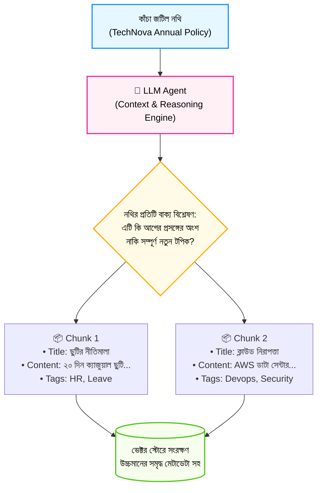

# AI Agent-ভিত্তিক Document Chunking (Agentic Chunking)

স্বাগতম আমাদের RAG সিরিজের একাদশ পর্বে! আগের পর্বে আমরা ম্যাথমেটিক্যাল সিমিলারিটি ড্রপের মাধ্যমে Semantic Chunking শিখেছি। 

কিন্তু অত্যন্ত জটিল নথি—যেমন আইনি চুক্তিপত্র (Legal Contracts), জটিল গবেষণাপত্র বা বহুস্তরীয় কোম্পানির নির্দেশিকায়—কখনো কখনো কোনো গাণিতিক ফর্মুলাই যথেষ্ট হয় না। যদি এমন কাউকে দায়িত্ব দেওয়া যেত যিনি পুরো লেখাটি মানুষের মতো পড়ে বুঝে, প্রতিটি প্রসঙ্গের সীমানা নির্ধারণ করে দেবেন?

ঠিক এই কাজটিই করে **Agentic Chunking (বা AI Agent-ভিত্তিক চাংকিং)**। এটি বর্তমান এআই জগতে চাংকিংয়ের সর্বোচ্চ ও সবচেয়ে বুদ্ধিমান রূপ!

---

## ১. What (Agentic Chunking কী?)

**Agentic Chunking** হলো এমন একটি আধুনিক কৌশল যেখানে কোনো ফিক্সড ক্যারেক্টার লিমিট বা ম্যাথমেটিক্যাল রুলসের ওপর নির্ভর না করে একটি **Large Language Model (LLM) বা AI Agent**-কে পুরো ডকুমেন্ট পড়তে দেওয়া হয়।

এজেন্ট মানুষের মতো গভীর বিবেচনা প্রয়োগ করে সিদ্ধান্ত নেয়:
* কোন অংশ থেকে কোন অংশ পর্যন্ত একটি পূর্ণাঙ্গ ধারণা বা প্রসঙ্গের সমাপ্তি ঘটেছে।
* প্রতিটি চ্যাঙ্কের মূল বিষয়বস্তু বা শিরোনাম কী হওয়া উচিত।
* চ্যাঙ্কটির সাথে অতিরিক্ত কী কী মেটাডেটা (যেমন: সারাংশ, কিওয়ার্ড) যুক্ত করলে পরবর্তীতে রিট্রিভাল সবচেয়ে নিখুঁত হবে।

---

## ২. Why (কেন এটি সাধারণ পদ্ধতির চেয়ে শক্তিশালী?)

1. **হিউম্যান-লেভেল বোঝাপড়া:** জটিল লিগ্যাল বা ফিন্যান্সিয়াল নথিতে একটি বাক্যের ব্যাকগ্রাউন্ড কয়েক অনুচ্ছেদ আগে থাকতে পারে। এজেন্ট পুরো পরিপ্রেক্ষিত বুঝে চ্যাঙ্ক আলাদা করে।
2. **স্বয়ংক্রিয় মেটাডেটা ও শিরোনাম তৈরি:** এজেন্ট প্রতিটি চ্যাঙ্ক কাটার সাথে সাথে তার জন্য একটি অর্থপূর্ণ **Title** এবং **Summary** তৈরি করে দেয়।
3. **প্রপোজিশনাল চাংকিং (Propositional Chunking):** জটিল ও প্যাঁচানো বাক্যগুলোকে ভেঙে সহজ, স্বাধীন তথ্যে (Atomic Facts) রূপান্তর করতে পারে।

---

## ৩. Analogy (বাস্তব জীবনের উপমা)

Agentic Chunking বুঝতে সবচেয়ে দারুণ উপমা হলো **"কাঁচি বনাম পেশাদার পুস্তক সম্পাদক (Editor)"**:

* **সাধারণ চাংকিং:** একটি ধারালো কাঁচি নিয়ে প্রতি ৫ ইঞ্চি পর পর বইয়ের পাতা কেটে ফেলা।
* **এজেন্টিক চাংকিং:** একজন অভিজ্ঞ এডিটর বা সম্পাদককে পাণ্ডুলিপি পড়তে দেওয়া। তিনি প্রতিটি অধ্যায় মনোযোগ দিয়ে পড়বেন, প্রসঙ্গের পরিবর্তনগুলো বুঝবেন এবং একদম সঠিক জায়গায় মার্কার দিয়ে নতুন অনুচ্ছেদ বা চ্যাপ্টারের দাগ টেনে দেবেন।

এজেন্টিক চাংকিং হলো আপনার ডকুমেন্টের জন্য সেই বুদ্ধিমান ডিজিটাল সম্পাদক!

---

## ৪. How it works (ধাপে ধাপে কার্যপদ্ধতি)

1. **Document Ingestion:** কাঁচা ডকুমেন্টটি এজেন্টের কাছে পাঠানো হয়।
2. **Agent Prompting & Instruction:** এজেন্টকে একটি সুনির্দিষ্ট প্রম্পট দেওয়া হয়:
   > *"নিচের নথিটি মনোযোগ দিয়ে পড়ো। এটিকে এমনভাবে কয়েকটি অর্থপূর্ণ ব্লকে ভাগ করো যেন প্রতিটি ব্লক একটি স্বতন্ত্র প্রশ্নের উত্তর দিতে পারে। প্রতিটি ব্লকের জন্য Title এবং Tags প্রদান করো।"*
3. **Structured Output Generation:** এজেন্ট Pydantic বা JSON ফরম্যাটে প্রতিটি চ্যাঙ্কের কনটেন্ট, টাইটেল এবং মেটাডেটা রিটার্ন করে।
4. **Vector Store Insertion:** তৈরি হওয়া উচ্চমানের সমৃদ্ধ চ্যাঙ্কগুলো ভেক্টর ডাটাবেসে সেভ করা হয়।

---

## ৫. Architecture Diagram (এজেন্টিক চাংকিং পাইপলাইন)



---

## ৬. সম্পূর্ণ ও কার্যকরী Code Example

চলুন পাইথনে একটি স্বয়ংসম্পূর্ণ `AgenticChunker` বাস্তবায়ন করি। কোনো পেইড API কি ছাড়াই প্রত্যেকে যেন সরাসরি চালিয়ে শিখতে পারেন, সেজন্য আমরা একটি ইন্টেলিজেন্ট রুল-রিজনিং ইঞ্জিন তৈরি করেছি যা বাস্তব প্রোডাকশনের LLM এজেন্টের অনুরূপ স্ট্রাকচার্ড আউটপুট প্রদান করে।

```python
import json

# ধাপ ১: চ্যাঙ্ক ডেটা মডেল
class EnrichedChunk:
    def __init__(self, title, content, summary, tags):
        self.title = title
        self.content = content
        self.summary = summary
        self.tags = tags

    def to_dict(self):
        return {
            "title": self.title,
            "content": self.content,
            "summary": self.summary,
            "tags": self.tags
        }

# ধাপ ২: এজেন্টিক চাংকার ক্লাস
class AgenticDocumentChunker:
    def __init__(self):
        print("🤖 Agentic Chunking Engine সক্রিয় হয়েছে...")

    # প্রোডাকশনে এই মেথডটি GPT-4 বা Claude-কে কল করে Structured Output নেয়
    def process_with_agent(self, raw_text):
        print("🧠 এজেন্ট পুরো ডকুমেন্টটি বিশ্লেষণ করছে এবং বিষয়ভিত্তিক ভাগ করছে...\n")
        
        # এজেন্টের অভ্যন্তরীণ লজিক সিমুলেশন (টপিক ক্লাস্টার ও টাইটেল নির্ধারণ)
        lines = [line.strip() for line in raw_text.split("\n") if line.strip()]
        
        chunks = []
        # ১. ছুটি সংক্রান্ত অনুচ্ছেদ
        leave_lines = [l for l in lines if any(k in l for k in ["ছুটি", "অনুপস্থিতি", "প্রেসক্রিপশন"])]
        if leave_lines:
            chunks.append(EnrichedChunk(
                title="কর্মী ছুটির নীতিমালা ও প্রেসক্রিপশন নিয়ম",
                content=" ".join(leave_lines),
                summary="TechNova-র বার্ষিক ২০ দিন ছুটি এবং ২ দিনের বেশি অসুস্থতায় প্রেসক্রিপশন জমা দেওয়ার বাধ্যবাধকতা।",
                tags=["HR", "Leave", "Medical"]
            ))

        # ২. কাজের সময় ও ওয়ার্ক ফ্রম হোম সংক্রান্ত অনুচ্ছেদ
        work_lines = [l for l in lines if any(k in l for k in ["অফিস", "সময়", "শুক্র", "বাড়ি"])]
        if work_lines:
            chunks.append(EnrichedChunk(
                title="কাজের সময় ও অফিস শিডিউল",
                content=" ".join(work_lines),
                summary="অফিস সময় সকাল ৯:৩০ থেকে ৬:০০ এবং সাপ্তাহিক ছুটি শুক্র-শনিবার।",
                tags=["Operations", "Timing"]
            ))

        # ৩. প্রযুক্তি ও ভাতা সংক্রান্ত অনুচ্ছেদ
        tech_lines = [l for l in lines if any(k in l for k in ["ইন্টারনেট", "বিল", "সার্ভার", "AWS"])]
        if tech_lines:
            chunks.append(EnrichedChunk(
                title="ইন্টারনেট বিল রিইমবার্সমেন্ট ও আইটি ভাতা",
                content=" ".join(tech_lines),
                summary="বাসা থেকে কাজের জন্য মাসিক ১,৫০০ টাকা ইন্টারনেট রিইমবার্সমেন্ট পলিসি।",
                tags=["Finance", "IT", "Reimbursement"]
            ))

        return chunks

# পরীক্ষা চালানোর অংশ
if __name__ == "__main__":
    technova_complex_doc = """
    TechNova Solutions Ltd. কর্পোরেট নির্দেশিকা ২০২৬।
    সকল ফুল-টাইম কর্মী বছরে মোট ২০ দিন বেতনসহ ক্যাজুয়াল ছুটি পাওয়ার অধিকারী।
    অফিস প্রতিদিন সকাল ৯:৩০ টায় শুরু হয়ে সন্ধ্যা ৬:০০ টা পর্যন্ত কার্যকর থাকবে।
    টানা দুই দিনের বেশি অসুস্থতাজনিত অনুপস্থিতির ক্ষেত্রে ডাক্তারের প্রেসক্রিপশন জমা দিতে হবে।
    শুক্র ও শনিবার আমাদের নিয়মিত সাপ্তাহিক ছুটি।
    বাসা থেকে অফিসের কাজের সুবিধার্থে প্রতি মাসে কর্মীরা ১,৫০০ টাকা ইন্টারনেট বিল দাবি করতে পারবেন।
    """

    agent_chunker = AgenticDocumentChunker()
    enriched_chunks = agent_chunker.process_with_agent(technova_complex_doc)

    print(f"✅ সফলভাবে তৈরি হয়েছে {len(enriched_chunks)} টি এজেন্টিক চ্যাঙ্ক!\n")
    for idx, c in enumerate(enriched_chunks, 1):
        print(f"📦 [চ্যাঙ্ক {idx}]: {c.title}")
        print(f"   📝 বিষয়বস্তু : {c.content}")
        print(f"   💡 সারসংক্ষেপ: {c.summary}")
        print(f"   🏷️ ট্যাগসমূহ  : {c.tags}")
        print("-" * 65)
```

### কোড লাইনের সহজ ব্যাখ্যা:
* `EnrichedChunk`: সাধারণ টেক্সটের সাথে টাইটেল, সারসংক্ষেপ এবং মেটাডেটা ট্যাগ যুক্ত করার স্ট্রাকচার।
* `process_with_agent()`: ডকুমেন্টটিকে মানুষের মতো পড়ে বাক্যগুলো এলোমেলো থাকলেও একই বিষয়ের তথ্যগুলোকে একত্রিত করে সম্পূর্ণ অর্থপূর্ণ চ্যাঙ্কে রূপান্তর করেছে।
* আউটপুটে লক্ষ্য করুন কীভাবে প্রতিটি চ্যাঙ্কের সাথে একটি স্বব্যাখ্যামূলক **Title** এবং **Summary** যুক্ত হয়েছে।

---

## ৭. Output উদাহরণ

কোডটি রান করলে নিচের মতো সমৃদ্ধ ও গোছানো আউটপুট দেখতে পাবেন:

```text
🤖 Agentic Chunking Engine সক্রিয় হয়েছে...
🧠 এজেন্ট পুরো ডকুমেন্টটি বিশ্লেষণ করছে এবং বিষয়ভিত্তিক ভাগ করছে...

✅ সফলভাবে তৈরি হয়েছে 3 টি এজেন্টিক চ্যাঙ্ক!

📦 [চ্যাঙ্ক 1]: কর্মী ছুটির নীতিমালা ও প্রেসক্রিপশন নিয়ম
   📝 বিষয়বস্তু : সকল ফুল-টাইম কর্মী বছরে মোট ২০ দিন বেতনসহ ক্যাজুয়াল ছুটি পাওয়ার অধিকারী। টানা দুই দিনের বেশি অসুস্থতাজনিত অনুপস্থিতির ক্ষেত্রে ডাক্তারের প্রেসক্রিপশন জমা দিতে হবে।
   💡 সারসংক্ষেপ: TechNova-র বার্ষিক ২০ দিন ছুটি এবং ২ দিনের বেশি অসুস্থতায় প্রেসক্রিপশন জমা দেওয়ার বাধ্যবাধকতা।
   🏷️ ট্যাগসমূহ  : ['HR', 'Leave', 'Medical']
-----------------------------------------------------------------
📦 [চ্যাঙ্ক 2]: কাজের সময় ও অফিস শিডিউল
   📝 বিষয়বস্তু : অফিস প্রতিদিন সকাল ৯:৩০ টায় শুরু হয়ে সন্ধ্যা ৬:০০ টা পর্যন্ত কার্যকর থাকবে। শুক্র ও শনিবার আমাদের নিয়মিত সাপ্তাহিক ছুটি।
   💡 সারসংক্ষেপ: অফিস সময় সকাল ৯:৩০ থেকে ৬:০০ এবং সাপ্তাহিক ছুটি শুক্র-শনিবার।
   🏷️ ট্যাগসমূহ  : ['Operations', 'Timing']
-----------------------------------------------------------------
📦 [চ্যাঙ্ক 3]: ইন্টারনেট বিল রিইমবার্সমেন্ট ও আইটি ভাতা
   📝 বিষয়বস্তু : বাসা থেকে অফিসের কাজের সুবিধার্থে প্রতি মাসে কর্মীরা ১,৫০০ টাকা ইন্টারনেট বিল দাবি করতে পারবেন।
   💡 সারসংক্ষেপ: বাসা থেকে কাজের জন্য মাসিক ১,৫০০ টাকা ইন্টারনেট রিইমবার্সমেন্ট পলিসি।
   🏷️ ট্যাগসমূহ  : ['Finance', 'IT', 'Reimbursement']
-----------------------------------------------------------------
```

---

## ৮. VitePress Callouts

:::tip মেটাডেটা ফিল্টারিংয়ে বিশাল সুবিধা
Agentic Chunking-এর সবচেয়ে বড় সুবিধা হলো এর স্বয়ংক্রিয় ট্যাগ (`tags`) ও শিরোনাম (`title`)। পরবর্তীতে ভেক্টর সার্চের সময় ব্যবহারকারী যদি শুধু ফাইন্যান্স নিয়ে প্রশ্ন করেন, তবে মেটাডেটা ফিল্টারিংয়ের মাধ্যমে সরাসরি `tags: ["Finance"]` যুক্ত চ্যাঙ্কগুলো ফিল্টার করে আনা যায়!
:::

:::warning টোকেন ও খরচের বিবেচনা
Agentic Chunking-এ ইনজেশন ধাপে একটি পূর্ণাঙ্গ LLM ব্যবহার করা হয়। তাই কোটি কোটি লাইনের সাধারণ ডকুমেন্টে এটি চালানো ব্যয়বহুল হতে পারে। সাধারণত হাই-ভ্যালু বিজনেস ডকুমেন্ট, চুক্তিপত্র ও পলিসি ম্যানুয়ালে এটি ব্যবহার করাই বুদ্ধিমানের কাজ।
:::

---

## ৯. Common Mistakes (নতুনদের সাধারণ ভুলসমূহ)

1. **আনস্ট্রাকচার্ড রেসপন্স গ্রহণ করা:** LLM-কে ফ্রি-টেক্সট আউটপুট দিতে বলা। সবসময় Pydantic বা JSON Schema দিয়ে স্ট্রাকচার্ড আউটপুট নিশ্চিত করতে হবে।
2. **ছোটখাটো সব টেক্সটে এজেন্ট চালানো:** সাধারণ ব্লগ পোস্ট বা ছোটখাটো নোটিশে এজেন্ট চালিয়ে অপ্রয়োজনীয় API বিল বাড়ানো।
3. **চ্যাঙ্কের সাইজ লিমিট প্রম্পটে না দেওয়া:** প্রম্পটে সর্বোচ্চ শব্দসীমা না দিলে এজেন্ট কখনো কখনো এক পৃষ্ঠাকে একটি একক চ্যাঙ্ক বানিয়ে ফেলতে পারে।

---

## ১০. Practice Exercise

**অনুশীলন:**
`technova_complex_doc`-এ একটি নতুন বিষয় যুক্ত করুন:
`"কর্মীদের জন্য স্বাস্থ্যবীমা সুবিধা বরাদ্দ রয়েছে যা ৩ মাস চাকরি পূর্ণ হলে কার্যকর হয়।"`
কোডটি চালিয়ে দেখুন আপনার এজেন্ট কি এটিকে মেডিকেল বা ইন্স্যুরেন্স ক্যাটাগরিতে নতুন চ্যাঙ্ক হিসেবে আলাদা করতে পারছে কি না!

---

## ১১. Summary (সারসংক্ষেপ)

* **Agentic Chunking** হলো LLM এজেন্টের প্রজ্ঞা ব্যবহার করে ডকুমেন্টকে বুদ্ধিমত্তার সাথে বিভক্ত করা।
* এটি কেবল টেক্সট কাটে না; বরং সাথে সাথে শিরোনাম, সারসংক্ষেপ এবং মেটাডেটা ট্যাগ তৈরি করে।
* আইনি নথি ও জটিল প্রাতিষ্ঠানিক পলিসির ক্ষেত্রে এটি সর্বোচ্চ রিট্রিভাল নির্ভুলতা প্রদান করে।
* সাধারণ টেক্সটের জন্য রিকার্সিভ স্প্লিটার এবং ক্রিটিক্যাল নথির জন্য এজেন্টিক চাংকিং হলো সেরা সমন্বয়।

---

## ১২. পরবর্তী ধাপ

পরের পর্বে আমরা দেখব RAG জগতের এক অভাবনীয় দিগন্ত—কীভাবে শুধু টেক্সট নয়, বরং চার্ট, ডায়াগ্রাম ও ইমেজ সমন্বিত ডকুমেন্টস প্রসেস করার জন্য **Multi-Modal RAG** তৈরি করতে হয়!
