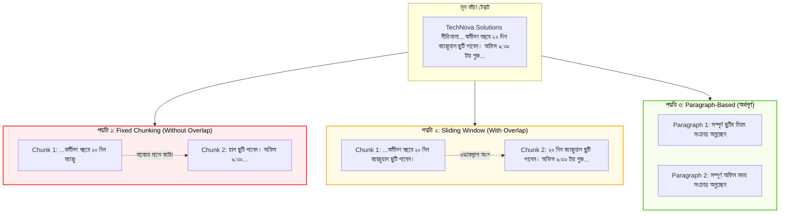

# কার্যকর Text Chunking কৌশলসমূহ (Text Chunking Strategies)

স্বাগতম আমাদের RAG সিরিজের অষ্টম পর্বে! RAG সিস্টেমে একটি অতি পরিচিত প্রবাদ রয়েছে:
> *"Garbage In, Garbage Out — আর বাজে Chunking মানেই বাজে Retrieval!"*

আপনি হয়তো বিশ্বের সবচেয়ে শক্তিশালী LLM এবং সবচেয়ে দামি ভেক্টর ডাটাবেস ব্যবহার করছেন, কিন্তু আপনার ডকুমেন্টের টেক্সট চাংকিং যদি দুর্বল হয়, তবে পুরো RAG সিস্টেম ব্যর্থ হতে বাধ্য। এই পর্বে আমরা শিখব কীভাবে প্রফেশনাল উপায়ে টেক্সটকে অর্থপূর্ণ খণ্ডে (Chunks) ভাগ করতে হয়।

---

## ১. What (Text Chunking কী?)

**Text Chunking** হলো একটি দীর্ঘ ডকুমেন্টকে (যেমন: ১০ বা ১০০ পৃষ্ঠার কোনো নির্দেশিকা) সুনির্দিষ্ট নিয়ম বা অ্যালগরিদম অনুযায়ী ছোট ছোট যৌক্তিক ও অর্থপূর্ণ টেক্সট ব্লকে (Text Segments) বিভক্ত করার প্রক্রিয়া।

একটি আদর্শ চ্যাঙ্কের বৈশিষ্ট্য হলো: এটি একাই একটি সম্পূর্ণ ধারণা বা প্রসঙ্গের (Context) অর্থ বহন করতে সক্ষম হবে।

---

## ২. Why (কেন সঠিক চাংকিং এত গুরুত্বপূর্ণ?)

চাংকিং হলো এমন এক জায়গা যেখানে **"গোল্ডিলকস নীতি" (Goldilocks Rule)** কাজ করে: *"Not too big, not too small, just right!"*

### ক. চ্যাঙ্ক যদি খুব ছোট হয় (Too Small - যেমন: ১০-২০ শব্দ):
* তথ্যের মূল ভাব বা প্রেক্ষাপট (Context) হারিয়ে যায়।
* যেমন: চ্যাঙ্কে শুধু থাকলো *"তিনি সম্মত হলেন"*—কিন্তু কে কার সাথে কিসে সম্মত হলেন, তা জানা সম্ভব হয় না।

### খ. চ্যাঙ্ক যদি খুব বড় হয় (Too Large - যেমন: ২০০০+ শব্দ):
* সুনির্দিষ্ট তথ্যের ঘনত্ব (Information Density) কমে যায়।
* ভেক্টর এম্বেডিং একটি গড়পড়তা মানে পরিণত হয়, ফলে নির্দিষ্ট প্রশ্নের সঠিক লাইনটি রিট্রিভার সহজে খুঁজে পায় না।
* অতিরিক্ত টোকেন খরচ হয়।

সঠিক চাংকিং কৌশল নিশ্চিত করে যে প্রতিটি খণ্ডে পর্যাপ্ত কনটেক্সট থাকবে এবং রিট্রিভালের সময় সর্বোচ্চ নিখুঁত রেজাল্ট পাওয়া যাবে।

---

## ৩. Analogy (বাস্তব জীবনের উপমা)

চাংকিং বুঝতে সবচেয়ে সহজ উপমা হলো **"আস্ত তরমুজ খাওয়া"**:

* একটি আস্ত বড় তরমুজ আপনি কখনই এক গ্রাসে খেতে পারবেন না (পুরো ডকুমেন্ট একবারে পাঠানো অসম্ভব)।
* আবার যদি তরমুজটিকে ব্লেন্ডারে একদম তরল করে বা সরিষার দানার মতো ছোট কুচি করেন, তবে খাওয়ার স্বাদ ও আনন্দ নষ্ট হবে (অতিরিক্ত ছোট চ্যাঙ্ক)।
* কিন্তু যদি তরমুজটিকে সুন্দর করে মাঝারি আকারের স্লাইস বা টুকরো করা হয়, তবে তা সহজেই খাওয়া যায় এবং পরিচ্ছন্ন থাকে।

চাংকিং হলো আপনার এআই অ্যাপ্লিকেশনের জন্য নথির সেই পারফেক্ট সাইজের স্লাইস তৈরি করা!

---

## ৪. প্রধান Chunking কৌশলসমূহ

1. **Fixed-Size Chunking (নির্দিষ্ট সাইজের চাংকিং):**
   * প্রতিটি চ্যাঙ্কে নির্দিষ্ট সংখ্যক অক্ষর (Character) বা টোকেন (Token) রাখা হয় (যেমন: ৫০০ ক্যারেক্টার)।
   * *সীমাবদ্ধতা:* এটি শব্দের বা বাক্যের ঠিক মাঝখানে কেটে ফেলতে পারে।
2. **Sliding Window with Overlap (ওভারল্যাপ সহ চাংকিং):**
   * ফিক্সড সাইজের সাথে ১০-২০% ওভারল্যাপ রাখা হয়, যাতে পূর্ববর্তী খণ্ডের শেষ অংশ পরবর্তী খণ্ডের শুরুতে থাকে।
3. **Paragraph / Sentence-Based Chunking (অনুচ্ছেদ বা বাক্যভিত্তিক):**
   * ন্যাচারাল ল্যাঙ্গুয়েজের সেপারেটর (যেমন: `\n\n` বা দাঁড়ি/ফুলস্টপ) ধরে ভাগ করা হয়, যাতে কোনো বাক্য বা প্যারাগ্রাফ অসম্পূর্ণ না থাকে।

---

## ৫. Architecture Diagram (চাংকিং পদ্ধতির তুলনা)



---

## ৬. সম্পূর্ণ ও কার্যকরী Code Example

চলুন পাইথনে তিনটি ভিন্ন চাংকিং কৌশল বাস্তবায়ন করি এবং TechNova-র ডকুমেন্টে তাদের আউটপুট তুলনা করে দেখি।

```python
# TechNova Solutions-এর একটি নমুনা টেক্সট
sample_document = """TechNova Solutions Ltd. - Employee Policy 2026.
সেকশন ১: ছুটির নীতিমালা।
সকল কর্মী বছরে মোট ২০ দিন বেতনসহ ক্যাজুয়াল ছুটি পাবেন। অসুস্থতাজনিত কারণে টানা ২ দিন অনুপস্থিত থাকলে ডাক্তারের প্রেসক্রিপশন জমা দিতে হবে।

সেকশন ২: কর্মঘণ্টা ও উপস্থিতি।
অফিসের নিয়মিত কাজের সময় সকাল ৯:৩০ টা থেকে সন্ধ্যা ৬:০০ টা পর্যন্ত। শুক্র ও শনিবার সাপ্তাহিক ছুটি থাকবে। কর্মীগণ সর্বোচ্চ ১৫ মিনিট গ্রেস টাইম পাবেন।

সেকশন ৩: ইন্টারনেট ও হোম অফিস ভাতা।
বাসা থেকে নির্বিঘ্নে অফিস করার জন্য প্রতি মাসে ১,৫০০ টাকা ইন্টারনেট রিইমবার্সমেন্ট প্রদান করা হবে।"""

# কৌশল ১: Naive Fixed-Size Chunking (শব্দের মাঝে কাটার ঝুঁকি থাকে)
def fixed_size_chunking(text, size=120):
    chunks = []
    for i in range(0, len(text), size):
        chunks.append(text[i:i + size])
    return chunks

# কৌশল ২: Sliding Window with Overlap (ধারাবাহিকতা বজায় থাকে)
def sliding_window_chunking(text, size=120, overlap=30):
    chunks = []
    start = 0
    while start < len(text):
        end = start + size
        chunks.append(text[start:end])
        start += (size - overlap)
    return chunks

# কৌশল ৩: Paragraph / Delimiter-Based Chunking (সবচেয়ে পরিষ্কার ও অর্থপূর্ণ)
def paragraph_chunking(text):
    # প্যারাগ্রাফ ব্রেক (\n\n) এর ভিত্তিতে ভাগ করা
    raw_paragraphs = text.split("\n\n")
    cleaned_chunks = [p.strip().replace("\n", " ") for p in raw_paragraphs if p.strip()]
    return cleaned_chunks

# ফলাফল তুলনা করার অংশ
if __name__ == "__main__":
    print("=" * 65)
    print("১. Naive Fixed Chunking (Size: 120, Overlap: 0):")
    print("=" * 65)
    fixed_chunks = fixed_size_chunking(sample_document, size=120)
    for idx, c in enumerate(fixed_chunks[:2], 1):
        print(f"[Chunk {idx}] -> {c.strip()}...")

    print("\n" + "=" * 65)
    print("২. Sliding Window Chunking (Size: 120, Overlap: 30):")
    print("=" * 65)
    overlap_chunks = sliding_window_chunking(sample_document, size=120, overlap=30)
    for idx, c in enumerate(overlap_chunks[:2], 1):
        print(f"[Chunk {idx}] -> {c.strip()}...")

    print("\n" + "=" * 65)
    print("৩. Paragraph-Based Chunking (যৌক্তিক অনুচ্ছেদ অনুযায়ী):")
    print("=" * 65)
    para_chunks = paragraph_chunking(sample_document)
    for idx, c in enumerate(para_chunks, 1):
        print(f"[Chunk {idx}] -> {c}")
```

### কোড লাইনের সহজ ব্যাখ্যা:
* `fixed_size_chunking`: অন্ধের মতো নির্দিষ্ট ক্যারেক্টার পর পর কেটে ফেলে, যা মাঝে মাঝে বাক্যের মাঝখানে কেটে মারাত্মক অর্থবিভ্রান্তি ঘটায়।
* `sliding_window_chunking`: `start += (size - overlap)` এর মাধ্যমে পেছনের কিছু অংশ নতুন চ্যাঙ্কে ধরে রাখে, ফলে তথ্যের যোগসূত্র অটুট থাকে।
* `paragraph_chunking`: মানুষের লেখার স্বাভাবিক নিয়ম (`\n\n`) মেনে পুরো অনুচ্ছেদকে একসাথে রাখে, যা সাধারণ বিজনেস ডকুমেন্টের জন্য সবচেয়ে কার্যকর।

---

## ৭. Output উদাহরণ

কোডটি রান করলে নিচের মতো তুলনামূলক আউটপুট পাবেন:

```text
=================================================================
১. Naive Fixed Chunking (Size: 120, Overlap: 0):
=================================================================
[Chunk 1] -> TechNova Solutions Ltd. - Employee Policy 2026.
সেকশন ১: ছুটির নীতিমালা।
সকল কর্মী বছরে মোট ২০ দিন বেতনসহ ক্যাজু...
[Chunk 2] -> য়াল ছুটি পাবেন। অসুস্থতাজনিত কারণে টানা ২ দিন অনুপস্থিত থাকলে ডাক্তারের প্রেসক্রিপশন জমা দিতে হবে।

সেকশন ২: কর্মঘণ্টা ও উপস্থিতি।...

=================================================================
২. Sliding Window Chunking (Size: 120, Overlap: 30):
=================================================================
[Chunk 1] -> TechNova Solutions Ltd. - Employee Policy 2026.
সেকশন ১: ছুটির নীতিমালা।
সকল কর্মী বছরে মোট ২০ দিন বেতনসহ ক্যাজু...
[Chunk 2] -> দিন বেতনসহ ক্যাজুয়াল ছুটি পাবেন। অসুস্থতাজনিত কারণে টানা ২ দিন অনুপস্থিত থাকলে ডাক্তারের প্রেসক্রিপশন জমা দিতে হবে。...

=================================================================
৩. Paragraph-Based Chunking (যৌক্তিক অনুচ্ছেদ অনুযায়ী):
=================================================================
[Chunk 1] -> TechNova Solutions Ltd. - Employee Policy 2026. সেকশন ১: ছুটির নীতিমালা। সকল কর্মী বছরে মোট ২০ দিন বেতনসহ ক্যাজুয়াল ছুটি পাবেন। অসুস্থতাজনিত কারণে টানা ২ দিন অনুপস্থিত থাকলে ডাক্তারের প্রেসক্রিপশন জমা দিতে হবে।
[Chunk 2] -> সেকশন ২: কর্মঘণ্টা ও উপস্থিতি। অফিসের নিয়মিত কাজের সময় সকাল ৯:৩০ টা থেকে সন্ধ্যা ৬:০০ টা পর্যন্ত। শুক্র ও শনিবার সাপ্তাহিক ছুটি থাকবে। কর্মীগণ সর্বোচ্চ ১৫ মিনিট গ্রেস টাইম পাবেন।
[Chunk 3] -> সেকশন ৩: ইন্টারনেট ও হোম অফিস ভাতা। বাসা থেকে নির্বিঘ্নে অফিস করার জন্য প্রতি মাসে ১,৫০০ টাকা ইন্টারনেট রিইমবার্সমেন্ট প্রদান করা হবে।
```

লক্ষ্য করুন, পদ্ধতি ১-এ "ক্যাজুয়াল" শব্দটি ভেঙে দুই খণ্ডে চলে গেছে! কিন্তু পদ্ধতি ৩-এ প্রতিটি সেকশন তার সম্পূর্ণ অর্থ নিয়ে একটি নিখুঁত চ্যাঙ্ক তৈরি করেছে।

---

## ৮. VitePress Callouts

:::tip ক্যারেক্টার বনাম টোকেন
চাঙ্ক সাইজ নির্ধারণের সময় মনে রাখবেন: **১ টোকেন $\approx$ ৪টি ইংরেজি ক্যারেক্টার বা প্রায় ০.৭৫টি শব্দ**। যদি আপনার এম্বেডিং মডেলের ইনপুট লিমিট ৫১২ টোকেন হয়, তবে চাঙ্ক সাইজ সাধারণত ২৫০ থেকে ৪০০ টোকেনের মধ্যে রাখা সবচেয়ে নিরাপদ।
:::

:::warning কোড বা টেবিল চাংকিং সতর্কতা
কোড ফাইল (Python, JS) বা Markdown Table সাধারণ ফিক্সড চাংকিং দিয়ে কাটা যাবে না। টেবিলের মাঝখানে কেটে গেলে টেবিলের হেডার হারিয়ে যায়, যার ফলে ভেক্টর সার্চ সম্পূর্ণ ব্যর্থ হয়।
:::

---

## ৯. Common Mistakes (নতুনদের সাধারণ ভুলসমূহ)

1. **শূন্য ওভারল্যাপ রাখা:** ফিক্সড চাংকিংয়ে কোনো ওভারল্যাপ না দিলে জটিল বাক্যের প্রথমাংশ ও শেষাংশ ভিন্ন ভিন্ন চ্যাঙ্কে চলে যায়।
2. **একই সাইজ সব ফাইলের জন্য প্রযোজ্য মনে করা:** টেকনিক্যাল ম্যানুয়াল, লিগ্যাল কন্ট্রাক্ট এবং নিউজ আর্টিকেলের জন্য চাঙ্ক সাইজ ভিন্ন হওয়া উচিত।
3. **Markdown হেডার না ধরে টেক্সট কাটা:** `# Heading 1`, `## Heading 2` বিবেচনা না করে চ্যাঙ্ক কাটলে ডকুমেন্টের হায়ারার্কি নষ্ট হয়।

---

## ১০. Practice Exercise

**অনুশীলন:**
`sample_document`-এর মধ্যে সেকশন ৩-এর পর একটি নতুন অনুচ্ছেদ যোগ করুন:
`"সেকশন ৪: প্রভিডেন্ট ফান্ড পলিসি..."`
এবং `paragraph_chunking` ফাংশনটি চালিয়ে নিশ্চিত করুন যে এটি ৪ নম্বর চ্যাঙ্ক হিসেবে আলাদাভাবে যুক্ত হচ্ছে কি না।

---

## ১১. Summary (সারসংক্ষেপ)

* **Chunking** হলো টেক্সটকে উপযুক্ত সাইজের অর্থপূর্ণ খণ্ডে বিভক্ত করার প্রক্রিয়া।
* অতিরিক্ত ছোট চ্যাঙ্কে প্রেক্ষাপট হারায় এবং অতিরিক্ত বড় চ্যাঙ্কে তথ্যের ঘনত্ব কমে যায়।
* **Sliding Window with Overlap** বাক্যের ধারাবাহিকতা অটুট রাখে।
* ডকুমেন্টের ধরন অনুযায়ী ক্যারেক্টার, টোকেন বা প্যারাগ্রাফভিত্তিক কৌশল নির্ধারণ করা উচিত।

---

## ১২. পরবর্তী ধাপ

পরের পর্বে আমরা শিখব কীভাবে **LangChain-এর Advanced Text Splitters** (যেমন `RecursiveCharacterTextSplitter` ও `MarkdownHeaderTextSplitter`) ব্যবহার করে প্রফেশনাল লেভেলের চাংকিং করতে হয়!
