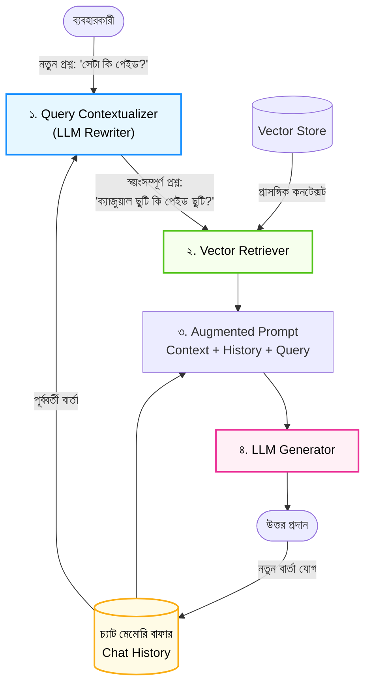

# Chat History সহ Conversational RAG (Conversational RAG with Chat History)

স্বাগতম আমাদের RAG সিরিজের সপ্তম পর্বে! আগের পর্বে আমরা স্ক্র্যাচ থেকে একটি সম্পূর্ণ এন্ড-টু-এন্ড RAG অ্যাপ্লিকেশন তৈরি করেছিলাম। 

কিন্তু বাস্তব জীবনে যখন একজন ব্যবহারকারী কোনো চ্যাটবটের সাথে কথা বলেন, তখন তিনি এক প্রশ্নে সবকিছু বলেন না। যেমন:
* **প্রশ্ন ১:** *"TechNova-র ছুটির নিয়ম কী?"*
* **অ্যাসিস্ট্যান্ট:** *"বছরে মোট ২০ দিন ক্যাজুয়াল ছুটি পাওয়া যায়।"*
* **প্রশ্ন ২:** *"সেটা কি পেইড ছুটি?"*

লক্ষ্য করুন, দ্বিতীয় প্রশ্নে ব্যবহারকারী কিন্তু বলেননি *"ক্যাজুয়াল ছুটি কি পেইড ছুটি?"*। সাধারণ RAG সিস্টেম দ্বিতীয় প্রশ্নটি দেখে বিভ্রান্ত হয়ে যায়, কারণ সে জানে না **"সেটা"** বলতে আসলে কী বোঝানো হয়েছে! 

এই সমস্যার সমাধানই হলো **Conversational RAG (স্মৃতি বা চ্যাট হিস্ট্রি সহ RAG)**। এই পর্বে আমরা শিখব কীভাবে আপনার RAG অ্যাপ্লিকেশনে কথোপকথনের স্মৃতি যোগ করতে হয়।

---

## ১. What (Conversational RAG কী?)

**Conversational RAG** হলো এমন একটি বুদ্ধিমান চ্যাট আর্কিটেকচার যা পূর্ববর্তী কথোপকথনের ইতিহাস (Chat History / Dialogue Memory) মনে রাখে এবং সেই কনটেক্সট ব্যবহার করে বর্তমান অসম্পূর্ণ প্রশ্নটিকে একটি পূর্ণাঙ্গ, স্বয়ংসম্পূর্ণ প্রশ্নে (Standalone Query) রূপান্তর করে সঠিক তথ্য রিট্রিভ করে।

সহজ কথায়, এটি RAG অ্যাপকে মানুষের মতো কথোপকথনের ধারাবাহিকতা বজায় রাখার ক্ষমতা দেয়।

---

## ২. Why (কেন চ্যাট হিস্ট্রি এত জরুরি?)

সাধারণ RAG সিস্টেমে প্রতিটি প্রশ্নকে আলাদা ও স্বাধীন (Stateless) মনে করা হয়। ফলে:
1. **Pronoun Reference Failure:** ব্যবহারকারী যখন "এটা", "ওটা", "সেটা", "আগেরটা" বা "তার" (It, That, They, His) ব্যবহার করেন, তখন রিট্রিভার ডেটাবেসে কোনো প্রাসঙ্গিক ভেক্টর খুঁজে পায় না।
2. **Follow-up Questions মিস হওয়া:** *"আগের নিয়মে কি কোনো পরিবর্তন আছে?"*—এর মতো ফলো-আপ প্রশ্ন রিট্রিভ করতে ব্যর্থ হয়।
3. **খারাপ ইউজার এক্সপেরিয়েন্স:** প্রতিবার ব্যবহারকারীকে পুরো আগের ব্যাকগ্রাউন্ড লিখে প্রশ্ন করতে বাধ্য করা অত্যন্ত বিরক্তিকর।

Conversational RAG এই সীমাবদ্ধতা দূর করে চ্যাটবটকে প্রকৃত অর্থেই মানবিক করে তোলে।

---

## ৩. Analogy (বাস্তব জীবনের উপমা)

Conversational RAG বুঝতে সেরা উপমা হলো **"একজন বন্ধুর সাথে স্বাভাবিক আড্ডা"**:

* আপনার বন্ধু আপনাকে বলল: *"আমি গতকাল কক্সবাজার ঘুরতে গিয়েছিলাম।"*
* আপনি জিজ্ঞেস করলেন: *"ওখানকার সমুদ্রের আবহাওয়া কেমন ছিল?"*
* আপনি কিন্তু বলেননি *"কক্সবাজারের সমুদ্রের আবহাওয়া কেমন ছিল?"*। আপনার বন্ধু নিজের মেমোরি থেকেই বুঝে নিয়েছে "ওখানকার" মানে কক্সবাজার!

যদি আপনার বন্ধুর কোনো স্মৃতি না থাকত (Stateless), তবে সে বলত: *"ওখানকার বলতে আপনি কোন জায়গার কথা বলছেন?"*। চ্যাট মেমোরি এআই-কে ঠিক এই স্বাভাবিক কথোপকথনের অনুভূতি দেয়।

---

## ৪. How it works (ধাপে ধাপে কার্যপদ্ধতি)

Conversational RAG-এর মূল ম্যাজিক ঘটে **Query Reformulation (প্রশ্ন পুনর্বিন্যাস)** ধাপে:

1. **History Storage:** ব্যবহারকারী ও এআই-এর প্রতিটি কথোপকথন একটি তালিকায় (Message Buffer) জমা হয়।
2. **Contextualizing the Question (কুয়েরি রি-রাইট):** ব্যবহারকারীর নতুন প্রশ্ন এবং চ্যাট হিস্ট্রি একসাথে বিবেচনা করে একটি নতুন **Standalone Query** তৈরি করা হয়।
   * *মূল প্রশ্ন:* "সেটা কি বেতনসহ?"
   * *রি-রাইট করা প্রশ্ন:* "TechNova Solutions-এর ক্যাজুয়াল ছুটি কি বেতনসহ?"
3. **Vector Retrieval:** রি-রাইট করা স্বয়ংসম্পূর্ণ প্রশ্নটি দিয়ে ভেক্টর ডেটাবেসে সার্চ করা হয়।
4. **Augmented Prompt with Memory:** উদ্ধারকৃত কনটেক্সট, চ্যাট হিস্ট্রি এবং মূল প্রশ্ন একসাথে LLM-কে পাঠানো হয়।
5. **Response & Memory Update:** LLM উত্তর প্রদান করে এবং সেই উত্তরটি মেমোরিতে যুক্ত হয়।

---

## ৫. Architecture Diagram (কনভারসেশনাল ফ্লো)



---

## ৬. সম্পূর্ণ ও কার্যকরী Code Example

চলুন পাইথনে একটি স্বয়ংসম্পূর্ণ `ConversationalRAGAssistant` তৈরি করি। কোনো পেইড API কি ছাড়াই এটি সহজে বোঝার জন্য আমরা মেমোরি বাফার এবং প্রসঙ্গ-সচেতন কুয়েরি রি-রাইটার যুক্ত করেছি।

```python
import math
from collections import Counter

# ধাপ ১: ডকুমেন্ট ও ইন-মেমোরি ভেক্টর রিট্রিভার
class Document:
    def __init__(self, page_content, metadata=None):
        self.page_content = page_content
        self.metadata = metadata or {}

technova_knowledge_base = [
    Document(
        page_content="TechNova Solutions-এ সকল ফুল-টাইম কর্মী বছরে মোট ২০ দিন ক্যাজুয়াল ছুটি (Casual Leave) পাবেন। এটি সম্পূর্ণ বেতনসহ ছুটি।",
        metadata={"source": "HR Policy", "topic": "Casual Leave"}
    ),
    Document(
        page_content="অসুস্থতাজনিত ছুটির (Sick Leave) ক্ষেত্রে বছরে ১০ দিন ছুটি পাওয়া যায়, তবে টানা ২ দিনের বেশি অনুপস্থিত থাকলে ডাক্তারের প্রেসক্রিপশন জমা দিতে হবে।",
        metadata={"source": "HR Policy", "topic": "Sick Leave"}
    ),
    Document(
        page_content="অফিস সময় সকাল ৯:৩০ টা থেকে সন্ধ্যা ৬:০০ টা পর্যন্ত। শুক্র ও শনিবার অফিস বন্ধ থাকে।",
        metadata={"source": "HR Policy", "topic": "Work Hours"}
    )
]

# ধাপ ২: কনভারসেশনাল RAG অ্যাসিস্ট্যান্ট
class ConversationalRAGAssistant:
    def __init__(self, documents, memory_window=3):
        self.documents = documents
        self.memory_window = memory_window
        self.chat_history = []  # [(user_msg, ai_msg), ...]

    def _term_frequency(self, text):
        words = text.lower().replace(",", "").replace(".", "").replace("?", "").split()
        return Counter(words)

    def _cosine_similarity(self, v1, v2):
        common = set(v1.keys()) & set(v2.keys())
        dot = sum(v1[k] * v2[k] for k in common)
        norm1 = math.sqrt(sum(v ** 2 for v in v1.values()))
        norm2 = math.sqrt(sum(v ** 2 for v in v2.values()))
        if not norm1 or not norm2:
            return 0.0
        return dot / (norm1 * norm2)

    # ক. কুয়েরি কনটেক্সটুয়ালাইজার (ইতিহাস থেকে অস্পষ্ট প্রশ্নের অর্থ উদ্ধার)
    def contextualize_query(self, current_query):
        # যদি কোনো চ্যাট হিস্ট্রি না থাকে, তবে প্রশ্ন যেমন আছে তেমনই থাকবে
        if not self.chat_history:
            return current_query

        # প্রোনাউন বা ইঙ্গিতমূলক শব্দ শনাক্ত করা
        pronouns = ["সেটা", "এটা", "এর", "ওটা", "আগেরটা", "তা"]
        has_pronoun = any(p in current_query for p in pronouns)

        if has_pronoun:
            # শেষ কথোপকথনের মূল বিষয়বস্তু টেনে আনা
            last_user_msg, last_ai_msg = self.chat_history[-1]
            topic_hint = ""
            if "ছুটি" in last_user_msg or "ছুটি" in last_ai_msg:
                topic_hint = "ক্যাজুয়াল ছুটি"
            elif "সময়" in last_user_msg:
                topic_hint = "অফিস সময়"

            rephrased = f"{topic_hint} {current_query}"
            print(f"🔄 [Query Rewriter]: '{current_query}' -> রূপান্তর করা হয়েছে: '{rephrased}'")
            return rephrased

        return current_query

    # খ. রিট্রিভাল ইঞ্জিন
    def retrieve(self, query):
        query_vec = self._term_frequency(query)
        scored = []
        for doc in self.documents:
            doc_vec = self._term_frequency(doc.page_content)
            score = self._cosine_similarity(query_vec, doc_vec)
            scored.append((score, doc))
        
        scored.sort(key=lambda x: x[0], reverse=True)
        return scored[0][1] if scored and scored[0][0] > 0.1 else None

    # গ. চ্যাট ইন্টারফেস
    def chat(self, user_message):
        print(f"\n👤 ইউজার: {user_message}")

        # ১. হিস্ট্রি-অ্যাওয়ার কুয়েরি তৈরি
        standalone_query = self.contextualize_query(user_message)

        # ২. তথ্য অনুসন্ধান
        matched_doc = self.retrieve(standalone_query)

        if not matched_doc:
            response = "দুঃখিত, এই প্রসঙ্গে পর্যাপ্ত তথ্য নথিতে নেই।"
        else:
            response = f"নথির তথ্যানুযায়ী: {matched_doc.page_content}"

        print(f"🤖 অ্যাসিস্ট্যান্ট: {response}")

        # ৩. চ্যাট হিস্ট্রিতে যোগ করা
        self.chat_history.append((user_message, response))

        # স্লাইডিং উইন্ডো মেমোরি সংরক্ষণ
        if len(self.chat_history) > self.memory_window:
            self.chat_history.pop(0)

        return response

# পরীক্ষা চালানো যাক (মাল্টি-টার্ন ডায়ালগ)
if __name__ == "__main__":
    assistant = ConversationalRAGAssistant(documents=technova_knowledge_base)

    print("=== TechNova Conversational RAG সেশন শুরু ===")

    # টার্ন ১: প্রথম প্রশ্ন
    assistant.chat("TechNova-র ছুটির নীতিমালা কী?")

    # টার্ন ২: ফলো-আপ প্রশ্ন (প্রোনাউন ব্যবহার করা হয়েছে)
    assistant.chat("সেটা কি বেতনসহ পাওয়া যায়?")

    # টার্ন ৩: আরেকটি ফলো-আপ প্রশ্ন
    assistant.chat("আর অসুস্থ হলে কী নিয়ম?")
```

### কোড লাইনের সহজ ব্যাখ্যা:
* `chat_history`: পূর্ববর্তী কথোপকথনের কিউ (Queue) যা ব্যবহারকারী ও এআই-এর বার্তাগুলো ধরে রাখে।
* `contextualize_query()`: বর্তমান প্রশ্নে "সেটা" বা "এটা" জাতীয় রেফারেন্স থাকলে চ্যাট হিস্ট্রি দেখে সেটিকে সম্পূর্ণ অর্থপূর্ণ বাক্যে রূপান্তর করে।
* `self.memory_window`: মেমোরির আকার নিয়ন্ত্রণ করে (যেমন শেষ ৩টি কথোপকথন রাখা), যাতে মেমোরি অতিরিক্ত বড় হয়ে টোকেন খরচ না বাড়ায়।

---

## ৭. Output উদাহরণ

কোডটি রান করলে মাল্টি-টার্ন কথোপকথনের চমৎকার ফলাফল দেখতে পাবেন:

```text
=== TechNova Conversational RAG সেশন শুরু ===

👤 ইউজার: TechNova-র ছুটির নীতিমালা কী?
🤖 অ্যাসিস্ট্যান্ট: নথির তথ্যানুযায়ী: TechNova Solutions-এ সকল ফুল-টাইম কর্মী বছরে মোট ২০ দিন ক্যাজুয়াল ছুটি (Casual Leave) পাবেন। এটি সম্পূর্ণ বেতনসহ ছুটি।

👤 ইউজার: সেটা কি বেতনসহ পাওয়া যায়?
🔄 [Query Rewriter]: 'সেটা কি বেতনসহ পাওয়া যায়?' -> রূপান্তর করা হয়েছে: 'ক্যাজুয়াল ছুটি সেটা কি বেতনসহ পাওয়া যায়?'
🤖 অ্যাসিস্ট্যান্ট: নথির তথ্যানুযায়ী: TechNova Solutions-এ সকল ফুল-টাইম কর্মী বছরে মোট ২০ দিন ক্যাজুয়াল ছুটি (Casual Leave) পাবেন। এটি সম্পূর্ণ বেতনসহ ছুটি।

👤 ইউজার: আর অসুস্থ হলে কী নিয়ম?
🤖 অ্যাসিস্ট্যান্ট: নথির তথ্যানুযায়ী: অসুস্থতাজনিত ছুটির (Sick Leave) ক্ষেত্রে বছরে ১০ দিন ছুটি পাওয়া যায়, তবে টানা ২ দিনের বেশি অনুপস্থিত থাকলে ডাক্তারের প্রেসক্রিপশন জমা দিতে হবে।
```

লক্ষ্য করুন, দ্বিতীয় প্রশ্নে ইউজার শুধু বলেছিলেন *"সেটা কি বেতনসহ পাওয়া যায়?"*—আর আমাদের Query Rewriter স্বয়ংক্রিয়ভাবে বুঝতে পেরেছে এখানে **"ক্যাজুয়াল ছুটি"** নিয়ে কথা বলা হচ্ছে!

---

## ৮. VitePress Callouts

:::tip Sliding Window Memory ব্যবহার করুন
কখনোই পুরো চ্যাট হিস্ট্রি (যেমন ৫০টি আগের মেসেজ) একসাথে প্রম্পটে পাঠাবেন না। সবসময় **Sliding Window (শেষ ৩ থেকে ৫ টার্ন)** বা সারসংক্ষেপ (Summary Buffer) ব্যবহার করুন। এতে টোকেন খরচ বাঁচে এবং মডেলের ফোকাস ঠিক থাকে।
:::

:::warning সরাসরি কাঁচা প্রশ্ন রিট্রিভারে পাঠাবেন না
চ্যাটবট বানানোর সময় সবচেয়ে সাধারণ ভুল হলো ব্যবহারকারীর ফলো-আপ প্রশ্নটি রি-রাইট না করে সরাসরি ভেক্টর স্টোরে পাঠিয়ে দেওয়া। *"সেটা কি পেইড?"* লিখে সার্চ করলে ভেক্টর স্টোর প্রায় নিশ্চিতভাবেই ভুল ডকুমেন্ট তুলে আনবে!
:::

---

## ৯. Common Mistakes (নতুনদের সাধারণ ভুলসমূহ)

1. **Stateless Retriever ব্যবহার করা:** চ্যাট মেমোরি শুধুমাত্র LLM-কে দিয়ে রিট্রিভারের কাছে না পাঠানো। মনে রাখবেন, সঠিক রিট্রিভালের জন্যই আগে রি-রাইট দরকার।
2. **আনলিমিটেড হিস্ট্রি সংরক্ষণ:** মেমোরি রিসেট বা ট্রিম করার ব্যবস্থা না রাখা। এর ফলে কিছুক্ষণ কথা বললেই LLM-এর Context Window ফুল হয়ে ক্র্যাশ করতে পারে।
3. **সিস্টেম প্রম্পট বারবার রিপিট করা:** প্রতিটি টার্নে অপ্রয়োজনীয়ভাবে বিশাল সিস্টেম প্রম্পট যোগ করে টোকেন অপচয় করা।

---

## ১০. Practice Exercise

**অনুশীলন:**
উপরের কোডে আরেকটি নতুন টার্ন যোগ করুন:
`assistant.chat("অফিসের কাজের সময় কখন?")`
এবং এরপর ফলো-আপ প্রশ্ন করুন:
`assistant.chat("শুক্রবারে কি এটা খোলা থাকে?")`
যাচাই করুন আপনার রি-রাইটার কি "এটা" বলতে অফিস সময় বুঝতে পারছে কি না!

---

## ১১. Summary (সারসংক্ষেপ)

* **Conversational RAG** পূর্ববর্তী চ্যাট হিস্ট্রি মনে রেখে বহু-ধাপের মানবিক কথোপকথন সম্ভব করে তোলে।
* ব্যবহারকারীর অসম্পূর্ণ প্রশ্নকে রিট্রিভালের সুবিধার্থে **Standalone Query**-তে রূপান্তর (Query Rewriting) করা হয়।
* **Sliding Window Memory** অপ্রয়োজনীয় টোকেন খরচ রোধ করে দক্ষ মেমোরি ম্যানেজমেন্ট নিশ্চিত করে।
* এটি গ্রাহক সেবা (Customer Support) ও এন্টারপ্রাইজ চ্যাটবটের মূল প্রাণকেন্দ্র।

---

## ১২. পরবর্তী ধাপ

পরের পর্বে আমরা শিখব RAG-এর পারফরম্যান্স নাটকীয়ভাবে বাড়ানোর মূল কারিগর—**Text Chunking Strategies (টেক্সট চাংকিং কৌশল)** এবং কীভাবে সঠিক সাইজের চ্যাঙ্ক নির্বাচন করতে হয়!
