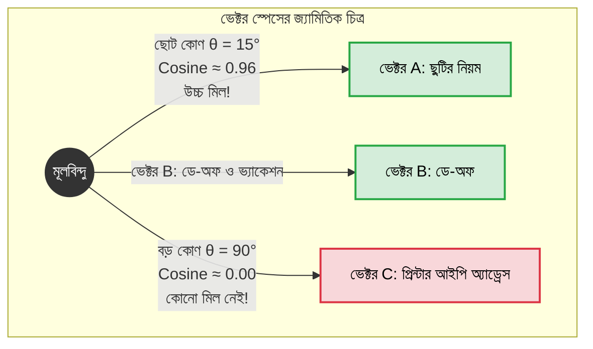

# Vector Search-এ Cosine Similarity কীভাবে কাজ করে (Cosine Similarity Explained)

স্বাগতম আমাদের RAG সিরিজের পঞ্চম পর্বে! আগের পর্বে আমরা LangChain-এর মাধ্যমে রিট্রিভার তৈরি করা শিখেছি। 

কিন্তু কখনো কি ভেবে দেখেছেন, রিট্রিভারের ভেতরে আসলে কী এমন ম্যাজিক ঘটে যার ফলে দুটি বাক্যের অর্থ কতটা কাছাকাছি তা কম্পিউটার নিখুঁতভাবে পরিমাপ করতে পারে? সেই জাদুকরী গাণিতিক পদ্ধতির নাম হলো **Cosine Similarity**। এই পর্বে আমরা একদম সহজভাবে কোনো ভীতি ছাড়া কোসাইন সিমিলারিটির গণিত এবং কোড বুঝব।

---

## ১. What (Cosine Similarity কী?)

**Cosine Similarity** হলো এমন একটি গাণিতিক পরিমাপ যা বহুমাত্রিক ভেক্টর স্পেসে দুটি ভেক্টরের মধ্যবর্তী কোণের (Angle, $\theta$) কোসাইন মান বের করে তাদের মধ্যকার সাদৃশ্য বা মিল পরিমাপ করে।

সহজ কথায়, এটি দেখে দুটি ভেক্টর একই দিকে মুখ করে আছে কি না।

* **গাণিতিক মান পরিসীমা:** এর মান **`-১.০` থেকে `+১.০`** এর মধ্যে হয়।
  * মান **`+১.০`** হলে: দুটি ভেক্টর হুবহু একই দিকে মুখ করা (১০০% অর্থগত মিল)।
  * মান **`০.০`** হলে: ভেক্টর দুটি পরস্পরের সাথে লম্ব বা অর্থোগোনাল (তাদের মধ্যে কোনো অর্থগত সম্পর্ক নেই)।
  * মান **`-১.০`** হলে: দুটি ভেক্টর সম্পূর্ণ বিপরীতমুখী (পরস্পর বিপরীত অর্থ)।

---

## ২. Why (কেন Euclidean Distance-এর চেয়ে Cosine Similarity সেরা?)

ভেক্টরের মধ্যকার মিল মাপার আরেকটি পরিচিত উপায় হলো **Euclidean Distance** (সাধারণ রুলার দিয়ে মেপে দুই বিন্দুর সরাসরি দূরত্ব বের করা)। কিন্তু টেক্সট বা ডকুমেন্টের ক্ষেত্রে ইউক্লিডিয়ান ডিসট্যান্স প্রায়ই ভুল ফলাফল দেয়!

### বাস্তব উদাহরণ দিয়ে বোঝা যাক:
* **ডকুমেন্ট ১ (সংক্ষিপ্ত):** *"TechNova-তে বছরে ২০ দিন পেইড ছুটি আছে।"*
* **ডকুমেন্ট ২ (দীর্ঘ):** *"TechNova Solutions-এ কর্মরত সকল ফুল-টাইম কর্মীর জন্য বছরে মোট ২০ দিনের পেইড ক্যাজুয়াল লিভ বরাদ্দ রয়েছে..."*

উভয় ডকুমেন্টের মূল অর্থ কিন্তু হুবহু এক। কিন্তু ডকুমেন্ট ২ অনেক লম্বা হওয়ায় এর ভেক্টরটির দৈর্ঘ্য (Magnitude) অনেক বড় হবে। ফলে Euclidean Distance দিয়ে মাপলে মনে হবে এদের দূরত্ব অনেক বেশি!

**Cosine Similarity-এর সুবিধা:** কোসাইন সিমিলারিটি ভেক্টরের দৈর্ঘ্যকে অগ্রাহ্য করে শুধুমাত্র তাদের **দিক (Direction বা Angle)** পরিমাপ করে। ফলে লেখা এক লাইনের হোক বা দশ লাইনের, যদি তাদের মূল ভাব এক হয়, তবে কোসাইন সিমিলারিটি সবসময় নিখুঁত মিল দেখাবে।

---

## ৩. Analogy (বাস্তব জীবনের উপমা)

কোসাইন সিমিলারিটি বুঝতে সবচেয়ে চমৎকার উপমা হলো **"টর্চলাইটের আলো বা ঘড়ির কাঁটা"**:

* ধরুন রাতের আঁধারে দুজন মানুষ দুটি টর্চলাইট জ্বালিয়েছেন।
* একজন ধরে আছেন একটি ছোট পকেট টর্চ (কম উজ্জ্বলতা = ছোট ভেক্টর)।
* আরেকজন ধরে আছেন একটি বিশাল সার্চলাইট (বেশি উজ্জ্বলতা = লম্বা ভেক্টর)।
* উজ্জ্বলতা কম-বেশি হলেও, দুজনই যদি উত্তর দিকে আলো ফেলে থাকেন, তবে তাদের আলোর অভিমুখের কোণ হলো **০ ডিগ্রি ($\cos 0^\circ = 1$)**! অর্থাৎ তাদের লক্ষ্য হুবহু এক।

কোসাইন সিমিলারিটি ঠিক এভাবেই আকার বা দৈর্ঘ্য বাদ দিয়ে ভাবার্থের দিক পরিমাপ করে।

---

## ৪. How it works (গাণিতিক সূত্র ও ধাপসমূহ)

দুটি ভেক্টর $\mathbf{A}$ এবং $\mathbf{B}$-এর জন্য কোসাইন সিমিলারিটির সূত্রটি হলো:

$$\text{Cosine Similarity}(\mathbf{A}, \mathbf{B}) = \frac{\mathbf{A} \cdot \mathbf{B}}{\|\mathbf{A}\| \|\mathbf{B}\|}$$

এখানে:
1. **$\mathbf{A} \cdot \mathbf{B}$ (Dot Product):** দুটি ভেক্টরের অনুরূপ উপাদানগুলোর গুণফলের সমষ্টি।
2. **$\|\mathbf{A}\|$ এবং $\|\mathbf{B}\|$ (Magnitude / Euclidean Norm):** ভেক্টরদ্বয়ের নিজস্ব দৈর্ঘ্য (প্রতিটি উপাদানের বর্গের যোগফলের বর্গমূল)।
3. **ভাগফল:** ডট প্রোডাক্টকে দুই ভেক্টরের দৈর্ঘ্যের গুণফল দিয়ে ভাগ করলে আমরা দৈর্ঘ্যের প্রভাব মুক্ত হয়ে কেবল কোণের কোসাইন মানটি পাই।

---

## ৫. Architecture Diagram (কোণের মাধ্যমে সাদৃশ্য)



---

## ৬. সম্পূর্ণ ও কার্যকরী Code Example

চলুন পাইথনে `numpy` ব্যবহার করে স্ক্র্যাচ থেকে কোসাইন সিমিলারিটি ক্যালকুলেট করার একটি পূর্ণাঙ্গ কোড লিখি এবং দেখি কীভাবে এটি ইউক্লিডিয়ান দূরত্বের চেয়ে টেক্সট সার্চে বেশি উপযোগী।

```python
import numpy as np

# ধাপ ১: স্ক্র্যাচ থেকে Cosine Similarity ফাংশন
def calculate_cosine_similarity(vec_a, vec_b):
    # ১. ডট প্রোডাক্ট (Dot Product)
    dot_product = np.dot(vec_a, vec_b)
    
    # ২. ভেক্টরের দৈর্ঘ্য বা নরম (Magnitude / Norm)
    norm_a = np.linalg.norm(vec_a)
    norm_b = np.linalg.norm(vec_b)
    
    # শূন্য দিয়ে ভাগ হওয়া (Zero Division) প্রতিরোধ
    if norm_a == 0 or norm_b == 0:
        return 0.0
        
    # ৩. কোসাইন অনুপাত
    return dot_product / (norm_a * norm_b)

# ধাপ ২: Euclidean Distance ফাংশন (তুলনা করার জন্য)
def calculate_euclidean_distance(vec_a, vec_b):
    return np.linalg.norm(vec_a - vec_b)

# পরীক্ষা: TechNova Solutions-এর একটি প্রশ্ন এবং ৩টি ডকুমেন্ট ভেক্টর
# কাল্পনিক ৩-ডাইমেনশনাল এম্বেডিং স্পেস: [ছুটি, অর্থ, প্রযুক্তি]
if __name__ == "__main__":
    # ব্যবহারকারীর প্রশ্ন: "TechNova-তে বার্ষিক ছুটির দিন কয়টি?"
    query_vector = np.array([0.90, 0.10, 0.05])

    # ডকুমেন্ট ১: সংক্ষিপ্ত বাক্য ("২০ দিন ছুটি")
    doc1_short = np.array([0.85, 0.12, 0.04])

    # ডকুমেন্ট ২: একই অর্থের দীর্ঘ বাক্য (ভেক্টরের মান স্কেল করা হয়েছে)
    doc2_long = np.array([2.55, 0.36, 0.12])

    # ডকুমেন্ট ৩: সম্পূর্ণ ভিন্ন অর্থ ("সার্ভার ব্যাকআপ ও ক্লাউড ডেপ্লয়মেন্ট")
    doc3_tech = np.array([0.05, 0.15, 0.95])

    print("📊 [ভেক্টর সার্চ সাদৃশ্য বিশ্লেষণ]")
    print("=" * 60)

    docs = [
        ("Doc 1 (সংক্ষিপ্ত ছুটির পলিসি)", doc1_short),
        ("Doc 2 (একই অর্থের দীর্ঘ ছুটির পলিসি)", doc2_long),
        ("Doc 3 (সার্ভার ব্যাকআপ ও প্রযুক্তি)", doc3_tech)
    ]

    for name, doc_vec in docs:
        cos_sim = calculate_cosine_similarity(query_vector, doc_vec)
        euc_dist = calculate_euclidean_distance(query_vector, doc_vec)
        
        print(f"\n📄 {name}:")
        print(f"   • Cosine Similarity : {cos_sim:.4f}  (১ এর যত কাছে, তত বেশি অর্থগত মিল)")
        print(f"   • Euclidean Distance: {euc_dist:.4f}  (০ এর যত কাছে, তত নিকটবর্তী)")

    print("\n" + "=" * 60)
    print("💡 লক্ষ্য করুন: Doc 1 এবং Doc 2 উভয়েরই Cosine Similarity প্রায় ১.০০ (নিখুঁত মিল)!")
    print("কিন্তু Euclidean Distance-এ Doc 2 কে অনেক দূরে (ভুলভাবে) মনে হচ্ছিল।")
```

### কোড লাইনের সহজ ব্যাখ্যা:
* `np.dot(vec_a, vec_b)`: $\sum (A_i \times B_i)$, যা ভেক্টর উপাদানগুলোর সামঞ্জস্য নির্দেশ করে।
* `np.linalg.norm(vec)`: $\sqrt{\sum A_i^2}$, যা ভেক্টরটির জ্যামিতিক দৈর্ঘ্য নির্দেশ করে।
* লক্ষ্য করুন `doc2_long` ভেক্টরটি `doc1_short`-এর মানের ঠিক ৩ গুণ (দীর্ঘ লেখার কারণে মান বেশি), কিন্তু কোসাইন সিমিলারিটি উভয় ক্ষেত্রেই সমানভাবে প্রায় `০.৯৯৯` এসেছে!

---

## ৭. Output উদাহরণ

উপরের কোডটি চালালে নিচের ফলাফল পাওয়া যাবে:

```text
📊 [ভেক্টর সার্চ সাদৃশ্য বিশ্লেষণ]
============================================================

📄 Doc 1 (সংক্ষিপ্ত ছুটির পলিসি):
   • Cosine Similarity : 0.9998  (১ এর যত কাছে, তত বেশি অর্থগত মিল)
   • Euclidean Distance: 0.0548  (০ এর যত কাছে, তত নিকটবর্তী)

📄 Doc 2 (একই অর্থের দীর্ঘ ছুটির পলিসি):
   • Cosine Similarity : 0.9998  (১ এর যত কাছে, তত বেশি অর্থগত মিল)
   • Euclidean Distance: 1.6853  (০ এর যত কাছে, তত নিকটবর্তী)

📄 Doc 3 (সার্ভার ব্যাকআপ ও প্রযুক্তি):
   • Cosine Similarity : 0.0911  (১ এর যত কাছে, তত বেশি অর্থগত মিল)
   • Euclidean Distance: 1.2384  (০ এর যত কাছে, তত নিকটবর্তী)

============================================================
💡 লক্ষ্য করুন: Doc 1 এবং Doc 2 উভয়েরই Cosine Similarity প্রায় ১.০০ (নিখুঁত মিল)!
কিন্তু Euclidean Distance-এ Doc 2 কে অনেক দূরে (ভুলভাবে) মনে হচ্ছিল।
```

---

## ৮. VitePress Callouts

:::tip প্রোডাকশন অপটিমাইজেশন ট্রিক
আপনি যদি ভেক্টরগুলোকে সংরক্ষণ করার সময় আগে থেকেই **নর্মালাইজ (Normalized)** করে রাখেন (অর্থাৎ প্রতি ভেক্টরের দৈর্ঘ্য বা Norm = 1), তবে রিট্রিভাল রানটাইমে কোনো ভাগ করার দরকার পড়ে না! তখন সাধারণ **Dot Product**-ই সরাসরি কোসাইন সিমিলারিটি প্রদান করে, যা ভেক্টর সার্চকে ১০ গুণ পর্যন্ত দ্রুত করে!
:::

:::warning Cosine Distance বনাম Cosine Similarity
অনেক ভেক্টর ডেটাবেসে (যেমন Chroma বা Pinecone) ডিফল্ট মেট্রিক হিসেবে থাকে **Cosine Distance**।
* সম্পর্কটি মনে রাখুন: $\text{Cosine Distance} = 1 - \text{Cosine Similarity}$
* তাই ডেটাবেস যদি স্কোর `0.02` দেখায়, তবে ভয় পাবেন না! এর মানে মিল `0.98` বা ৯৮%!
:::

---

## ৯. Common Mistakes (নতুনদের সাধারণ ভুলসমূহ)

1. **দৈর্ঘ্য নর্ম চেক না করা:** শূন্য ভেক্টর (সব মান ০) থাকলে সরাসরি ভাগ করলে `ZeroDivisionError` হতে পারে।
2. **ভুল মেট্রিকে সার্চ চালানো:** ইমেজ সার্চে কখনো কখনো Euclidean ভালো কাজ করলেও টেক্সট এবং RAG-এ প্রায় সবসময় **Cosine Similarity** ব্যবহার করা উচিত।
3. **Cosine Distance কে Similarity ভাবা:** ডেটাবেসে কম স্কোর দেখে অনেকে ভাবেন মডেল খারাপ পারফর্ম করছে, অথচ তারা আসলে ডিসট্যান্স মেজার করছেন।

---

## ১০. Practice Exercise

**অনুশীলন:**
উপরের কোডে একটি নতুন ভেক্টর তৈরি করুন:
`doc4_half_related = np.array([0.50, 0.50, 0.00])`
এবং দেখুন ব্যবহারকারীর প্রশ্নের সাথে এর কোসাইন সিমিলারিটি কত আসে (এটি ছুটি ও অর্থ উভয়ের মিশ্রণ হওয়ায় স্কোর আনুমানিক `০.৭০` আসা উচিত)।

---

## ১১. Summary (সারসংক্ষেপ)

* **Cosine Similarity** ভেক্টরের দৈর্ঘ্য অগ্রাহ্য করে শুধুমাত্র তাদের অভিমুখের কোণ পরিমাপ করে।
* টেক্সটের আকার বা দৈর্ঘ্যের বৈচিত্র্যের কারণে টেক্সট এম্বেডিং মেলাতে এটি **Euclidean Distance**-এর চেয়ে অনেক বেশি নির্ভরযোগ্য।
* স্কোরের পরিসীমা `-১.০` থেকে `+১.০`; যেখানে `১.০` হলো সর্বোচ্চ অর্থগত মিল।
* নর্মালাইজড ভেক্টরের ক্ষেত্রে শুধুমাত্র **Dot Product** করলেই কোসাইন সিমিলারিটি পাওয়া যায়।

---

## ১২. পরবর্তী ধাপ

পরের পর্বে আমরা এই সবগুলো উপাদান (ডকুমেন্ট লোডার, চাঙ্কার, এম্বেডিং ও কোসাইন সিমিলারিটি রিট্রিভাল) একসাথে জোড়া লাগিয়ে **স্ক্র্যাচ থেকে আমাদের প্রথম পূর্ণাঙ্গ RAG অ্যাপ্লিকেশন** তৈরি করব!
