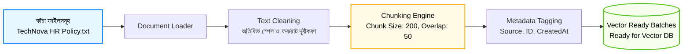

# Python দিয়ে Data Ingestion Pipeline তৈরি (Build Ingestion Pipeline)

স্বাগতম আমাদের RAG সিরিজের তৃতীয় পর্বে! আগের পর্বে আমরা ভেক্টর এম্বেডিং এবং RAG-এর সার্বিক আর্কিটেকচার সম্পর্কে বিস্তারিত জেনেছি। 

বাস্তব দুনিয়ায় আপনার কোম্পানির সব তথ্য কিন্তু সুন্দরভাবে সাজানো থাকে না। তথ্যগুলো থাকে বিভিন্ন PDF, Word ফাইল, টেক্সট নোট বা ডাটাবেসের টেবিলে। কাঁচা (Raw) ফাইলগুলো থেকে তথ্য সংগ্রহ করে সেগুলোকে ভেক্টর ডাটাবেসে সংরক্ষণ করার স্বয়ংক্রিয় প্রক্রিয়াকেই বলা হয় **Data Ingestion Pipeline**। এই পর্বে আমরা পাইথন দিয়ে একটি স্বয়ংসম্পূর্ণ ইনজেশন পাইপলাইন তৈরি করব।

---

## ১. What (Data Ingestion Pipeline কী?)

**Data Ingestion Pipeline** হলো এমন একটি ডেটা প্রসেসিং পাইপলাইন যা বিভিন্ন সোর্স থেকে আনস্ট্রাকচার্ড ডেটা (যেমন: `.txt`, `.pdf`, `.md`, ইত্যাদি) সংগ্রহ করে, পরিষ্কার (Clean) করে, ছোট ছোট টুকরো (Chunks)-তে ভাগ করে এবং পরবর্তীতে ভেক্টর ডেটাবেসে সংরক্ষণ করার উপযোগী করে তোলে।

সহজ কথায়, এটি কাঁচা নথিকে এমন একটি অবস্থায় নিয়ে আসে যেন রিট্রিভাল ইঞ্জিন খুব সহজে ও দ্রুত সঠিক তথ্য খুঁজে বের করতে পারে।

---

## ২. Why (কেন ইনজেশন পাইপলাইন এত গুরুত্বপূর্ণ?)

আপনি হয়তো ভাবতে পারেন—*পুরো একটা ১০০ পাতার PDF ফাইল একবারে ভেক্টর স্টোরে রেখে দিলেই তো হতো, এত পাইপলাইনের কী দরকার?* 

আসলে সরাসরি ফাইল স্টোর করলে নিচের ৩টি বড় সমস্যা হয়:

1. **Information Dilution (তথ্যের ঘনত্ব নষ্ট হওয়া):** পুরো ১০০ পাতার একটি মাত্র ভেক্টর বানালে ডকুমেন্টের ভেতরের নির্দিষ্ট খুটিনাটি তথ্য (যেমন: নির্দিষ্ট কোনো ছুটির নিয়ম) হারিয়ে যায়।
2. **Context Window Exceeded:** ব্যবহারকারী একটি ছোট প্রশ্ন করলে আপনি পুরো ১০০ পাতা LLM-কে পাঠাতে পারবেন না, কারণ LLM-এর একটি নির্দিষ্ট টোকেন লিমিট (Context Window) থাকে।
3. **No Metadata Tracking:** ফাইলটি কোথা থেকে এসেছে (সোর্স ফাইলের নাম, পৃষ্ঠার নম্বর, সেকশন ইত্যাদি) তা যদি ট্র্যাক না করা হয়, তবে ব্যবহারকারীকে উত্তরের সাথে রেফারেন্স (Citations) দেখানো সম্ভব হয় না।

একটি শক্তিশালী Ingestion Pipeline নিশ্চিত করে যে আপনার ডেটা সুসংগঠিত, সঠিক মেটাডেটা সম্বলিত এবং সার্চের জন্য শতভাগ উপযোগী।

---

## ৩. Analogy (বাস্তব জীবনের উপমা)

ইনজেশন পাইপলাইন বুঝতে সবচেয়ে সুন্দর উপমা হলো **"রান্নার জন্য কাঁচা শাকসবজি প্রসেসিং"**:

* আপনি বাজার থেকে কাঁচা আলু ও ফুলকপি কিনে আনলেন (Raw Documents)।
* আপনি কি আস্ত ধুলোবালি সহ ফুলকপি কড়াইয়ে ঢেলে দেবেন? নিশ্চয়ই না!
* প্রথমে আপনি সেগুলোর পচা পাতা ফেলে ধুয়ে পরিষ্কার করবেন (**Data Cleaning**)।
* তারপর রান্নার উপযোগী ছোট ছোট টুকরো করে কাটবেন (**Chunking**)।
* এরপর কোন পাত্রে কী রাখছেন সেটার লেবেল লাগিয়ে সাজিয়ে রাখবেন (**Metadata Tracking**)।
* সবশেষে সেগুলো রান্নার জন্য প্রস্তুত হবে।

ইনজেশন পাইপলাইন হলো ঠিক এই প্রাথমিক প্রস্তুতির কারখানা!

---

## ৪. How it works (ধাপে ধাপে কার্যপদ্ধতি)

একটি আদর্শ Data Ingestion Pipeline নিচের ৫টি ধাপে কাজ করে:

1. **Document Loading:** ফাইল সিস্টেম বা ক্লাউড থেকে ফাইল রিড করা।
2. **Text Preprocessing & Cleaning:** অপ্রয়োজনীয় অতিরিক্ত স্পেস, খালি লাইন বা আন-প্রিন্টেবল ক্যারেক্টার মুছে ফেলা।
3. **Chunking with Overlap:** বড় টেক্সটকে নির্দিষ্ট দৈর্ঘ্যের ছোট খণ্ডে ভাগ করা, যেখানে প্রতিটি খণ্ডের মাঝে কিছুটা ওভারল্যাপ (Overlap) রাখা হয় যাতে বাক্যের প্রসঙ্গ কেটে না যায়।
4. **Metadata Enrichment:** প্রতিটি খণ্ডের সাথে সোর্স ফাইলের নাম, চ্যাঙ্ক আইডি এবং তৈরির তারিখ ট্যাগ করা।
5. **Batch Ingestion:** প্রস্তুতকৃত চ্যাঙ্কগুলোকে এম্বেডিং ও ভেক্টর স্টোরে পাঠানোর উপযোগী ডেটা স্ট্রাকচারে রূপান্তর করা।

---

## ৫. Architecture Diagram (ইনজেশন ফ্লো)



---

## ৬. সম্পূর্ণ ও কার্যকরী Code Example

চলুন কোনো জটিল ফ্রেমওয়ার্ক ছাড়াই সরাসরি পাইথনের অবজেক্ট ওরিয়েন্টেড আর্কিটেকচার দিয়ে একটি প্রফেশনাল Data Ingestion Pipeline তৈরি করি।

```python
import os
import re
from datetime import datetime

# ধাপ ১: চ্যাঙ্ক এবং মেটাডেটা ধারণ করার জন্য ডেটাক্লাস বা স্ট্রাকচার
class DocumentChunk:
    def __init__(self, text, metadata):
        self.text = text
        self.metadata = metadata

    def __repr__(self):
        return f"\n--- [Chunk ID: {self.metadata['chunk_id']}] (Source: {self.metadata['source']}) ---\n{self.text}\n"

# ধাপ ২: মূল Ingestion Pipeline ক্লাস
class IngestionPipeline:
    def __init__(self, chunk_size=150, chunk_overlap=30):
        self.chunk_size = chunk_size
        self.chunk_overlap = chunk_overlap

    # ক. টেক্সট ক্লিনিং মেথড
    def clean_text(self, text):
        # একাধিক স্পেস বা অপ্রয়োজনীয় নিউলাইন দূর করা
        text = re.sub(r'\s+', ' ', text)
        return text.strip()

    # খ. টেক্সটকে ওভারল্যাপ সহ স্লাইস করার মেথড (Sliding Window Chunking)
    def create_chunks(self, text, source_name):
        cleaned_text = self.clean_text(text)
        chunks = []
        start = 0
        text_length = len(cleaned_text)
        chunk_index = 1

        while start < text_length:
            end = start + self.chunk_size
            chunk_content = cleaned_text[start:end]

            # মেটাডেটা সমৃদ্ধকরণ
            metadata = {
                "chunk_id": f"{source_name}_c{chunk_index}",
                "source": source_name,
                "start_char": start,
                "end_char": min(end, text_length),
                "created_at": datetime.now().strftime("%Y-%m-%d %H:%M:%S")
            }

            chunks.append(DocumentChunk(text=chunk_content, metadata=metadata))
            
            # পরবর্তী চ্যাঙ্কের জন্য ওভারল্যাপ সহ শিফট করা
            start += (self.chunk_size - self.chunk_overlap)
            chunk_index += 1

        return chunks

    # গ. পাইপলাইন এক্সিকিউশন
    def process_file_content(self, file_name, raw_content):
        print(f"⚙️ প্রসেস করা হচ্ছে: {file_name} (মোট অক্ষর: {len(raw_content)})")
        chunks = self.create_chunks(raw_content, file_name)
        print(f"✅ সফলভাবে তৈরি হয়েছে {len(chunks)} টি চ্যাঙ্ক।")
        return chunks

# পরীক্ষা চালানোর অংশ
if __name__ == "__main__":
    # TechNova Solutions-এর একটি দীর্ঘ পলিসি ডকুমেন্টের নমুনা টেক্সট
    sample_policy_doc = """
    TechNova Solutions Ltd. - Employee Handbook 2026.
    ১. ছুটির নীতিমালা: সকল ফুল-টাইম কর্মী বছরে মোট ২০ দিন পেইড ক্যাজুয়াল লিভ (Casual Leave) পাবেন। 
    এছাড়াও অসুস্থতাজনিত কারণে টানা দুই দিনের বেশি অফিসে অনুপস্থিত থাকলে অনুমোদিত চিকিৎসকের প্রেসক্রিপশন জমা দিতে হবে।
    ২. কাজের সময় ও উপস্থিতি: আমাদের অফিস সকাল ৯:৩০ টা থেকে সন্ধ্যা ৬:০০ টা পর্যন্ত কার্যকর থাকে। 
    শুক্র ও শনিবার অফিস বন্ধ থাকবে। কর্মীগণ সর্বোচ্চ ১৫ মিনিট গ্রেস টাইম পাবেন।
    ৩. অফিস ভাতা ও সুবিধাসমূহ: কর্মীদের বাসা থেকে কাজের সুবিধার্থে মাসিক ১,৫০০ টাকা ইন্টারনেট রিইমবার্সমেন্ট প্রদান করা হয়।
    """

    # পাইপলাইন ইনস্ট্যান্স তৈরি (Chunk Size: 180 অক্ষর, Overlap: 40 অক্ষর)
    pipeline = IngestionPipeline(chunk_size=180, chunk_overlap=40)

    # পাইপলাইন রান করা
    processed_chunks = pipeline.process_file_content("technova_handbook.txt", sample_policy_doc)

    # চ্যাঙ্কগুলোর আউটপুট দেখা
    print("\n📦 তৈরি হওয়া চ্যাঙ্ক ও মেটাডেটার বিবরণ:")
    for chunk in processed_chunks:
        print(chunk)
```

### কোড লাইনের সহজ ব্যাখ্যা:
* `DocumentChunk`: প্রতিটি টেক্সট খণ্ডের সাথে তার নিজস্ব মেটাডেটা (আইডি, সোর্স, তারিখ) এক সাথে রাখার ক্লাস।
* `clean_text()`: অপ্রয়োজনীয় ট্যাব, অতিরিক্ত স্পেস বা লাইন ব্রেক মুছে ফেলে ডেটাকে মসৃণ করে।
* `create_chunks()`: স্লাইডিং উইন্ডো (Sliding Window) পদ্ধতিতে নির্দিষ্ট সাইজ অনুযায়ী টেক্সট কাটে এবং কিছুটা পূর্ববর্তী অংশ ওভারল্যাপ হিসেবে নতুন অংশে রাখে।
* `start += (self.chunk_size - self.chunk_overlap)`: এটি নিশ্চিত করে যে প্রতিটি চ্যাঙ্কের শেষের কিছু কথা পরবর্তী চ্যাঙ্কের শুরুতে আবার আসবে, যাতে কোনো বাক্যের অর্থ মাঝখানে ভেঙে না যায়।

---

## ৭. Output উদাহরণ

কোডটি রান করলে নিচের মতো সুবিন্যস্ত ফলাফল দেখতে পাবেন:

```text
⚙️ প্রসেস করা হচ্ছে: technova_handbook.txt (মোট অক্ষর: 524)
✅ সফলভাবে তৈরি হয়েছে 4 টি চ্যাঙ্ক।

📦 তৈরি হওয়া চ্যাঙ্ক ও মেটাডেটার বিবরণ:

--- [Chunk ID: technova_handbook.txt_c1] (Source: technova_handbook.txt) ---
TechNova Solutions Ltd. - Employee Handbook 2026. ১. ছুটির নীতিমালা: সকল ফুল-টাইম কর্মী বছরে মোট ২০ দিন পেইড ক্যাজুয়াল লিভ (Casual Leave) পাবেন। এছাড়াও অসুস্থতাজনিত কারণে টানা দুই দিন


--- [Chunk ID: technova_handbook.txt_c2] (Source: technova_handbook.txt) ---
ছু অসুস্থতাজনিত কারণে টানা দুই দিনের বেশি অফিসে অনুপস্থিত থাকলে অনুমোদিত চিকিৎসকের প্রেসক্রিপশন জমা দিতে হবে। ২. কাজের সময় ও উপস্থিতি: আমাদের অফিস সকাল ৯:৩০ টা থেকে সন্ধ্যা ৬:০০ টা পর


--- [Chunk ID: technova_handbook.txt_c3] (Source: technova_handbook.txt) ---
সকাল ৯:৩০ টা থেকে সন্ধ্যা ৬:০০ টা পর্যন্ত কার্যকর থাকে। শুক্র ও শনিবার অফিস বন্ধ থাকবে। কর্মীগণ সর্বোচ্চ ১৫ মিনিট গ্রেস টাইম পাবেন। ৩. অফিস ভাতা ও সুবিধাসমূহ: কর্মীদের বাসা থেকে কাজের সুবি


--- [Chunk ID: technova_handbook.txt_c4] (Source: technova_handbook.txt) ---
৩. অফিস ভাতা ও সুবিধাসমূহ: কর্মীদের বাসা থেকে কাজের সুবিধার্থে মাসিক ১,৫০০ টাকা ইন্টারনেট রিইমবার্সমেন্ট প্রদান করা হয়।
```

---

## ৮. VitePress Callouts

:::tip Chunk Overlap কেন দিতে হয়?
যদি দুটি চ্যাঙ্কের মাঝে কোনো ওভারল্যাপ না থাকে, তাহলে একটি বাক্য ঠিক মাঝখানে কেটে দুই চ্যাঙ্কে ভাগ হয়ে যেতে পারে (যেমন: চ্যাঙ্ক ১-এ থাকলো *"ডাক্তারের প্রেসক্রিপশন..."* আর চ্যাঙ্ক ২-এ থাকলো *"...জমা দিতে হবে"* )। ফলে সার্চের সময় পূর্ণাঙ্গ অর্থ উদ্ধার করা কঠিন হয়ে পড়ে। ওভারল্যাপ রাখলে বাক্যের ধারাবাহিকতা বজায় থাকে।
:::

:::warning মেটাডেটা সংরক্ষণে যত্নশীল হোন
কখনোই শুধু টেক্সট ভেক্টর স্টোরে রাখবেন না। সাথে অবশ্যই ফাইল নাম, পৃষ্ঠা বা সেকশন আইডি রাখবেন। বাস্তব প্রজেক্টে ব্যবহারকারী জানতে চাইবে AI এই তথ্যটি কোন নথির কোন পৃষ্ঠা থেকে পেয়েছে!
:::

---

## ৯. Common Mistakes (নতুনদের সাধারণ ভুলসমূহ)

1. **অতিরিক্ত বড় চ্যাঙ্ক সাইজ নির্ধারণ করা:** চ্যাঙ্ক সাইজ যদি ১০০০-২০০০ শব্দের বেশি হয়ে যায়, তবে নির্দিষ্ট প্রশ্নের নিখুঁত উত্তর খুঁজে বের করার ক্ষমতা কমে যায়।
2. **টেক্সট ক্লিন না করে সরাসরি চ্যাঙ্ক করা:** কাঁচা HTML ট্যাগ বা অতিরিক্ত উল্টাপাল্টা স্পেস সহ এম্বেড করলে এম্বেডিং মডেল বিভ্রান্ত হয়।
3. **ওভারল্যাপ খুব বেশি বা খুব কম রাখা:** সাধারণত চ্যাঙ্ক সাইজের ১০% থেকে ২০% ওভারল্যাপ রাখা একটি ইন্ডাস্ট্রিয়াল স্ট্যান্ডার্ড (যেমন: Chunk Size ২০০ হলে Overlap ৩০-৪০)।

---

## ১০. Practice Exercise

**অনুশীলন:**
উপরের কোডে `clean_text` ফাংশনটিকে আপডেট করুন যাতে এটি টেক্সটের মধ্যে থাকা কোনো ইমেইল অ্যাড্রেস বা গোপনীয় ফোন নম্বর থাকলে সেটিকে `[REDACTED]` দিয়ে প্রতিস্থাপন করে (তথ্য সুরক্ষার জন্য Data Sanitization)।

*টিপস:* পাইথনের `re.sub(r'[\w\.-]+@[\w\.-]+', '[REDACTED]', text)` রেগুলার এক্সপ্রেশন ব্যবহার করতে পারেন।

---

## ১১. Summary (সারসংক্ষেপ)

* **Data Ingestion Pipeline** হলো কাঁচা নথিপত্রকে ভেক্টর স্টোরে সেভ করার পূর্বশর্ত।
* এটি মূলত লোডিং, ক্লিনিং, চাংকিং এবং মেটাডেটা ট্যাগিং সম্পন্ন করে।
* **Chunk Overlap** বাক্যের প্রেক্ষাপট (Context) ভেঙে যাওয়া প্রতিরোধ করে।
* রেফারেন্স ও সাইটেশনের জন্য প্রতিটি চ্যাঙ্কের সাথে **Metadata** সংরক্ষণ করা অত্যন্ত জরুরি।

---

## ১২. পরবর্তী ধাপ

পরের পর্বে আমরা দেখব কীভাবে বিখ্যাত AI ফ্রেমওয়ার্ক **LangChain** ব্যবহার করে এই চ্যাঙ্কগুলোকে প্রফেশনালি লোড এবং **Document Retrieval** বাস্তবায়ন করতে হয়!
