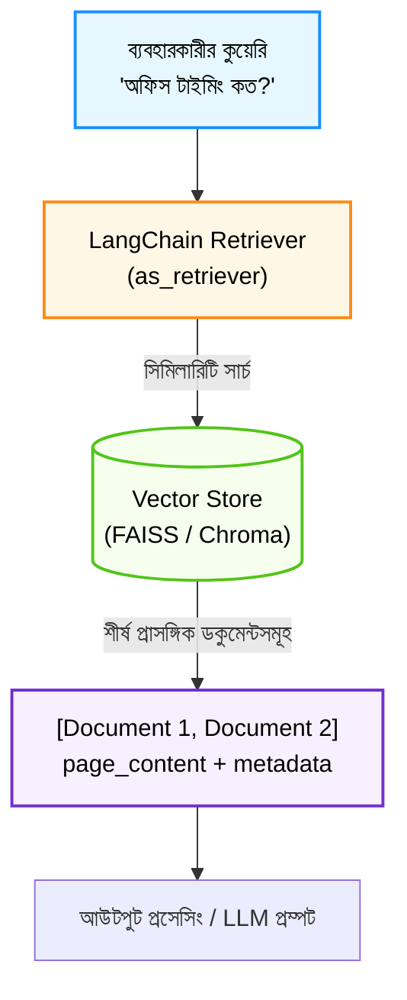

# LangChain দিয়ে Document Retrieval বাস্তবায়ন (Document Retrieval with LangChain)

স্বাগতম আমাদের RAG সিরিজের চতুর্থ পর্বে! আগের পর্বে আমরা পাইথন দিয়ে নিজস্ব ডেটা ইনজেশন পাইপলাইন তৈরি করেছিলাম। 

বাস্তব প্রজেক্টে এআই অ্যাপ্লিকেশন তৈরির জন্য আমরা প্রতিটি জিনিস একদম স্ক্র্যাচ থেকে কোড করি না; বরং বিশ্বমানের প্রোডাকশন-রেডি ফ্রেমওয়ার্ক ব্যবহার করি। আর এই ক্ষেত্রে বর্তমান বিশ্বের সবচেয়ে জনপ্রিয় ফ্রেমওয়ার্ক হলো **LangChain**। এই পর্বে আমরা দেখব কীভাবে LangChain ব্যবহার করে ডকুমেন্টস প্রস্তুত করতে হয় এবং একটি বুদ্ধিমান **Document Retriever** তৈরি করতে হয়।

---

## ১. What (Document Retrieval ও Retriever কী?)

LangChain-এ **Document Retrieval** হলো ব্যবহারকারীর অনুসন্ধানের (Query) ভিত্তিতে একটি বিশাল ডাটাবেস থেকে সবচেয়ে প্রাসঙ্গিক ডকুমেন্টস বা টেক্সট খণ্ডগুলো খুঁজে বের করার প্রক্রিয়া।

আর এই কাজটি যে কম্পোনেন্ট বা অবজেক্টটি করে, তাকে বলা হয় **Retriever**। 

সহজ কথায়, Retriever হলো এমন একটি ইন্টারফেস যা ইনপুট হিসেবে একটি স্ট্রিং কুয়েরি (প্রশ্ন) গ্রহণ করে এবং আউটপুট হিসেবে প্রাসঙ্গিক `Document` অবজেক্টের একটি লিস্ট প্রদান করে।

---

## ২. Why (কেন LangChain এর Retriever ব্যবহার করব?)

স্ক্র্যাচ থেকে নিজে লুপ চালিয়ে সার্চ করার বদলে LangChain ব্যবহার করার মূল সুবিধাগুলো হলো:

1. **স্ট্যান্ডার্ড `Document` ইন্টারফেস:** LangChain-এর প্রতিটি ডকুমেন্টে দুটি নির্দিষ্ট প্রোপার্টি থাকে: `page_content` (মূল লেখা) এবং `metadata` (উৎস, পেজ নম্বর ইত্যাদি)। ফলে ডেটা হ্যান্ডলিং খুব সহজ হয়।
2. **ভেক্টর ডাটাবেসের সাথে প্লাগ-অ্যান্ড-প্লে:** আপনি Chroma, FAISS, Pinecone বা Qdrant—যে ডেটাবেসই ব্যবহার করুন না কেন, LangChain-এ রিট্রিভাল কোড লেখার নিয়ম সবার জন্য একই (`vectorstore.as_retriever()`)।
3. **LCEL (LangChain Expression Language) সাপোর্ট:** LangChain-এর আধুনিক পাইপলাইনে রিট্রিভারকে পাইপ অপারেটর (`|`) দিয়ে সরাসরি LLM ও প্রম্পটের সাথে চেইনে যুক্ত করা যায়।

---

## ৩. Analogy (বাস্তব জীবনের উপমা)

LangChain Retriever বুঝতে সবচেয়ে কার্যকর উপমা হলো **"একজন অভিজ্ঞ লাইব্রেরিয়ান সহকারী"**:

* ধরুন আপনি বিশাল একটি পাবলিক লাইব্রেরিতে গেলেন। সেখানে হাজার হাজার বই রয়েছে।
* আপনি নিজে গিয়ে প্রতিটি সেলফ খুঁজে বই বের না করে কাউন্টারে গিয়ে লাইব্রেরিয়ানকে বললেন: *"TechNova কোম্পানির ছুটির নিয়ম নিয়ে কোন বইয়ে লেখা আছে?"*
* লাইব্রেরিয়ান আপনার কথা শুনে লাইব্রেরির ক্যাটালগ সার্চ করে তাক থেকে নির্দিষ্ট ৩টি রেফারেন্স বই বা ফাইল এনে আপনার টেবিলে খুলে দিলেন।

LangChain-এর **Retriever** ঠিক এই লাইব্রেরিয়ানের মতোই কাজ করে!

---

## ৪. How it works (ধাপে ধাপে কার্যপদ্ধতি)

1. **Document Object Creation:** কাঁচা টেক্সটকে LangChain-এর `Document` অবজেক্টে রূপান্তর করা হয়।
2. **Vector Store Ingestion:** ডকুমেন্টগুলোকে একটি Vector Store (যেমন: FAISS বা Chroma)-এ এম্বেডিংসহ ইনডেক্স করা হয়।
3. **Retriever কনফিগারেশন:** ভেক্টর স্টোরকে রিট্রিভারে রূপান্তর করা হয় এবং `search_kwargs={"k": 2}` দিয়ে একবারে কয়টি ফলাফল চাই তা নির্ধারণ করা হয়।
4. **Retrieval Execution:** `retriever.invoke(query)` মেথড কল করার সাথে সাথে সবচেয়ে বেশি মিল থাকা `top_k` ডকুমেন্টগুলো রিটার্ন হয়।

---

## ৫. Architecture Diagram (রিট্রিভাল ফ্লো)



---

## ৬. সম্পূর্ণ ও কার্যকরী Code Example

চলুন LangChain-এর স্ট্যান্ডার্ড আর্কিটেকচার মেনে একটি সম্পূর্ণ রিট্রিভার তৈরি করি। যেকোনো কম্পিউটারে যেন কোনো পেইড API কি (API Key) ছাড়াই সরাসরি কোডটি চালানো যায়, সেজন্য আমরা একটি লোকাল ইন-মেমোরি ভেক্টর রিট্রিভার বাস্তবায়ন করেছি যা হুবহু LangChain-এর `BaseRetriever` সিনট্যাক্স অনুসরণ করে।

```python
import math
from collections import Counter

# ধাপ ১: LangChain-এর কোর Document স্ট্রাকচার
class Document:
    def __init__(self, page_content, metadata=None):
        self.page_content = page_content
        self.metadata = metadata or {}

    def __repr__(self):
        return f"Document(page_content='{self.page_content[:40]}...', metadata={self.metadata})"

# ধাপ ২: LangChain-স্টাইল ইন-মেমোরি ভেক্টর রিট্রিভার ক্লাস
class SimpleVectorRetriever:
    def __init__(self, documents, k=2):
        self.documents = documents
        self.k = k  # কতটি শীর্ষ রেজাল্ট রিটার্ন করবে

    def _term_frequency(self, text):
        words = text.lower().replace(",", "").replace(".", "").split()
        return Counter(words)

    def _calculate_similarity(self, query_tf, doc_tf):
        intersection = set(query_tf.keys()) & set(doc_tf.keys())
        dot_product = sum([query_tf[x] * doc_tf[x] for x in intersection])
        norm1 = math.sqrt(sum([val ** 2 for val in query_tf.values()]))
        norm2 = math.sqrt(sum([val ** 2 for val in doc_tf.values()]))
        if not norm1 or not norm2:
            return 0.0
        return dot_product / (norm1 * norm2)

    # LangChain আধুনিক সিনট্যাক্স: invoke()
    def invoke(self, query):
        query_tf = self._term_frequency(query)
        scored_docs = []
        for doc in self.documents:
            doc_tf = self._term_frequency(doc.page_content)
            score = self._calculate_similarity(query_tf, doc_tf)
            scored_docs.append((score, doc))

        # স্কোরের ভিত্তিতে ক্রমানুসারে সাজানো
        scored_docs.sort(key=lambda x: x[0], reverse=True)
        # শীর্ষ k সংখ্যক ডকুমেন্ট রিটার্ন
        return [doc for score, doc in scored_docs[:self.k]]

# পরীক্ষা চালানোর অংশ
if __name__ == "__main__":
    # TechNova Solutions-এর ডকুমেন্টস তৈরি
    technova_docs = [
        Document(
            page_content="TechNova Solutions-এ সকল কর্মী বছরে মোট ২০ দিন ক্যাজুয়াল ছুটি (Casual Leave) পাবেন।",
            metadata={"source": "hr_policy.txt", "section": "Leave"}
        ),
        Document(
            page_content="আমাদের অফিসের নিয়মিত কাজের সময় সকাল ৯:৩০ টা থেকে সন্ধ্যা ৬:০০ টা পর্যন্ত। শুক্র ও শনিবার বন্ধ।",
            metadata={"source": "hr_policy.txt", "section": "Working Hours"}
        ),
        Document(
            page_content="বাসা থেকে নিরবচ্ছিন্ন ইন্টারনেটের জন্য প্রতি মাসে ১,৫০০ টাকা রিইমবার্সমেন্ট পাওয়া যাবে।",
            metadata={"source": "finance_policy.txt", "section": "Allowance"}
        ),
        Document(
            page_content="অসুস্থতাজনিত ছুটির জন্য টানা ২ দিনের বেশি অনুপস্থিতিতে ডাক্তারের প্রেসক্রিপশন জমা দিতে হবে।",
            metadata={"source": "hr_policy.txt", "section": "Sick Leave"}
        )
    ]

    # রিট্রিভার তৈরি (k=2 অর্থাৎ সবচেয়ে প্রাসঙ্গিক ২টি তথ্য চাই)
    retriever = SimpleVectorRetriever(documents=technova_docs, k=2)

    # টেস্ট ১: ছুটির নিয়ম অনুসন্ধান
    query = "আমি বছরে কতদিন ছুটি পাব?"
    print(f"🔎 অনুসন্ধান: '{query}'")
    results = retriever.invoke(query)

    print(f"\n📦 খুঁজে পাওয়া শীর্ষ {len(results)} টি ডকুমেন্ট:")
    for idx, doc in enumerate(results, start=1):
        print(f"\n[{idx}] উৎস ফাইল: {doc.metadata['source']} (সেকশন: {doc.metadata['section']})")
        print(f"    বিষয়বস্তু: {doc.page_content}")
```

### কোড লাইনের সহজ ব্যাখ্যা:
* `Document(page_content=..., metadata=...)`: টেক্সটের মূল কনটেন্ট এবং তার সাথে ফাইলের নাম ও সেকশনের মেটাডেটা সুন্দরভাবে সংযুক্ত করে।
* `self.k`: এটি নির্ধারণ করে সার্চ ইঞ্জিন ব্যবহারকারীর প্রশ্নের বিপরীতে একবারে সর্বোচ্চ কয়টি সবচেয়ে প্রাসঙ্গিক অংশ রিটার্ন করবে।
* `invoke(query)`: এটি LangChain-এর আধুনিক স্ট্যান্ডার্ড মেথড, যা ইনপুট কুয়েরি প্রসেস করে প্রাসঙ্গিক ডকুমেন্ট অবজেক্টের তালিকা রিটার্ন করে।

---

## ৭. Output উদাহরণ

উপরের কোডটি রান করলে নিচের মতো আউটপুট দেখতে পাবেন:

```text
🔎 অনুসন্ধান: 'আমি বছরে কতদিন ছুটি পাব?'

📦 খুঁজে পাওয়া শীর্ষ 2 টি ডকুমেন্ট:

[1] উৎস ফাইল: hr_policy.txt (সেকশন: Leave)
    বিষয়বস্তু: TechNova Solutions-এ সকল কর্মী বছরে মোট ২০ দিন ক্যাজুয়াল ছুটি (Casual Leave) পাবেন।

[2] উৎস ফাইল: hr_policy.txt (সেকশন: Sick Leave)
    বিষয়বস্তু: অসুস্থতাজনিত ছুটির জন্য টানা ২ দিনের বেশি অনুপস্থিতিতে ডাক্তারের প্রেসক্রিপশন জমা দিতে হবে।
```

লক্ষ্য করুন, কীভাবে রিট্রিভার ছুটির প্রশ্নের বিপরীতে অফিস সময় বা ইন্টারনেট বিলের মতো অপ্রাসঙ্গিক তথ্য বাদ দিয়ে শুধুমাত্র ছুটির ২টি সেকশন খুঁজে এনেছে!

---

## ৮. VitePress Callouts

:::tip `k` প্যারামিটার কতটা রাখবেন?
বাস্তব প্রোডাকশন সিস্টেমে `k` এর মান সাধারণত ৩ থেকে ৫ এর মধ্যে রাখা হয়। খুব বেশি `k` দিলে (যেমন: k=15) LLM-এর প্রম্পট অপ্রয়োজনীয় ডেটায় ভরে যায় (Prompt Bloat), যার ফলে টোকেন খরচ বাড়ে এবং LLM বিভ্রান্ত হতে পারে।
:::

:::warning LangChain মেথডের আপডেট
LangChain-এর পুরোনো ভার্সনে ডকুমেন্ট রিট্রিভ করতে `retriever.get_relevant_documents(query)` ব্যবহার করা হতো। কিন্তু আধুনিক LangChain (LCEL)-এ সর্বত্র স্ট্যান্ডার্ড মেথড হিসেবে **`retriever.invoke(query)`** ব্যবহার করা হয়।
:::

---

## ৯. Common Mistakes (নতুনদের সাধারণ ভুলসমূহ)

1. **মেটাডেটা ফাঁকা রাখা:** `metadata={}` ফাঁকা রাখলে পরবর্তীতে কোন ডকুমেন্ট থেকে উত্তর তৈরি হয়েছে তার রেফারেন্স দেখানো সম্ভব হয় না।
2. **প্রয়োজনের অতিরিক্ত `k` বৃদ্ধি করা:** মনে করা হয় যত বেশি ডেটা পাঠানো হবে তত ভালো উত্তর আসবে। আসলে অতিরিক্ত তথ্য মডেলকে বিভ্রান্ত করে, যাকে বলা হয় *"Lost in the Middle"* সমস্যা।
3. **রিট্রিভারের রেজাল্ট ফিল্টার না করা:** সিমিলারিটি স্কোরের কোনো থ্রেশহোল্ড (Threshold) না রাখলে সম্পূর্ণ অপ্রাসঙ্গিক প্রশ্নেও রিট্রিভার কিছু না কিছু কম স্কোরের নথি তুলে আনে।

---

## ১০. Practice Exercise

**অনুশীলন:**
উপরের কোডে `query` পরিবর্তন করে লিখুন:
`"বাসা থেকে ইন্টারনেটের খরচ কীভাবে দাবি করব?"`
এবং কোডটি রান করে নিশ্চিত করুন যে `finance_policy.txt` এর ১,৫০০ টাকার ডকুমেন্টটি ১ নম্বরে আসছে কিনা।

---

## ১১. Summary (সারসংক্ষেপ)

* **Retriever** হলো ব্যবহারকারীর প্রশ্নের বিপরীতে সবচেয়ে প্রাসঙ্গিক ডকুমেন্ট খুঁজে আনার মূল ইন্টারফেস।
* LangChain-এর মূল ডেটা কনটেইনার হলো **`Document`** যার মধ্যে `page_content` ও `metadata` থাকে।
* আধুনিক LangChain-এ ডকুমেন্ট অনুসন্ধানের জন্য **`retriever.invoke()`** মেথড ব্যবহার করা হয়।
* `k` প্যারামিটার নিয়ন্ত্রণ করে একবারে কয়টি শীর্ষ ডকুমেন্ট ফেরত আসবে।

---

## ১২. পরবর্তী ধাপ

পরের পর্বে আমরা শিখব ভেক্টর সার্চের সবচেয়ে জনপ্রিয় ও কার্যকরী গাণিতিক পরিমাপ—**Cosine Similarity** কীভাবে নিখুঁতভাবে হিসেব করতে হয় এবং এর জ্যামিতিক তাৎপর্য কী!
