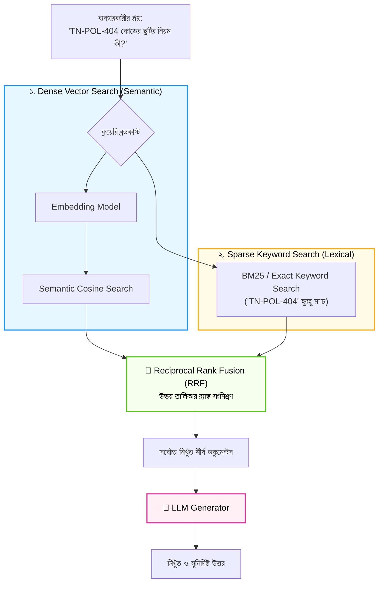

# Hybrid Search (Vector + Keyword Search-এর মেলবন্ধন)

স্বাগতম আমাদের RAG সিরিজের ষোড়শ পর্বে! আধুনিক এন্টারপ্রাইজ RAG সিস্টেমে যদি এমন কোনো টেকনিক থাকে যা সার্চের মানকে সরাসরি প্রোডাকশন-গ্রেডে উন্নীত করে, তবে সেটি হলো **Hybrid Search**।

ভেক্টর এম্বেডিং মানুষের ভাষার অন্তর্নিহিত অর্থ চমৎকার বোঝে, কিন্তু একটি জায়গায় এসে সে প্রায়ই হোঁচট খায়—তা হলো **সুনির্দিষ্ট কোড, সিরিয়াল নম্বর, এরর কোড বা দুর্লভ নাম**! যেমন: *"TechNova-TN902"* বা *"ErrorCode_503"* লিখে সার্চ করলে ভেক্টর সার্চ অনেক সময় অপ্রাসঙ্গিক টেক্সট তুলে আনে।

এই সমস্যার সমাধান করতেই এসেছে **Hybrid Search**—যা ভেক্টর সার্চের গভীর বোধশক্তি এবং প্রথাগত কিওয়ার্ড সার্চের নিখুঁত শব্দ মেলানোর ক্ষমতাকে একত্রিত করে।

---

## ১. What (Hybrid Search কী?)

**Hybrid Search** হলো এমন একটি সার্চ আর্কিটেকচার যা দুটি সম্পূর্ণ ভিন্ন ধরণের সার্চ মেথডোলজিকে একই সাথে প্যারালালে চালায়:

1. **Dense Retrieval (Semantic Search):** ডিপ লার্নিং ভেক্টর এম্বেডিং ব্যবহার করে বাক্যের মূল ভাবার্থ ও সমার্থক শব্দ খুঁজে বের করে।
2. **Sparse Retrieval (Keyword Search / BM25):** প্রথাগত লেক্সিক্যাল সার্চ যা হুবহু শব্দের বানান, সিরিয়াল কোড, নাম ও টেকনিক্যাল টার্ম হুবহু মেলায়।

এরপর উভয় সার্চের ফলাফলকে **RRF (Reciprocal Rank Fusion)** অথবা ওয়েটেড স্কোরের মাধ্যমে একত্রিত করে সেরা ফলাফল প্রদান করা হয়।

---

## ২. Why (কেন একক ভেক্টর সার্চ যথেষ্ট নয়?)

| সার্চের ধরণ | শক্তি (Strengths) | দুর্বলতা (Weaknesses) |
|---|---|---|
| **Dense Vector Search** | সমার্থক শব্দ বোঝে, ধারণার মিল খুঁজে পায় ("day-off" $\leftrightarrow$ "leave")। | নির্দিষ্ট কোড, ইউনিক আইডি বা বানানের হুবহু মিল খুঁজে পেতে ব্যর্থ হয়। |
| **Sparse BM25 Search** | নিখুঁত কিওয়ার্ড, এরর কোড ও সিরিয়াল নম্বর মেলাতে ১০০% পারফেক্ট। | সমার্থক শব্দ বোঝে না (বানান না মিললে রেজাল্ট শূন্য)। |
| **Hybrid Search (উভয়ের মিলন)** | **উভয় জগতের সেরা ক্ষমতা! ভাবার্থও বোঝে, আবার নির্দিষ্ট কোডও মেলায়।** | কোনো উল্লেখযোগ্য দুর্বলতা নেই। |

---

## ৩. Analogy (বাস্তব জীবনের উপমা)

Hybrid Search বুঝতে সবচেয়ে চমৎকার উপমা হলো **"পুলিশি তদন্তে গোয়েন্দা ও ফরেনসিক টিম"**:

* একটি অপরাধ তদন্তে **গোয়েন্দা কর্মকর্তা (Dense Vector Search)** অপরাধীর মোটিভ, স্বভাব ও চারিত্রিক প্রেক্ষাপট বিশ্লেষণ করেন।
* অন্যদিকে **ফরেনসিক টিম (Sparse Keyword Search)** কোনো ভাবনা চিন্তা না করে সরাসরি আঙুলের ছাপ (Fingerprint) বা জাতীয় পরিচয়পত্র নম্বর হুবহু মেলায়।
* যখন গোয়েন্দার সন্দেহ এবং ফরেনসিক ল্যাবের ফিঙ্গারপ্রিন্ট উভয়ই একই ব্যক্তির সাথে মিলে যায়—তখন শতভাগ নিশ্চিত হওয়া যায় যে অপরাধী ধরা পড়েছে!

Hybrid Search হলো আপনার এআই-এর সেই নিখুঁত গোয়েন্দা ও ফরেনসিক সমন্বয়।

---

## ৪. How it works (ধাপে ধাপে কার্যপদ্ধতি)

1. **User Query Input:** ব্যবহারকারী একটি মিশ্র প্রশ্ন করেন (যেমন: *"TN-POL-404 ছুটির পলিসি কী?"*)।
2. **Parallel Retrieval Execution:**
   * **শাখা ক (Dense):** এম্বেডিং তৈরি করে ভেক্টর ডাটাবেসে সেমান্টিক সার্চ চালায়।
   * **শাখা খ (Sparse / BM25):** টেক্সটের ইনভার্টেড ইনডেক্সে "TN-POL-404" কোডটির হুবহু ম্যাচ খোঁজে।
3. **Rank Fusion (RRF):** উভয় শাখার ফলাফল থেকে পাওয়া র‍্যাঙ্কগুলোকে RRF ফর্মুলায় ফিউজ করা হয়।
4. **Final Context Generation:** একত্রিত শীর্ষ ফলাফলগুলো ফিল্টার করে LLM-এর প্রম্পটে পাঠানো হয়।

---

## ৫. Architecture Diagram (হাইব্রিড সার্চ ফ্লো)



---

## ৬. সম্পূর্ণ ও কার্যকরী Code Example

চলুন পাইথনে একটি স্বয়ংসম্পূর্ণ `HybridSearchEngine` বাস্তবায়ন করি। কোনো জটিল সার্ভার কনফিগারেশন ছাড়াই যাতে প্রত্যেকে সরাসরি চালিয়ে শিখতে পারেন, সেজন্য আমরা ভেক্টর সিমিলারিটি এবং BM25-স্টাইল কিওয়ার্ড ম্যাচিং একসাথে যুক্ত করে RRF দিয়ে ফিউজ করেছি।

```python
import math
from collections import Counter

# TechNova Solutions-এর ডকুমেন্টস (যাতে সাধারণ লেখার সাথে নির্দিষ্ট পলিসি কোড যুক্ত আছে)
technova_documents = {
    "D1": "TechNova পলিসি কোড TN-POL-404: কর্মীগণ বছরে মোট ২০ দিন ক্যাজুয়াল ছুটি পাওয়ার অধিকারী।",
    "D2": "TechNova পলিসি কোড TN-POL-502: অসুস্থতাজনিত কারণে টানা ২ দিন অনুপস্থিতিতে ডাক্তারের প্রেসক্রিপশন লাগবে।",
    "D3": "TechNova ফিন্যান্স কোড TN-FIN-101: বাসা থেকে অফিসের কাজের জন্য ইন্টারনেট ভাতা বাবদ মাসিক ১৫০০ টাকা দেওয়া হবে।",
    "D4": "অফিসের কাজের স্বাভাবিক সময় সকাল ৯:৩০ টা থেকে সন্ধ্যা ৬:০০ টা পর্যন্ত।"
}

class HybridSearchEngine:
    def __init__(self, docs_dict):
        self.docs = docs_dict

    # ১. Sparse Keyword Search (হুবহু শব্দ বা কোড মেলানো)
    def sparse_search(self, query):
        query_words = set(query.lower().split())
        scored = []
        for doc_id, text in self.docs.items():
            doc_words = text.lower().replace(":", "").replace(".", "").split()
            # সাধারণ কিওয়ার্ড ম্যাচ সংখ্যা গণনা
            overlap_count = len(query_words.intersection(set(doc_words)))
            if overlap_count > 0:
                scored.append((doc_id, overlap_count))
        
        # বেশি ম্যাচিং স্কোরে সাজানো
        scored.sort(key=lambda x: x[1], reverse=True)
        return [doc_id for doc_id, _ in scored]

    # ২. Dense Vector Search (অর্থ ও সেমান্টিক ভাবার্থ মেলানো)
    def dense_search(self, query):
        def get_vector(t):
            return Counter(t.lower().replace(":", "").replace(".", "").split())
        
        query_vec = get_vector(query)
        scored = []
        for doc_id, text in self.docs.items():
            doc_vec = get_vector(text)
            common = set(query_vec.keys()) & set(doc_vec.keys())
            dot = sum(query_vec[k] * doc_vec[k] for k in common)
            norm1 = math.sqrt(sum(v ** 2 for v in query_vec.values()))
            norm2 = math.sqrt(sum(v ** 2 for v in doc_vec.values()))
            sim = dot / (norm1 * norm2) if (norm1 and norm2) else 0.0
            if sim > 0:
                scored.append((doc_id, sim))
        
        scored.sort(key=lambda x: x[1], reverse=True)
        return [doc_id for doc_id, _ in scored]

    # ৩. RRF ফিউশন ইঞ্জিন
    def hybrid_search(self, query, top_k=2):
        print(f"\n🔎 হাইব্রিড অনুসন্ধান: '{query}'")
        print("-" * 65)

        sparse_ranks = self.sparse_search(query)
        dense_ranks = self.dense_search(query)

        print(f"🔹 Sparse (Keyword) রেজাল্ট তালিকা : {sparse_ranks}")
        print(f"🔹 Dense (Semantic) রেজাল্ট তালিকা  : {dense_ranks}")

        # RRF স্কোর গণনা: 1 / (60 + rank)
        rrf_scores = {}
        for rank, doc_id in enumerate(sparse_ranks, start=1):
            rrf_scores[doc_id] = rrf_scores.get(doc_id, 0.0) + (1.0 / (60 + rank))

        for rank, doc_id in enumerate(dense_ranks, start=1):
            rrf_scores[doc_id] = rrf_scores.get(doc_id, 0.0) + (1.0 / (60 + rank))

        # চূড়ান্ত সর্টিং
        final_sorted = sorted(rrf_scores.items(), key=lambda x: x[1], reverse=True)
        
        print("\n🏆 [হাইব্রিড ফিউশন শেষে সেরা ফলাফল]:")
        top_results = []
        for pos, (doc_id, score) in enumerate(final_sorted[:top_k], start=1):
            print(f"[{pos}] ID: {doc_id} (RRF Score: {score:.5f}) -> {self.docs[doc_id]}")
            top_results.append(self.docs[doc_id])

        return top_results

# পরীক্ষা চালানোর অংশ
if __name__ == "__main__":
    engine = HybridSearchEngine(technova_documents)

    # টেস্ট: ব্যবহারকারী নির্দিষ্ট পলিসি কোড 'TN-POL-404' সহ ছুটির নিয়ম জানতে চাইলেন
    user_query = "TN-POL-404 কোডের ছুটির দিন কয়টি?"
    results = engine.hybrid_search(user_query, top_k=2)
```

### কোড লাইনের সহজ ব্যাখ্যা:
* `sparse_search`: নির্দিষ্ট কোড "TN-POL-404" থাকা ডকুমেন্টকে সবার আগে তুলে আনে।
* `dense_search`: "ছুটির দিন কয়টি" সংক্রান্ত অর্থপূর্ণ ডকুমেন্টগুলোকে তুলে আনে।
* `hybrid_search`: RRF-এর মাধ্যমে উভয় তালিকার পয়েন্ট যোগ করে এমন একটি ডকুমেন্টকে ১ নম্বরে নিশ্চিত করে যা একই সাথে নির্দিষ্ট কোডও ধারণ করে এবং ছুটির অর্থও বোঝায়!

---

## ৭. Output উদাহরণ

কোডটি চালালে নিচের মতো সুস্পষ্ট আউটপুট পাবেন:

```text
🔎 হাইব্রিড অনুসন্ধান: 'TN-POL-404 কোডের ছুটির দিন কয়টি?'
-----------------------------------------------------------------
🔹 Sparse (Keyword) রেজাল্ট তালিকা : ['D1']
🔹 Dense (Semantic) রেজাল্ট তালিকা  : ['D1', 'D2']

🏆 [হাইব্রিড ফিউশন শেষে সেরা ফলাফল]:
[1] ID: D1 (RRF Score: 0.03279) -> TechNova পলিসি কোড TN-POL-404: কর্মীগণ বছরে মোট ২০ দিন ক্যাজুয়াল ছুটি পাওয়ার অধিকারী।
[2] ID: D2 (RRF Score: 0.01613) -> TechNova পলিসি কোড TN-POL-502: অসুস্থতাজনিত কারণে টানা ২ দিন অনুপস্থিতিতে ডাক্তারের প্রেসক্রিপশন লাগবে।
```

লক্ষ্য করুন, কীভাবে `D1` কিওয়ার্ড সার্চ এবং ভেক্টর সার্চ—উভয় তালিকার শীর্ষে থাকায় সর্বোচ্চ স্কোরে চূড়ান্ত ১ নম্বর ফলাফল হিসেবে নির্বাচিত হয়েছে!

---

## ৮. VitePress Callouts

:::tip মডার্ন ভেক্টর ডাটাবেসের সাপোর্ট
বর্তমানে প্রায় সব শীর্ষ ভেক্টর ডাটাবেস (যেমন: Pinecone, Qdrant, Weaviate, Milvus, এবং ElasticSearch)-এ হাইব্রিড সার্চ সরাসরি বিল্ট-ইন রয়েছে। তারা ইন্টারনালি Dense ও Sparse ভেক্টর ভেক্টরাইজ করে রিয়েল-টাইমে ফিউজ করে।
:::

:::warning আলফা ($\alpha$) ব্যালান্সিং টিপস
কিছু হাইব্রিড সার্চ সিস্টেমে RRF-এর বদলে ওয়েটেড স্কোরিং ব্যবহার করা হয়:
$\text{Score} = \alpha \times \text{Dense} + (1 - \alpha) \times \text{Sparse}$
এখানে $\alpha = 0.5$ হলো সমভার, $\alpha = 0.7$ দিলে বেশি প্রাধান্য পাবে ভেক্টর সার্চ, আর $\alpha = 0.3$ দিলে বেশি প্রাধান্য পাবে কিওয়ার্ড সার্চ।
:::

---

## ৯. Common Mistakes (নতুনদের সাধারণ ভুলসমূহ)

1. **শুধুমাত্র ভেক্টর সার্চের ওপর নির্ভর করা:** পণ্যের মডেল নম্বর, পার্টস আইডি বা এরর কোড মিস হওয়ার প্রধান কারণ হলো কিওয়ার্ড সার্চ বাদ রাখা।
2. **স্পার্স টোকেনাইজারে হাইফেন কেটে ফেলা:** "TN-POL-404"-কে যদি স্প্লিট করে "TN", "POL", "404" বানানো হয়, তবে ইউনিক কোড ম্যাচ নষ্ট হতে পারে।
3. **ফিউশন লজিক ছাড়া দুই তালিকা কনক্যাট করা:** ডুপ্লিকেট না সরিয়ে বা র‍্যাঙ্ক না মিলিয়ে পাশাপাশি রেখে দেওয়া।

---

## ১০. Practice Exercise

**অনুশীলন:**
`technova_documents`-এ আরেকটি নতুন নথি যোগ করুন:
`"D5": "সার্ভার এরর ERR-502-BAD-GATEWAY হলে ডেভঅপস টিমকে জানান।"`
এবং সার্চ করুন: `"ERR-502 এরর কোড আসলে কী করব?"`। লক্ষ্য করুন কীভাবে হাইব্রিড সার্চ নিখুঁতভাবে এই নতুন এরর কোডটি খুঁজে বের করে!

---

## ১১. Summary (সারসংক্ষেপ)

* **Hybrid Search** হলো Dense Vector Search (Semantic) এবং Sparse Keyword Search (Lexical)-এর সেরা সংমিশ্রণ।
* এটি যেমন সমার্থক শব্দ ও গভীর অর্থ বোঝে, তেমনই দুর্লভ এরর কোড, আইডি ও সুনির্দিষ্ট নাম হুবহু মেলাতে পারে।
* **Reciprocal Rank Fusion (RRF)** দিয়ে উভয় তালিকার ফলাফলকে সুষমভাবে ফিউজ করা হয়।
* এটি বর্তমান বিশ্বের যেকোনো এন্টারপ্রাইজ-লেভেল RAG অ্যাপ্লিকেশনের গোল্ড স্ট্যান্ডার্ড।

---

## ১২. পরবর্তী ধাপ

পরের পর্বে আমরা শিখব আমাদের এই সম্পূর্ণ কোর্সের গ্র্যান্ড ফিনালে—**RAG Reranking (Cross-Encoders) এবং প্রোডাকশন RAG-এর পরবর্তী ধাপ**!
