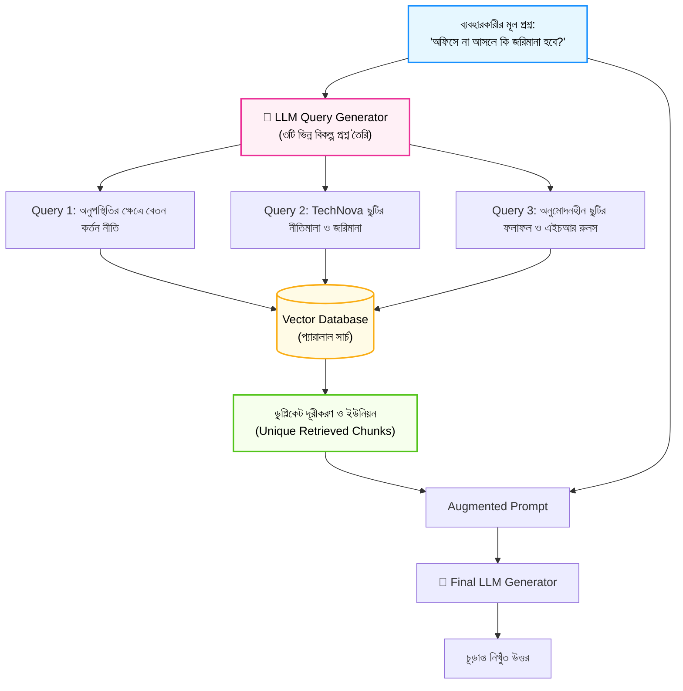

# Multi-Query RAG দিয়ে উন্নত সার্চ (Multi-Query RAG for Better Results)

স্বাগতম আমাদের RAG সিরিজের চতুর্দশ পর্বে! আগের পর্বে আমরা Small-to-Big রিট্রিভাল টেকনিক দেখেছি। 

বাস্তব জীবনে ব্যবহারকারীরা যেভাবে প্রশ্ন করেন, তার ভাষা এবং ডকুমেন্টে যেভাবে উত্তর লেখা থাকে, তার শব্দচয়ন সবসময় এক হয় না। যেমন:
* ব্যবহারকারী প্রশ্ন করলেন: *"অফিসে না আসলে কি টাকা কাটবে?"*
* কিন্তু নথিতে লেখা আছে: *"অননুমোদিত অনুপস্থিতির ক্ষেত্রে বেতন কর্তন সংক্রান্ত বিধিমালা।"*

যদিও ভেক্টর এম্বেডিং অর্থগত মিল খোঁজার চেষ্টা করে, তবুও দূরত্বের সূক্ষ্ম পার্থক্যের কারণে কখনো কখনো সঠিক চ্যাঙ্কটি মিস হয়ে যেতে পারে। 

এই সমস্যার একটি অত্যন্ত কার্যকর ও পরীক্ষিত সমাধান হলো **Multi-Query RAG (বা Query Expansion)**। এই পর্বে আমরা শিখব কীভাবে ব্যবহারকারীর একটিমাত্র প্রশ্নকে একাধিক কোণ থেকে প্রসারিত করে সার্চ এক্যুরেসি বহুগুণ বাড়ানো যায়।

---

## ১. What (Multi-Query RAG কী?)

**Multi-Query RAG** হলো এমন একটি টেকনিক যেখানে ব্যবহারকারীর মূল প্রশ্নটিকে সরাসরি সার্চে না পাঠিয়ে প্রথমে একটি লার্জ ল্যাঙ্গুয়েজ মডেল (LLM)-এর মাধ্যমে বিভিন্ন দৃষ্টিভঙ্গি ও শব্দচয়নে **৩ থেকে ৫টি বিকল্প প্রশ্নে (Alternative Queries)** রূপান্তর করা হয়।

এরপর প্রতিটি বিকল্প প্রশ্নের জন্য ভেক্টর ডাটাবেসে আলাদা আলাদা সার্চ চালানো হয় এবং সবগুলোর রেজাল্ট একত্রিত করে ডুপ্লিকেট অংশগুলো বাদ দিয়ে (Deduplication) চূড়ান্ত কনটেক্সট তৈরি করা হয়।

সহজ কথায়: **এক প্রশ্নের বদলে চারভাবে খোঁজা!**

---

## ২. Why (কেন এটি সার্চের মান আকাশচুম্বী করে?)

1. **রিকল (Recall) বৃদ্ধি পায়:** কোনো নির্দিষ্ট চ্যাঙ্ক যদি ব্যবহারকারীর মূল প্রশ্নে মিসও হয়ে যায়, অন্য কোনো বিকল্প প্রশ্নে সেটি নিশ্চিতভাবেই রিট্রিভ হয়ে যায়।
2. **শব্দচয়নের বৈচিত্র্য সমাধান:** একেক ব্যবহারকারী একেক ভাষায় প্রশ্ন করেন (কেউ লেখেন "ডে-অফ", কেউ "ছুটি", কেউ "অনুপস্থিতি")। মাল্টি-কুয়েরি সব ধরণের সম্ভাব্য সমার্থক শব্দ কাভার করে।
3. **জটিল প্রশ্নের বিভিন্ন দিক উন্মোচন:** একটি বড় প্রশ্নের ভেতরে হয়তো দুটি ভিন্ন দিক থাকে। মাল্টি-কুয়েরি সেগুলোকে ভেঙে আলাদা ছোট প্রশ্নে পরিণত করে সঠিক সব নথি তুলে আনে।

---

## ৩. Analogy (বাস্তব জীবনের উপমা)

Multi-Query RAG বুঝতে সবচেয়ে দারুণ উপমা হলো **"ঘরে হারানো চাবি খোঁজা"**:

* ধরুন আপনার ঘরের চাবিটি হারিয়ে গেছে।
* আপনি একাই কেবল সোফার নিচে খুঁজলেন (Single Query Search)। সেখানে না পেলে আপনি ধরে নিলেন চাবি হারিয়ে গেছে।
* কিন্তু আপনি যদি ঘরের আরও ৩ জন সদস্যকে বলেন: *"একজন টেবিলের ড্রয়ার দেখো, একজন ব্যাগের পকেট দেখো, আর একজন সোফার পেছনের ফাঁক দেখো!"* (Multi-Query Search)।

চারজন মানুষ চার কোণ থেকে একযোগে খুঁজলে চাবিটি খুঁজে পাওয়ার সম্ভাবনা প্রায় শতভাগে পৌঁছে যায়!

---

## ৪. How it works (ধাপে ধাপে কার্যপদ্ধতি)

1. **User Query Input:** ব্যবহারকারী একটি সংক্ষিপ্ত বা অস্পষ্ট প্রশ্ন করেন।
2. **Query Expansion via LLM:** একটি প্রম্পটের মাধ্যমে LLM-কে দিয়ে মূল প্রশ্নের ৩টি বিকল্প প্রশ্ন তৈরি করানো হয়:
   * *মূল প্রশ্ন:* "অফিসে ছুটি নেওয়ার নিয়ম কী?"
   * *বিকল্প ১:* "TechNova Solutions-এ বার্ষিক ক্যাজুয়াল ছুটির সংখ্যা কত?"
   * *বিকল্প ২:* "ছুটির আবেদন করার এইচআর পোর্টাল প্রক্রিয়া কী?"
   * *বিকল্প ৩:* "অসুস্থ হলে ছুটির জন্য কী ডকুমেন্টস জমা দিতে হয়?"
3. **Parallel Vector Retrieval:** সবগুলো প্রশ্ন দিয়ে ভেক্টর স্টোরে প্যারালাল সার্চ চালানো হয়।
4. **Deduplication & Union:** সবগুলো রেজাল্টকে একসাথে করে ডুপ্লিকেট চ্যাঙ্কগুলো মুছে ফেলা হয় (Unique Document Set)।
5. **Generation:** সমৃদ্ধ কনটেক্সটের ওপর ভিত্তি করে LLM পূর্ণাঙ্গ উত্তর প্রদান করে।

---

## ৫. Architecture Diagram (মাল্টি-কুয়েরি পাইপলাইন)



---

## ৬. সম্পূর্ণ ও কার্যকরী Code Example

চলুন পাইথনে একটি সম্পূর্ণ `MultiQueryRAGSystem` তৈরি করি। কোনো পেইড API কি ছাড়াই প্রত্যেকে যেন সরাসরি চালিয়ে শিখতে পারেন, সেজন্য আমরা একটি সিমুলেটেড কুয়েরি এক্সপান্ডার এবং ভেক্টর রিট্রিভার তৈরি করেছি।

```python
import math
from collections import Counter

# ধাপ ১: ইন-মেমোরি ভেক্টর রিট্রিভার
class Document:
    def __init__(self, doc_id, text, metadata=None):
        self.doc_id = doc_id
        self.text = text
        self.metadata = metadata or {}

    def __repr__(self):
        return f"[Doc {self.doc_id}]: {self.text[:50]}..."

# TechNova Solutions-এর পলিসি নথিপত্র
technova_docs = [
    Document("D1", "TechNova Solutions কর্মীগণ বছরে মোট ২০ দিন বেতনসহ ক্যাজুয়াল ছুটি (Casual Leave) পাবেন।", {"topic": "leave"}),
    Document("D2", "অননুমোদিত অনুপস্থিতি বা অনুমতি ছাড়া অফিসে অনুপস্থিত থাকলে সংশ্লিষ্ট দিনের বেতন কর্তন করা হবে।", {"topic": "absence"}),
    Document("D3", "অসুস্থতাজনিত কারণে টানা দুই দিনের বেশি অফিসে অনুপস্থিত থাকলে ডাক্তারের প্রেসক্রিপশন জমা দিতে হবে।", {"topic": "sick_leave"}),
    Document("D4", "অফিস সকাল ৯:৩০ টা থেকে সন্ধ্যা ৬:০০ টা পর্যন্ত। শুক্র ও শনিবার সাপ্তাহিক ছুটি।", {"topic": "timing"})
]

# ধাপ ২: মাল্টি-কুয়েরি RAG সিস্টেম
class MultiQueryRAGSystem:
    def __init__(self, documents):
        self.documents = documents

    def _term_frequency(self, text):
        words = text.lower().replace(",", "").replace(".", "").replace("?", "").split()
        return Counter(words)

    def _cosine_similarity(self, v1, v2):
        common = set(v1.keys()) & set(v2.keys())
        dot = sum(v1[k] * v2[k] for k in common)
        norm1 = math.sqrt(sum(v ** 2 for v in v1.values()))
        norm2 = math.sqrt(sum(v ** 2 for v in v2.values()))
        if not norm1 or not norm2:
            return 0.0
        return dot / (norm1 * norm2)

    # ক. কুয়েরি জেনারেটর (বাস্তব প্রোডাকশনে এখানে GPT-4 বা Claude কল হয়)
    def generate_alternative_queries(self, original_query):
        # সিমুলেটেড এক্সপ্যানশন লজিক
        queries = [original_query]
        if "টাকা" in original_query or "জরিমানা" in original_query or "কাটবে" in original_query:
            queries.append("অননুমোদিত অনুপস্থিতির ক্ষেত্রে বেতন কর্তন নীতিমালা")
            queries.append("অফিসে অনুপস্থিত থাকলে স্যালারি কাটার নিয়ম")
        elif "ছুটি" in original_query:
            queries.append("TechNova ক্যাজুয়াল ও পেইড ছুটির সংখ্যা")
            queries.append("ছুটি নেওয়ার শর্তাবলী ও প্রেসক্রিপশন")
        return queries

    # খ. একক সার্চ
    def _search_single(self, query, top_k=1):
        query_vec = self._term_frequency(query)
        scored = []
        for doc in self.documents:
            doc_vec = self._term_frequency(doc.text)
            sim = self._cosine_similarity(query_vec, doc_vec)
            scored.append((sim, doc))
        scored.sort(key=lambda x: x[0], reverse=True)
        return [doc for score, doc in scored[:top_k] if score > 0.05]

    # গ. মাল্টি-কুয়েরি রিট্রিভাল এক্সিকিউশন
    def multi_query_retrieve(self, user_query):
        print(f"\n👤 মূল প্রশ্ন: '{user_query}'")
        expanded_queries = self.generate_alternative_queries(user_query)
        
        print(f"🔄 প্রসারিত প্রশ্নসমূহ (মোট: {len(expanded_queries)} টি):")
        for idx, q in enumerate(expanded_queries, 1):
            print(f"   {idx}. {q}")

        # প্যারালাল সার্চ এবং ফলাফল একত্রীকরণ
        unique_docs = {}
        for q in expanded_queries:
            matches = self._search_single(q, top_k=1)
            for doc in matches:
                # ডুপ্লিকেট দূর করে ইউনিক রাখা
                if doc.doc_id not in unique_docs:
                    unique_docs[doc.doc_id] = doc

        print(f"\n📦 ডুপ্লিকেট দূর করার পর উদ্ধারকৃত মোট ইউনিক ডকুমেন্ট: {len(unique_docs)} টি")
        for doc_id, doc in unique_docs.items():
            print(f"   • [{doc_id}] {doc.text}")

        return list(unique_docs.values())

# পরীক্ষা চালানো যাক
if __name__ == "__main__":
    system = MultiQueryRAGSystem(documents=technova_docs)

    # এমন একটি প্রশ্ন যেখানে সরাসরি "অননুমোদিত" বা "কর্তন" শব্দটি ব্যবহার করা হয়নি
    user_q = "অফিসে না আসলে কি টাকা কাটবে?"
    final_docs = system.multi_query_retrieve(user_q)
```

### কোড লাইনের সহজ ব্যাখ্যা:
* `generate_alternative_queries()`: ব্যবহারকারীর কথার অন্তর্নিহিত অর্থ বুঝে একাধিক সমার্থক ও প্রাসঙ্গিক সার্চ বাক্য তৈরি করে।
* `unique_docs`: একটি ডিকশনারি বা সেট ব্যবহার করে নিশ্চিত করা হয় যেন একই ডকুমেন্ট একাধিক কুয়েরির মাধ্যমে এলেও ডুপ্লিকেট তৈরি না হয়।
* লক্ষ্য করুন ব্যবহারকারী লিখেছিলেন *"না আসলে কি টাকা কাটবে?"*—আর মাল্টি-কুয়েরির মাধ্যমে সিস্টেম মুহূর্তেই `D2` (বেতন কর্তন) ডকুমেন্টটি নিখুঁতভাবে রিট্রিভ করেছে!

---

## ৭. Output উদাহরণ

কোডটি চালালে নিচের মতো আউটপুট দেখতে পাবেন:

```text
👤 মূল প্রশ্ন: 'অফিসে না আসলে কি টাকা কাটবে?'
🔄 প্রসারিত প্রশ্নসমূহ (মোট: 3 টি):
   1. অফিসে না আসলে কি টাকা কাটবে?
   2. অননুমোদিত অনুপস্থিতির ক্ষেত্রে বেতন কর্তন নীতিমালা
   3. অফিসে অনুপস্থিত থাকলে স্যালারি কাটার নিয়ম

📦 ডুপ্লিকেট দূর করার পর উদ্ধারকৃত মোট ইউনিক ডকুমেন্ট: 1 টি
   • [D2] অননুমোদিত অনুপস্থিতি বা অনুমতি ছাড়া অফিসে অনুপস্থিত থাকলে সংশ্লিষ্ট দিনের বেতন কর্তন করা হবে।
```

---

## ৮. VitePress Callouts

:::tip LangChain MultiQueryRetriever
LangChain-এ এটি একটি রেডিমেড রিট্রিভার হিসেবে পাওয়া যায়:
```python
from langchain.retrievers.multi_query import MultiQueryRetriever
from langchain_openai import ChatOpenAI

retriever = MultiQueryRetriever.from_llm(
    retriever=vectorstore.as_retriever(),
    llm=ChatOpenAI(temperature=0)
)
unique_docs = retriever.invoke("অফিসের ছুটির নিয়ম কী?")
```
:::

:::warning লেটেন্সির ভারসাম্য বজায় রাখা
মাল্টি-কুয়েরিতে একটি অতিরিক্ত LLM কল প্রয়োজন হয়। যদি আপনি প্রতি প্রশ্নে ১০টি বিকল্প তৈরি করান, তবে সার্চের গতি কমে যেতে পারে। সাধারণত **৩ থেকে ৪টি প্রশ্ন তৈরি করাই সবচেয়ে আদর্শ**।
:::

---

## ৯. Common Mistakes (নতুনদের সাধারণ ভুলসমূহ)

1. **Deduplication না করা:** একাধিক প্রশ্ন একই ডকুমেন্টকে তুলে আনে। ডুপ্লিকেট ফিল্টার না করলে প্রম্পটে একই লেখা বারবার চলে যায়।
2. **অতিরিক্ত সৃজনশীল (Temperature > 0.7) প্রম্পট দেওয়া:** কুয়েরি জেনারেটরে টেম্পারেচার বেশি রাখলে মডেল মূল প্রসঙ্গের বাইরে অদ্ভুত প্রশ্ন তৈরি করে ফেলতে পারে।
3. **লেবেল বা ফিল্টার ছাড়া সব কনটেক্সট পাঠানো:** রিট্রিভ করা ডকুমেন্টের তালিকা খুব দীর্ঘ হয়ে গেলে মডেল গুরুত্বপূর্ণ ফ্যাক্ট হারিয়ে ফেলে।

---

## ১০. Practice Exercise

**অনুশীলন:**
`generate_alternative_queries`-এ আরেকটি ক্যাটাগরি যোগ করুন:
যদি প্রশ্নে থাকে *"বাসা থেকে কাজের সুবিধা"*, তবে বিকল্প প্রশ্ন তৈরি হবে:
`"TechNova হোম অফিস ও ইন্টারনেট রিইমবার্সমেন্ট সুবিধা"`।
এবং টেস্ট করুন সিস্টেম কি ইন্টারনেট সংক্রান্ত ডকুমেন্টটি রিট্রিভ করতে পারছে কি না!

---

## ১১. Summary (সারসংক্ষেপ)

* **Multi-Query RAG** ব্যবহারকারীর একক প্রশ্নকে একাধিক দৃষ্টিভঙ্গি ও ভাষায় প্রসারিত করে।
* এটি ভেক্টর সার্চের সংবেদনশীলতা কাটিয়ে **Recall (তথ্যের সামগ্রিক উপস্থিতি)** শতভাগ বাড়িয়ে দেয়।
* বিভিন্ন বিকল্প প্রশ্নে পাওয়া ফলাফল থেকে ডুপ্লিকেট দূর করে একটি সুসংগঠিত ইউনিক কনটেক্সট তৈরি করা হয়।
* বাস্তব জীবনের বিভিন্ন বৈচিত্র্যময় প্রশ্নের উত্তর দিতে এটি একটি অত্যন্ত জনপ্রিয় টেকনিক।

---

## ১২. পরবর্তী ধাপ

পরের পর্বে আমরা শিখব কীভাবে একাধিক ভিন্ন ভিন্ন সার্চ ফলাফলের র‍্যাঙ্ক সুন্দরভাবে মিশ্রিত করে সেরা ডকুমেন্টকে এক নম্বরে আনতে হয়—**Reciprocal Rank Fusion (RRF)**!
