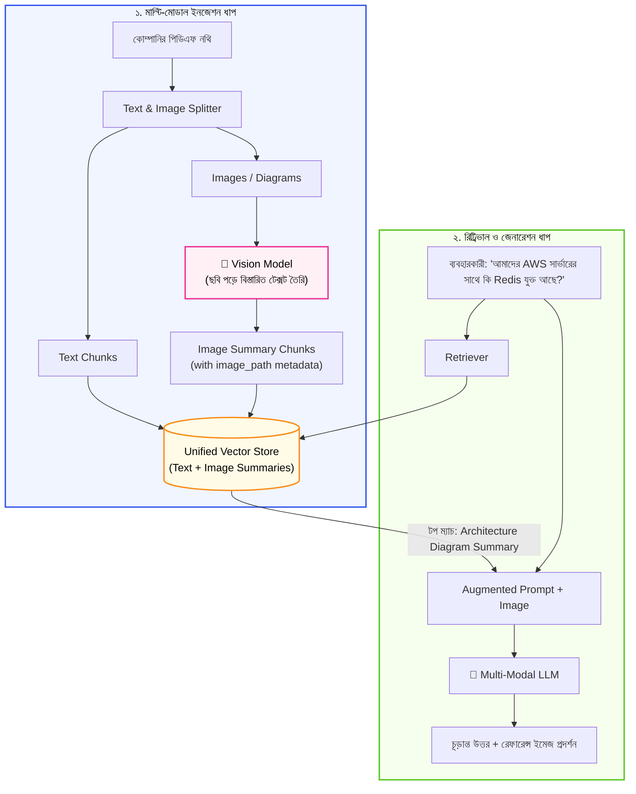

# Multi-Modal RAG (ইমেজ এবং ডকুমেন্টস) (Multi-Modal RAG Explained)

স্বাগতম আমাদের RAG সিরিজের দ্বাদশ পর্বে! এটি এই টিউটোরিয়াল সিরিজের সবচেয়ে রোমাঞ্চকর এবং গুরুত্বপূর্ণ অধ্যায়গুলোর একটি।

বাস্তব দুনিয়ায় আপনার কোম্পানির প্রোডাক্ট ম্যানুয়াল, বার্ষিক আর্থিক প্রতিবেদন বা ক্লাউড ইনফ্রাস্ট্রাকচার গাইডে শুধু প্লেইন টেক্সট থাকে না। সেখানে থাকে প্রচুর **আর্কিটেকচার ডায়াগ্রাম, পাই-চার্ট, গ্রাফ এবং স্ক্রিনশট**। সাধারণ টেক্সট-অনলি RAG এসব ছবির সামনে সম্পূর্ণ অন্ধ!

এই পর্বে আমরা শিখব কীভাবে টেক্সট এবং ইমেজ—উভয় মাধ্যমকে সমন্বয় করে একটি আধুনিক **Multi-Modal RAG** সিস্টেম তৈরি করতে হয়।

---

## ১. What (Multi-Modal RAG কী?)

**Multi-Modal RAG** হলো এমন একটি আধুনিক RAG আর্কিটেকচার যা শুধুমাত্র লিখিত টেক্সট নয়, বরং নথিপত্রের ভেতরে থাকা **ছবি, চার্ট, ইনফোগ্রাফিকস এবং ডায়াগ্রাম** থেকে তথ্য উদ্ধার করতে এবং উত্তর জেনারেট করতে সক্ষম।

সহজ কথায়, এখানে এআই শুধুমাত্র পড়তে পারে না, বরং ছবির দিকে "তাকিয়ে" ছবির ভেতরের তথ্য নিখুঁতভাবে বিশ্লেষণ করতে পারে।

---

## ২. Why (কেন মাল্টি-মোডাল RAG এত দরকারি?)

1. **ডকুমেন্টের অর্ধেকের বেশি তথ্য ছবিতে থাকে:** ফাইন্যান্সিয়াল রিপোর্টে গত বছরের লাভ-ক্ষতির হিসাব হয়তো একটি বার-চার্টে (Bar Chart) দেওয়া থাকে। টেক্সট রিট্রিভার সেই সংখ্যা কখনো খুঁজে পাবে না।
2. **আর্কিটেকচার ও ফ্লো ডায়াগ্রাম:** ক্লাউড সার্ভারের নেটওয়ার্ক ডিজাইন বা কোম্পানির অর্গ-চার্ট (Org Chart) সবসময় ছবির আকারে থাকে।
3. **হ্যালুসিনেশন রোধ:** ব্যবহারকারী যখন কোনো ডায়াগ্রাম দেখে প্রশ্ন করেন (যেমন: *"ডাটাবেসটি কি সরাসরি ইন্টারনেটের সাথে যুক্ত?"*), মাল্টি-মোডাল মডেল সরাসরি ডায়াগ্রামের তীরচিহ্ন দেখে সত্য উত্তর দিতে পারে।

---

## ৩. Analogy (বাস্তব জীবনের উপমা)

মাল্টি-মোডাল RAG বুঝতে সবচেয়ে দারুণ উপমা হলো **"একজন বিশেষজ্ঞ চিকিৎসক ও এক্স-রে রিপোর্ট"**:

* একজন অন্ধ চিকিৎসক শুধুমাত্র রোগীর মুখের কথা এবং লিখিত টেস্ট রিপোর্ট শুনতে পারবেন।
* কিন্তু একজন বিশেষজ্ঞ চিকিৎসক লিখিত প্রেসক্রিপশন পড়ার পাশাপাশি চোখের সামনে রোগীর **বুকের এক্স-রে বা এমআরআই ফিল্ম (Image)** আলোর সামনে ঝুলিয়ে সরাসরি ফুসফুসের প্যাচ দেখে নিশ্চিত ডায়াগনসিস দেন!

মাল্টি-মোডাল RAG হলো আপনার এআই-এর সেই চোখ, যা টেক্সটের পাশাপাশি ভিজ্যুয়াল ডেটাও দেখতে পায়।

---

## ৪. How it works (প্রধান আর্কিটেকচারাল কৌশলসমূহ)

বাস্তব প্রজেক্টে Multi-Modal RAG মূলত ৩টি ভিন্ন উপায়ে বাস্তবায়ন করা যায়:

### পদ্ধতি ১: Image Summarization with Vision LLM (সবচেয়ে জনপ্রিয় ও নির্ভরযোগ্য)
1. ডকুমেন্ট থেকে ছবিগুলোকে আলাদা করা হয়।
2. একটি Vision Model (যেমন: GPT-4o, Claude 3.5 Sonnet, বা Gemini Flash)-কে ছবিটি দিয়ে বলা হয়: *"এই চার্ট বা ডায়াগ্রামের ভেতরের প্রতিটি তথ্য বিস্তারিত টেক্সট হিসেবে লিখে দাও।"*
3. প্রাপ্ত টেক্সট ডেসক্রিপশনটিকে সাধারণ চ্যাঙ্ক হিসেবে ভেক্টর ডাটাবেসে সেভ করা হয় (মেটাডেটায় আসল ইমেজের পাথ রেখে)।
4. সার্চের সময় ব্যবহারকারী সাধারণ প্রশ্ন করলেই ওই টেক্সট রিট্রিভ হয় এবং সাথে আসল ছবিটিও ব্যবহারকারীকে দেখানো যায়!

### পদ্ধতি ২: Multi-Modal Embeddings (CLIP / ColPali)
* এমন বিশেষ এম্বেডিং মডেল ব্যবহার করা হয় যা ইমেজ এবং টেক্সট উভয়কেই একই ভেক্টর স্পেসে ম্যাপ করতে পারে। ফলে টেক্সট প্রশ্ন দিয়ে সরাসরি ছবি সার্চ করা যায়।

---

## ৫. Architecture Diagram (মাল্টি-মোডাল পাইপলাইন)



---

## ৬. সম্পূর্ণ ও কার্যকরী Code Example

চলুন পাইথনে একটি স্বয়ংসম্পূর্ণ `MultiModalRAGPipeline` তৈরি করি। পদ্ধতি ১ (Image Summarization Pattern) অনুসরণ করে আমরা টেক্সট এবং ডায়াগ্রাম উভয়ের তথ্য একই পাইপলাইনে সার্চ করব।

```python
import math
from collections import Counter

# ধাপ ১: মাল্টি-মোডাল ডকুমেন্ট অবজেক্ট
class MultiModalDocument:
    def __init__(self, content, doc_type="text", image_path=None, metadata=None):
        self.content = content          # টেক্সট অথবা ইমেজের তৈরি করা বিস্তারিত ডেসক্রিপশন
        self.doc_type = doc_type        # "text" অথবা "image"
        self.image_path = image_path    # আসল ছবির লোকেশন
        self.metadata = metadata or {}

    def __repr__(self):
        return f"[{self.doc_type.upper()}] {self.content[:50]}... (Image: {self.image_path})"

# ধাপ ২: TechNova-র ডকুমেন্টস প্রস্তুতকরণ (টেক্সট + ডায়াগ্রাম সারসংক্ষেপ)
technova_knowledge_base = [
    # লিখিত টেক্সট পলিসি
    MultiModalDocument(
        content="TechNova Solutions কর্মীগণ বছরে মোট ২০ দিন ক্যাজুয়াল পেইড ছুটি পাবেন।",
        doc_type="text",
        metadata={"source": "hr_policy.txt", "section": "Leave"}
    ),
    # একটি আর্কিটেকচার ডায়াগ্রাম যা ভিশন মডেল দিয়ে টেক্সটে রূপান্তর করা হয়েছে
    MultiModalDocument(
        content="TechNova Cloud Architecture 2026 Diagram: ব্যবহারকারীর ট্রাফিক প্রথমে Cloudflare CDN-এ আসে, সেখান থেকে AWS Application Load Balancer (ALB)-এ যায়। মূল ব্যাকএন্ড সার্ভার FastAPI তে তৈরি এবং ডাটা ক্যাশিংয়ের জন্য একটি ডেডিকেটেড Redis ক্লাস্টার যুক্ত আছে। মূল ডাটাবেস হলো PostgreSQL。",
        doc_type="image",
        image_path="/assets/diagrams/cloud_architecture_2026.png",
        metadata={"source": "system_design.pdf", "figure": "Figure 3.1"}
    ),
    # একটি অর্গানাইজেশন চার্ট ইমেজ
    MultiModalDocument(
        content="TechNova Org Chart Diagram: ইঞ্জিনিয়ারিং বিভাগের প্রধান হিসেবে আছেন VP of Engineering। তার অধীনে ৩টি টিম রয়েছে: AI/ML টিম, ক্লাউড ইনফ্রা টিম, এবং ওয়েব প্ল্যাটফর্ম টিম。",
        doc_type="image",
        image_path="/assets/diagrams/org_chart.png",
        metadata={"source": "company_overview.pdf", "figure": "Figure 1.2"}
    )
]

# ধাপ ৩: মাল্টি-মোডাল RAG ইঞ্জিন
class MultiModalRAGApp:
    def __init__(self, documents):
        self.documents = documents

    def _get_tf_vector(self, text):
        words = text.lower().replace(",", "").replace(".", "").replace(":", "").replace("?", "").split()
        return Counter(words)

    def _cosine_similarity(self, v1, v2):
        common = set(v1.keys()) & set(v2.keys())
        dot = sum(v1[k] * v2[k] for k in common)
        norm1 = math.sqrt(sum(v ** 2 for v in v1.values()))
        norm2 = math.sqrt(sum(v ** 2 for v in v2.values()))
        if not norm1 or not norm2:
            return 0.0
        return dot / (norm1 * norm2)

    def search_and_answer(self, query):
        print(f"\n💬 ব্যবহারকারীর প্রশ্ন: '{query}'")
        query_vec = self._get_tf_vector(query)
        
        scored = []
        for doc in self.documents:
            doc_vec = self._get_tf_vector(doc.content)
            score = self._cosine_similarity(query_vec, doc_vec)
            scored.append((score, doc))
        
        scored.sort(key=lambda x: x[0], reverse=True)
        top_match = scored[0][1]

        # রেসপন্স জেনারেশন
        if top_match.doc_type == "image":
            answer = (
                f"📊 [ভিজ্যুয়াল ডায়াগ্রাম থেকে প্রাপ্ত তথ্য]:\n"
                f"{top_match.content}\n"
                f"🖼️ রেফারেন্স ইমেজ ফাইল: {top_match.image_path} ({top_match.metadata.get('figure', '')})"
            )
        else:
            answer = (
                f"📄 [টেক্সট ডকুমেন্ট থেকে প্রাপ্ত তথ্য]:\n"
                f"{top_match.content}\n"
                f"🔖 রেফারেন্স সোর্স: {top_match.metadata.get('source', '')}"
            )
        return answer

# পরীক্ষা চালানোর অংশ
if __name__ == "__main__":
    app = MultiModalRAGApp(documents=technova_knowledge_base)

    # টেস্ট ১: ডায়াগ্রাম সংক্রান্ত প্রশ্ন (যা সাধারণ টেক্সটে ছিল না!)
    q1 = "আমাদের ক্লাউড সার্ভারে ক্যাশিংয়ের জন্য কি Redis ব্যবহার করা হয়েছে?"
    print(app.search_and_answer(q1))

    # টেস্ট ২: সাধারণ টেক্সট পলিসি সংক্রান্ত প্রশ্ন
    q2 = "বছরে ক্যাজুয়াল ছুটির সংখ্যা কত?"
    print(app.search_and_answer(q2))
```

### কোড লাইনের সহজ ব্যাখ্যা:
* `MultiModalDocument`: টেক্সট এবং ইমেজ উভয়ের তথ্য মেটাডেটা সহ সংরক্ষণ করার উপযুক্ত ক্লাস।
* `image_path`: ছবির আসল লোকেশন ধরে রাখে, যাতে উত্তরের সাথে ব্যবহারকারীকে চিত্রটি দেখানো যায়।
* লক্ষ্য করুন কীভাবে প্রথম প্রশ্নে ইমেজ ডায়াগ্রামের ভেতরের Redis ও FastAPI সংক্রান্ত তথ্য নিখুঁতভাবে রিট্রিভ হয়েছে!

---

## ৭. Output উদাহরণ

কোডটি রান করলে নিচের মতো আউটপুট দেখতে পাবেন:

```text
💬 ব্যবহারকারীর প্রশ্ন: 'আমাদের ক্লাউড সার্ভারে ক্যাশিংয়ের জন্য কি Redis ব্যবহার করা হয়েছে?'
📊 [ভিজ্যুয়াল ডায়াগ্রাম থেকে প্রাপ্ত তথ্য]:
TechNova Cloud Architecture 2026 Diagram: ব্যবহারকারীর ট্রাফিক প্রথমে Cloudflare CDN-এ আসে, সেখান থেকে AWS Application Load Balancer (ALB)-এ যায়। মূল ব্যাকএন্ড সার্ভার FastAPI তে তৈরি এবং ডাটা ক্যাশিংয়ের জন্য একটি ডেডিকেটেড Redis ক্লাস্টার যুক্ত আছে। মূল ডাটাবেস হলো PostgreSQL।
🖼️ রেফারেন্স ইমেজ ফাইল: /assets/diagrams/cloud_architecture_2026.png (Figure 3.1)

💬 ব্যবহারকারীর প্রশ্ন: 'বছরে ক্যাজুয়াল ছুটির সংখ্যা কত?'
📄 [টেক্সট ডকুমেন্ট থেকে প্রাপ্ত তথ্য]:
TechNova Solutions কর্মীগণ বছরে মোট ২০ দিন ক্যাজুয়াল পেইড ছুটি পাবেন।
🔖 রেফারেন্স সোর্স: hr_policy.txt
```

---

## ৮. VitePress Callouts

:::tip বাস্তব প্রজেক্টের সেরা পদ্ধতি (Best Practice)
প্রোডাকশনে Multi-Modal RAG করার সময় সরাসরি Raw Image ভেক্টরাইজ করার চেয়ে **Vision LLM দিয়ে ছবির পুঙ্খানুপুঙ্খ বিবরণ (Image Caption/Summary) তৈরি করে টেক্সট হিসেবে সেভ করা** অনেক বেশি সাশ্রয়ী এবং নিখুঁত ফলাফল দেয়।
:::

:::warning Base64 ইমেজ হ্যান্ডলিং সতর্কতা
LLM-এর কাছে সরাসরি ইমেজ পাঠানোর সময় ইমেজগুলোকে ছোট রেজোলিউশনে কম্প্রেস করে নিন। অরিজিনাল ৪কে (4K) ইমেজ Base64 ফরম্যাটে পাঠালে প্রম্পটের টোকেন সংখ্যা অস্বাভাবিক বৃদ্ধি পায় এবং লেটেন্সি বাড়ে।
:::

---

## ৯. Common Mistakes (নতুনদের সাধারণ ভুলসমূহ)

1. **OCR এবং Vision Model গুলিয়ে ফেলা:** সাধারণ OCR শুধু ছবির ভেতরের লেখা পড়তে পারে, কিন্তু চার্টের ট্রেন্ড বা ডায়াগ্রামের তীরচিহ্নের অর্থ বুঝতে পারে না। এজন্য ভিশন মডেল দরকার।
2. **ইমেজের মেটাডেটা হারিয়ে ফেলা:** ডেসক্রিপশন তৈরি করার পর ছবির মূল ফাইল লোকেশন মুছে ফেলা, যার ফলে ব্যবহারকারীকে চ্যাটবক্সে ছবিটি দেখানো যায় না।
3. **টেবিল ডেটাকে ইমেজ ভাবা:** ডকুমেন্টে থাকা টেবিলগুলোকে ইমেজ হিসেবে রাখার চেয়ে Markdown টেবিল হিসেবে টেক্সট রাখা বেশি কার্যকর।

---

## ১০. Practice Exercise

**অনুশীলন:**
`technova_knowledge_base`-এ কোম্পানির গত ৩ মাসের সেলস গ্রাফের একটি নতুন ইমেজ ডেসক্রিপশন যোগ করুন:
`"TechNova Q1 Sales Chart: জানুয়ারিতে বিক্রি ছিল ৫০ লাখ, ফেব্রুয়ারিতে ৬০ লাখ, এবং মার্চে ৮০ লাখ টাকা।" (image_path: 'q1_sales.png')`
এবং প্রশ্ন করুন: *"মার্চ মাসে কোম্পানির বিক্রি কত ছিল?"*। দেখুন আপনার সিস্টেম কি সঠিক গ্রাফের রেফারেন্স দেখাচ্ছে?

---

## ১১. Summary (সারসংক্ষেপ)

* **Multi-Modal RAG** টেক্সট এবং ভিজ্যুয়াল ডেটা (চার্ট, ডায়াগ্রাম) উভয় মাধ্যমকে একীভূত করে।
* Vision LLM ব্যবহার করে ছবির পুঙ্খানুপুঙ্খ বিবরণ তৈরি করা সবচেয়ে টেকসই কৌশল।
* ব্যবহারকারীর প্রশ্নের বিপরীতে এটি টেক্সট উত্তরের সাথে সাথে রেফারেন্স ইমেজ প্রদর্শনে সক্ষম।
* টেকনিক্যাল আর্কিটেকচার, ম্যানুয়াল ও ফাইন্যান্সিয়াল নথির জন্য এটি অপরিহার্য।

---

## ১২. পরবর্তী ধাপ

পরের পর্বে আমরা শিখব বাস্তব প্রোডাকশনে সার্চ কোয়ালিটিকে আরও বহুগুণ বাড়ানোর পদ্ধতি—**Advanced Document Retrieval Techniques**!
