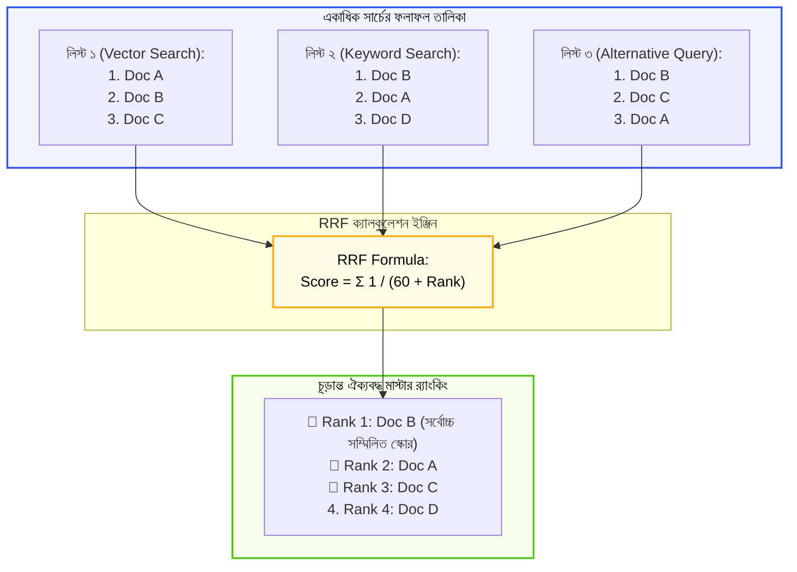

# Reciprocal Rank Fusion (RRF) পদ্ধতি (Reciprocal Rank Fusion Explained)

স্বাগতম আমাদের RAG সিরিজের পঞ্চদশ পর্বে! আগের পর্বে আমরা Multi-Query RAG দেখেছি, যেখানে একটি প্রশ্নের বদলে ৩-৪টি ভিন্ন সার্চ চালিয়ে অনেকগুলো ফলাফল পাওয়া যায়।

কিন্তু এখানে একটি নতুন চ্যালেঞ্জ তৈরি হয়:
* কুয়েরি ১-এর সার্চ রেজাল্টে একটি ডকুমেন্ট আসলো **১ নম্বরে**।
* কুয়েরি ২-এর সার্চে সেটি আসলো **৪ নম্বরে**।
* কুয়েরি ৩-এর সার্চে সেটি আসলো **২ নম্বরে**।

বিভিন্ন সার্চ তালিকার এই এলোমেলো ফলাফলগুলোকে আমরা কীভাবে বৈজ্ঞানিক উপায়ে একত্রিত করে একটি **একক, সর্বশ্রেষ্ঠ ও সবচেয়ে ন্যায্য র‍্যাংকিং** তৈরি করব? এই গাণিতিক ম্যাজিকের নামই হলো **Reciprocal Rank Fusion (RRF)**!

---

## ১. What (Reciprocal Rank Fusion কী?)

**Reciprocal Rank Fusion (RRF)** হলো একাধিক ভিন্ন ভিন্ন সার্চ অ্যালগরিদম বা কুয়েরি থেকে প্রাপ্ত র‍্যাঙ্কড তালিকাগুলোকে (Ranked Lists) একত্রিত করে একটি একক ও সমন্বিত মাস্টার র‍্যাংকিং তৈরি করার সবচেয়ে জনপ্রিয় অ্যালগরিদম।

এর মূল সৌন্দর্য হলো: এটি সার্চের জটিল স্কোর (যেমন: ০.৮৫২ বনাম ১২.৪) মেলানোর চেষ্টা করে না; বরং ডকুমেন্টটি প্রতিটি তালিকায় **কত নম্বরে (র‍্যাঙ্ক)** ছিল, কেবল সেই অবস্থানের ওপর ভিত্তি করে পয়েন্ট প্রদান করে।

---

## ২. Why (কেন সরাসরি স্কোর যোগ না করে RRF ব্যবহার করব?)

অনেকের মনে হতে পারে: *"বিভিন্ন সার্চের সিমিলারিটি স্কোরগুলোকে সাধারণ যোগ বা গড় করে দিলেই তো হতো!"* 

বাস্তবে এটি মারাত্মক ভুল, কারণ:
1. **ভিন্ন স্কেলের স্কোর (Different Score Scales):** ভেক্টর সার্চের স্কোর থাকে `-১ থেকে +১` বা `০ থেকে ১`-এর মধ্যে। কিন্তু কিওয়ার্ড সার্চের (যেমন BM25) স্কোর হতে পারে `৫, ১৫ বা ৫০`! এগুলো সরাসরি যোগ করলে তুলনা সম্পূর্ণ অন্যায্য হয়ে যায়।
2. **ক্যালিব্রেশনের ঝামেলা নেই:** RRF-এ কোনো জটিল স্কোর নরমালাইজেশন বা ওয়েট (Weight) টিউন করার প্রয়োজন হয় না।
3. **উচ্চ সহনশীলতা (Robustness):** গবেষণায় প্রমাণিত হয়েছে যে একাধিক সার্চ ফলাফলের সংমিশ্রণে জটিল গণিতের চেয়ে RRF সবচেয়ে নির্ভরযোগ্য ফলাফল দেয়।

---

## ৩. Analogy (বাস্তব জীবনের উপমা)

RRF বুঝতে সবচেয়ে চমৎকার উপমা হলো **"একটি রান্নার প্রতিযোগিতা ও তিনজন বিচারক"**:

* ধরুন ৩ জন বিচারক সেরা রাঁধুনি বাছাই করছেন:
  * বিচারক ক নম্বর দেন ১০০-এর স্কেলে।
  * বিচারক খ নম্বর দেন ১০-এর স্কেলে।
  * বিচারক গ নম্বর দেন বর্ণমালায় (A+, B, C)।
* আপনি কি তাদের স্কোরগুলো সরাসরি যোগ করতে পারবেন? কখনই না!
* কিন্তু আপনি যদি দেখেন ৩ জনের তালিকাতেই প্রতিযোগী **"আরিফ"** ১ম বা ২য় স্থান পেয়েছেন, তবে আপনি নিশ্চিতভাবেই বুঝতে পারবেন যে আরিফই প্রতিযোগিতার আসল চ্যাম্পিয়ন!

RRF ঠিক এই বুদ্ধিমত্তা প্রয়োগ করে প্রতিটি তালিকার র‍্যাঙ্ক থেকে চূড়ান্ত চ্যাম্পিয়ন নির্ধারণ করে।

---

## ৪. How it works (গাণিতিক সূত্র ও ধাপসমূহ)

RRF-এর আন্তর্জাতিক মানসম্পন্ন গাণিতিক সূত্রটি হলো:

$$\text{RRF Score}(d) = \sum_{m \in M} \frac{1}{k + r_m(d)}$$

এখানে:
* $d$: নির্দিষ্ট কোনো একটি ডকুমেন্ট।
* $M$: সমস্ত সার্চ তালিকার সেট (যেমন ৩টি কুয়েরির ৩টি রেজাল্ট লিস্ট)।
* $r_m(d)$: $m$ নম্বর তালিকায় ডকুমেন্ট $d$-এর র‍্যাঙ্ক বা অবস্থান ($1, 2, 3 \dots$)। ডকুমেন্টটি কোনো তালিকায় না থাকলে তার স্কোর ০ ধরা হয়।
* $k$: একটি ধ্রুবক বা কনস্ট্যান্ট (ইন্ডাস্ট্রি স্ট্যান্ডার্ড মান হলো **$k = 60$**)। এটি যোগ করা হয় যেন ১ নম্বর র‍্যাঙ্কের ডকুমেন্ট অতিরিক্ত সুবিধা পেয়ে বাকিদের দমন না করে।

---

## ৫. Architecture Diagram (ফিউশন পাইপলাইন)



---

## ৬. সম্পূর্ণ ও কার্যকরী Code Example

চলুন পাইথনে স্ক্র্যাচ থেকে একটি পূর্ণাঙ্গ Reciprocal Rank Fusion অ্যালগরিদম বাস্তবায়ন করি এবং TechNova Solutions-এর পলিসি নথিতে এর কার্যকারিতা দেখি।

```python
# TechNova Solutions-এর ডকুমেন্টস
documents = {
    "D1": "TechNova কর্মীগণ বছরে মোট ২০ দিন ক্যাজুয়াল ছুটি (Casual Leave) পাবেন।",
    "D2": "অসুস্থতাজনিত কারণে টানা ২ দিনের বেশি অনুপস্থিতিতে ডাক্তারের প্রেসক্রিপশন জমা দিতে হবে।",
    "D3": "অননুমোদিত অনুপস্থিতির ক্ষেত্রে সংশ্লিষ্ট দিনের বেতন কর্তন করা হবে।",
    "D4": "বাসা থেকে কাজের সুবিধার জন্য প্রতি মাসে ১,৫০০ টাকা ইন্টারনেট রিইমবার্সমেন্ট পাওয়া যাবে।"
}

# ৩টি ভিন্ন সার্চ অ্যালগরিদম বা কুয়েরি থেকে পাওয়া আলাদা আলাদা র‍্যাঙ্কড তালিকা
# (ডকুমেন্ট আইডিগুলো তাদের পাওয়ার ক্রমানুসারে সাজানো)
search_results_query1 = ["D1", "D2", "D3"]       # ছুটির সাধারণ কুয়েরি
search_results_query2 = ["D2", "D1", "D4"]       # অসুস্থতার কুয়েরি
search_results_query3 = ["D2", "D3", "D1"]       # ডাক্তারের প্রেসক্রিপশন কুয়েরি

# ধাপ ১: Reciprocal Rank Fusion ফাংশন
def compute_rrf(ranked_lists, k=60):
    rrf_scores = {}  # {doc_id: total_score}

    print(f"⚙️ RRF ক্যালকুলেশন শুরু (Smoothing Constant k = {k}):\n")

    for list_idx, doc_list in enumerate(ranked_lists, start=1):
        for rank, doc_id in enumerate(doc_list, start=1):
            # RRF স্কোর সূত্র: 1 / (k + rank)
            score_contribution = 1.0 / (k + rank)
            
            if doc_id not in rrf_scores:
                rrf_scores[doc_id] = 0.0
            rrf_scores[doc_id] += score_contribution

            print(f"লিস্ট {list_idx} -> [র‍্যাঙ্ক {rank}] {doc_id}: যোগ হলো {score_contribution:.5f}")

    # স্কোরের ভিত্তিতে সর্বোচ্চ থেকে সর্বনিম্ন ক্রমানুসারে সাজানো
    sorted_docs = sorted(rrf_scores.items(), key=lambda item: item[1], reverse=True)
    return sorted_docs

# পরীক্ষা চালানো যাক
if __name__ == "__main__":
    all_search_lists = [search_results_query1, search_results_query2, search_results_query3]

    final_ranked_results = compute_rrf(all_search_lists, k=60)

    print("\n" + "=" * 65)
    print("🏆 [চূড়ান্ত RRF সমন্বিত মাস্টার র‍্যাংকিং]:")
    print("=" * 65)

    for position, (doc_id, total_score) in enumerate(final_ranked_results, start=1):
        content = documents[doc_id]
        print(f"\n🥇 অবস্থান {position} | RRF Score: {total_score:.5f} | ID: {doc_id}")
        print(f"   নথি: {content}")
```

### কোড লাইনের সহজ ব্যাখ্যা:
* `enumerate(doc_list, start=1)`: প্রতিটি লিস্টে ডকুমেন্টের অবস্থান ১-ইনডেক্সড র‍্যাঙ্ক হিসেবে চিহ্নিত করে।
* `1.0 / (k + rank)`: র‍্যাঙ্ক যত ভালো (যেমন ১ নম্বর), ভগ্নাংশটির মান তত বড় হবে।
* `rrf_scores[doc_id] += score_contribution`: সব তালিকার প্রাপ্ত পয়েন্টগুলো একত্র করে যোগ করা হয়।
* লক্ষ্য করুন `D2` ডকুমেন্টটি ৩টি তালিকার দুটিতে ১ নম্বর এবং একটিতে ২ নম্বর অবস্থানে থাকায় সামগ্রিকভাবে শীর্ষ চ্যাম্পিয়ন নির্বাচিত হয়েছে!

---

## ৭. Output উদাহরণ

কোডটি রান করলে নিচের মতো স্পষ্ট ও সুশৃঙ্খল আউটপুট পাবেন:

```text
⚙️ RRF ক্যালকুলেশন শুরু (Smoothing Constant k = 60):

লিস্ট 1 -> [র‍্যাঙ্ক 1] D1: যোগ হলো 0.01639
লিস্ট 1 -> [র‍্যাঙ্ক 2] D2: যোগ হলো 0.01613
লিস্ট 1 -> [র‍্যাঙ্ক 3] D3: যোগ হলো 0.01587
লিস্ট 2 -> [র‍্যাঙ্ক 1] D2: যোগ হলো 0.01639
লিস্ট 2 -> [র‍্যাঙ্ক 2] D1: যোগ হলো 0.01613
লিস্ট 2 -> [র‍্যাঙ্ক 3] D4: যোগ হলো 0.01587
লিস্ট 3 -> [র‍্যাঙ্ক 1] D2: যোগ হলো 0.01639
লিস্ট 3 -> [র‍্যাঙ্ক 2] D3: যোগ হলো 0.01613
লিস্ট 3 -> [র‍্যাঙ্ক 3] D1: যোগ হলো 0.01587

=================================================================
🏆 [চূড়ান্ত RRF সমন্বিত মাস্টার র‍্যাংকিং]:
=================================================================

🥇 অবস্থান 1 | RRF Score: 0.04891 | ID: D2
   নথি: অসুস্থতাজনিত কারণে টানা ২ দিনের বেশি অনুপস্থিতিতে ডাক্তারের প্রেসক্রিপশন জমা দিতে হবে।

🥇 অবস্থান 2 | RRF Score: 0.04839 | ID: D1
   নথি: TechNova কর্মীগণ বছরে মোট ২০ দিন ক্যাজুয়াল ছুটি (Casual Leave) পাবেন।

🥇 অবস্থান 3 | RRF Score: 0.03200 | ID: D3
   নথি: অননুমোদিত অনুপস্থিতির ক্ষেত্রে সংশ্লিষ্ট দিনের বেতন কর্তন করা হবে।

🥇 অবস্থান 4 | RRF Score: 0.01587 | ID: D4
   নথি: বাসা থেকে কাজের সুবিধার জন্য প্রতি মাসে ১,৫০০ টাকা ইন্টারনেট রিইমবার্সমেন্ট পাওয়া যাবে।
```

---

## ৮. VitePress Callouts

:::tip কনস্ট্যান্ট $k=60$ কেন রাখা হয়?
মূল RRF গবেষণাপত্রে (Cormack et al.) প্রমাণিত হয়েছে যে **$k = 60$** রাখলে কোনো তালিকার ১ নম্বর আইটেম অন্য তালিকার আইটেমগুলোর ওপর অসম আধিপত্য বিস্তার করতে পারে না। ফলে একাধিক তালিকার মধ্যে একটি সুষ্ঠু ভারসাম্য তৈরি হয়।
:::

:::warning স্কোর যোগ করার মারাত্মক ভুল
কখনোই ভেক্টর সিমিলারিটি স্কোর এবং BM25 স্কোর সাধারণ যোগফল করবেন না। সবসময় তাদের র‍্যাঙ্ক অবস্থানকে এই RRF সূত্রের মাধ্যমে ফিউজ করুন।
:::

---

## ৯. Common Mistakes (নতুনদের সাধারণ ভুলসমূহ)

1. **০-ইনডেক্সিং দিয়ে ভাগ করা:** র‍্যাঙ্ক ১ থেকে শুরু না করে ০ থেকে শুরু করলে $k=0$ থাকলে ইনফিনিটি এরর হতে পারে। সর্বদা `start=1` ব্যবহার করুন।
2. **অনুপস্থিত ডকুমেন্টে পেনাল্টি দেওয়া:** একটি ডকুমেন্ট সব লিস্টে নাও থাকতে পারে; যেটিতে নেই সেটির জন্য সাধারণ ০ যোগ করাই যথেষ্ট।
3. **ছোট $k$ ব্যবহার করা:** $k$ এর মান ১ বা ২ দিলে প্রথম র‍্যাঙ্কের ডকুমেন্টটি এত বেশি নম্বর পেয়ে যায় যে অন্য কোনো ডকুমেন্ট তাকে আর টপকাতে পারে না।

---

## ১০. Practice Exercise

**অনুশীলন:**
`all_search_lists`-এ আরেকটি নতুন সার্চ রেজাল্ট যোগ করুন:
`search_results_query4 = ["D4", "D1"]`
এবং দেখুন এবার `D1` এবং `D4`-এর অবস্থানে কী ধরনের পরিবর্তন ঘটে!

---

## ১১. Summary (সারসংক্ষেপ)

* **Reciprocal Rank Fusion (RRF)** একাধিক সার্চ ফলাফলকে সুন্দরভাবে একত্রিত করার বিশ্বমানের র‍্যাংকিং পদ্ধতি।
* এটি স্কোরের মানের ওপর নির্ভর না করে তালিকার **র‍্যাঙ্ক পজিশনের** ওপর ভিত্তি করে স্কোর প্রদান করে।
* এটি বিভিন্ন স্কেলের সার্চ সিস্টেমকে (যেমন ভেক্টর ও কিওয়ার্ড সার্চ) সফলভাবে মিশ্রিত করে।
* স্ট্যান্ডার্ড সূত্র: $\frac{1}{60 + \text{Rank}}$।

---

## ১২. পরবর্তী ধাপ

পরের পর্বে আমরা এই RRF-কে কাজে লাগিয়ে RAG-এর সবচেয়ে শক্তিশালী সার্চ টেকনিক তৈরি করব—**Hybrid Search (Vector Search + Keyword Search-এর মেলবন্ধন)**!
