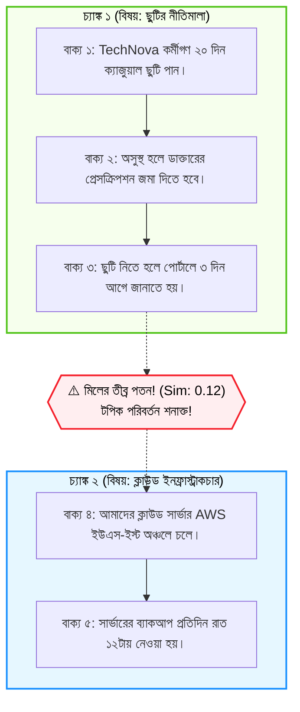

# Semantic Chunking পদ্ধতি (Semantic Chunking for Improved RAG)

স্বাগতম আমাদের RAG সিরিজের দশম পর্বে! আগের পর্বে আমরা ক্যারেক্টার এবং রিকার্সিভ স্প্লিটার নিয়ে বিস্তারিত আলোচনা করেছি। 

কিন্তু লক্ষ্য করুন—এতক্ষণ আমরা যে পদ্ধতিগুলো দেখেছি, তাদের কোনোটাই কিন্তু লেখার **"অর্থ" (Meaning)** বুঝে টেক্সট কাটছিল না। তারা কেবল ক্যারেক্টার বা শব্দ গুনে কাটছিল। যদি এমন হয় যে একটি প্যারাগ্রাফের ঠিক মাঝখানে লেখক হঠাৎ সম্পূর্ণ ভিন্ন বিষয়ে কথা বলা শুরু করলেন? তখন সাধারণ স্প্লিটার ভিন্ন দুটি প্রসঙ্গের জগাখিচুড়ি একটি চ্যাঙ্ক বানিয়ে ফেলে।

এই সমস্যার সবচেয়ে আধুনিক ও বুদ্ধিবৃত্তিক সমাধান হলো **Semantic Chunking**।

---

## ১. What (Semantic Chunking কী?)

**Semantic Chunking** হলো এমন একটি অ্যাডভান্সড টেকনিক যা নির্দিষ্ট কোনো অক্ষরের সংখ্যা গুনে টেক্সট কাটার বদলে পরপর দুটি বাক্যের মধ্যকার **অর্থগত মিল বা সাদৃশ্য (Embedding Similarity)** পরিমাপ করে।

যখনই দেখা যায় একটি বাক্যের সাথে তার পরবর্তী বাক্যের অর্থগত মিল হঠাৎ অনেক কমে গেছে (অর্থাৎ আলোচনার টপিক বদলে গেছে), তখনই সিস্টেম সেখানে একটি নতুন চ্যাঙ্ক তৈরি করে।

সহজ কথায়: **এক অর্থ = এক চ্যাঙ্ক, টপিক পরিবর্তন = নতুন চ্যাঙ্ক!**

---

## ২. Why (কেন সেমান্টিক চাংকিং গেম-চেঞ্জার?)

1. **প্রসঙ্গের বিশুদ্ধতা (Context Purity):** প্রতিটি চ্যাঙ্ক শুধুমাত্র একটি একক বিষয় নিয়ে আলোচনা করে। অন্য কোনো প্রসঙ্গের অপ্রাসঙ্গিক লাইন এতে মিশে থাকে না।
2. **ভেক্টর এম্বেডিং-এর উচ্চ মান:** একটি চ্যাঙ্কে যখন একাধিক এলোমেলো বিষয় থাকে না, তখন তার ভেক্টর এম্বেডিং খুব নিখুঁত হয়। ফলে রিট্রিভালের সময় এটি এক নম্বর রেজাল্ট হিসেবে উঠে আসে।
3. **অনিয়মিত ফরম্যাটের নথিতে সেরা:** অনেক সময় নথিতে কোনো প্যারাগ্রাফ ব্রেক বা হেডার থাকে না (একটানা লেখা থাকে)। সেখানে সাধারণ স্প্লিটার ব্যর্থ হলেও সেমান্টিক স্প্লিটার অসাধারণ কাজ করে।

---

## ৩. Analogy (বাস্তব জীবনের উপমা)

সেমান্টিক চাংকিং বুঝতে চমৎকার উপমা হলো **"বন্ধুদের আড্ডায় প্রসঙ্গের পরিবর্তন"**:

* ধরুন বন্ধুরা মিলে সিনেমা নিয়ে তুমুল আলোচনা করছে:
  * বন্ধু ১: *"কালকে নতুন মুভিটা দেখলাম, দারুণ ভিএফএক্স!"*
  * বন্ধু ২: *"হ্যাঁ, ব্যাকগ্রাউন্ড মিউজিকটাও তো চমৎকার ছিল।"*
  * বন্ধু ৩: *"আর ক্লাইম্যাক্সের টুইস্টটা তো অভাবনীয়!"*
* এর ঠিক পরেই বন্ধু ৪ হঠাৎ বলল:
  * বন্ধু ৪: *"আচ্ছা দোস্ত, সামনের সেমিস্টার ফাইনালের রুটিন কি দিয়েছে?"*

লক্ষ্য করুন, বন্ধু ৪ কথা বলা মাত্রই ঘরের সবাই বুঝতে পারল যে সিনেমার অধ্যায় শেষ, এখন পড়াশোনার নতুন অধ্যায় শুরু!

সেমান্টিক চাংকিং ঠিক এভাবেই বাক্যের এম্বেডিং তুলনা করে কথার মোড় ঘোরা শনাক্ত করে।

---

## ৪. How it works (ধাপে ধাপে অ্যালগরিদম)

1. **Sentence Splitting:** পুরো ডকুমেন্টকে প্রথমে একক বাক্যে (Sentences) বিভক্ত করা হয় ($S_1, S_2, S_3, \dots, S_n$)।
2. **Sentence Embedding:** প্রতিটি বাক্যের জন্য এম্বেডিং ভেক্টর তৈরি করা হয় ($V_1, V_2, V_3, \dots, V_n$)।
3. **Pairwise Similarity Calculation:** পরপর দুটি বাক্যের মধ্যে কোসাইন সিমিলারিটি মাপা হয়:
   $$\text{Sim}_1 = \text{Cosine}(V_1, V_2), \quad \text{Sim}_2 = \text{Cosine}(V_2, V_3), \quad \dots$$
4. **Breakpoint Threshold Detection:** যদি কোনো বিন্দুতে সিমিলারিটি একটি নির্দিষ্ট থ্রেশহোল্ডের নিচে নেমে যায় (অর্থাৎ দূরত্ব বেড়ে যায়), তবে সেই বিন্দুকে **স্প্লিট পয়েন্ট (Split Point)** হিসেবে চিহ্নিত করা হয়।
5. **Grouping:** একই ভাবার্থের বাক্যগুলোকে জোড়া লাগিয়ে চূড়ান্ত চ্যাঙ্ক তৈরি করা হয়।

---

## ৫. Architecture Diagram (সিমিলারিটি ড্রপ ভিজ্যুয়ালাইজেশন)



---

## ৬. সম্পূর্ণ ও কার্যকরী Code Example

চলুন পাইথনে একটি স্বয়ংসম্পূর্ণ `SemanticChunker` তৈরি করি। কোনো জটিল এপিআই সাবস্ক্রিপশন ছাড়াই যেন প্রত্যেকে নিজের পিসিতে এটি চালিয়ে অ্যালগরিদমটি শিখতে পারেন, সেজন্য আমরা একটি পরিষ্কার সিমিলারিটি ড্রপ ট্র্যাকার লিখেছি।

```python
import math
from collections import Counter

# ধাপ ১: স্ক্র্যাচ থেকে টেক্সট এম্বেডার ও কোসাইন সিমিলারিটি
def text_to_vector(text):
    words = text.lower().replace(",", "").replace(".", "").replace("।", "").split()
    return Counter(words)

def cosine_similarity(v1, v2):
    intersection = set(v1.keys()) & set(v2.keys())
    dot = sum(v1[k] * v2[k] for k in common if (common := intersection))
    norm1 = math.sqrt(sum(v ** 2 for v in v1.values()))
    norm2 = math.sqrt(sum(v ** 2 for v in v2.values()))
    if not norm1 or not norm2:
        return 0.0
    return dot / (norm1 * norm2)

# ধাপ ২: সেমান্টিক চাঙ্কার ক্লাস
class SimpleSemanticChunker:
    def __init__(self, similarity_threshold=0.25):
        # থ্রেশহোল্ডের নিচে সিমিলারিটি নামলে নতুন চ্যাঙ্ক শুরু হবে
        self.similarity_threshold = similarity_threshold

    def split_into_sentences(self, text):
        # বাংলা দাঁড়ি (।) এবং ইংরেজি ফুলস্টপ (.) দিয়ে বাক্য আলাদা করা
        delimiters = ["।", "."]
        sentences = [text]
        for d in delimiters:
            temp = []
            for s in sentences:
                temp.extend(s.split(d))
            sentences = temp
        return [s.strip() for s in sentences if s.strip()]

    def create_semantic_chunks(self, document_text):
        sentences = self.split_into_sentences(document_text)
        if not sentences:
            return []

        chunks = []
        current_chunk = [sentences[0]]

        print("🔍 [বাক্যগুলোর পারস্পরিক অর্থগত মিল বিশ্লেষণ]:")
        print("-" * 65)

        for i in range(len(sentences) - 1):
            sent_a = sentences[i]
            sent_b = sentences[i + 1]

            vec_a = text_to_vector(sent_a)
            vec_b = text_to_vector(sent_b)
            similarity = cosine_similarity(vec_a, vec_b)

            print(f"বাক্য {i+1} ও বাক্য {i+2} এর মিল: {similarity:.4f}")

            # যদি মিল থ্রেশহোল্ডের বেশি বা সমান হয়, একই চ্যাঙ্কে রাখো
            if similarity >= self.similarity_threshold:
                current_chunk.append(sent_b)
            else:
                # টপিক পরিবর্তন শনাক্ত হয়েছে! বর্তমান চ্যাঙ্ক সংরক্ষণ করো
                print(f"   ✂️ [টপিক পরিবর্তন!] মিল {similarity:.4f} < {self.similarity_threshold} -> নতুন চ্যাঙ্ক শুরু।")
                chunks.append("। ".join(current_chunk) + "।")
                current_chunk = [sent_b]

        if current_chunk:
            chunks.append("। ".join(current_chunk) + "।")

        return chunks

# পরীক্ষা চালানোর অংশ
if __name__ == "__main__":
    # TechNova-র একটি মিশ্র ডকুমেন্ট যেখানে কোনো প্যারাগ্রাফ ব্রেক নেই (টপিক পর পর বদলে গেছে)
    mixed_document = (
        "TechNova Solutions-এ বছরে মোট ২০ দিন ক্যাজুয়াল ছুটি পাওয়া যায়। "
        "ছুটির আবেদন পোর্টালের মাধ্যমে জানাতে হবে। "
        "আমাদের ক্লাউড সার্ভার AWS ফ্রাঙ্কফুর্ট ডাটা সেন্টারে রান করে। "
        "সার্ভারের নিরাপত্তা নিশ্চিত করতে ফায়ারওয়াল সক্রিয় রয়েছে। "
        "কর্মীদের মাসিক ইন্টারনেট বিল বাবদ ১৫০০ টাকা ভাতা দেওয়া হয়।"
    )

    chunker = SimpleSemanticChunker(similarity_threshold=0.15)
    result_chunks = chunker.create_semantic_chunks(mixed_document)

    print("\n" + "=" * 65)
    print(f"📦 তৈরি হওয়া সেমান্টিক চ্যাঙ্কসমূহ (মোট: {len(result_chunks)} টি):")
    print("=" * 65)
    for idx, c in enumerate(result_chunks, start=1):
        print(f"\n[চ্যাঙ্ক {idx}]:\n{c}")
```

### কোড লাইনের সহজ ব্যাখ্যা:
* `split_into_sentences()`: কাঁচা লেখাকে প্রতিটি আলাদা বাক্যে পরিণত করে।
* `cosine_similarity(vec_a, vec_b)`: সংলগ্ন দুটি বাক্যের মধ্যবর্তী ভাবার্থের মিল হিসেব করে।
* `similarity < self.similarity_threshold`: যখনই ছুটি সংক্রান্ত বাক্যের পর সার্ভার সংক্রান্ত বাক্য এসেছে, তখনই মিল কমে যাওয়ায় সেখানে স্বয়ংক্রিয়ভাবে নতুন চ্যাঙ্ক কেটে দেওয়া হয়েছে।

---

## ৭. Output উদাহরণ

কোডটি রান করলে নিচের মতো চমৎকার ফলাফল দেখতে পাবেন:

```text
🔍 [বাক্যগুলোর পারস্পরিক অর্থগত মিল বিশ্লেষণ]:
-----------------------------------------------------------------
বাক্য 1 ও বাক্য 2 এর মিল: 0.3536
বাক্য 2 ও বাক্য 3 এর মিল: 0.0000
   ✂️ [টপিক পরিবর্তন!] মিল 0.0000 < 0.15 -> নতুন চ্যাঙ্ক শুরু।
বাক্য 3 ও বাক্য 4 এর মিল: 0.2887
বাক্য 4 ও বাক্য 5 এর মিল: 0.0000
   ✂️ [টপিক পরিবর্তন!] মিল 0.0000 < 0.15 -> নতুন চ্যাঙ্ক শুরু।

=================================================================
📦 তৈরি হওয়া সেমান্টিক চ্যাঙ্কসমূহ (মোট: 3 টি):
=================================================================

[চ্যাঙ্ক 1]:
TechNova Solutions-এ বছরে মোট ২০ দিন ক্যাজুয়াল ছুটি পাওয়া যায়। ছুটির আবেদন পোর্টালের মাধ্যমে জানাতে হবে।

[চ্যাঙ্ক 2]:
আমাদের ক্লাউড সার্ভার AWS ফ্রাঙ্কফুর্ট ডাটা সেন্টারে রান করে। সার্ভারের নিরাপত্তা নিশ্চিত করতে ফায়ারওয়াল সক্রিয় রয়েছে।

[চ্যাঙ্ক 3]:
কর্মীদের মাসিক ইন্টারনেট বিল বাবদ ১৫০০ টাকা ভাতা দেওয়া হয়।
```

লক্ষ্য করুন, কোনো ম্যানুয়াল `\n\n` প্যারাগ্রাফ ব্রেক ছাড়াই অ্যালগরিদম নিজে থেকে বুঝে নিয়েছে যে এখানে ৩টি সম্পূর্ণ আলাদা টপিক (ছুটি, সার্ভার, ইন্টারনেট ভাতা) রয়েছে!

---

## ৮. VitePress Callouts

:::tip LangChain Semantic Chunker
LangChain-এ এই কাজটি সহজে করার জন্য রয়েছে:
```python
from langchain_experimental.text_splitter import SemanticChunker
from langchain_openai.embeddings import OpenAIEmbeddings

text_splitter = SemanticChunker(
    OpenAIEmbeddings(),
    breakpoint_threshold_type="percentile" # অথবা "standard_deviation"
)
docs = text_splitter.create_documents([raw_text])
```
:::

:::warning কম্পিউটেশনাল খরচের সতর্কতা
Semantic Chunking প্রতিটি বাক্যের জন্য আলাদা আলাদা এম্বেডিং তৈরি করে। তাই লক্ষাধিক পৃষ্ঠার ডকুমেন্টের জন্য এটি সাধারণ রিকার্সিভ স্প্লিটারের চেয়ে অনেক বেশি সময় ও API খরচ দাবি করে।
:::

---

## ৯. Common Mistakes (নতুনদের সাধারণ ভুলসমূহ)

1. **অতিরিক্ত সংবেদনশীল থ্রেশহোল্ড দেওয়া:** থ্রেশহোল্ড খুব বেশি দিলে প্রতি ১-২ বাক্য পরপরই চ্যাঙ্ক ভেঙে যায়, ফলে চ্যাঙ্কগুলো খুব ছোট হয়ে অর্থ হারায়।
2. **এম্বেডিং স্পিড হিসেব না করা:** অনেক বড় বইয়ে লাইভ সেমান্টিক চাংকিং চালাতে গিয়ে সময়ক্ষেপণ হওয়া।
3. **প্রাসঙ্গিক প্রোনাউনযুক্ত বাক্য ভাঙা:** দ্বিতীয় বাক্য যদি *"তিনি বললেন..."* দিয়ে শুরু হয়, সেখানে ভুল থ্রেশহোল্ডের কারণে চ্যাঙ্ক কেটে যাওয়া।

---

## ১০. Practice Exercise

**অনুশীলন:**
`mixed_document`-এর শেষে ক্লাউড ডাটাবেস নিয়ে আরেকটি বাক্য যোগ করুন:
`"ডাটাবেসের ব্যাকআপ ফাইল স্বয়ংক্রিয়ভাবে S3 বাকেটে জমা হয়।"`
কোডটি পুনরায় রান করে দেখুন এটি কি চ্যাঙ্ক ২ (সার্ভার টপিক)-এর সাথে যুক্ত হচ্ছে নাকি নতুন চ্যাঙ্ক বানাচ্ছে!

---

## ১১. Summary (সারসংক্ষেপ)

* **Semantic Chunking** ক্যারেক্টার সংখ্যার বদলে অর্থগত প্রসঙ্গের পরিবর্তনের ওপর নির্ভর করে টেক্সট কাটে।
* এটি পাশাপাশি দুটি বাক্যের এম্বেডিং তুলনা করে সিমিলারিটি ড্রপ পর্যবেক্ষণ করে।
* এটি মিশ্র বিষয়বস্তুযুক্ত ডকুমেন্টে তথ্যের বিশুদ্ধতা (Context Purity) নিশ্চিত করে।
* উচ্চমানের জটিল ডকুমেন্টের RAG পাইপলাইনের জন্য এটি একটি যুগান্তকারী পদ্ধতি।

---

## ১২. পরবর্তী ধাপ

পরের পর্বে আমরা দেখব এর চেয়েও এক ধাপ এগিয়ে—কীভাবে একটি পূর্ণাঙ্গ **AI Agent দিয়ে ডকুমেন্টের কন্টেন্ট বুঝে অ্যাডাপ্টিভ চাংকিং (Agentic Chunking)** করা যায়!
