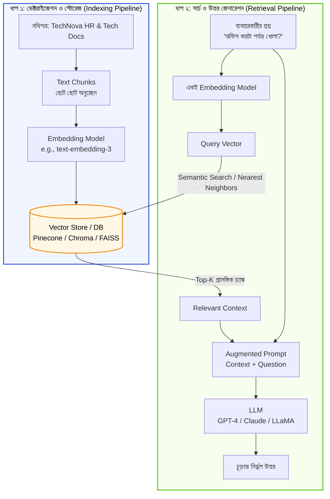

# ভেক্টর এম্বেডিং এবং RAG আর্কিটেকচার (Vector Embeddings & RAG Architecture)

স্বাগতম আমাদের RAG সিরিজের দ্বিতীয় পর্বে! আগের পর্বে আমরা জেনেছি RAG কী এবং এটি কীভাবে কাজ করে। এই পর্বে আমরা RAG-এর সবচেয়ে ম্যাজিকাল অংশটি শিখব—**ভেক্টর এম্বেডিং (Vector Embeddings)** এবং RAG-এর পূর্ণাঙ্গ স্থাপত্য (Architecture)।

কম্পিউটার বা কোনো মেশিন টেক্সটের অর্থ সরাসরি বুঝতে পারে না। তাহলে সে কীভাবে বোঝে যে *"ছুটি"* এবং *"অনুপস্থিতি"* শব্দের অর্থ প্রায় একই? এর উত্তর লুকিয়ে আছে ভেক্টর এম্বেডিং-এর মধ্যে!

---

## ১. What (ভেক্টর এম্বেডিং কী?)

**Vector Embedding** হলো মানুষের ভাষাকে (শব্দ, বাক্য বা পুরো প্যারাগ্রাফ) কম্পিউটারের জন্য উপযুক্ত **একগুচ্ছ সংখ্যায় (Floating Point Numbers / Array of Numbers)** রূপান্তর করার বিশেষ পদ্ধতি।

উদাহরণস্বরূপ, একটি Embedding Model যদি "TechNova" শব্দটিকে প্রক্রিয়া করে, তবে এটি নিচের মতো একটি সংখ্যাসূচক তালিকা তৈরি করতে পারে:

```python
# একটি কাল্পনিক ভেক্টর রূপ
[0.124, -0.852, 0.431, 0.009, -0.215, ...]
```

এই সংখ্যার তালিকাকে বলা হয় একটি **ভেক্টর (Vector)**। এই ভেক্টরে মোট যতগুলো সংখ্যা থাকে, তাকে বলা হয় তার **ডাইমেনশন (Dimension)**। সাধারণত আধুনিক এম্বেডিং মডেলগুলোতে ৩৮৪, ৭৬৮ বা ১৫৩৬ ডাইমেনশনের ভেক্টর তৈরি হয়।

সবচেয়ে জাদুকরী বিষয় হলো—যে দুটি বাক্যের অর্থ কাছাকাছি, তাদের ভেক্টর সংখ্যাগুলোও গাণিতিক স্পেসে একে অপরের খুব কাছাকাছি অবস্থান করে।

---

## ২. Why (কেন এটি RAG-এ অপরিহার্য?)

প্রথাগত সার্চ ইঞ্জিনে আমরা **Keyword Search** (যেমন SQL `LIKE` বা সাধারণ Ctrl+F) ব্যবহার করতাম। এতে একটি বিরাট সমস্যা ছিল:

* যদি ব্যবহারকারী সার্চ করেন: *"How to take a day off?"*
* আর আপনার ডকুমেন্টে লেখা থাকে: *"Casual Leave Policy"*

সাধারণ কিওয়ার্ড সার্চ কোনো মিল পাবে না, কারণ "day off" আর "leave" শব্দ দুটোর বানান সম্পূর্ণ আলাদা।

এখানেই **Semantic Search** এর ক্ষমতা প্রকাশ পায়। একটি Embedding Model বুঝতে পারে যে *"day off"* এবং *"leave"* উভয়ের অন্তর্নিহিত অর্থ (Semantic Meaning) একই। ভেক্টর এম্বেডিং ব্যবহার করার ফলে RAG সিস্টেম বানানের ওপর নির্ভর না করে **অর্থের গভীরতার ওপর নির্ভর করে** সঠিক তথ্য খুঁজে বের করতে পারে।

---

## ৩. Analogy (বাস্তব জীবনের উপমা)

ভেক্টর এম্বেডিং বুঝতে সবচেয়ে সহজ উপমা হলো **"গুগল ম্যাপসের GPS কো-অর্ডিনেট (অক্ষাংশ ও দ্রাঘিমাংশ)"**:

* ধরুন, পৃথিবীর প্রতিটি শহরের একটি নির্দিষ্ট কো-অর্ডিনেট রয়েছে:
  * ঢাকা: `(23.8103, 90.4125)`
  * গাজীপুর: `(23.9999, 90.4203)`
  * নিউ ইয়র্ক: `(40.7128, -74.0060)`
* আপনি মানচিত্রের দিকে না তাকিয়েও শুধু সংখ্যাগুলো বিয়োগ করে বলে দিতে পারবেন ঢাকা এবং গাজীপুর একে অপরের খুব কাছে, কিন্তু নিউ ইয়র্ক অনেক দূরে!

ঠিক একইভাবে, Embedding Model ভাষার প্রতিটি শব্দ বা বাক্যকে একটি বহুমাত্রিক মানচিত্রে নির্দিষ্ট কো-অর্ডিনেট (ভেক্টর) বসিয়ে দেয়। ফলে একই অর্থবোধক বাক্যগুলো মানচিত্রে পাশাপাশি বসে।

---

## ৪. How it works (ধাপে ধাপে কার্যপদ্ধতি)

1. **Text Tokenization:** টেক্সটকে প্রথমে ছোট ছোট টোকেনে ভাগ করা হয়।
2. **Neural Network Processing:** টোকেনগুলোকে একটি প্রি-ট্রেইনড এম্বেডিং মডেলে (যেমন: OpenAI-এর `text-embedding-3-small`, HuggingFace-এর `all-MiniLM-L6-v2`) পাঠানো হয়।
3. **Dense Vector Output:** মডেল প্রতিটি বাক্যের জন্য একটি ফিক্সড সাইজের ঘন ভেক্টর (Dense Vector) রিটার্ন করে।
4. **Distance Measurement:** দুটি ভেক্টরের মধ্যকার দূরত্ব বা কোণ পরিমাপ করার জন্য **Cosine Similarity** বা **Euclidean Distance** ব্যবহার করা হয়।
   * কোণের মান যত কম (Cosine Similarity ১ এর যত কাছাকাছি), তাদের অর্থের মিল তত বেশি।

---

## ৫. Architecture Diagram (RAG-এর পূর্ণাঙ্গ স্থাপত্য)



---

## ৬. সম্পূর্ণ ও কার্যকরী Code Example

চলুন পাইথনে ভেক্টর এম্বেডিং এবং তাদের মধ্যবর্তী সেমান্টিক সাদৃশ্য (Semantic Similarity) বের করার একটি সম্পূর্ণ কোড দেখি। এটি চালানোর জন্য `numpy` লাইব্রেরি ব্যবহার করা হয়েছে।

```python
import numpy as np

# দুটি ভেক্টরের মধ্যকার কোসাইন সিমিলারিটি (Cosine Similarity) মাপার ফাংশন
def cosine_similarity(v1, v2):
    dot_product = np.dot(v1, v2)
    norm_v1 = np.linalg.norm(v1)
    norm_v2 = np.linalg.norm(v2)
    if norm_v1 == 0 or norm_v2 == 0:
        return 0.0
    return dot_product / (norm_v1 * norm_v2)

# বাস্তবসম্মত উদাহরণের জন্য সিমুলেটেড ৪-ডাইমেনশনাল এম্বেডিং স্পেস:
# ডাইমেনশন ১: ছুটি সংক্রান্ত বৈশিষ্ট্য (Leave/Vacation)
# ডাইমেনশন ২: আর্থিক/টাকা সংক্রান্ত বৈশিষ্ট্য (Money/Finance)
# ডাইমেনশন ৩: অফিস সময় সংক্রান্ত বৈশিষ্ট্য (Timing/Hours)
# ডাইমেনশন ৪: স্বাস্থ্য/চিকিৎসা সংক্রান্ত বৈশিষ্ট্য (Health/Medical)

# TechNova Solutions-এর ডকুমেন্টের ৩টি চ্যাঙ্কের ভেক্টর
doc_embeddings = {
    "Doc 1: নৈমিত্তিক ছুটি ২০ দিন": np.array([0.95, 0.05, 0.10, 0.15]),
    "Doc 2: ইন্টারনেট বিল ১৫০০ টাকা ভাতা": np.array([0.05, 0.92, 0.08, 0.02]),
    "Doc 3: অফিস সময় সকাল ৯:৩০ থেকে ৬:০০": np.array([0.10, 0.02, 0.96, 0.05]),
}

# ব্যবহারকারীর ২টি ভিন্ন প্রশ্ন
user_query_1 = "আমি কীভাবে ভ্যাকেশন বা ডে-অফ নিতে পারি?"
# এই প্রশ্নের ভেক্টর (ছুটি সম্পর্কিত বৈশিষ্ট্যে অনেক বেশি সক্রিয়)
query_vector_1 = np.array([0.91, 0.02, 0.12, 0.18])

user_query_2 = "অফিসের কাজের শিডিউল কতক্ষণ?"
# এই প্রশ্নের ভেক্টর (সময় সম্পর্কিত বৈশিষ্ট্যে অনেক বেশি সক্রিয়)
query_vector_2 = np.array([0.08, 0.01, 0.94, 0.04])

# সার্চ ইঞ্জিন ফাংশন
def semantic_search(query_text, query_vector, docs_dict):
    print(f"\n🔍 ব্যবহারকারীর প্রশ্ন: '{query_text}'")
    print("-" * 55)
    
    results = []
    for doc_name, doc_vec in docs_dict.items():
        score = cosine_similarity(query_vector, doc_vec)
        results.append((doc_name, score))
    
    # সবচেয়ে বেশি স্কোরের ভিত্তিতে ক্রমানুসারে সাজানো
    results.sort(key=lambda x: x[1], reverse=True)
    
    for rank, (doc_name, score) in enumerate(results, start=1):
        print(f"র‍্যাঙ্ক {rank} | মিলের হার (Similarity): {score:.4f} -> {doc_name}")
    
    best_doc, best_score = results[0]
    print(f"\n✅ সবচেয়ে প্রাসঙ্গিক ফলাফল: {best_doc} (Score: {best_score:.4f})")

# রান করা যাক
if __name__ == "__main__":
    # টেস্ট ১: ছুটি সংক্রান্ত প্রশ্ন
    semantic_search(user_query_1, query_vector_1, doc_embeddings)
    
    # টেস্ট ২: অফিস সময় সংক্রান্ত প্রশ্ন
    semantic_search(user_query_2, query_vector_2, doc_embeddings)
```

### কোড লাইনের সহজ ব্যাখ্যা:
* `np.dot(v1, v2)`: দুটি ভেক্টরের ডট প্রোডাক্ট (Dot Product) বের করে, যা তাদের উপাদানগুলোর গুণফলের সমষ্টি।
* `np.linalg.norm(v)`: ভেক্টরের দৈর্ঘ্য (Magnitude) পরিমাপ করে।
* `cosine_similarity`: দুই ভেক্টরের কোসাইনের মান (-১ থেকে +১) বের করে। ১ এর যত কাছাকাছি, দুটি লেখার অর্থ তত নিকটবর্তী।
* `semantic_search`: ব্যবহারকারীর প্রশ্নের ভেক্টরের সাথে প্রতিটি ডকুমেন্টের ভেক্টর তুলনা করে সবচেয়ে উপযুক্ত ডকুমেন্টটি খুঁজে আনে।

---

## ৭. Output উদাহরণ

কোডটি রান করলে নিচের মতো আউটপুট দেখতে পাবেন:

```text
🔍 ব্যবহারকারীর প্রশ্ন: 'আমি কীভাবে ভ্যাকেশন বা ডে-অফ নিতে পারি?'
-------------------------------------------------------
র‍্যাঙ্ক 1 | মিলের হার (Similarity): 0.9857 -> Doc 1: নৈমিত্তিক ছুটি ২০ দিন
র‍্যাঙ্ক 2 | মিলের হার (Similarity): 0.1983 -> Doc 3: অফিস সময় সকাল ৯:৩০ থেকে ৬:০০
র‍্যাঙ্ক 3 | মিলের হার (Similarity): 0.0831 -> Doc 2: ইন্টারনেট বিল ১৫০০ টাকা ভাতা

✅ সবচেয়ে প্রাসঙ্গিক ফলাফল: Doc 1: নৈমিত্তিক ছুটি ২০ দিন (Score: 0.9857)

🔍 ব্যবহারকারীর প্রশ্ন: 'অফিসের কাজের শিডিউল কতক্ষণ?'
-------------------------------------------------------
র‍্যাঙ্ক 1 | মিলের হার (Similarity): 0.9984 -> Doc 3: অফিস সময় সকাল ৯:৩০ থেকে ৬:০০
র‍্যাঙ্ক 2 | মিলের হার (Similarity): 0.1774 -> Doc 1: নৈমিত্তিক ছুটি ২০ দিন
র‍্যাঙ্ক 3 | মিলের হার (Similarity): 0.0766 -> Doc 2: ইন্টারনেট বিল ১৫০০ টাকা ভাতা

✅ সবচেয়ে প্রাসঙ্গিক ফলাফল: Doc 3: অফিস সময় সকাল ৯:৩০ থেকে ৬:০০ (Score: 0.9984)
```

---

## ৮. VitePress Callouts

:::tip গোল্ডেন রুল
ডকুমেন্ট ইনজেশন (Indexing) করার সময় আপনি যে Embedding Model ব্যবহার করবেন, ব্যবহারকারীর প্রশ্নের ভেক্টর তৈরি করার সময়ও **ঠিক একই Embedding Model** ব্যবহার করতে হবে। মডেল পরিবর্তন করলে ভেক্টরের স্থান ও অর্থ সম্পূর্ণ উল্টাপাল্টা হয়ে যাবে!
:::

:::warning ডাইমেনশন সংক্রান্ত সতর্কতা
ভেক্টর ডাইমেনশন বেশি হলেই যে মডেল ভালো হবে এমন কোনো নিশ্চয়তা নেই। বেশি ডাইমেনশনের ভেক্টর স্টোর করতে বেশি মেমোরি লাগে এবং সার্চ হতে তুলনামূলক বেশি সময় নেয়। উৎপাদনের ক্ষেত্রে পারফরম্যান্স ও ব্যয়ের ভারসাম্য বজায় রাখা জরুরি।
:::

---

## ৯. Common Mistakes (নতুনদের সাধারণ ভুলসমূহ)

1. **ভিন্ন মডেলের ভেক্টর মেলানো:** ইনজেশনে OpenAI আর সার্চে HuggingFace মডেল মেশানো—এটি সবচেয়ে মারাত্মক ভুল, কারণ এদের ম্যাথমেটিক্যাল স্পেস আলাদা।
2. **Cosine Distance বনাম Cosine Similarity গুলিয়ে ফেলা:**
   * Cosine **Similarity** ১ মানে ১০০% মিল, ০ মানে কোনো মিল নেই।
   * Cosine **Distance** (1 - Similarity) ০ মানে ১০০% মিল, ১ মানে কোনো মিল নেই।
3. **খুব বড় টেক্সট একবারে এম্বেড করা:** পুরো ৫ পৃষ্ঠার একটি PDF ফাইল একবারে এম্বেড করলে তথ্যের সুনির্দিষ্ট অর্থ হারিয়ে যায়। তাই ছোট ছোট টুকরো (Chunk) করা বাধ্যতামূলক।

---

## ১০. Practice Exercise

**অনুশীলন:**
উপরের কোডে TechNova-এর আরেকটি ডকুমেন্ট যোগ করুন:
`"Doc 4: অসুস্থতাজনিত ছুটির জন্য ডাক্তারের প্রেসক্রিপশন লাগবে"`
এবং একটি নতুন প্রশ্ন দিয়ে টেস্ট করুন:
`"শরীর খারাপ হলে কী করতে হবে?"`
দেখুন আপনার ভেক্টর সার্চ সিস্টেম Doc 1 নাকি Doc 4 কে বেশি প্রায়োরিটি দেয়!

---

## ১১. Summary (সারসংক্ষেপ)

* **Vector Embedding** হলো টেক্সটকে সংখ্যাসূচক ডাইমেনশনে রূপান্তর করা যা অর্থগত মিল (Semantic Meaning) ধারণ করে।
* এটি কিওয়ার্ড সার্চের সীমাবদ্ধতা দূর করে বাক্য অন্যভাবে সাজিয়ে বললেও সঠিক উত্তর খুঁজে পেতে সাহায্য করে।
* **Cosine Similarity** হলো ভেক্টর স্পেসে দুটি লেখার অর্থগত দূরত্বের গাণিতিক পরিমাপ।
* ইনজেশন পাইপলাইন এবং রিট্রিভাল পাইপলাইনে **সর্বদা একই এম্বেডিং মডেল** ব্যবহার করতে হবে।

---

## ১২. পরবর্তী ধাপ

পরের পর্বে আমরা দেখব কীভাবে পাইথন ব্যবহার করে বাস্তব ফাইল (যেমন PDF বা টেক্সট ফাইল) পড়ে একটি পরিপূর্ণ **Data Ingestion Pipeline** তৈরি করতে হয়!
