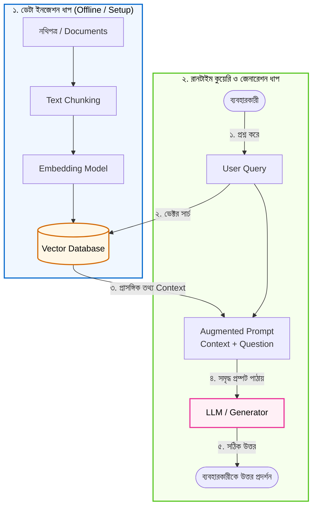

# RAG কী এবং কেন? (Introduction to Retrieval-Augmented Generation)

স্বাগতম! আপনি যদি আর্টিফিশিয়াল ইন্টেলিজেন্স (AI) এবং লার্জ ল্যাঙ্গুয়েজ মডেল (LLM) নিয়ে কাজ করতে চান, তাহলে বর্তমানে সবচেয়ে প্রয়োজনীয় এবং কার্যকর টেকনোলজি হলো **RAG (Retrieval-Augmented Generation)**। 

এই গাইডে আমরা একদম শুরু থেকে সহজ বাংলায় জানবো RAG কী, কেন এটা প্রতিটি আধুনিক AI অ্যাপ্লিকেশনের মেরুদণ্ড, এবং কীভাবে এটি বাস্তব ক্ষেত্রে কাজ করে।

---

## ১. What (RAG কী?)

**RAG** এর পূর্ণরূপ হলো **Retrieval-Augmented Generation**। এটি এমন একটি শক্তিশালী কৌশল যা একটি Large Language Model (যেমন GPT-4, Claude, বা LLaMA)-কে আপনার নিজস্ব বা রিয়েল-টাইম তথ্যের সাথে যুক্ত করে নির্ভুল উত্তর তৈরি করতে সাহায্য করে।

সহজ কথায়, RAG তিনটি মূল শব্দের সমন্বয়:

1. **Retrieval (তথ্য খুঁজে বের করা):** ব্যবহারকারীর প্রশ্নের ওপর ভিত্তি করে একটি বাহ্যিক ডেটাবেস (Knowledge Base) বা ডকুমেন্ট থেকে সবচেয়ে প্রাসঙ্গিক তথ্যটি খুঁজে বের করা।
2. **Augmented (তথ্য যোগ করে সমৃদ্ধ করা):** খুঁজে পাওয়া প্রাসঙ্গিক তথ্যটিকে ব্যবহারকারীর মূল প্রশ্নের সাথে যুক্ত করে একটি সমৃদ্ধ **Prompt** বা নির্দেশিকা প্রস্তুত করা।
3. **Generation (উত্তর তৈরি করা):** সেই সমৃদ্ধ প্রম্পটটি LLM-এর কাছে পাঠানো, যাতে LLM প্রাপ্ত তথ্যের ওপর ভিত্তি করে সঠিক ও প্রাসঙ্গিক উত্তর জেনারেট করে।

---

## ২. Why (RAG কেন দরকার?)

আমরা জানি ChatGPT বা অন্যান্য LLM মডেলগুলো বিপুল পরিমাণ পাবলিক ডেটার ওপর প্রি-ট্রেইনড। কিন্তু সাধারণ LLM গুলোর ৩টি বড় সীমাবদ্ধতা রয়েছে:

1. **Knowledge Cutoff (তথ্যের সীমাবদ্ধতা):** LLM একটি নির্দিষ্ট তারিখ পর্যন্ত ডেটার ওপর ট্রেনিং পায়। আজকের আবহাওয়া, গতকালের কোম্পানির মিটিং মিনিটস বা সাম্প্রতিক কোনো খবর সে জানে না।
2. **Hallucination (ভুল তথ্য বানিয়ে বলা):** LLM কোনো প্রশ্নের সঠিক উত্তর না জানলে প্রায়শই সম্পূর্ণ আত্মবিশ্বাসের সাথে কাল্পনিক বা ভুল উত্তর তৈরি করে ফেলে, যাকে টেকনিক্যাল ভাষায় **Hallucination** বলা হয়।
3. **Private Data Lack (ব্যক্তিগত বা প্রাতিষ্ঠানিক তথ্যের অভাব):** আপনার কোম্পানির গোপনীয় পলিসি, প্রজেক্ট ডকুমেন্টেশন বা গ্রাহকের তথ্য পাবলিক LLM-এর প্রশিক্ষণে থাকে না।

### RAG কীভাবে এর সমাধান করে?
RAG পুরো মডেলকে পুনরায় ট্রেনিং (Fine-tuning) না করেই আপনার নিজস্ব ডেটাসেট (PDF, Word, Database, Notion ইত্যাদি) থেকে রিয়েল-টাইম তথ্য এনে LLM-কে কনটেক্সট হিসেবে সরবরাহ করে। ফলে মডেল সবসময় সাম্প্রতিক এবং সঠিক তথ্যের ওপর নির্ভর করে উত্তর প্রদান করে।

---

## ৩. Analogy (বাস্তব জীবনের উপমা)

RAG বুঝতে সবচেয়ে সেরা উপমা হলো **"ক্লোজড-বুক পরীক্ষা" বনাম "ওপেন-বুক পরীক্ষা"**:

* **সাধারণ LLM (Closed-Book Exam):** একজন শিক্ষার্থীকে পরীক্ষার হলে কোনো বই বা নোট ছাড়া বসিয়ে দেওয়া হলো। সে অতীতে যা মুখস্থ করেছিল, কেবল স্মৃতিশক্তি থেকেই উত্তর লেখার চেষ্টা করবে। কোনো প্রশ্নের উত্তর ভুলে গেলে সে আন্দাজে ভুল তথ্য বানিয়ে লিখতে পারে।
* **RAG আর্কিটেকচার (Open-Book Exam):** সেই একই শিক্ষার্থীকে একটি রেফারেন্স লাইব্রেরিতে উন্মুক্ত বই-খাতা দিয়ে পরীক্ষা দিতে বলা হলো। যখনই কোনো প্রশ্ন আসবে, সে প্রথমে প্রাসঙ্গিক বই বা পাতাটি খুঁজে বের করবে (**Retrieval**), সেই পাতার তথ্যটি নিজের চোখের সামনে রাখবে (**Augmentation**), এবং তারপর পড়ে সুন্দর ভাষায় নির্ভুল উত্তর লিখবে (**Generation**)।

---

## ৪. How it works (ধাপে ধাপে কার্যপদ্ধতি)

RAG মূলত দুটি প্রধান ধাপে কাজ করে:

### ক. Data Ingestion Phase (ডেটা প্রস্তুতকরণ)
1. **Document Loading:** কোম্পানির পলিসি ফাইল, PDF বা টেক্সট লোড করা হয়।
2. **Chunking:** বড় ডকুমেন্টগুলোকে ছোট ছোট যৌক্তিক টুকরো (Chunks)-তে ভাগ করা হয়।
3. **Embedding:** টেক্সট চ্যাঙ্কগুলোকে সংখ্যাসূচক ভেক্টরে (Mathematical Vectors) রূপান্তর করা হয়।
4. **Vector Store:** এই ভেক্টরগুলোকে একটি বিশেষ ডেটাবেসে (Vector Database) সংরক্ষণ করা হয়।

### খ. Query & Generation Phase (প্রশ্ন ও উত্তর তৈরির ধাপ)
1. **User Query:** ব্যবহারকারী একটি প্রশ্ন করেন (যেমন: *"আমাদের কোম্পানিতে ছুটির নিয়ম কী?"*)।
2. **Retrieval:** ব্যবহারকারীর প্রশ্নটিকে ভেক্টরে রূপান্তর করে ভেক্টর ডেটাবেস থেকে সবচেয়ে প্রাসঙ্গিক চ্যাঙ্কগুলো খুঁজে আনা হয়।
3. **Augmentation:** একটি প্রম্পট টেমপ্লেটের মাধ্যমে ব্যবহারকারীর প্রশ্ন এবং খুঁজে পাওয়া তথ্য একত্র করা হয়:
   > *"নিচের প্রাসঙ্গিক তথ্যের ওপর ভিত্তি করে প্রশ্নের উত্তর দাও: [Context] ... প্রশ্ন: [User Query]"*
4. **Generation:** LLM এই পূর্ণাঙ্গ প্রম্পট পড়ে প্রাসঙ্গিক তথ্যের ওপর ভিত্তি করে নিখুঁত উত্তর প্রদান করে।

---

## ৫. Architecture Diagram (ফ্লোচার্ট)



---

## ৬. সম্পূর্ণ ও কার্যকরী Code Example

চলুন পাইথন দিয়ে একটি সহজ ও পূর্ণাঙ্গ RAG পাইপলাইন তৈরি করি। কোনো জটিল থার্ড-পার্টি পেইড সার্ভিস ছাড়াই পুরো বিষয়টি স্পষ্টভাবে বোঝার জন্য আমরা একটি ইন-মেমোরি নলেজবেস ও সিমিলারিটি সার্চ তৈরি করব।

```python
import math
from collections import Counter

# ধাপ ১: আমাদের নিজস্ব নলেজ বেস (কোম্পানির অভ্যন্তরীণ ডকুমেন্ট)
# TechNova Solutions নামের একটি টেক কোম্পানির উদাহরণ আমরা পুরো কোর্সে অনুসরণ করব
knowledge_base = [
    "TechNova Solutions-এ বছরে মোট ২০ দিন বেতনসহ নৈমিত্তিক ছুটি (Casual Leave) পাওয়া যায়।",
    "অফিস সকাল ৯:৩০ টা থেকে সন্ধ্যা ৬:০০ টা পর্যন্ত খোলা থাকে, শুক্র ও শনিবার সাপ্তাহিক ছুটি।",
    "অসুস্থতজনিত ছুটির জন্য টানা ২ দিনের বেশি অনুপস্থিত থাকলে ডাক্তারের প্রেসক্রিপশন জমা দিতে হবে।",
    "কর্মীদের ইন্টারনেট বিল বাবদ প্রতি মাসে ১,৫০০ টাকা রিইমবার্সমেন্ট দেওয়া হয়।"
]

# ধাপ ২: টেক্সটকে সহজ সংখ্যাসূচক ভেক্টরে রূপান্তর ফাংশন
def text_to_vector(text):
    words = text.lower().replace(",", "").replace(".", "").split()
    return Counter(words)

# দুটি টেক্সটের মধ্যে মিল (Cosine Similarity) পরিমাপ করার ফাংশন
def cosine_similarity(vec1, vec2):
    intersection = set(vec1.keys()) & set(vec2.keys())
    numerator = sum([vec1[x] * vec2[x] for x in intersection])
    
    sum1 = sum([val ** 2 for val in vec1.values()])
    sum2 = sum([val ** 2 for val in vec2.values()])
    denominator = math.sqrt(sum1) * math.sqrt(sum2)
    
    if not denominator:
        return 0.0
    return float(numerator) / denominator

# ধাপ ৩: Retrieval (তথ্য খোঁজার ইঞ্জিন)
def retrieve_relevant_context(query, documents, top_k=1):
    query_vec = text_to_vector(query)
    scores = []
    
    for doc in documents:
        doc_vec = text_to_vector(doc)
        sim = cosine_similarity(query_vec, doc_vec)
        scores.append((sim, doc))
    
    # স্কোরের ভিত্তিতে সবচেয়ে প্রাসঙ্গিক তথ্য সাজানো
    scores.sort(key=lambda x: x[0], reverse=True)
    return [doc for score, doc in scores[:top_k]]

# ধাপ ৪: Augmentation & Generation (সিমুলেটেড LLM জেনারেশন)
def generate_rag_response(user_query):
    # ১. Retrieval: প্রাসঙ্গিক তথ্য খুঁজে বের করা
    retrieved_docs = retrieve_relevant_context(user_query, knowledge_base, top_k=1)
    context = retrieved_docs[0] if retrieved_docs else "কোনো প্রাসঙ্গিক তথ্য পাওয়া যায়নি।"
    
    # ২. Augmentation: অগমেন্টেড প্রম্পট তৈরি করা
    prompt = f"""
[সিস্টেম নির্দেশিকা]: তুমি TechNova Solutions-এর একজন সহায়ক এআই। নিচের তথ্যের ভিত্তিতে প্রশ্নের উত্তর দাও।
[প্রাসঙ্গিক তথ্য]: {context}
[ব্যবহারকারীর প্রশ্ন]: {user_query}
"""
    print("--- [Augmented Prompt যা LLM-এর কাছে যাবে] ---")
    print(prompt.strip())
    print("-------------------------------------------------")
    
    # ৩. Generation: বাস্তব সিস্টেমে এই প্রম্পটটি OpenAI/Anthropic/Gemini API-তে পাঠানো হয়
    # এখানে প্রদর্শনের জন্য জেনারেটেড আউটপুট দেখানো হলো:
    if "ছুটি" in user_query:
        answer = f"TechNova Solutions-এর পলিসি অনুযায়ী: {context}"
    else:
        answer = f"পলিসি নথির ভিত্তিতে: {context}"
    
    return answer

# পরীক্ষা চালানো যাক
if __name__ == "__main__":
    user_question = "TechNova কোম্পানিতে বছরে কতদিন নৈমিত্তিক ছুটি পাওয়া যায়?"
    print(f"ব্যবহারকারীর প্রশ্ন: {user_question}\n")
    
    result = generate_rag_response(user_question)
    print(f"\nফলাফল (RAG Response):\n{result}")
```

### কোডের গুরুত্বপূর্ণ অংশের ব্যাখ্যা:
* `knowledge_base`: আমাদের নিজস্ব ডেটাসেট যা সাধারণ কোনো পাবলিক LLM-এর ভেতরে পূর্বে সংরক্ষিত ছিল না।
* `retrieve_relevant_context()`: ব্যবহারকারীর প্রশ্নের সাথে মিলিয়ে ডকুমেন্ট থেকে সবচেয়ে প্রাসঙ্গিক তথ্যটি বের করে আনে (Retrieval)।
* `prompt`: প্রশ্ন এবং খুঁজে পাওয়া তথ্যকে জোড়া লাগিয়ে তৈরি করা কনটেক্সট (Augmentation)।
* `generate_rag_response()`: প্রাপ্ত কনটেক্সট ব্যবহার করে চূড়ান্ত উত্তর তৈরি করে (Generation)।

---

## ৭. Output উদাহরণ

উপরের কোডটি রান করলে নিচের মতো আউটপুট পাওয়া যাবে:

```text
ব্যবহারকারীর প্রশ্ন: TechNova কোম্পানিতে বছরে কতদিন নৈমিত্তিক ছুটি পাওয়া যায়?

--- [Augmented Prompt যা LLM-এর কাছে যাবে] ---
[সিস্টেম নির্দেশিকা]: তুমি TechNova Solutions-এর একজন সহায়ক এআই। নিচের তথ্যের ভিত্তিতে প্রশ্নের উত্তর দাও।
[প্রাসঙ্গিক তথ্য]: TechNova Solutions-এ বছরে মোট ২০ দিন বেতনসহ নৈমিত্তিক ছুটি (Casual Leave) পাওয়া যায়।
[ব্যবহারকারীর প্রশ্ন]: TechNova কোম্পানিতে বছরে কতদিন নৈমিত্তিক ছুটি পাওয়া যায়?
-------------------------------------------------

ফলাফল (RAG Response):
TechNova Solutions-এর পলিসি অনুযায়ী: TechNova Solutions-এ বছরে মোট ২০ দিন বেতনসহ নৈমিত্তিক ছুটি (Casual Leave) পাওয়া যায়।
```

---

## ৮. VitePress Callouts

:::tip বাস্তব প্রজেক্টের টিপস
RAG সিস্টেম তৈরির ক্ষেত্রে সব ডেটা একসাথে LLM-কে না পাঠিয়ে ছোট ছোট প্রাসঙ্গিক খণ্ডে (Chunks) ভাগ করে পাঠানোই সবচেয়ে বুদ্ধিমানের কাজ। এতে LLM-এর টোকেন খরচ (API Cost) উল্লেখযোগ্যভাবে কমে এবং মডেল বিভ্রান্ত হয় না।
:::

:::warning নতুনদের জন্য সতর্কতা
RAG মানেই কিন্তু নতুন মডেল তৈরি বা ফাইন-টিউনিং (Fine-Tuning) নয়! RAG-এ মূল মডেলের প্যারামিটার অপরিবর্তিত থাকে; শুধু ইনপুট প্রম্পটের সাথে সঠিক ডেটা রেফারেন্স হিসেবে যোগ করে দেওয়া হয়।
:::

---

## ৯. Common Mistakes (নতুনদের সাধারণ ভুলসমূহ)

1. **পুরো বড় ডকুমেন্ট প্রম্পটে ঢুকিয়ে দেওয়া:** কোনো ফিল্টারিং ছাড়া শত শত পাতার ডেটা সরাসরি প্রম্পটে দিলে টোকেন লিমিট শেষ হবে এবং খরচ আকাশচুম্বী হবে।
2. **খারাপ কোয়ালিটির ডেটা ব্যবহার করা:** আপনার নথিতে ভুল বা অস্পষ্ট তথ্য থাকলে RAG সিস্টেমও ভুল উত্তর তৈরি করবে (*"Garbage in, Garbage out"* )।
3. **Retrieval কোয়ালিটি টেস্ট না করা:** LLM-কে দোষারোপ করার আগে যাচাই করুন আপনার Retriever সঠিক তথ্য খুঁজে আনতে পারছে কি না।

---

## ১০. Practice Exercise

**অনুশীলন:**
উপরের কোডের `knowledge_base`-এ আপনার নিজের শিক্ষা প্রতিষ্ঠান বা অফিসের ৩টি তথ্য যোগ করুন। এরপর একটি প্রশ্ন করে দেখুন আপনার রিট্রিভার সঠিক তথ্যটি খুঁজে আনতে পারে কি না।

*লক্ষণীয়:* যদি প্রশ্ন করেন *"অসুস্থ হলে কী জমা দিতে হবে?"*, আপনার কোডটি কি ডাক্তারের প্রেসক্রিপশনের লাইনটি সঠিকভাবে খুঁজে পাচ্ছে?

---

## ১১. Summary (সারসংক্ষেপ)

* **RAG** হলো বাহ্যিক নলেজবেস থেকে তথ্য এনে LLM-এর মাধ্যমে সঠিক উত্তর তৈরির একটি বিশ্বমানের স্থাপত্য।
* এটি LLM-এর **Hallucination** দূর করে এবং সাম্প্রতিক ও নিজস্ব প্রাইভেট ডেটা নিয়ে কাজ করার সক্ষমতা দেয়।
* এটি ফাইন-টিউনিং এর চেয়ে অনেক বেশি সাশ্রয়ী, দ্রুত এবং সহজে রক্ষণাবেক্ষণযোগ্য।
* মূল ফ্লো: **Query → Retrieval (তথ্য সন্ধান) → Augmentation (প্রম্পট সমৃদ্ধকরণ) → Generation (উত্তর তৈরি)**।

---

## ১২. পরবর্তী ধাপ

পরের পর্বে আমরা দেখবো RAG-এর সবচেয়ে গুরুত্বপূর্ণ গাণিতিক ভিত্তি — **ভেক্টর এম্বেডিং (Vector Embeddings)** কী এবং কীভাবে কম্পিউটার মানুষের ভাষাকে সংখ্যার মাধ্যমে বুঝতে পেরে মিল খুঁজে বের করে!
